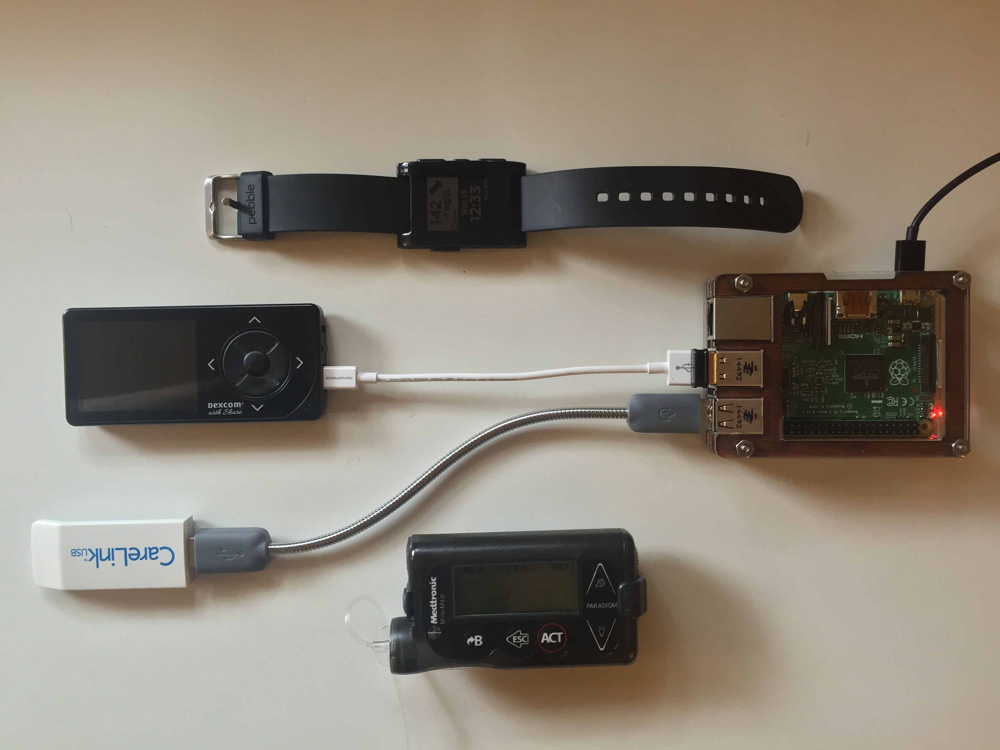

#Example OpenAPS Build

Here is an example of one user's OpenAPS:

While there are numerous variations, this particular setup shows the key components—namely, a continuous glucose monitor, an insulin pump, a method for communicating with the pump (here, a CareLink USB stick), and a controller (here, a Raspberry Pi). Also shown is a Pebble watch, which can be used for monitoring the status of the OpenAPS. Not shown is the power supply (off-screen) and a way to interact with and program the Raspberry Pi, typically a computer or smartphone.

For more details on the exact hardware required to build an OpenAPS, see the [Hardware](../Hardware/hardware.md) section.