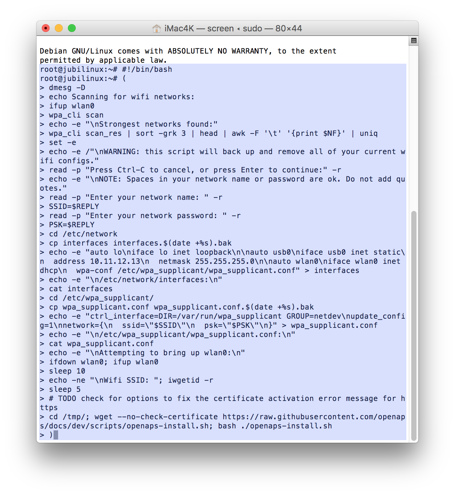
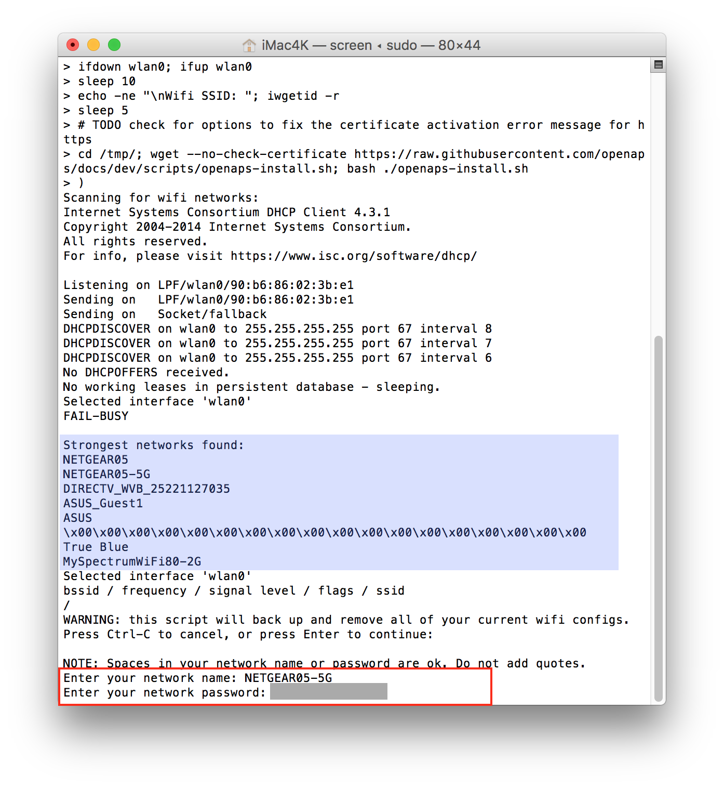
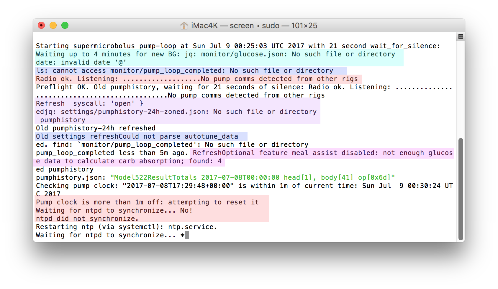
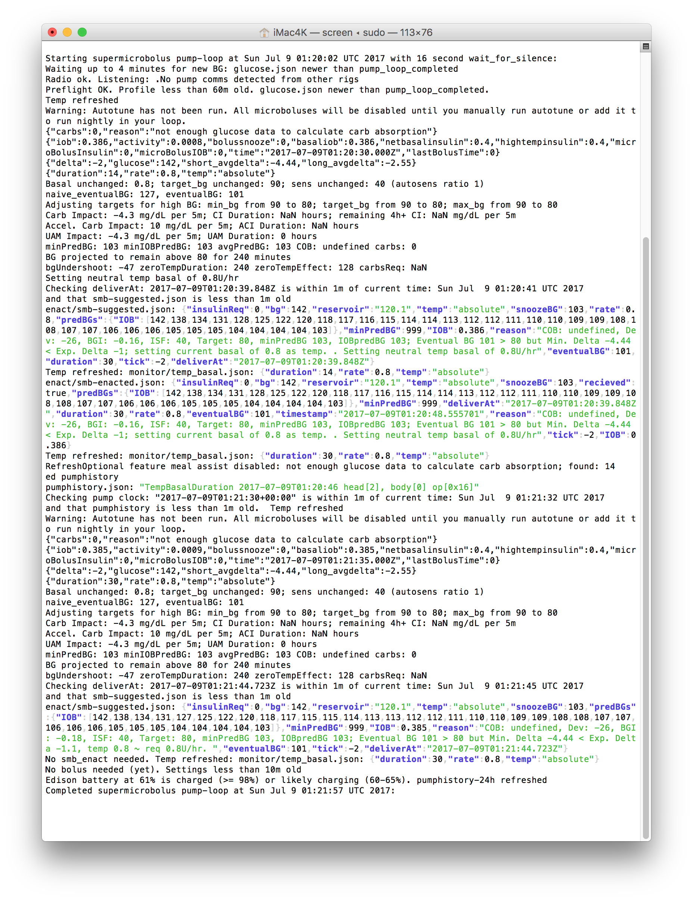

# Installing OpenAPS on your rig with a jubilinux-flashed Edison

*This page assumes you have a pre-flashed (with jubilinux) Edison. Don't have a pre-flashed Edison? Follow the steps for flashing on (a) [all-computers page](http://openaps.readthedocs.io/en/latest/docs/Resources/Edison-Flashing/all-computers-flash.html) (with the most comprehensive [troubleshooting section](http://openaps.readthedocs.io/en/latest/docs/Resources/Edison-Flashing/all-computers-flash.html#troubleshooting)); b) the [Mac-specific flashing page](http://openaps.readthedocs.io/en/latest/docs/Resources/Edison-Flashing/mac-flash.html); or c) the [Windows-specific flashing page](http://openaps.readthedocs.io/en/latest/docs/Resources/Edison-Flashing/PC-flash.html)), then come back here before installing wifi and other steps, which is easier to do following this page's flow.* 

### Prep Steps
* **PC users:** [follow these instructions to get PUTTY and plug in your rig](windows-putty-prep.md). Then, follow the rest of the instructions below.

* **Mac users:** [follow these instructions to open Terminal and plug in your rig](mac-prep.md). Then, follow the rest of the instructions below.

### Log in to your rig

If you're not already, make sure you're logged into your rig via root. You should see root@jubilinux on the command prompt.

### Copy and paste to run the wifi and oref0-setup scripts

Copy this text (all of it): 

```
#!/bin/bash
(
dmesg -D
echo Scanning for wifi networks:
ifup wlan0
wpa_cli scan
echo -e "\nStrongest networks found:"
wpa_cli scan_res | sort -grk 3 | head | awk -F '\t' '{print $NF}' | uniq
set -e
echo -e /"\nWARNING: this script will back up and remove all of your current wifi configs."
read -p "Press Ctrl-C to cancel, or press Enter to continue:" -r
echo -e "\nNOTE: Spaces in your network name or password are ok. Do not add quotes."
read -p "Enter your network name: " -r
SSID=$REPLY
read -p "Enter your network password: " -r
PSK=$REPLY
cd /etc/network
cp interfaces interfaces.$(date +%s).bak
echo -e "auto lo\niface lo inet loopback\n\nauto usb0\niface usb0 inet static\n  address 10.11.12.13\n  netmask 255.255.255.0\n\nauto wlan0\niface wlan0 inet dhcp\n  wpa-conf /etc/wpa_supplicant/wpa_supplicant.conf" > interfaces
echo -e "\n/etc/network/interfaces:\n"
cat interfaces
cd /etc/wpa_supplicant/
cp wpa_supplicant.conf wpa_supplicant.conf.$(date +%s).bak
echo -e "ctrl_interface=DIR=/var/run/wpa_supplicant GROUP=netdev\nupdate_config=1\nnetwork={\n  ssid=\"$SSID\"\n  psk=\"$PSK\"\n}" > wpa_supplicant.conf
echo -e "\n/etc/wpa_supplicant/wpa_supplicant.conf:\n"
cat wpa_supplicant.conf
echo -e "\nAttempting to bring up wlan0:\n"
ifdown wlan0; ifup wlan0
sleep 10
echo -ne "\nWifi SSID: "; iwgetid -r
sleep 5
# TODO check for options to fix the certificate activation error message for https
cd /tmp/; wget --no-check-certificate https://raw.githubusercontent.com/openaps/docs/dev/scripts/openaps-install.sh; bash ./openaps-install.sh
)
```

Copy all of those lines; go back to Terminal/PuTTY and paste into the command line. Then, hit `enter`.  The screenshot below is an example of what the pasted text will look like (highlighted in blue for clarity).

*************
Note: **This setup script will require you to have an available working internet connection to be successful.**  If anything fails during the installation, the setup may end early before you get to the setup script questions.  In that case, you can just paste the script above into the command line again and try again.  (Don't try to use the up arrow, it probably won't work.)  If you get repeated failures, bring your questions and error messages into Gitter or FB for help with troubleshooting.
*************



The script will do some initial installing, check the wifi, and ask you to hit enter to proceed.  It will run for a while again, and then ask you to type in your wifi name and press `enter`; and type your wifi password and press `enter`.  Pay careful attention to capital letters, spacing, and special characters.



* Change your hostname (a.k.a, your rig's name). **Make sure to write down your hostname; this is how you will log in in the future as `ssh root@whatyounamedit.local`**

* Pick your time zone (e.g., In the US, you'd select `US` and then scroll and find your time zone, such as `Pacific New` if you're in California).

The script will then continue to run awhile longer (~10+ minutes) before asking you to press `enter` to run oref0-setup.

#### Be prepared to enter the following information into "oref0-setup":

The screenshot below shows an example of the questions you'll be prompted to reply to during the oref0-setup (a.k.a. setup script).  Your answers will depend on the particulars of your setup.  Also, don't expect the rainbow colored background - that's just to help you see each of the sections it will ask you about!
********************
**IMPORTANT NOTE: One of the first setup questions is "What would you like to call your loop directory?"  PLEASE name your openaps directory with the default name of `myopenaps`.  There are many troubleshooting tips in these docs that assume you have used the default name.  If you don't use `myopenaps` as a new user, chances are nearly 100% that you will forget this warning and try to use the troubleshooting tips without replacing the directory name with your directory name.  Frustrations will ensue.  So PLEASE use the default name of `myopenaps`.  If you want personalization, name your rig something cool...not the `myopenaps` directory.**
********************


**Be prepared to enter the following items:** 

* email address for github commits
* directory name for your openaps - we recommend the default `myopenaps` (see note above)
* serial number of your pump
* whether or not you are using an Explorer board
   * if not an Explorer board, and not a Carelink stick, you'll need to enter the mmeowlink port for TI stick.  See [here](https://github.com/oskarpearson/mmeowlink/wiki/Installing-MMeowlink) for directions on finding your port
    * if you're using a Carelink, you will NOT be using mmeowlink
* CGM method:  The options are `g4-upload`, `g4-local-only`, `g5`, `mdt`, and `xdrip`.  Note:  OpenAPS also attempts to get BG data from your Nightscout.  OpenAPS will always use the most recent BG data regardless of the source.  G4-upload will allow you to have raw data when the G4 receiver is plugged directly into the rig.
* Nightscout URL and API secret (or NS authentication token, if you use that option)
* whether you want Autosensitivity and/or Autotune enabled
* whether you want any oref1-related advanced features (SMB/UAM) - NOT RECOMMENDED until you have run oref0 and are familiar with basic OpenAPS looping
* BT MAC address of your phone, if you want to pair for BT tethering to personal hotspot (letters should be in all caps)
  * Note, you'll still need to do finish the BT tethering as outlined [here](http://openaps.readthedocs.io/en/latest/docs/Customize-Iterate/bluetooth-tethering-edison.html) after setup.
* After the setup script builds your myopenaps, it will ask if you want to schedule a cron (in other words, automate and turn on your loop) and remove any existing cron.  You'll want to answer `y` to both - and also then press `enter` to reboot after the cron is installed.

#### Login again, and change your password

If this is your first build, after the rig reboots, you will be prompted to log back in. Login as "root" and the password from before (probably `edison`). It will ask you a second time for the current password (probably `edison`). However, now it will prompt you to change your password.  You'll want to change it to something personal so your device is secure. Make sure to write down/remember your password; this is what you'll use to log in to your rig moving forward. You'll type it twice.  There is no recovery of this password if you forget it.  You will have to reflash your edison if you forget your password.

Once you've successfully changed your password, you'll end back at the command prompt, logged in as root and ready to watch your logs while the system begins to read your pump history, gather glucose records, and begin the calculations of any needed adjustments. So it's time to watch your logs next!

## Watch your Pump-Loop Log - REQUIRED!

THIS IS A REQUIRED MUST-LEARN HOW-TO STEP - DO NOT MOVE ON WITHOUT DOING THIS! This is a key skill for monitoring your OpenAPS setup to "check" or "monitor" or "watch" the logs. 

It's easy: simply type the letter `l` (short for "log", aka the very important pump-loop.log). (*This is a shortcut for the full command, `tail -F /var/log/openaps/pump-loop.log`*.)

#### What you'll see while waiting for your first loop (common non-error messages)

If this is your first rig, you are probably (1) going to underestimate how long it takes for the first loop to successfully run and (2) while underestimating the time, you'll freak out over the messages you see in the pump-loop logs.  Let's go over what are NOT errors:



When your loop very first starts, if you are quick enough to get into the logs before the first BG is read, you will likely see: 
```
Waiting up to 4 minutes for new BG: jq: monitor/glucose.json: No such file or directory
date: invalid date '@'
```
Don't worry...once you get a BG reading in, that error will go away.

The next not-error you may see:
```
ls: cannot access monitor/pump_loop_completed: No such file or directory
```
Don't worry about that one either.  It's only going to show because there hasn't been a completely loop yet.  Once a loop completes, that file gets created and the "error" message will stop.

Next frequently confused non-error:
```
Waiting for silence: Radio ok. Listening.....No pump comms detected from other rigs
```
Well, hey that's actually a good message.  It's saying "I don't hear any interruptions from other rigs, so I won't be needing to wait my turn to talk to the pump."  That message will continue to show even when your loop is successfully running.

As the pump loop continues:
```
Refreshed jq: settings/pumphistory-25h-zoned.json: No such file or directory
```
That message will clear out once the pump history has successfully been read.

Or how about the fact that autotune hasn't run yet, but you enabled it during setup:
```
Old settings refresh Could not parse autotune_data
```
Autotune only runs at 12:05am every evening.  So, unless you're building your rig at midnight, you'll probably have to wait overnight for that error message to clear out.  Not a big deal.  You can still loop while that message is showing.  Additionally, you'll have to wait until Autotune runs before SMBs can be enacted (SMBs won't enact unless an Autotune directory exists).

And then you may have an issue about the time on your pump not matching your rig's time:
```
Pump clock is more than 1m off: attempting to reset it
Waiting for ntpd to synchronize....No!
ntpd did not synchronize.
```
This synchronization may fail a few times before it actually succeeds...be patient.  There's a script called oref0-set-device-clocks that will eventually (assuming you have internet connection) use the internet to sync the rig and pump's times automatically when they are more than 1 minute different.  (If you don't have internet connection, you may need to do that yourself on the pump manually.)

How about these daunting messages:
```
Optional feature meal assist disabled: not enough glucose data to calculate carb absorption; found: 4

and

carbsReq: NaN CI Duration: NaN hours and ACI Duration: NaN hours

and

"carbs":0, "reason": "not enough glucose data to calculate carb absorption"
```
Advanced meal assist requires at least 36 BG readings before it can begin to calculate its necessary data. So after about three hours of looping these messages will clear out.  You can watch the count-up of "found" BG readings and know when you are getting close.  

#### What you'll see when you are looping successfully ~20+ minutes later!

Finally, you should eventually see colorful indications of successful looping, with a message saying "Starting with supermicrobolus pump-loop" (or simply pump-loop if you don't have SMBs enabled) and ending with "Completed supermicrobolus pump-loop"



Reading these should give you an idea for what OpenAPS knows: current BG, changes in BG, information about netIOB (taking into account any temp basals it has set along with any boluses you have done), carbs on board, etc. Plus, it will give you information about the predictions and show you the data points it is using to draw the "purple prediction lines" in Nightscout. It also will tell you what, if anything, is limiting it's ability to give more insulin - i.e. if you have maxIOB at 0, or it is capped by one of the safety settings, etc. This information is a longer version of the information that will show in the "OpenAPS pill" on Nightscout. And - this is where it will tell you what insulin it thinks you need (more/less and how much) and what temporary basal rate (temp basal) it will try to set next to adjust and bring your eventualBG prediction into your target range.

If after 20 minutes, you still have some errors showing instead of the above successful looping information, it may be time to head over to the [Troubleshooting oref0-setup tips page](http://openaps.readthedocs.io/en/latest/docs/Troubleshooting/oref0-setup-troubleshooting.html) for ideas on your error messages and how to resolve them.  IF you aren't able to resolve your errors, please make sure that you have captured the error messages before heading over to Gitter or Facebook to get help.  Troubleshooting is far more successful when you come prepared with the error messages.

**Done watching the logs? Type control-C to exit the pump-loop log.**

#### **Temp basals > 6.3?**

If your rig tries and fails to set a temp basal > 6.3 you should see "ValueError: byte must be in range(0, 256)" in the log.  To fix this error you need to update decocare.  This is easy.  Type control-C to exit the pump-loop log.  Then copy the following 3 lines to the terminal window.

```
cd ~/src && git clone git://github.com/openaps/decocare.git
cd decocare
python setup.py install
```

#### Rig Logs and Shortcut commands

Checking your pump-loop.log is a great place to start anytime you are having looping failures.  Your error may not be in the pump-loop, but the majority of the time, you'll get a good head start on the issue by looking at the logs first. So, develop a good habit of checking the pump-loop log to get to know what a normal log looks like so that when a real error appears, you can easily see it as out of place and needing to be addressed.  Additionally, knowing how to access your pump-loop log is important if you come to Gitter or Facebook looking for troubleshooting help...one of the first questions will usually be "what does your pump-loop log look like?"

Note: The pump-loop log is not the only log your rig generates.  There are also several other loop logs contained within your OpenAPS setup such as:

* Autosens log: `tail -F /var/log/openaps/autosens-loop.log`

* Nightscout log: `tail -F /var/log/openaps/ns-loop.log`

* Network log: `tail -F /var/log/openaps/network.log`

* Autotune log: `tail -F /var/log/openaps/autotune.log` (remember Autotune only runs at midnight, so there's not much action in that log)

These logs and other files are things you may frequently access. There are shortcuts built in to help you more easily access key files on the go. The `l` you type for logs is an example of one of these shortcuts - it's actually a shortcut for the full command `tail -F /var/log/openaps/pump-loop.log`. Here are some other shortcuts:

```
 l => tail -F /var/log/openaps/pump-loop.log
 autosens-loop => tail -n 100 -F /var/log/openaps/autosens-loop.log
 autotune => tail -n 100 -F /var/log/openaps/autotune.log
 ns-loop => tail -n 100 -F /var/log/openaps/ns-loop.log
 pump-loop => tail -n 100 -F /var/log/openaps/pump-loop.log
 cat-pref => cd ~/myopenaps && cat preferences.json
 edit-wifi => vi /etc/wpa_supplicant/wpa_supplicant.conf
 cat-wifi => cat /etc/wpa_supplicant/wpa_supplicant.conf
 edit-pref => cd ~/myopenaps && vi preferences.json
 log-wifi => tail -n 100 -F /var/log/openaps/network.log
 git-branch => cd ~/src/oref0 && git branch
 cat-autotune => cd ~/myopenaps/autotune && cat autotune_recommendations.log
 edit-runagain => cd ~/myopenaps && nano oref0-runagain.sh
 cat-runagain => cd ~/myopenaps && cat oref0-runagain.sh
```
To use these shortcuts, just type in the phrase you see on the left - i.e. `edit-wifi` and hit enter.

## Finish your OpenAPS setup

You're looping? Congrats! However, you're not done quite done yet. 

****************
**Shortly after you confirm your loop is running, you should [set your preferences](http://openaps.readthedocs.io/en/latest/docs/While%20You%20Wait%20For%20Gear/preferences-and-safety-settings.html).  Don't forget, your preferences are reset to defaults after each run of a setup script, so please remember to check preferences after confirming a loop is successfully run/rerun.**
*******************

As your time permits, there's still more useful and cool things you can do to make looping more efficient and automated.

* [Add more wifi networks to your rig](http://openaps.readthedocs.io/en/latest/docs/Customize-Iterate/on-the-go-wifi-adding.html) so that when you are away from home, the rig has access to trusted wifi networks
* [Setup Papertrail](http://openaps.readthedocs.io/en/latest/docs/While%20You%20Wait%20For%20Gear/monitoring-OpenAPS.html#papertrail-remote-monitoring-of-openaps-logs-recommended) Papertrail will even allow you to remotely track your logs when you are not logged into your rig. Setting up Papertrail and watching your logs will dramatically help you understand your rig and help troubleshoot if you run into problems.
* [Setup IFTTT for your phone or watch](http://openaps.readthedocs.io/en/latest/docs/Customize-Iterate/ifttt-integration.html) to allow you to use Nightscout's temp targets, carb entries, and similar for single button interactions with your rig
* [Finish Bluetooth tethering your phone](http://openaps.readthedocs.io/en/latest/docs/Customize-Iterate/bluetooth-tethering-edison.html) so that when you are away from trusted wifi networks, your rig can automatically access your phone's mobile hotspot for continued online looping. 
* [Learn about offline looping](http://openaps.readthedocs.io/en/latest/docs/Customize-Iterate/offline-looping-and-monitoring.html) for times when your rig is not able to access internet (no wifi, no hotspot).
* [Additional access to your rig via other types of mobile apps.](http://openaps.readthedocs.io/en/latest/docs/Customize-Iterate/useful-mobile-apps.html) Grab some of these other apps, based on your preference, for accessing your rig in different ways. 

Remember, the performance of your DIY closed loop is up to you. Make sure you at least look at the rest of the documentation for help with troubleshooting, ideas about advanced features you can implement in the future when you're comfortable with baseline looping, and more. Plus, the docs are updated frequently, so it's worth bookmarking and checking back periodically to see what features and preference options have been added. 


