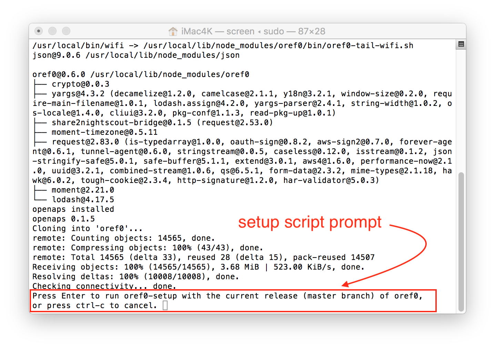

# Jubilinux prerequisite

*This page assumes you have a Jubilinux already flashed on your Edison. If you don't, please follow the steps for flashing on (a) [all-computers page](http://openaps.readthedocs.io/en/latest/docs/Resources/Edison-Flashing/all-computers-flash.html) (with the most comprehensive [troubleshooting section](http://openaps.readthedocs.io/en/latest/docs/Resources/Edison-Flashing/all-computers-flash.html#troubleshooting)); b) the [Mac-specific flashing page](http://openaps.readthedocs.io/en/latest/docs/Resources/Edison-Flashing/mac-flash.html); or c) the [Windows-specific flashing page](http://openaps.readthedocs.io/en/latest/docs/Resources/Edison-Flashing/PC-flash.html)), then come back here when the flashing is complete.  You do not have to take the steps so far as installing wifi, or dependencies manually anymore.  Thanks to the bootstrap script below, all of those steps AFTER FLASHING are now automated.  So, when you get to the end of flash step, come on back here for bootstrap.*  

### Prep Computer and Login to rig

Assuming you don't have your computer setup yet for OpenAPS, here's the instructions for getting the environment ready and logging in, depending on computer system:

* **PC users:** [follow these instructions to get PUTTY and plug in your rig](windows-putty-prep.md). Then, follow the rest of the instructions below.

* **Mac users:** [follow these instructions to open Terminal and plug in your rig](mac-prep.md). Then, follow the rest of the instructions below.

### Bootstrap script

If you're not already, make sure you're logged into your rig via root. You should see `root@jubilinux` on the command prompt.

The box below is the Bootstrap script, and it will complete steps 2 and 3 for you.  You'll get your first wifi network connection and install dependencies.  Copy this text (all of it in the box): 

```
#!/bin/bash
(
dmesg -D
echo Scanning for wifi networks:
ifup wlan0
wpa_cli scan
echo -e "\nStrongest networks found:"
wpa_cli scan_res | sort -grk 3 | head | awk -F '\t' '{print $NF}' | uniq
set -e
echo -e /"\nWARNING: this script will back up and remove all of your current wifi configs."
read -p "Press Ctrl-C to cancel, or press Enter to continue:" -r
echo -e "\nNOTE: Spaces in your network name or password are ok. Do not add quotes."
read -p "Enter your network name: " -r
SSID=$REPLY
read -p "Enter your network password: " -r
PSK=$REPLY
cd /etc/network
cp interfaces interfaces.$(date +%s).bak
echo -e "auto lo\niface lo inet loopback\n\nauto usb0\niface usb0 inet static\n  address 10.11.12.13\n  netmask 255.255.255.0\n\nauto wlan0\niface wlan0 inet dhcp\n  wpa-conf /etc/wpa_supplicant/wpa_supplicant.conf" > interfaces
echo -e "\n/etc/network/interfaces:\n"
cat interfaces
cd /etc/wpa_supplicant/
cp wpa_supplicant.conf wpa_supplicant.conf.$(date +%s).bak
echo -e "ctrl_interface=DIR=/var/run/wpa_supplicant GROUP=netdev\nupdate_config=1\nnetwork={\n  ssid=\"$SSID\"\n  psk=\"$PSK\"\n}" > wpa_supplicant.conf
echo -e "\n/etc/wpa_supplicant/wpa_supplicant.conf:\n"
cat wpa_supplicant.conf
echo -e "\nAttempting to bring up wlan0:\n"
ifdown wlan0; ifup wlan0
sleep 10
echo -ne "\nWifi SSID: "; iwgetid -r
sleep 5
curl https://raw.githubusercontent.com/openaps/oref0/master/bin/openaps-install.sh > /tmp/openaps-install.sh
bash /tmp/openaps-install.sh
)
```

Copy all of those lines; go back to Terminal/PuTTY and paste into the command line (Paste in PuTTY is just a right mouse click). Then, hit `enter`.  The screenshot below is an example of what the pasted text will look like (highlighted in blue for clarity). *(If you have trouble copying from the box, [click here](https://raw.githubusercontent.com/openaps/oref0/dev/bin/openaps-bootstrap.sh) and ctrl-a or command-a to copy the text from there.)*

*************
Note: **This setup script will require you to have an available working internet connection to be successful.**  If anything fails during the installation, the setup may end early before you get to the setup script questions.  In that case, you can just paste the script above into the command line again and try again.  (Don't try to use the up arrow, it probably won't work.)  If you get repeated failures, bring your questions and error messages into Gitter or FB for help with troubleshooting.
*************


The script will do some initial installing, check the wifi, and ask you to hit enter to proceed.  It will run for a while again, and then ask you to type in your wifi name and press `enter`; and type your wifi password and press `enter`.  Pay careful attention to capital letters, spacing, and special characters.


* Change your hostname (a.k.a, your rig's name). **Make sure to write down your hostname; this is how you will log in in the future as `ssh root@what-you-named-it.local`**

* Pick your time zone (e.g., In the US, you'd select `US` and then scroll and find your time zone, such as `Pacific New` if you're in California).

Now that step 2 is done, the bootstrap script will then continue to run awhile longer (~20+ minutes)...this next part is installing the necessary dependencies (step 3) before you move onto the setup script (step 4).  You'll see an awful lot of lines going by as the process goes on.  Eventually, the successful bootstrap ends with this screen below:



At the completion, you will be prompted to press `enter` if you want to continue the setup script (oref0-setup).  If you don't have time to run the setup script (a fresh install of setup script can take about an hour to run), then you can cancel and come back to it later.  Regardless of your answer, you should now return to [the Setup Script section](http://openaps.readthedocs.io/en/latest/docs/Build%20Your%20Rig/OpenAPS-install.html#run-oref0-setup) for finishing step 4.
