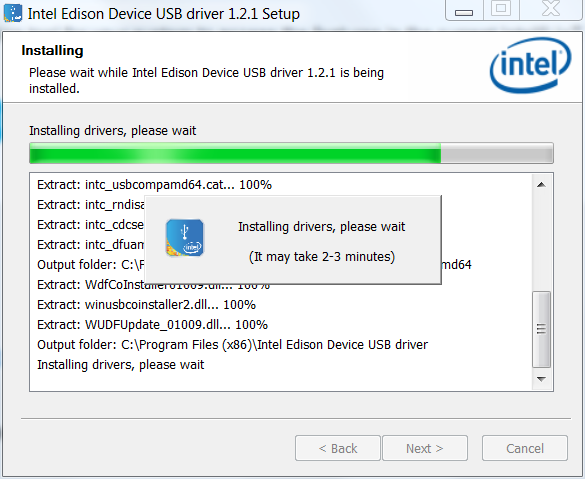
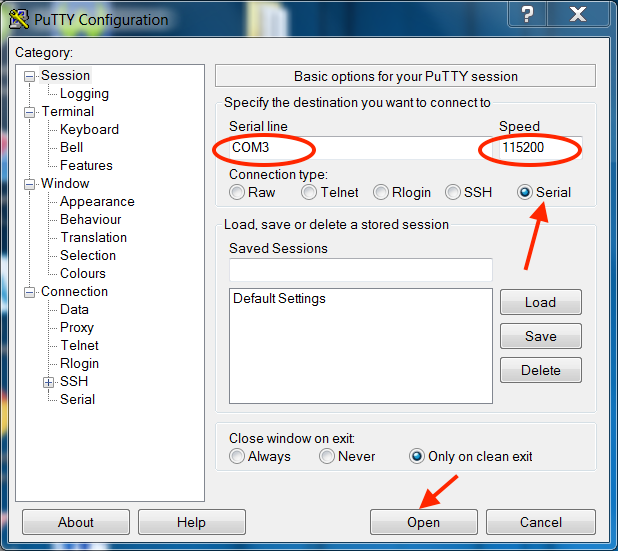

# Logging into your Explorer Board rig via console

## Prerequisites for Windows users

- Install the [Intel Edison drivers for Windows](https://software.intel.com/en-us/iot/hardware/edison/downloads). Select the "Windows standalone driver" download if available.  (Note: Intel has announced the Edison will be discontinued at the end of 2017.  As part of this, apparently, the old link to Edison drivers has been removed.  We are unsure if this is a temporary issue or long term.  Therefore, if the link above for Intel Edison Drivers is not working, you can use [this link](https://www.dropbox.com/s/d5ooojru5jxsilp/IntelEdisonDriverSetup1.2.1.exe?dl=0) to download them directly from an OpenAPS user's dropbox.  Obviously screenshots below will be different if Intel has not fixed or repaired their driver downloads page for Edisons.) After it is done downloading, click on the downloaded file and it will execute installation. You do not need to reflash the Edison or setup security or Wi-Fi with this tool because later steps in this process will overwrite those settings.

- Install [PuTTY]( http://www.chiark.greenend.org.uk/~sgtatham/putty/download.html). PuTTY is the program you will normally use to login to your rig in the future from the computer.  Creating a desktop shortcut for it is a good idea, since you will likely use it often.  Download the installation file that matches your PC's architecture (32-bit or 64-bit).  If you are unsure, you can check your computer's build and memory in the Control Panel.  Example shown is for a 64-bit computer.  If unsure, installing the 32-bit version won't harm anything...it just might be a little slower to use PuTTY.

## Plugging in cables and starting console

Your Explorer Board has 2 micro USB connectors. They can both provide power. On the community developed Edison Explorer Board, the port labeled OTG is for flashing, and the one labeled UART provides console login. You must connect both ports to your computer to complete the flash process. If you need to log into the rig using the console in the future, you will only need to connect to the UART port.

You must use DATA micro USB to USB cables. How do you know if your cable is for data? One good way is to plug the cable into your computer USB port and the explorer board OTG port. If your folder/window explorer shows Edison as a drive then the cable supports data.
If you don’t… 1) Try unplugging and replugging the existing cables; 2) try different cables.  If your USB port is bad and not recognizing the device, you may need to [reset your SMC first](https://support.apple.com/en-au/HT201295) (it’s not hard to do, takes 2 minutes.)

 

 

Note: If you are using a Macbook with a USB-C Hub you may encounter some issues with the flashing process, including unexpected rebooting and the wireless LAN setup not functioning correctly. If you have an option to use a PC or Laptop with directly connected USB cables, it will be easier to do so. Direct USB-C to micro-USB cables are better than a hub and a USB-to-microUSB cable, but still not as good as a regular USB port.

  - Connect a USB cable (one that carries data, not just power) to the USB console port. On the Explorer board or Sparkfun base block, this is the port labeled `UART`.  On the Intel mini breakout board, this is the USB port that is labeled P6 (should be the USB closest to the JST battery connector).  Plug the other end into the computer (or Pi) you want to use to connect to console.
  - Plug another USB cable (one that carries data, not just power) into the USB port labeled OTG on the Explorer board or Sparkfun base block, or the port that is almost in the on the bottom right (if reading the Intel logo) if setting up with the Intel mini breakout board.  Plug the other end into the computer (or Pi) you want to flash from.
  
 

## If you're using a Raspberry Pi or Mac for console:
  - Open a terminal window and type `sudo screen /dev/tty.usbserial-* 115200` 
  - If you do not have screen installed you can install with `sudo apt-get install screen`.
  - If necessary, replace the '*' with your Edison UART serial number, obtained using lsusb.
  - You’ll most likely be asked for your computer password again because you're using sudo.  Enter it.  
  - Continue with the All platforms section below.
  
## If you're using a Windows PC for console:

  - Once you plug in the cable, you need to determine which COM number it's using. On your computer, go to Control Panel\All Control Panel Items\Device Manager\Ports\ and look for USB Serial Port COMXX. If you have multiple and are unsure of which is the port you need: Make note of existing ports. Unplug the cable from the Explorer board. Notice which port disappears. This is the port you are looking for. (If only one shows up, that is your Edison's port.)
  
  
  
  - Open PuTTY, and change from SSH to Serial. It normally defaults to COM1 and speed of 9600. Change the COM number to the number you found when you plugged into the Explorer board. Change the speed (baud rate) to 115200. 
  
     
  - Once you've made those changes, Click on OPEN at the bottom of your Putty configuration window. 
  - Continue with the All platforms section below.
  
## All platforms:
  - Once the screen comes up, press enter a few times to wake things up. This will give you a "console" view of what is happening on your Edison. 
  - Now you will see a login prompt for the edison on the console screen.
  - Don't resize your console window: it will likely mess up your terminal's line wrapping.  (Once you get wifi working and connect with SSH you can resize safely.)
  
If you have a problem getting to the Edison login prompt, and possibly get a warning like "can't find a PTY", exit your console window.  Then unplug the usb cables from your computer (not from the Edison... leave those ones as is) and swap the USB ports they were plugged into. Then try the above directions again. Usually just changing the USB ports for the cables will fix that "can't find a PTY" error.

### Not sure of your password?

You should have changed your rig's root password during setup; if not, please [go back and do so now](../Build Your Rig/step-1-flashing). The default password is most likely "edison" without quotes, but check the slip of paper that might have come with your pre-flashed Edison.