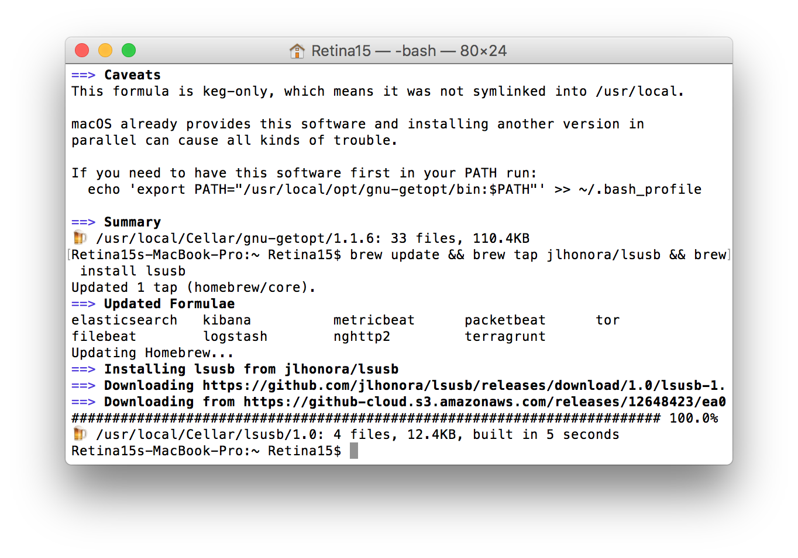
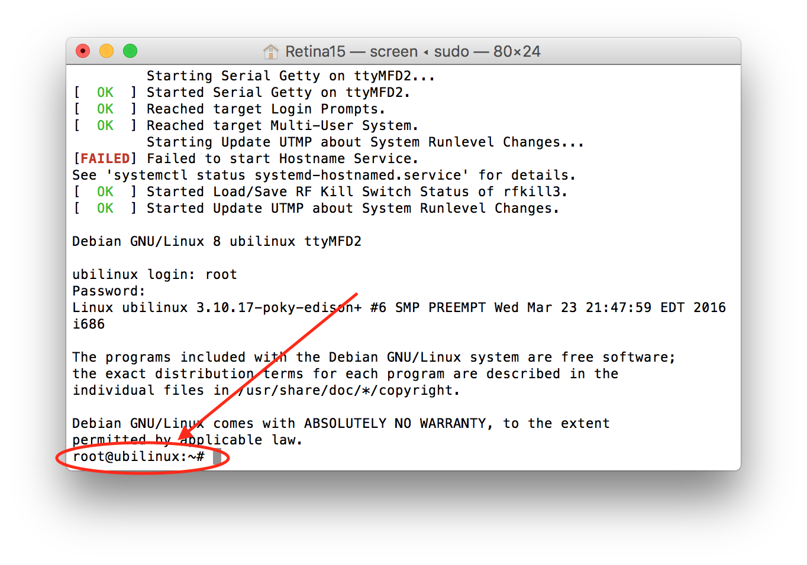

# Step 1: Jubilinux (for Edison rigs only)

This is only necessary for Edison rigs. Pi users can skip to 
[step 2](step-2-wifi-dependencies). If you purchased a pre-flashed Edison, you can also skip on down to [step 2](step-2-wifi-dependencies).

The steps outlined below include instructions for the various build-platforms (Windows PC, Mac, and Raspberry Pi). Linux users in general should be able to follow the steps for the Raspberry Pi.

## What is flashing?

The Edison comes with a very limited operating system, called Yocto, that doesn’t work easily with OpenAPS.  The first step is to replace the operating system with a new one.  This is called “flashing” the Edison.  

It's best to replace this with a custom version of Debian, as this fits best with OpenAPS, and it also means you have the latest security and stability patches. (These setup instructions were pulled from the mmeowlink wiki; if you're an advanced user and want/need to use Ubilinux instead of the recommended Jubilinux, [go here](https://github.com/oskarpearson/mmeowlink/wiki/Prepare-the-Edison-for-OpenAPS).) The setup instructions also are going to assume you're using the Explorer Board that has a built in radio stick. If you're using any other base board and/or any other radio sticks (TI, ERF, Rileylink, etc.), check out [the mmeowlink wiki](https://github.com/oskarpearson/mmeowlink/wiki) for support of those hardware options.

## 1. Prerequisites

### If you’re using a Raspberry Pi:

To flash the Edison using a Raspberry Pi, you’ll need a large (preferably 16GB+) SD card for your Pi.  The Edison image is almost 2GB, so you’ll not only need space for the compressed and uncompressed image, but you’ll also need to enable a large swapfile on your Pi to fit the image into virtual memory while it is being flashed.  Using an SD card as memory is very slow, so allow extra time to flash the Edison image using a Pi.

  - Run `sudo bash -c 'echo CONF_SWAPSIZE=2000 > /etc/dphys-swapfile'` to configure a 2GB swap file.
     *Note: if you don't have enough space on the SD card for a 2G swap a 1G swap will probably work*
  -  Run `sudo /etc/init.d/dphys-swapfile stop` and then `sudo /etc/init.d/dphys-swapfile start` to enable the new swap file.
  -  If you installed `watchdog` on the pi, it's a good idea to stop it since loading the image into memory to flash is intensive

### Windows PCs with under 6 GB of RAM

Windows PCs with less than 6 GB of RAM  may need to have the size of the page file increased to flash the Edison. Close all unnecessary programs and attempt to flash the device. If the flash operation fails follow these steps to ensure enough swap space is allocated when the computer boots, then restart and try again. Only do this if flashing the device doesn't work without changing these settings.

*Important: Write down the settings in the Virtual Memory window before you make any changes to your system. When you finish the flash process you must return these settings to their original values or Windows may become unstable.*

 - Go to the Control Panel, click All Control Panel Items, then click System. At top left click the Remote Settings link.
 - Select the Advanced tab in the System Properties window, then under Performance click Settings.
 - On the Advanced tab click the Change... button to change the page size.
 - In the Virtual Memory window uncheck "Automatically manage paging file size for all drives," click "Custom size," and set the initial size to at least 4096 MB. If you have already attempted this process at least once continue to increase this number by 1024 MB. Set the maximum size to 2048 MB higher than the initial size you used.
 - Click the Set button, then click OK until all windows are closed.
 - Reboot and attempt the flash process.

### If you're using a Mac:

- Install Homebrew, a tool which allows you to easily install other software packages and keep them up to date. Enter the following command in the Terminal app to install Homebrew: 
  
  ```ruby -e "$(curl -fsSL https://raw.githubusercontent.com/Homebrew/install/master/install)```
  
  You will be prompted to enter “RETURN” to continue and then enter your passcode for the user account (your computer password). When you type the password, you will not see any letters appear in the Terminal screen--that is normal.  Terminal does not show keystrokes for passwords.


It will take about 1-2 minutes for Homebrew to install.  You’ll see a bunch of commands scrolling by in Terminal window.  Just wait it out until you see the screen showing Installation successful and you’ll be returned to the Terminal prompt.
  
  If you get a message that Homebrew is already installed, that's also fine!
  
- Install several other utilities by entering the command:
  
  ```brew install dfu-util coreutils gnu-getopt```
  


- If you are reflashing an Edison, you might see a recommendation to upgrade coreutils, in which case, run `brew upgrade coreutils gnu-getopt`

-  Install lsusb: 

`brew update && brew tap jlhonora/lsusb && brew install lsusb`



The above instructions are based on [these instructions](https://software.intel.com/en-us/node/637974#manual-flash-process) which may be useful as a reference.

## 2. Downloading Jubilinux image

[Jubilinux](http://www.jubilinux.org/) "is an update to the stock ubilinux edison distribution to make it more useful as a server, most significantly by upgrading from wheezy to jessie."  That means we can skip many of the time-consuming upgrade steps that are required when starting from ubilinux.

  - Download [Jubilinux](http://www.jubilinux.org/dist/) - the jubilinux-v0.3.0.zip is known to work; jubilinux 0.2.0 runs Debian jessie, which is NOT supported by Debian any longer.
  - In the download folder, right-click on file and extract (or use `unzip jubilinux.zip` from the command line). You will access this directory from a command prompt in the next step. It is a good idea to create the Jubilinux in your root directory to make this easier to access.
  
  **Note** On Windows, you should see an `extract all` option when you right-click.  However, in some instances, it may not be active for zipped files. If you do not see the `extract all` option in the right-click menu, right-click the zipped file, choose `Properties` at the bottom of the context menu.  On the General tab, click on the button next to the "opens with" and change it to use Windows Explorer.  Apply the change and select `OK` to save the change.  You should now be able to right-click the jubilinux.zip file to extract all.
  
  - Open a Terminal (Mac) or Command Prompt (Windows) window and navigate to the extracted folder: `cd jubilinux`. This is your "flash window."  Keep it open for later!
  
  - If using Windows, you will need two additional utilities.  Download [DFU-Util](https://cdn.sparkfun.com/assets/learn_tutorials/3/3/4/dfu-util-0.8-binaries.tar.xz). Extract the two files, libusb-1.0.dll and dfu-util.exe, to the directory where you extracted jublinux.zip. (Alternately, you can download the two files [libusb-1.0.dll](http://dfu-util.sourceforge.net/releases/dfu-util-0.8-binaries/win32-mingw32/libusb-1.0.dll) and [dfu-util.exe](http://dfu-util.sourceforge.net/releases/dfu-util-0.8-binaries/win32-mingw32/dfu-util.exe) directly.) When you have successfully moved those two folders into the jubilinux folder, you should see files/folders inside the jubilinux folder like so:


## 3. Connecting cables to the Explorer Board and starting console

Now we move to the rig. You'll need to connect two cables from the rig to your computer. 
Follow the [console login directions](<../Build Your Rig/logging-into-rig-serial>) to get set up. 

Once you get to the login prompt, log in using the username "root" (all lowercase) and no password. This will have us ready to reboot from the command line when we are ready. This is your "console window" - keep it open.

If you do not have your Edison password at this point, don't panic.  We are only logging in to reboot the Edison and that can be accomplished via the black button on the explorer board as well.  Without the root password you may continue.

## 4. Flashing image onto the Edison

### If you’re using a Raspberry Pi - starting flash:
  - In the "flash window" from the Download Image instructions above, run `sudo ./flashall.sh`.  If you receive an `dfu-util: command not found` error, you can install dfu-util by running `sudo apt-get install dfu-util`

### If you’re using a Mac - starting flash:
  - In the "flash window" from the Download Image instructions above, run `./flashall.sh`.  
    - If you receive an `dfu-util: command not found` error, you can install dfu-util by following [the Mac instructions here](https://software.intel.com/en-us/node/637974#manual-flash-process). 
    - If you receive an 
        ```
        Error: Running Homebrew as root is extremely dangerous and no longer supported. As Homebrew does not drop privileges on installation you would be giving all build scripts full access to your system.
        ``` 
        see the troubleshooting section below.

### If you're using a Windows PC - starting flash:
  - In the "flash window" from the Download Image instructions above, run `flashall.bat`

### All platforms:
  - The flashall script will ask you to "plug and reboot" the Edison. 
    - If you have your edison root password: Go back to your console window and type `reboot`. 
    - If you do not have your edison root password: Press the black button on the explorer board until the LED between the usb connectors shuts off.  Then press it again until the light comes back on. 
  - Switch back to the other window and you will see the flash process begin. You can monitor both the flash and console windows throughout the rest of the flash process. If nothing else works and you are feeling brave, you can try pulling the Edison out and reconnecting it to the board to start the flash process. 
  - In the console window where you typed `reboot`, you should see:

```
Hit any key to stop autoboot:  0
Target:blank
Partitioning using GPT
Writing GPT: success!
Saving Environment to MMC...
Writing to redundant MMC(0)... done
Flashing already done...
GADGET DRIVER: usb_dnl_dfu
#
DFU complete CRC32: 0x77ccc805
DOWNLOAD ... OK
Ctrl+C to exit ...
######################################################################################################################
```
  And in the flash window, you should see 
```
Using U-Boot target: edison-blankcdc
Now waiting for dfu device 8087:0a99
Please plug and reboot the board
Flashing IFWI
Download	[=========================] 100%      4194304 bytes
Download	[=========================] 100%      4194304 bytes
Flashing U-Boot
Download	[=========================] 100%       245760 bytes
Flashing U-Boot Environment
Download	[=========================] 100%        65536 bytes
Flashing U-Boot Environment Backup
Download	[=========================] 100%        65536 bytes
Rebooting to apply partition changes
Now waiting for dfu device 8087:0a99
Flashing boot partition (kernel)
Download	[=========================] 100%      5980160 bytes
Flashing rootfs, (it can take up to 10 minutes... Please be patient)
```
  
  - Like it says, it will take about 10 minutes to flash from Mac or Windows.  If the step that flashall says should take up to 10 minutes completes in seconds, then the flash did not complete successfully, perhaps because you didn't set up the virtual memory / swap settings correctly; check the troubleshooting section.  If you’re using a Raspberry Pi, it may take up to 45 minutes, and for the first 10-15 minutes it may appear like nothing is happening, but eventually you will start to see a progress bar in the console. 
  - After flashing is complete and the Edison begins rebooting, watch the console: you may get asked to type `control-D` to continue after one or more reboots. If so, press `Ctrl-d` to allow it to continue. 
  - The Edison will reboot several times. You may see 
```
[**    ] A start job is running for /etc/rc.local Compatibili...14s / no limit)
```
for a few minutes: that's fine.  You can also expect to see an ugly red:
```
[FAILED] Failed to start Hostname Service.
```
That is also fine, and you can ignore it too. Just about when you'll start to get concerned that it is stuck in a loop, you should get a login prompt.  If so, congratulations! Your Edison is flashed. Use login `root` and password `edison` to login to your newly flashed Edison. 

After logging in, you will notice that the Terminal prompt says `root@ubilinux:~#`.  This is the correct prompt for the jubilinux system.  You will not see jubilinux in the prompt.  If you bought a pre-flashed Edison, this is how your initial Terminal prompt will look.



If you have any difficulty with flashing, skip down to [Troubleshooting](#troubleshooting)

After you've flashed your Edison, head on to [step 2 - setting up wifi and installing dependencies](step-2-wifi-dependencies)


## Troubleshooting

### Troubleshooting the flash process

a) If you get:
```
dfu-util: Device has DFU interface, but has no DFU functional descriptor
dfu-util: Cannot open DFU device 8087:0a99
```
that likely means you ran ./flashall.sh without sudo.

b) If you get:
```
Flashing rootfs, (it can take up to 10 minutes... Please be patient)
dfu-util -v -d 8087:0a99 --alt rootfs -D /home/pi/toFlash/edison-image-edison.ext4 -R 2>&1 | tee -a flash.log | ( sed -n '19 q'; head -n 1; cat >/dev/null )
Rebooting
U-boot & Kernel System Flash Success...
```
in something closer to 10 seconds than 10 minutes, then you likely didn't set up swap properly.  To verify, `cat flash.log` and look for `dfu-util: Cannot allocate memory of size 1610612736 bytes` near the end.
Alternatively, [this newer version of DFU Util](https://sourceforge.net/projects/dfu-util/files/latest/download) (DFU Util v0.9) seems to work better on computers with lots of RAM.

c) If you recieve an 
```
Error: Running Homebrew as root is extremely dangerous and no longer supported. As Homebrew does not drop privileges on installation you would be giving all build scripts full access to your system.
``` 
it means that you have a recent copy of homebrew (that's good) which doesn't allow sudo to even do a `brew list`. 

   * The _easiest_ - but perhaps not so forward compatible - thing is to figure out what the brew command was trying to do and edit the `flashall.sh` script accordingly.
   ** The v0.2.0 version of `flashapp.sh` has `$(brew list gnu-getopt | grep bin/getopt)`.
   ** Running `brew list gnu-getopt | grep bin/getopt` for me (Dec 2017) gave me `/usr/local/Cellar/gnu-getopt/1.1.6/bin/getopt`
   * Edit the `flashall.sh` from 
   ```
   :bash
        GETOPTS="$(which getopt)"
        if [[ "$OSTYPE" == "darwin"* ]] ; then READLINK=greadlink; GETOPTS="$(brew l    ist gnu-getopt | grep bin/getopt)"; else READLINK=readlink;fi;
   ```
   
   to
        
   ```:bash
        GETOPTS="$(which getopt)"
        if [[ "$OSTYPE" == "darwin"* ]]
        then
                READLINK=greadlink
                GETOPTS=/usr/local/Cellar/gnu-getopt/1.1.6/bin/getopt
        else
                READLINK=readline
        fi
   ```

d) If you have a failed flash or have problems with the reboot, try starting the console and hitting enter a bunch of times while connecting to stop autoboot.  You'll then be at a `boot>` prompt.  Run `sudo ./flashall.sh` and when it asks you to reboot type and enter `run do_flash` at the `boot>` prompt.

e) If you get stuck on an error that says "Ready to receive application" on the Edison the problem is you don't have enough power to properly boot up the Edison. This can happen if you are powering from your Pi. You should either connect a battery to the Edison board to give it a little boost, or use a powered USB hub between the Pi and the Edison.

f) If Edison reboots correctly but never gets picked up by the flashall.sh script and the flashing process does not start, check that you have DATA micro USB to USB cables - both of them. A large proportion of USB cables are not "data" - just power - and even cables previously used for data can degrade to no longer reliably carry data. How do you know if each cable is for data? One good way is to unplug both cables from the Edison, plug each cable in turn into your computer USB port and the explorer board OTG port. If your folder/window explorer shows Edison as a drive then the cable supports data. You need both to be data cables.

g) If Edison reboots correctly but never gets picked up by the flashall.sh script and the flashing process does not start, and you've re-confirmed that the two cables you are using are indeed good data cables, check the Edison device ID. It will probably come out automatically after the flashall.sh script fails with a list of available devices connected to the machine. On Linux, you can run lsusb to get a list of usb devices with their device ID. If the device ID is different from the one expected on flashall.sh, you can edit the script and change lines containing: USB_VID=8087 & USB_PID=0a99 to whatever the Edison has for an ID. Some users have encountered their devices ID to be 8087:0a9e

h) If you have attempted the firmware flash with Jubilinux several times and the flash will not complete successfully, it is highly recommended that you follow the mmeowlink [deprecated Ubilinux instructions](https://github.com/oskarpearson/mmeowlink/wiki/Prepare-the-Edison-for-OpenAPS#ubilinux-deprecated). Note that those instructions will have notes throughout for steps which are specific to the flash of Ubilinux. Additional steps help to align the Edison's operating system with Jubilinux. You must do these steps.

If you're having issues with a *Windows* flash of Jubilinux, try following along with the videos below. OpenAPS users have cited their instructions in successful flashes of Ubilinux. You will still need to go through the extra Ubilinux configuration steps mentioned in the linked mmeowlink wiki above.

1. [Flash Ubilinux Onto Intel Edison via Windows, 5 Part Video](https://www.youtube.com/watch?v=L57RC8POJzM) (Cygwin)
2. [uCast #21: Installing Ubilinux on the Edison (Windows)](https://www.youtube.com/watch?v=BSnXjuttSgY&t=16s) (Windows Command Prompt)

i) If none of the above has worked with the Explorer board, try swapping the two microUSB cables, or replacing them with new ones. See "f)" above too.

j) If you've attempted all of the troubleshooting steps above but still aren't successful, it's worth trying to use a different computer to flash.
     
     
### Troubleshooting rescue mode

* If your edison boots to a console and says it is in rescue mode (you can hit ctrl-d to continue or enter the root password), you may need to change a u-boot environment variable to make it boot normally.   During the boot process you will see:
```
*** Ready to receive application *** 


U-Boot 2014.04 (Feb 09 2015 - 15:40:31)

       Watchdog enabled
DRAM:  980.6 MiB
MMC:   tangier_sdhci: 0
In:    serial
Out:   serial
Err:   serial
Hit any key to stop autoboot:  0 
```
1. Hit any key to drop to a prompt and type:  
`printenv bootargs_target`
2. If the answer is  
`bootargs_target=first-install`  
then type:  
`setenv bootargs_target multi-user`   
`saveenv`  
3. And to exit that firmware u-boot prompt:  
`run do_boot`

* If this doesn't fix the problem, and your boot gets stuck here:
```
[  OK  ] Mounted /home.

         Starting Rescue Shell...

[  OK  ] Started Rescue Shell.

[  OK  ] Reached target Rescue Mode.
```
You may have an issue with the flashall.sh script. (This seems to only impact mac users). 
In the "flash window" terminal where you downloaded Jubilinux

1. Edit the flashall script  
`nano flashall.sh`
2. Find the following text (around line 220) Your text may vary slightly, with additional echo statements or such  
```
echo "Flashing U-Boot Environment Backup and rebooting to apply partiton changes"
    flash-command --alt u-boot-env1 -D "${VARIANT_FILE}" -R

    dfu-wait
```
3. Modify this line to remove the -R and the dfu-wait command   
```
echo "Flashing U-Boot Environment Backup and rebooting to apply partiton changes"
    flash-command --alt u-boot-env1 -D "${VARIANT_FILE}" 
```
4. Reboot one last time - install should take a good deal longer than previous executions.  


### Override DNS resolvers

Some users have reported problems with connecting to internet sites.  If you are experience poor internet connections, try 'nano /etc/resolv.conf' and change the first two nameservers to: 

     nameserver 8.8.4.4
     nameserver 8.8.8.8

Also see the instructions [here](https://wiki.debian.org/NetworkConfiguration#The_resolvconf_program) to add these nameservers to your `/network/interfaces` file as the `resolv.conf` file is likely to be overwritten.

Alternatively, add the nameservers you want to see in `resolv.conf` to `/etc/resolvconf/resolv.conf.d/tail` and they'll be automatically added to `resolv.conf`. (You may need to create the folder by running this command first: `mkdir -p /etc/resolvconf/resolv.conf.d`)


### IP address conflicts (able to ping external but not LAN addresses)

Some users have reported problems where the local router uses the same IP block as that of usb0 config.  The default configuration for usb0 in `/etc/network/interfaces` uses 192.168.2.15, so if your local router also uses 192.168.2.xx you may not be able to properly connect to your Edison using SSH, and external connectivity may intermittently fail.

To check which IP address your router is using, you can run `ipconfig` on Windows or `ifconfig` on Mac/Linux.  If you're getting an address starting with 192.168.2.x, you'll want to edit your Edison's configuration to use a different subnet for usb0:

Use `vi /etc/network/interfaces` to edit the static usb0 interface address from 192.168.2.15 to another valid private IP, like 192.168.29.29.  The resulting config should look like:

```
# interfaces(5) file used by ifup(8) and ifdown(8)
auto lo
iface lo inet loopback

auto usb0
iface usb0 inet static
    address 192.168.29.29
    netmask 255.255.255.0

auto wlan0
iface wlan0 inet dhcp
    wpa-conf /etc/wpa_supplicant/wpa_supplicant.conf
```

Once that looks correct, save the file and `reboot` your rig for the changes to take effect.


### Interrupting Kernel Messages in Console/Screen Mode


#### Fix for individual console/screen session:

Type this at the prompt:   `dmesg -D`

#### Permanent solution:

`vi /etc/rc.local`
press i for insert mode

add this line:    sudo dmesg -n 1


(remember to save and exit the vi editor by using esc and then :wq)


