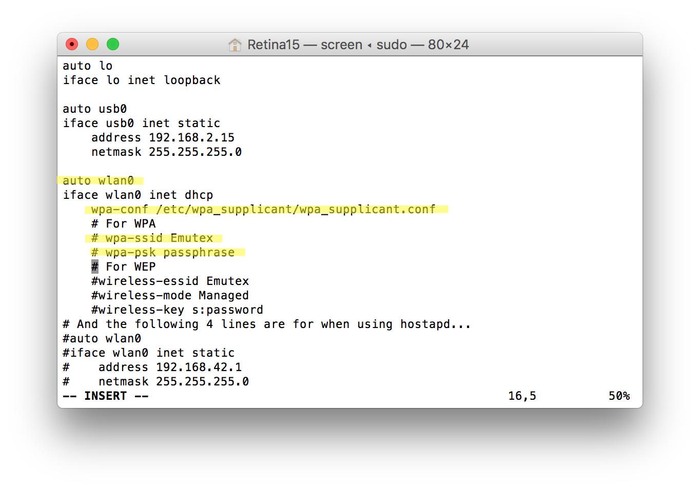
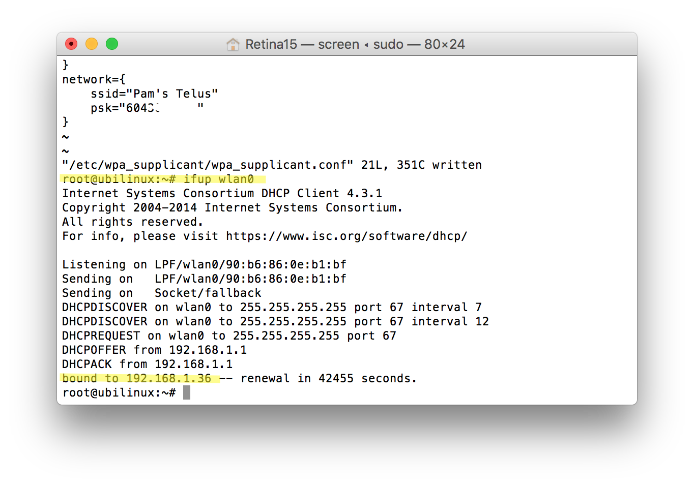
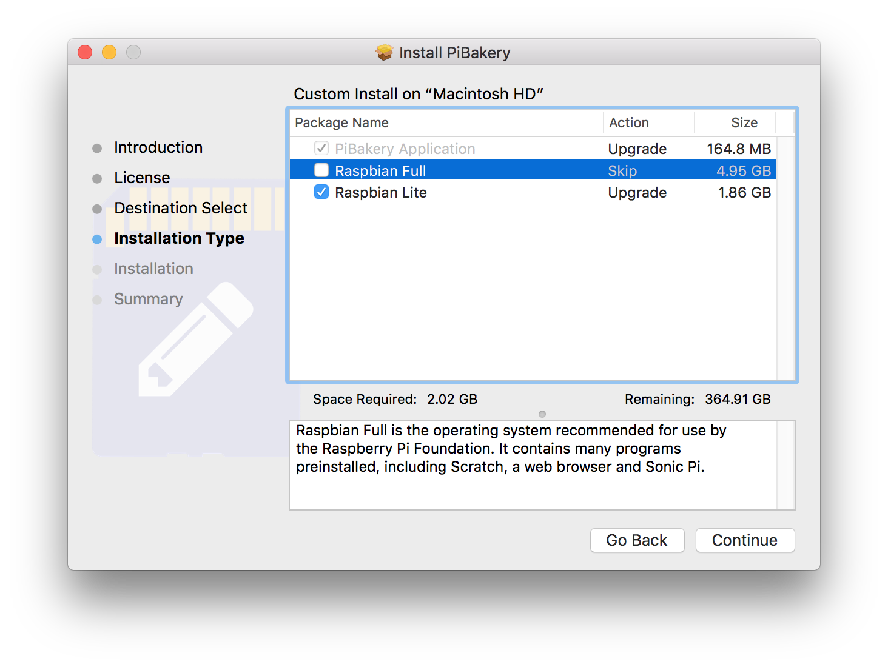
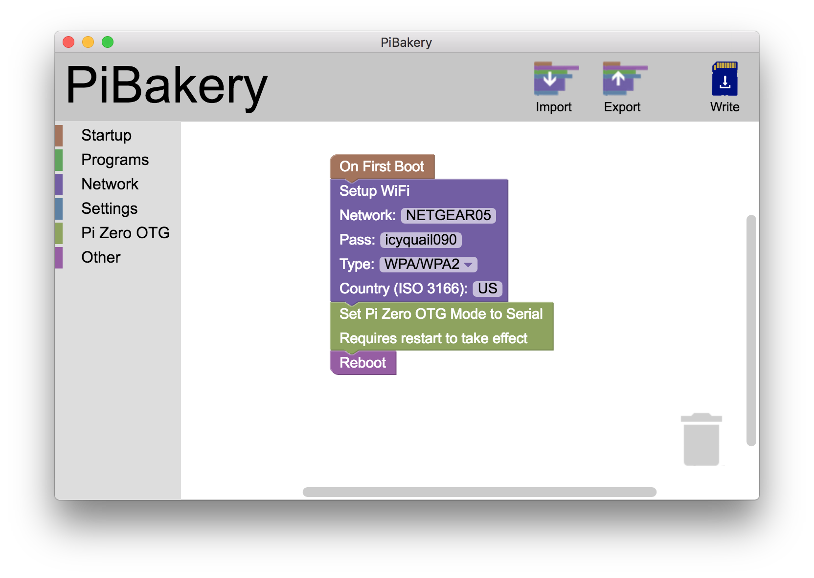
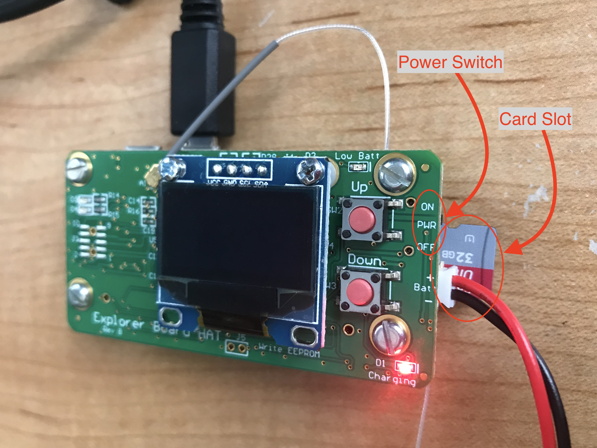
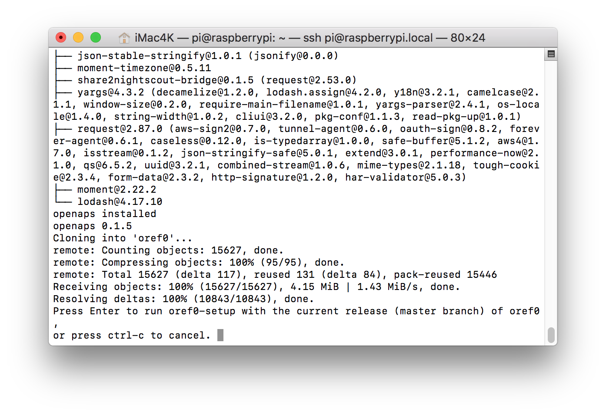
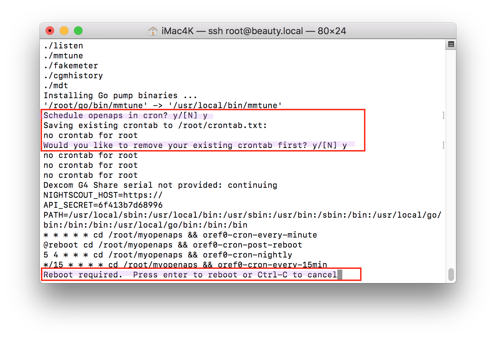

# Step 2: Wifi and Dependencies

The directions for this step depend on which type of rig you are using:

- [Intel Edison](#Intel-Edison-instructions)

- [Raspberry Pi](#Raspberry-Pi-instructions)

## Intel Edison instructions

### Prep Computer and Login to rig

To get your first wifi connection set up and install OpenAPS, you'll need to log in to the rig via the console. Follow the [console login directions](../Build Your Rig/logging-into-rig-serial) to get a console window open, then the rest of the instructions below.

### Bootstrap script

If you're not already, make sure you're logged into your rig via root. You should see `root@jubilinux` on the command prompt.

The box below is the Bootstrap script, which will set up your first wifi network connection and install dependencies.  Copy this text (all of it in the box): 

```
#!/bin/bash
(
dmesg -D
echo Scanning for wifi networks:
ifup wlan0
wpa_cli scan
echo -e "\nStrongest networks found:"
wpa_cli scan_res | sort -grk 3 | head | awk -F '\t' '{print $NF}' | uniq
set -e
echo -e /"\nWARNING: this script will back up and remove all of your current wifi configs."
read -p "Press Ctrl-C to cancel, or press Enter to continue:" -r
echo -e "\nNOTE: Spaces in your network name or password are ok. Do not add quotes."
read -p "Enter your network name: " -r
SSID=$REPLY
read -p "Enter your network password: " -r
PSK=$REPLY
cd /etc/network
cp interfaces interfaces.$(date +%s).bak
echo -e "auto lo\niface lo inet loopback\n\nauto usb0\niface usb0 inet static\n  address 10.11.12.13\n  netmask 255.255.255.0\n\nauto wlan0\niface wlan0 inet dhcp\n  wpa-conf /etc/wpa_supplicant/wpa_supplicant.conf" > interfaces
echo -e "\n/etc/network/interfaces:\n"
cat interfaces
cd /etc/wpa_supplicant/
cp wpa_supplicant.conf wpa_supplicant.conf.$(date +%s).bak
echo -e "ctrl_interface=DIR=/var/run/wpa_supplicant GROUP=netdev\nupdate_config=1\nnetwork={\n  ssid=\"$SSID\"\n  psk=\"$PSK\"\n}" > wpa_supplicant.conf
echo -e "\n/etc/wpa_supplicant/wpa_supplicant.conf:\n"
cat wpa_supplicant.conf
echo -e "\nAttempting to bring up wlan0:\n"
ifdown wlan0; ifup wlan0
sleep 10
echo -ne "\nWifi SSID: "; iwgetid -r
sleep 5
curl https://raw.githubusercontent.com/openaps/oref0/master/bin/openaps-install.sh > /tmp/openaps-install.sh
bash /tmp/openaps-install.sh
)
```

Copy all of those lines; go back to Terminal/PuTTY and paste into the command line (Paste in PuTTY is just a right mouse click). Then, hit `enter`.  The screenshot below is an example of what the pasted text will look like (highlighted in blue for clarity). *(If you have trouble copying from the box, [click here](https://raw.githubusercontent.com/openaps/oref0/master/bin/openaps-bootstrap.sh) and ctrl-a or command-a to copy the text from there.)*

*************
Note: **This setup script will require you to have an available working internet connection to be successful.**  If anything fails during the installation, the setup may end early before you get to the setup script questions.  In that case, you can just paste the script above into the command line again and try again.  (Don't try to use the up arrow, it probably won't work.)  If you get repeated failures, bring your questions and error messages into Gitter or FB for help with troubleshooting.
*************


The script will do some initial installing, check the wifi, and ask you to hit enter to proceed.  It will run for a while again, and then ask you to type in your wifi name and press `enter`; and type your wifi password and press `enter`.  Pay careful attention to capital letters, spacing, and special characters.


* Change your hostname (a.k.a, your rig's name). **Make sure to write down your hostname; this is how you will log in in the future as `ssh root@what-you-named-it.local`**

* Pick your time zone (e.g., In the US, you'd select `US` and then scroll and find your time zone, such as `Pacific New` if you're in California).

Now that step 2 is done, the bootstrap script will then continue to run awhile longer (~20+ minutes)...this next part is installing the necessary dependencies (step 3) before you move onto the setup script (step 4).  You'll see an awful lot of lines going by as the process goes on.  Eventually, the successful bootstrap ends with this screen below:


At the completion, you will be prompted to press `enter` if you want to continue the setup script (oref0-setup).  If you don't have time to run the setup script (a fresh install of setup script can take about an hour to run), then you can cancel and come back to it later.  Regardless of your answer, you should now return to [the Setup Script section](http://openaps.readthedocs.io/en/latest/docs/Build%20Your%20Rig/OpenAPS-install.html#run-oref0-setup) for finishing step 4.

Now that you have a wifi connection to your rig, you have the option of [logging into it using SSH](../While%20You%20Wait%20For%20Gear/monitoring-OpenAPS#accessing-your-online-rig-via-ssh) from a computer on the same network, rather than using a cable. 

### Manual instructions for Intel Edison

Below are the manual instructions for reference only - it is strongly recommended that you use the bootstrap script above instead.

#### Initial Edison Setup

Log in as root/edison via serial console.

Type/edit the following:

    myedisonhostname=<thehostname-you-want>     #Do not type the <>

And then paste the following to rename your Edison accordingly:

    echo $myedisonhostname > /etc/hostname
    sed -r -i"" "s/localhost( jubilinux)?$/localhost $myedisonhostname/" /etc/hosts

Run these commands to set secure passwords. Make sure you save them somewhere - you will need them! It will ask you to enter your new password for each user 2 times. Type the password in the same both times.  To use SSH (which you will need to do shortly) this password needs to be at least 8 characters long.  Do not use a dictionary word or other easy-to-guess word/phrase as the basis for your passwords.  Do not reuse passwords you've already used elsewhere.

    passwd root
    passwd edison

#### Set up Wifi:

`vi /etc/network/interfaces`

A screen similar to the one below will appear.  Type “i” to enter INSERT mode for editing on the file.



Type 'i' to get into INSERT mode. In INSERT mode 
* Uncomment 'auto wlan0' (remove the `#` at the beginning of the line)
* Edit the next two lines to read:
```
auto wlan0
iface wlan0 inet dhcp
    wpa-conf /etc/wpa_supplicant/wpa_supplicant.conf
```
Comment out (add # at the start of the line) or delete the wpa-ssid and wpa-psk lines.

After editing, your file should look like:

```
# interfaces(5) file used by ifup(8) and ifdown(8)
auto lo
iface lo inet loopback

auto usb0
iface usb0 inet static
    address 192.168.2.15
    netmask 255.255.255.0

auto wlan0
iface wlan0 inet dhcp
    wpa-conf /etc/wpa_supplicant/wpa_supplicant.conf
```

Press Esc and then type ':wq' and press Enter to write (save) the file and quit.

To set up a wireless connection, enter

`vi /etc/wpa_supplicant/wpa_supplicant.conf`

Type 'i' to get into INSERT mode and add the following to the end, once for each network you want to add. Be sure to include the quotes around the network name and password.  If you have a hidden wifi network add the line `scan_ssid=1`.


```
network={
    ssid="my network"
    psk="my wifi password"
}
```

The networks you enter here are the wifi networks that your rig will be able to use to stay connected to internet. After getting your initial wireless connection set up, you can return to [the instructions for adding additional wireless connections ](http://openaps.readthedocs.io/en/latest/docs/Customize%20Iterate/on-the-go-wifi-adding.html) to add more options to your rig at any point.


On a Mac, if you experience any erratic behavior while using the screen editor, such as the cursor overwriting or deleting adjacent words when typing or even when using the cursor arrow keys, this may be due to incorrectly set Mac Terminal window settings. Try going to the "Shell" on the menu bar above and selecting "Show Inspector." Ensure the Columns setting is set to "80" and the Rows setting is set to "25."

Press Esc and then type ':wq' and press Enter to write the file and quit.

Run `ifup wlan0` to make sure you can connect to wifi.  A successful connection should look similar (IP address numbers will be different than mine):



Make sure you see a message showing you are successfully connected, then `reboot` to apply the wifi changes and (hopefully) get online.

After rebooting, log back in and type `iwgetid -r` to make sure you successfully connected to wifi. It should print out your network name. If the rig isn't online, go back and check your /etc/network/interfaces and /etc/wpa_supplicant/wpa_supplicant.conf files above: you probably either missed a step or made a typo. 

Note: If you are reflashing an Edison, you might get a scary looking error about "WARNING: POSSIBLE DNS SPOOFING DECTECTED WARNING: REMOTE HOST IDENTIFICATION HAS CHANGED!" that is likely because you are attempting to login to a rig that has the same hostname as a previous rig that has been logged into on the computer. You can delete the history of known hosts for the rig by entering the commands `cd .ssh` and then `rm known_hosts`.  This will delete the log of known hosts on your computer.  There's no significant downside to removing the known_host log, except that you will need to answer yes to the key fingerprint additions again for the first time you login to old rigs again. 


Run `ifconfig wlan0` to determine the IP address of the wireless interface, in case you need it to SSH below.  Alternatively, if you know how to login to your router, you can also see the Edison's IP address there.


Leave the serial window open in case you can't get in via SSH and need to fix your wifi config.
 
If you need more details on setting up wpa_supplicant.conf, see one of these guides:

* [http://weworkweplay.com/play/automatically-connect-a-raspberry-pi-to-a-wifi-network/](http://weworkweplay.com/play/automatically-connect-a-raspberry-pi-to-a-wifi-network/)
* [http://www.geeked.info/raspberry-pi-add-multiple-wifi-access-points/](http://www.geeked.info/raspberry-pi-add-multiple-wifi-access-points/)
* [http://raspberrypi.stackexchange.com/questions/11631/how-to-setup-multiple-wifi-networks](http://raspberrypi.stackexchange.com/questions/11631/how-to-setup-multiple-wifi-networks)
* [http://www.cs.upc.edu/lclsi/Manuales/wireless/files/wpa_supplicant.conf](http://www.cs.upc.edu/lclsi/Manuales/wireless/files/wpa_supplicant.conf)


#### Install packages, ssh keys, and other settings

From a new terminal or PuTTY window, `ssh root@myedisonhostname.local`. If you can't connect via `youredisonhostname.local` (for example, on a Windows PC without iTunes), you can instead connect directly to the IP address you found with `ifconfig` above. 

If you see warnings about the authenticity of host can't be established, you can say yes to continue and add the new edison to your known hosts list.  This message typically appears when you've set-up multiple edisons on the same computer.

Log in as root (with the password you just set above), and run these three lines one by one. The first line "dpkg -P ... " will be quick. Check the printout to see that it ran without error. Then run the apt-get lines one at a time. They may take several minutes. 


    dpkg -P nodejs nodejs-dev
    apt-get update && apt-get -y dist-upgrade && apt-get -y autoremove
    apt-get install -y sudo strace tcpdump screen acpid vim python-pip locate

And these three (the first two will be fast, the last line will take you to a screen for setting up your timezone):

    adduser edison sudo
    adduser edison dialout
    dpkg-reconfigure tzdata    # Set local time-zone
       Use arrow button to choose zone then arrow to the right to make cursor highlight <OK> then hit ENTER


Enter `vi /etc/logrotate.conf`, press “i” for INSERT mode, and make the following changes:

 * set the log rotation to `daily` instead of `weekly`
 * remove the # from the “#compress” line, in order to enable log compression; this reduces the probability of running out of disk space
 
Press ESC and then type “:wq” to save and quit


If you're *not* using the Explorer board and want to run everything as `edison` instead of `root`, log out and log back in as edison (with the password you just set above).  (If you're using an Explorer board you'll need to stay logged in as root and run everything that follows as root for libmraa to work right.)

If you have an ssh key and want to be able to log into your Edison without a password, copy your ssh key to the Edison ([directions you can adapt are here](http://openaps.readthedocs.io/en/latest/docs/Resources/Deprecated-Pi/Pi-setup.html#mac-and-linux)).  For Windows/Putty users, you can use these instructions: [https://www.howtoforge.com/ssh_key_based_logins_putty](https://www.howtoforge.com/ssh_key_based_logins_putty).

If you're *not* using the Explorer board, are running as the `edison` users, and want to be able to run sudo without typing a password, run:
```
    $ su -
    $ visudo
```    
and add to the end of the file:
``` 
 edison ALL=(ALL) NOPASSWD: ALL   
```    


## Raspberry Pi instructions

Note: there are two key ways to setup a Pi rig. One uses Pi Bakery, the other is a manual method. If your Pi Bakery process does not work, just use [Option B](#Option-B). 

### Option A - Use Pi Bakery

There are many ways setup Raspian (the operating system...like jubilinux is for Edison board) microSD card to use in your Raspberry Pi.  One easy way for a new user is to use PiBakery, a free application you'll download from the internet. (Note that if this is not successful, you can switch to [Option B](#Option-B) below). 

Download PiBakery [here](http://pibakery.org/download.html).  Follow the directions for installing PiBakery on your computer (the directions on their site include screenshots that are helpful).  The download is fairly large (2.2GB) so it may take a couple minutes to complete.

Once you open PiBakery installer, you will be presented with a choice of installing Raspian Full or Raspian Lite.  Unselect the checkbox for Raspian Full, and keep the installation for Raspian Lite.  When the installation is done, you will be asked if you want to move the PiBakery installer to the trash.  That is fine to do.



When the install has finished, find and open the PiBakery app from your applications folder on the computer.  You may be prompted for your computer's passcode; if so, enter it.

The starting screen for the PiBakery is fairly empty, but we are going to basically use visual boxes to build a puzzle of what we would like to install on our SD card.  So start by clicking on the "Startup" selection on left column.  Click, drag, and drop the "on first boot" box over to the white area to the right of the window.  


Next, click on the Network category and drag over the Setup Wifi box to near the On First Boot box.


You want to have the boxes link together (if you have audio on, you'll hear a little click noise as the boxes link together).  You can drag more wifi network boxes if you already know the wifi networks that you'd like to add already.  Don't worry though, you'll have the opportunity to add more later...this is just an important step to get started the first time with at least one network.


Note:  Raspbian requires a Country Code (such as US, UK, DE, etc) - otherwise wifi will remain disabled on the Pi.  This is different than the Edison/Jubilinux setups so be aware!  The default country code is GB, because that is where the PiBakery author is from.  Most users will need to change this.  Wondering what the codes are?  You can look up your two letter code [here](https://www.iso.org/obp/ui/#search/code/).

Enter in your network name, password, and country code.  Capital and lowercase matter.  You can leave the type as WPA/WPA2 unless you specifically know your network uses a different connection type.

You can add as many special "recipe ingredients" as you'd like.  Advanced users may find ingredients they are specifically interested in.  Shown below is a relatively simple setup that will have good utility (one wifi network and setting the OTG port to serial to make future offline-connections easier).  



Put your microSD card into a reader for your computer.  Once you get your recipe completed in PiBakery, click on the "Write" icon in the upper left of the window. You'll select your SD card's name from the menu that appears and the Operating System will be Raspbian Lite.  Click the Start Write button.  Click yes to the warning about erasing the content of the card to begin the writing process.


#### Boot up your Pi and connect to it

After a couple minutes, the writing should be done and you can eject the microSD card from your computer, insert it into your Pi (card slot location shown below), and plug in power to the Pi, and turn on the power switch (off/on positions are labeled on the HAT board for ease).



Give the rig a couple minutes to boot up.  Once the green LED stops blinking as much, you can try to log in.

On Mac, open Terminal and use `ssh pi@raspberrypi.local`

On Windows, use PuTTY and establish an SSH connection, with username `pi`, to hostname `raspberrypi.local`. If you receive a warning that the rig's host key is not yet cached, respond YES to add it.

Troubleshooting:  If you have problems connecting, try rebooting your router.  If you have multiple channels (2.4Ghz vs 5Ghz), you could try redoing the PiBakery setup with the other channel's network name, if the first one fails.

The default password for logging in as `pi` is `raspberry`.  The `pi` username and default password is only used for this initial connection: subsequently you'll log in as `root` with a password and rig hostname of your choosing.

#### Run openaps-install.sh

Once you're logged in, run the following commands to start the OpenAPS install process:

```
sudo bash
curl -s https://raw.githubusercontent.com/openaps/oref0/dev/bin/openaps-install.sh > /tmp/openaps-install.sh && bash /tmp/openaps-install.sh
```

* Change your hostname (a.k.a, your rig's name). **Make sure to write down your hostname; this is how you will log in in the future as `ssh root@whatyounamedit.local`**

* You'll be prompted to set two passwords; one for root user and one for pi user.  You'll want to change the password to something personal so your device is secure. Make sure to write down/remember your password; this is what you'll use to log in to your rig moving forward. You'll type it twice for each user.  There is no recovery of this password if you forget it.  You will have to start over from the top of this page if you forget your password.

* Pick your time zone (e.g., In the US, you'd select `US` and then scroll and find your time zone, such as `Pacific New` if you're in California).

The script will then continue to run awhile longer (10 to 30 minutes) before asking you to press `enter or control-c` for the setup script options.  Successful completion of this section should look like below.  



**If you are installing to a Pi with a legacy radio (Ti-stick, SliceOfRadio, etc.) - Press enter.  [Jump to finishing the installation](#finish-installation)**

**If you are installing to a newer Pi with a HAT or RFM69HCW as radio: Do not press enter!  [Continue on to Pi-Hat instructions.](#switch-to-dev-branch-for-your-pi-hat).**

Troubleshooting:  If your screen stops as shown below or jumps ahead to the interactive portion before successful completion (as shown above), rerun the curl -s command line shown above.  


#### Switch to dev branch for your pi HAT
If you are here - you should be building a rig with a Pi HAT(recommended) or RFM69HCW (experimental).  Instead of proceeding with the setup script, press `control-c` to cancel the setup script.

Reboot your rig by entering `reboot`.  This will end your ssh session.  Give your rig time to reboot, reconnect to wifi, and then login to the rig again.  This time the rig will be using the rig name you chose before in the setup so use `ssh root@yourrigname.local` on a Mac.  On a Windows PC with PuTTY, the hostname can be either `yourrigname` or `yourrigname.local`, and the username will be `root`.

Now we will select a Raspian-compatible updated branch by using `cd ~/src/oref0 && git checkout dev`. On your first install you should see a message returned of "Branch dev set up to track remote branch dev from origin. Switched to a new branch 'dev'". On subsequent installs or updates you would follow the direction to execute the command "git pull".

#### Finish installation

First, update npm to the latest version. Run `npm install npm@latest -g`. 

Next, change to the oref0 directory if you are not in it already. Run `cd ~/src/oref0`. 

Now run `npm run global-install`.  After about 10-15 minutes, the installations will end and you will be dropped off at the `root@yourrigname:~/src/oref0#` prompt.  Successful completion of this step should look like below.


Now you can run the interactive oref0 setup script:

`cd && ~/src/oref0/bin/oref0-setup.sh`

Answer all the setup questions.  A successful setup script will finish asking you if you want to setup cron.  Say yes to those two questions.  Finally, you'll see a message about Reboot required.  Go ahead and reboot the rig.  You've finished the loop installation. Login to the rig again. 


**Troubleshooting**: If your rig gets stuck at the point shown below, simply login to the rig again and run the setup script one more time.  Usually, running the setup script a second time will clear that glitch.


Once your setup script finishes, **make sure to [watch the pump loop logs](http://openaps.readthedocs.io/en/latest/docs/Build%20Your%20Rig/OpenAPS-install.html#step-5-watch-your-pump-loop-log)**

**NOTE**: If you are using RFM69HCW as RF module:

If you have connected your RFM69HCW module as described in [Soldering RFM69HCW](https://openaps.readthedocs.io/en/latest/docs/Gear%20Up/edison.html#soldering), while running interactive setup use following options:
```Are you using an Explorer Board? [Y]/n n
Are you using an Explorer HAT? [Y]/n n
Are you using mmeowlink (i.e. with a TI stick)? If not, press enter. If so, paste your full port address: it looks like "/dev/ttySOMETHING" without the quotes.
What is your TTY port? /dev/spidev0.0
Ok, TTY /dev/spidev0.0 it is. 

Would you like to [D]ownload released precompiled Go pump communication library or install an [U]nofficial (possibly untested) version.[D]/U u
You could either build the Medtronic library from [S]ource, or type the version tag you would like to use, example 'v2018.08.08' [S]/<version> s
Building Go pump binaries from source
What type of radio do you use? [1] for cc1101 [2] for CC1110 or CC1111 [3] for RFM69HCW radio module 1/[2]/3 3
Building Go pump binaries from source with  + radiotags +  tags.
```
after running oref0-setup.sh run the following:
```$ cd ~ && export PATH="$PATH:/usr/local/go/bin"
$ rm -rf ~/go/src/github.com/ecc1
$ go get -u -v -tags "rfm69 walrus" github.com/ecc1/medtronic/...
$ cp -pruv $HOME/go/bin/* /usr/local/bin/
$ mv /usr/local/bin/mmtune /usr/local/bin/Go-mmtune
```
This will help in building the right pump communication libraries.

* You'll want to also delete the openaps-menu folder to avoid error messages in your logs. `rm -rf ~/src/openaps-menu/`
* If you experience something like this:
```mmtune: radio_locale = WW
2019/01/14 15:14:25 cannot connect to CC111x radio on /dev/spidev0.0
2019/01/14 15:14:25 cc111x: no response
Usage: grep [OPTION]... PATTERN [FILE]...
Try 'grep --help' for more information.
```
That means you have probably run the oref-runagain.sh script. Currently, with RFM69HCW, you can't use the runagain script. Please run the interactive setup script (`cd && ~/src/oref0/bin/oref0-setup.sh`). Other option would be you didn't solder diligently enough. Before disassembling and resoldering, try running the interactive script first. It's less work. 


*****************************

### Option B 

#### Download Raspbian and write it to your microSD card

Following the [install instructions](https://www.raspberrypi.org/documentation/installation/installing-images/README.md), download Raspbian Lite (you do **not** want Raspbian Desktop) and write it to an microSD card using Etcher.

#### Place your wifi and ssh configs on the new microSD card

Once Etcher has finished writing the image to the microSD card, remove the microSD card from your computer and plug it right back in, so the boot partition shows up in Finder / Explorer.

Create a file named wpa_supplicant.conf on the boot drive, with your wifi network(s) configured.  The file must be in a Unix format.  If creating the file in Windows, use an editor that allows you to save the file in Unix format instead of DOS format. There are many editors with this ability. `Notepad++` is one that works well. The file should look something like:

```
country=xx
ctrl_interface=DIR=/var/run/wpa_supplicant GROUP=netdev
update_config=1
network={
  ssid="MyWirelessNetwork"
  psk="MyWirelessPassword"
}
```

You will need to replace xx after country with the correct ISO3166-1 Alpha-2 country code for your country (such as US, UK, DE, etc) - otherwise wifi will remain disabled on the Pi.

To enable SSH login to the Pi, you will need to create an empty file named `ssh` (with no file extention).
On Windows, you can make this file appear on your Desktop by opening the command prompt and typing:
```
cd %HOMEPATH%\Desktop
type NUL > ssh
```
On a Mac, the equivalent command is:
```
cd ~/Desktop/
touch ssh
```

When you are done, copy it from your Desktop to the boot drive of your SD card.

#### Boot up your Pi and connect to it

Eject the microSD card from your computer, insert it into your Pi, and plug in power to the Pi to turn it on.  Give it a couple minutes to boot up.  Once the green LED stops blinking as much, you can try to log in.

On Mac, open Terminal and `ssh pi@raspberrypi.local`

On Windows, use PuTTY and establish an SSH connection, with username `pi`, to hostname `raspberrypi.local`. 

The default password for logging in as `pi` is `raspberry`.  The `pi` username and default password is only used for this initial connection: subsequently you'll log in as `root` with a password and rig hostname of your choosing.

#### Run openaps-install.sh

Once you're logged in, run the following commands to start the OpenAPS install process:

```
sudo bash
curl -s https://raw.githubusercontent.com/openaps/oref0/dev/bin/openaps-install.sh > /tmp/openaps-install.sh && bash /tmp/openaps-install.sh
```

You'll be prompted to set a password.  You'll want to change it to something personal so your device is secure. Make sure to write down/remember your password; this is what you'll use to log in to your rig moving forward. You'll type it twice.  There is no recovery of this password if you forget it.  You will have to start over from the top of this page if you forget your password.

* Change your hostname (a.k.a, your rig's name). **Make sure to write down your hostname; this is how you will log in in the future as `ssh root@whatyounamedit.local`**

* Pick your time zone (e.g., In the US, you'd select `US` and then scroll and find your time zone, such as `Pacific New` if you're in California).

The script will then continue to run awhile longer (~10+ minutes) before asking you to press `enter` to run oref0-setup.

Return to the [OpenAPS Install page](http://openaps.readthedocs.io/en/latest/docs/Build%20Your%20Rig/OpenAPS-install.html#step-3-setup-script) to complete oref0-setup. 

**If you are installing to a Pi with a legacy radio (Ti-stick, SliceOfRadio, etc.) - Press enter. [Jump to finishing the installation](#finish-installation)**

**If you are installing to a newer Pi with a HAT as radio: Do not press enter!  [Continue on to Pi-Hat instructions.](#switch-to-dev-branch-for-your-pi-hat).**
