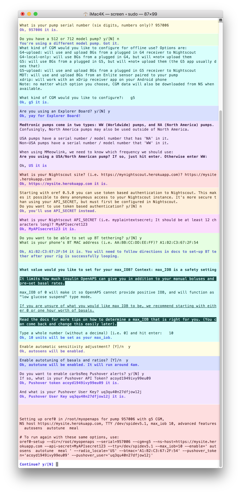

# Step 3: Setup script

* **If you pressed `enter` to continuing on with the setup script at the end of the bootstrap script**, you do **NOT** need to specifically enter the command in the box below.  By pressing `enter` to continuing on with setup script, the command was automatically started for you.

* **If you pressed `control-c` to end at the completion of the bootstrap script** and did not continue automatically with setup script, this is where you'll pick back up.  At this point, your rig should have your first wifi connection finished and your dependencies installed.  

Log in to your rig and run the following command (aka "the setup script"):
    
    `cd && ~/src/oref0/bin/oref0-setup.sh`

If this is your first time logging into the rig since running bootstrap script, you will have to change your rig's password on this first login.  You will enter the default password first of `edison` and then be prompted to enter your new password twice in a row.  If you get an error, it is likely that you forgot to enter `edison` at the first prompt for changing the password.

## Be prepared to enter the following information into the setup script:

The screenshot below shows an example of the questions you'll be prompted to reply to during the setup script (oref0-setup).  Your answers will depend on the particulars of your setup.  Also, don't expect the rainbow colored background - that's just to help you see each of the sections it will ask you about!

* 6-digit serial number of your pump
* whether you are using an 512/712 model pump (those require special setup steps that other model pumps do not)
* whether you are using an Explorer board
   * if not an Explorer board, and not a Carelink stick, you'll need to enter the mmeowlink port for TI stick.  See [here](https://github.com/oskarpearson/mmeowlink/wiki/Installing-MMeowlink) for directions on finding your port
    * if you're using a Carelink, you will NOT be using mmeowlink. After you finish setup you need to check if the line `radio_type = carelink` is present in your `pump.ini` file.
* CGM method:  The options are `g4-upload`, `g4-local-only`, `g5`, `mdt`, and `xdrip`.
   * Note:  OpenAPS also attempts to get BG data from your Nightscout.  OpenAPS will always use the most recent BG data regardless of the source. As a consequence, if you use FreeStyle Libre or any other CGM system that gets its data only from Nightscout, you'll be fine choosing any of the options above. 
   * Note:  For Medtronic 640G (CGM) users, it is recommended that you enter 'xdrip' - otherwise the BG values may not be read from your Nightscout. (The reason being, the 'MDT' option applies only for the enlite sensor attached to the actual pump you're looping with)
   * Note: G4-upload will allow you to have raw data when the G4 receiver is plugged directly into the rig.
* Nightscout URL and API secret (or NS authentication token, if you use that option)
* BT MAC address of your phone, if you want to pair for BT tethering to personal hotspot (letters should be in all caps)
  * Note, you'll still need to do finish the BT tethering as outlined [here](http://openaps.readthedocs.io/en/latest/docs/Customize-Iterate/bluetooth-tethering-edison.html) after setup.
* Your desired max-iob
* whether you want Autosensitivity and/or Autotune enabled
* whether you want any carbs-required Pushover notifications (and if you do, you'll need your Pushover API token and User Key)



At the end of the questions, the script will ask if you want to continue.  Review the information provided in the "to run again with these same options" area...check for any typos.  If everything looks correct, then press `y` to continue.  If you see a typo, press `n` and then type `cd && ~/src/oref0/bin/oref0-setup.sh` to start the setup questions over again.

After the setup script finishes building your loop (called myopenaps), it will ask if you want to schedule a cron (in other words, automate and turn on your loop) and remove any existing cron.  You'll want to answer `y` to both - and also then press `enter` to reboot after the cron is installed.  If your setup script stalls out before those two questions happen, rerun the setup script again.

**************************

## Log rotate fix

<details>
    <summary><b>Click here to expand notes about checking log rotate, which was fixed in 0.6.1:</b></summary>
<br>
    
Make sure that at the end of the setup script, your log rotate file is set to `daily` as described below.  Most users will have the `compress` line properly edited already, but the log rotate file seems to be left at `weekly` for many users.  If you leave the setup at `weekly`, you will likely get a `device full` error in your pump logs within a week...so please check this before moving on!

* Enter `vi /etc/logrotate.conf` then press “i” for INSERT mode, and make the following changes so that your file matches the one below for the highlighted areas:

 * set the log rotation to `daily` from `weekly`
 * remove the # from the “#compress” line (if it is present)

* Press ESC and then type `:wq` to save and quit


</details> 

## 512 and 712 Pump users only - important extra setup steps

If you have one of the x12 model pumps, you can still successfully use OpenAPS for basic looping (but not some advanced featuers like SMB).  You'll need to complete some extra setup tweaks before your loop will be successful, however.

Note: If you have an old rig running oref0 0.5.3 or below, you'll need to follow historical instructions. The instructions below reflect the adjusted oref0-setup.sh in 0.6.0 and beyond, that does some of this work manually.

### Most important step - make sure you said yes (y) in oref0-setup.sh 

During the interactive setup script, one early question is about whether you have an x12 pump. This means you, if you have a 512 or 712 pump you're setting up. Make sure to type Y or y and see the confirmation that you'll be using an x12 pump.

### Edit the three (3) necessary files: basal, settings, and targets

At the end of the oref0-setup.sh script, it will open the most important file for you to edit - your basal profile. Edit this file to match your preferred basal rates and timing. 

```
Note: The "minutes" is "minutes from midnight". e.g., a basal starting at 5:00am 
will have a minutes entry of 5 x 60 = 300 minutes and a basal starting at 7:30am 
will have a minutes entry of 7.5 x 60 = 450 minutes. 
If you have a basal rate less than 1.0 unit/hour, 
make sure to include a zero before the decimal point such as `0.55`
```

After you ctrl-x and hit "y" to save the file, you'll also see a reminder to further adjust other files with your settings in order to loop off of your information. 

* If you need to edit your basal rate file in the future, simply type `nano ~/myopenaps/settings/basal_profile.json` from the command line.

To edit and set your maxBasal or your DIA:
* `nano ~/myopenaps/settings/settings.json`

Finally, to set your targets:
* `nano ~/myopenaps/settings/bg_targets_raw.json`


#### Examples of the three file types

To see examples of each of these three files, see below.

##### Sample file for settings.json

notes are added with `#` on the lines you want to adjust or pay attention to in particular

```
{
  "maxBasal": 1.5,  #adjust to your preferred max temp basal rate
  "temp_basal": {
    "percent": 100,
    "type": "Units/hour"
  }, 
  "insulin_action_curve": 6 #adjust to your selected duration of insulin action in whole hour increments
}
```

##### Sample file for bg-targets-raw.json

Note: the "offset" entry is the minutes since midnight for that particular target to start.  The profile always starts with a midnight rate first, offset is 0.  The next BG target, in this example, starts at 6 am and therefore has an offset of 360 minutes (6 hours from midnight at 60 minutes per hour).  Target range can have the same bg value for high and low, if desired, but be careful not to have a high target set lower than the low target.

You can add or delete bg targets to the sample file below, but pay close attention to syntax.  The last bg target range in the profile needs end without a comma after the last `}`

```
{
  "units": "mg/dL", 
  "targets": [
    {
      "high": 120, 
      "start": "00:00:00", 
      "low": 110, 
      "offset": 0, 
      "i": 0, 
      "x": 0
    }, 
    {
      "high": 110, 
      "start": "06:00:00", 
      "low": 110, 
      "offset": 360, 
      "i": 12, 
      "x": 1
    }, 
    {
      "high": 120, 
      "start": "20:00:00", 
      "low": 110, 
      "offset": 1200, 
      "i": 40, 
      "x": 2
    }
  ], 
  "first": 1
}
```

##### Sample file for selected-basal-profile.json

Note:  The format for the basal rates is the "minutes" value refers to the "minutes from midnight" for whatever rate schedule you are setting.  For example, the 6:00 am rate in the example file below is a rate of 1.15 units/hour and 6:00 am is 360 minutes since midnight passed (6 hours x 60 minutes per hour).  

If you have a basal rate less than 1.0 unit/hour, make sure to include a zero before the decimal point such as `0.55`

You can add or delete basal rates to the sample file below, but pay close attention to syntax.  The last basal rate in the profile needs end without a comma after the last `}`

```
  [
  {
    "i": 0,
    "start": "00:00:00",
    "rate": 1.15,
    "minutes": 0
  },
  {
    "i": 1,
    "start": "02:30:00",
    "rate": 1.20,
    "minutes": 150
  },
  {
    "i": 2,
    "start": "06:00:00",
    "rate": 1.15,
    "minutes": 360
  },
  {
    "i": 3,
    "start": "09:00:00",
    "rate": 1.05,
    "minutes": 600
  },
  {
    "i": 4,
    "start": "11:30:00",
    "rate": 1.05,
    "minutes": 690
  },
  {
    "i": 5,
    "start": "14:00:00",
    "rate": 1.05,
    "minutes": 840
  },
  {
    "i": 6,
    "start": "18:30:00",
    "rate": 1.05,
    "minutes": 1110
  },
  {
    "i": 7,
    "start": "23:00:00",
    "rate": 1.05,
    "minutes": 1380
  }
  ]
```
