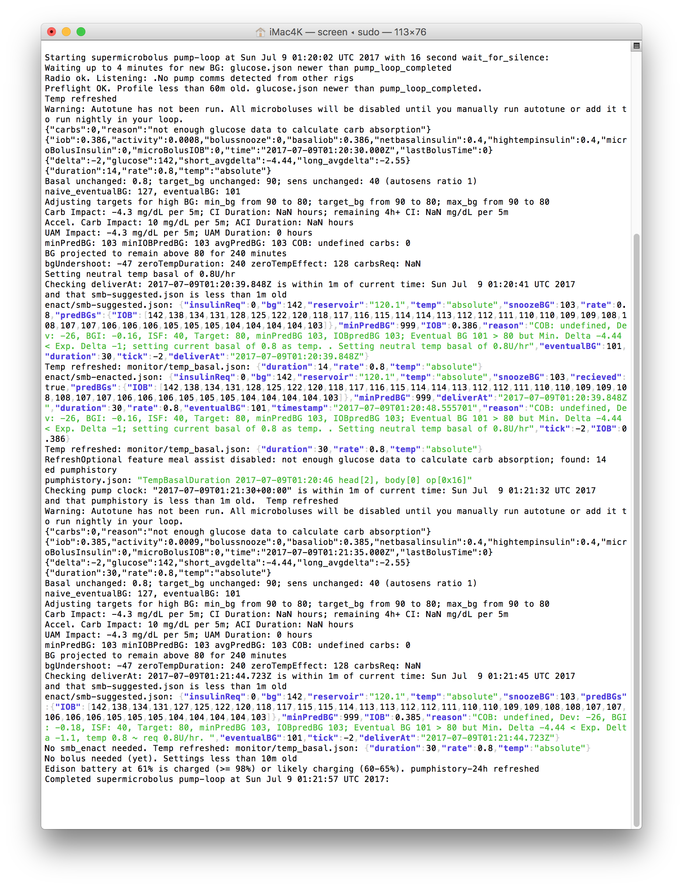

# Step 4: Watch your Pump-Loop Log

THIS IS A REQUIRED MUST-LEARN HOW-TO STEP - DO NOT MOVE ON WITHOUT DOING THIS! This is a key skill for monitoring your OpenAPS setup to "check" or "monitor" or "watch" the logs. 

It's easy: simply type the letter `l` (short for "log", aka the very important pump-loop.log). (*This is a shortcut for the full command, `tail -F /var/log/openaps/pump-loop.log`*.)

## What you'll see while waiting for your first loop (common non-error messages)

If this is your first rig, you are probably (1) going to underestimate how long it takes for the first loop to successfully run and (2) while underestimating the time, you'll freak out over the messages you see in the pump-loop logs.  Let's go over what are NOT errors:


<details>
    <summary><b>Click here</b> to expand the explanation of the non-error messages</summary>
<br>

When your loop very first starts, if you are quick enough to get into the logs before the first BG is read, you will likely see: 
```
Waiting up to 4 minutes for new BG: jq: monitor/glucose.json: No such file or directory
date: invalid date '@'
```
Don't worry...once you get a BG reading in, that error will go away.

The next not-error you may see:
```
ls: cannot access monitor/pump_loop_completed: No such file or directory
```
Don't worry about that one either.  It's only going to show because there hasn't been a completely loop yet.  Once a loop completes, that file gets created and the "error" message will stop.

Next frequently confused non-error:
```
Waiting for silence: Radio ok. Listening.....No pump comms detected from other rigs
```
Well, hey that's actually a good message.  It's saying "I don't hear any interruptions from other rigs, so I won't be needing to wait my turn to talk to the pump."  That message will continue to show even when your loop is successfully running.

As the pump loop continues:
```
Refreshed jq: settings/pumphistory-24h-zoned.json: No such file or directory
```
That message will clear out once the pump history has successfully been read.

Or how about the fact that autotune hasn't run yet, but you enabled it during setup:
```
Old settings refresh Could not parse autotune_data
```
Autotune only runs at 4:05am every morning. So if autotune has not yet run, you must wait for that error message to clear out, or run it manually. You can still loop while that message is showing. Additionally, you'll have to wait until autotune runs before SMBs can be enacted. (SMBs won't enact unless an Autotune directory exists.)

And then you may have an issue about the time on your pump not matching your rig's time:
```
Pump clock is more than 1m off: attempting to reset it
Waiting for ntpd to synchronize....No!
ntpd did not synchronize.
```
This synchronization may fail a few times before it actually succeeds...be patient.  There's a script called oref0-set-device-clocks that will eventually (assuming you have internet connection) use the internet to sync the rig and pump's times automatically when they are more than 1 minute different.  (If you don't have internet connection, you may need to do that yourself on the pump manually.)

How about these daunting messages:
```
Optional feature meal assist disabled: not enough glucose data to calculate carb absorption; found: 4

and

carbsReq: NaN CI Duration: NaN hours and ACI Duration: NaN hours

and

"carbs":0, "reason": "not enough glucose data to calculate carb absorption"
```
Advanced meal assist requires at least 36 BG readings before it can begin to calculate its necessary data. So after about three hours of looping these messages will clear out.  You can watch the count-up of "found" BG readings and know when you are getting close.  

</details>
<br>

## What you'll see when you are looping successfully ~20+ minutes later!

Finally, you should eventually see colorful indications of successful looping, with a message saying "Starting with oref0-pump-loop" and ending with "Completed oref0-pump-loop"



Reading these should give you an idea for what OpenAPS knows: current BG, changes in BG, information about netIOB (taking into account any temp basals it has set along with any boluses you have done), carbs on board, etc. Plus, it will give you information about the predictions and show you the data points it is using to draw the "purple prediction lines" in Nightscout. It also will tell you what, if anything, is limiting it's ability to give more insulin - i.e. if you have maxIOB at 0, or it is capped by one of the safety settings, etc. This information is a longer version of the information that will show in the "OpenAPS pill" on Nightscout. And - this is where it will tell you what insulin it thinks you need (more/less and how much) and what temporary basal rate (temp basal) it will try to set next to adjust and bring your eventualBG prediction into your target range. ([For more details on how to interpret the OpenAPS math and information, see this page for understanding OpenAPS determine-basal](<../How it works/understand-determine-basal#summary-of-outputs>).)

If after 20 minutes, you still have some errors showing instead of the above successful looping information, it may be time to head over to the [Troubleshooting oref0-setup tips page](<../Troubleshooting/oref0-setup-troubleshooting>) for ideas on your error messages and how to resolve them.  IF you aren't able to resolve your errors, please make sure that you have captured the error messages before heading over to Gitter or Facebook to get help.  Troubleshooting is far more successful when you come prepared with the error messages.

**Done watching the logs? Type control-C to exit the pump-loop log.**

## Temp basals > 6.3, ISF > 255 or carb ratio > 25 with a x23 or x54?

<details>
    <summary><b>Expand here for notes:</b></summary>
<br>

* If your rig tries and fails to set a temp basal > 6.3 you should see "ValueError: byte must be in range(0, 256)" in the log.  

* If your pump ISF setting is > 255 the ISF shown in the log and in the OpenAPS pill in Nightscout will be 256 less than the actual pump setting (257 will show as 1).  

* If your pump carb ratio is > 25 and you have a x23 or x54 pump you will see a message about "carb ratio out of bounds" in the log.

To fix these problems you need to update decocare.  This is easy.  Type control-C to exit the pump-loop log.  Then copy the following 3 lines to the terminal window.

```
cd ~/src && git clone git://github.com/openaps/decocare.git
cd decocare
python setup.py install
```

</details>

## Rig Logs and Shortcut commands - bookmark this section!

Checking your pump-loop.log is a great place to start anytime you are having looping failures.  Your error may not be in the pump-loop, but the majority of the time, you'll get a good head start on the issue by looking at the logs first. So, develop a good habit of checking the pump-loop log to get to know what a normal log looks like so that when a real error appears, you can easily see it as out of place and needing to be addressed.  Additionally, knowing how to access your pump-loop log is important if you come to Gitter or Facebook looking for troubleshooting help...one of the first questions will usually be "what does your pump-loop log look like?" or "what do the logs say?"

Note: The pump-loop log is not the only log your rig generates.  There are also several other loop logs contained within your OpenAPS setup such as:

* Autosens log: `tail -F /var/log/openaps/autosens-loop.log`

* Nightscout log: `tail -F /var/log/openaps/ns-loop.log`

* Network log: `tail -F /var/log/openaps/network.log`

* Autotune log: `tail -F /var/log/openaps/autotune.log` (remember Autotune only runs at midnight (or at 4AM starting from 0.6.0-rc1), so there's not much action in that log)

These logs and other files are things you may frequently access. There are shortcuts built in to help you more easily access key files on the go. The `l` you type for logs is an example of one of these shortcuts - it's actually a shortcut for the full command `tail -F /var/log/openaps/pump-loop.log`. Here are other shortcuts:

```
 --View live logs--
 l => tail -F /var/log/openaps/pump-loop.log
 autosens-looplog => tail -n 100 -F /var/log/openaps/autosens-loop.log
 autotunelog => tail -n 100 -F /var/log/openaps/autotune.log
 ns-looplog => tail -n 100 -F /var/log/openaps/ns-loop.log
 pump-looplog => tail -n 100 -F /var/log/openaps/pump-loop.log
 networklog => tail -n 100 -F /var/log/openaps/network.log
 xdrip-looplog => tail -n 100 -F /var/log/openaps/xdrip-loop.log
 cgm-looplog => tail -n 100 -F /var/log/openaps/cgm-loop.log
 urchin-looplog => tail -n 100 -F /var/log/openaps/urchin-loop.log
 * to quit watching, press Ctrl+C
 
 --View settings/logs/info--
 cat-pref => cd ~/myopenaps && cat preferences.json
 cat-wifi => cat /etc/wpa_supplicant/wpa_supplicant.conf
 cat-autotune => cd ~/myopenaps/autotune && cat autotune_recommendations.log
 cat-runagain => cd ~/myopenaps && cat oref0-runagain.sh
 git-branch => cd ~/src/oref0 && git branch
 edison-battery => cd ~/myopenaps/monitor && cat edison-battery.json
 cat-reservoir => cd ~/myopenaps/monitor && cat reservoir.json
 
 --Edit settings--
 edit-wifi => vi /etc/wpa_supplicant/wpa_supplicant.conf
 edit-pref => cd ~/myopenaps && vi preferences.json
 edit-runagain => cd ~/myopenaps && nano oref0-runagain.sh
 ```
To use these shortcuts, just type in the phrase you see on the left - i.e. `edit-wifi` and hit enter.