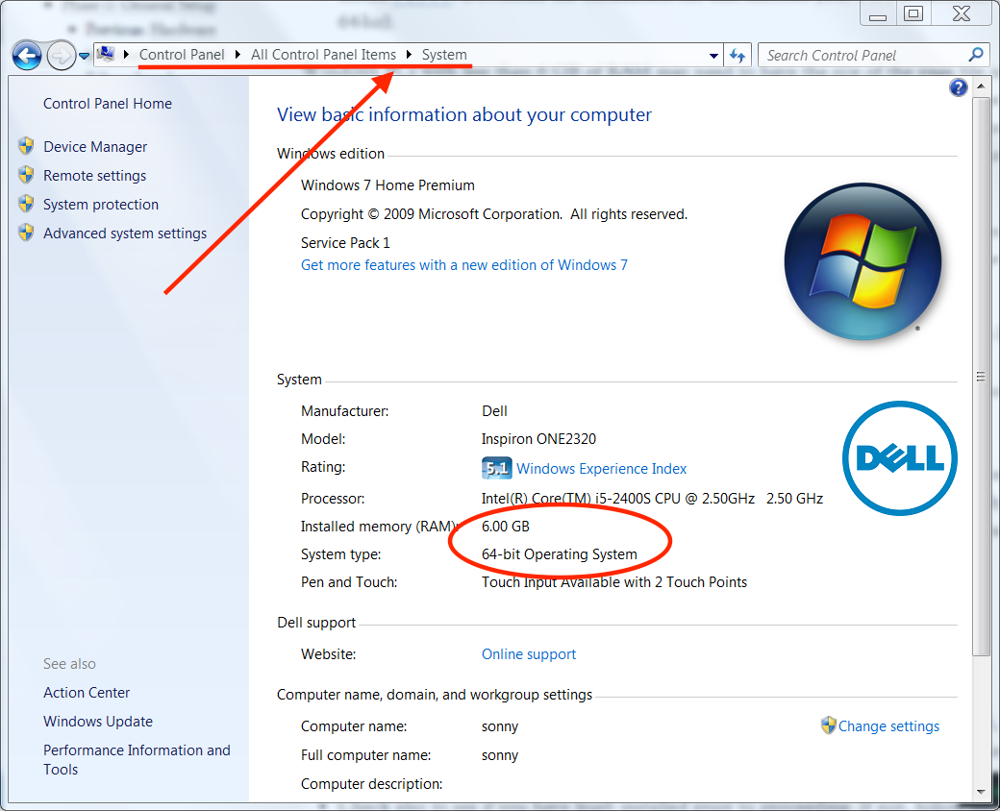
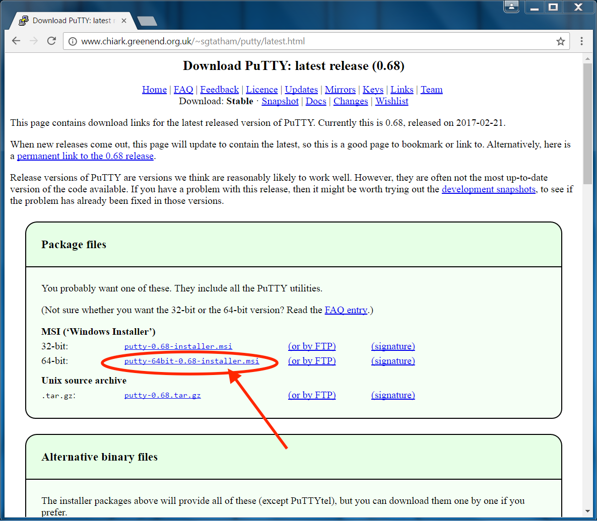
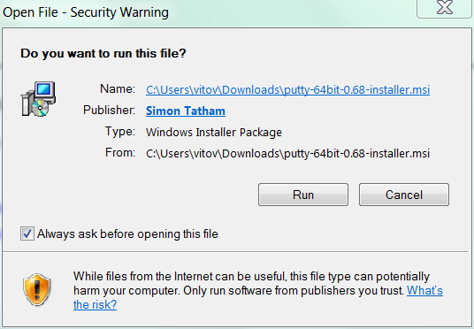

# Windows Users: Getting drivers and PUTTY so you can access your rig

### **1-1 Prepare Windows Computer**

- Install the [Intel Edison drivers for Windows]( https://downloadcenter.intel.com/download/26993/Intel-Edison-Configuration-Tool). Select the "...setup...exe" download, for example, "IntelEdisonDriverSetup1.2.1.exe". After it is done downloading, click on the downloaded file and it will execute installation.

- Install [PuTTY]( http://www.chiark.greenend.org.uk/~sgtatham/putty/download.html). PuTTY is the program you will normally use to login to your rig in the future from the computer.  Creating a desktop shortcut for it is a good idea, since you will likely use it often.  Download the installation file that matches your PC's architecture (32-bit or 64-bit).  If you are unsure, you can check your computer's build and memory in the Control Panel.  Example shown is for a 64-bit computer.  If unsure, installing the 32-bit version won't harm anything...it just might be a little slower to use PuTTY.

### **1-2  Prepare Edison**
Now we move to the Edison.  You’ll see two microB USB ports on your explorer board.  One is labeled OTG (that’s for flashing) and one is labeled UART (that’s for logging into the Edison from a computer).  Connect the board's UART port with your computer’s USB port using one of the cables listed in the parts list (Dexcom’s charging cable will work too). 

 
Note: This photo displays two cables plugged into the Edison board, but only one is necessary for connecting to your computer.

- Once you plug in the cable, you need to determine which COM number it's using. On your computer, go to Control Panel\All Control Panel Items\Device Manager\Ports\ and look for USB Serial Port COMXX. If you see multiple entries and are unsure of which is the port you need: Make note of existing ports. Unplug the cable from the Explorer Board. Notice which port disappears. This is the port you are looking for.  If only one shows up while your Edison is plugged in, and none appear when your Edison is unplugged from your computer, then that is your Edison's port.
 

Note: If your Edison's port doesn't appear, make sure its battery is charged and/or the Edison is powered on.
 
  - Open PuTTY, change from SSH to Serial. It normally defaults to COM1 and speed of 9600. Change the COM number to the number you found when you plugged into the Explorer Board. Change the speed (baud rate) to 115200. 
  - Once you've made those changes, Click on OPEN at the bottom of your Putty configuration window.
  

 - Once the screen comes up, press enter a few times to wake things up. This will give you a "console" window of what is happening on your Edison. 
- Now you will see a login prompt for the Edison on the console screen. Login using the username "root" (all lowercase) and default password (most likely "edison" without quotes, but check the slip of paper that might have come with your pre-flashed Edison).

Head back to the other directions to continue the setup.
  

