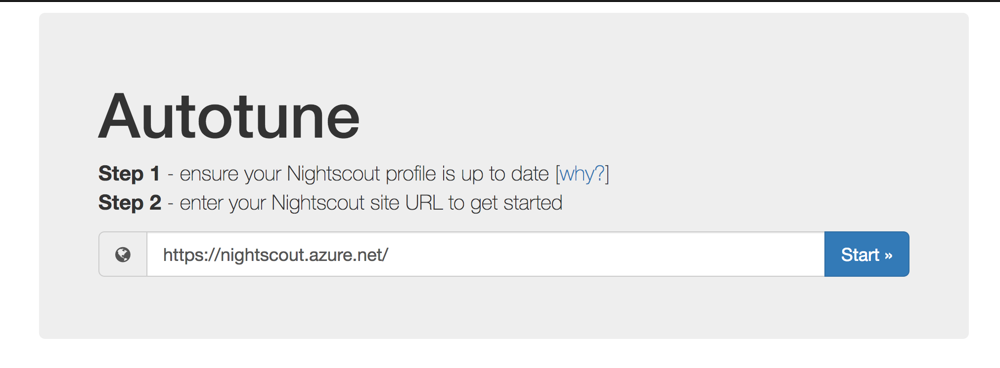
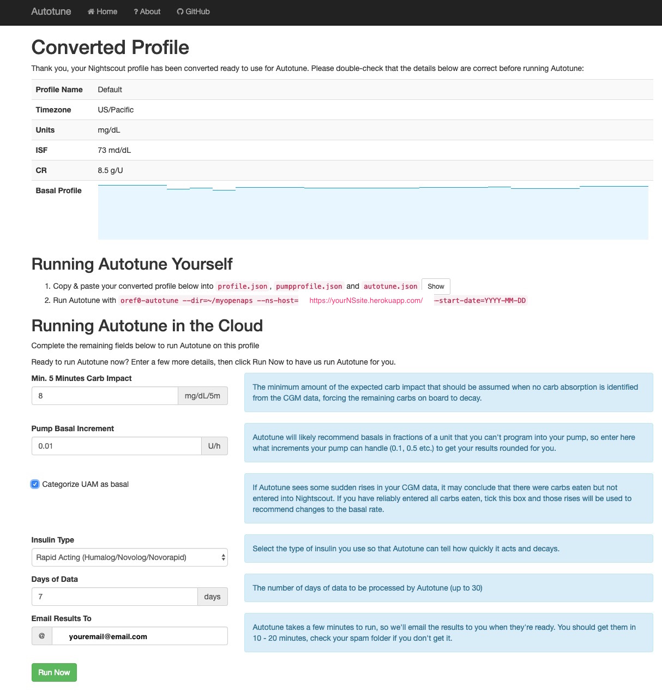
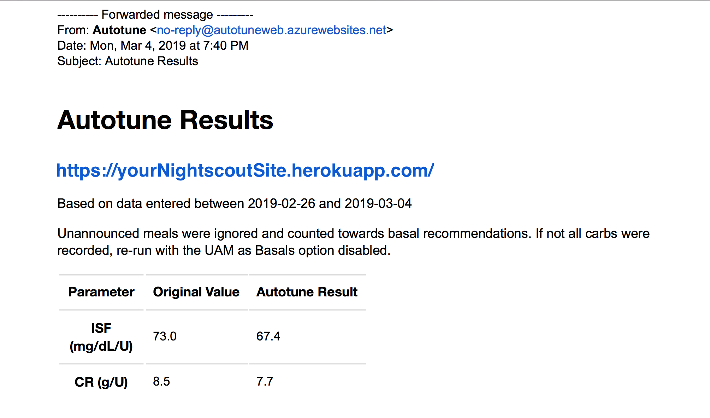
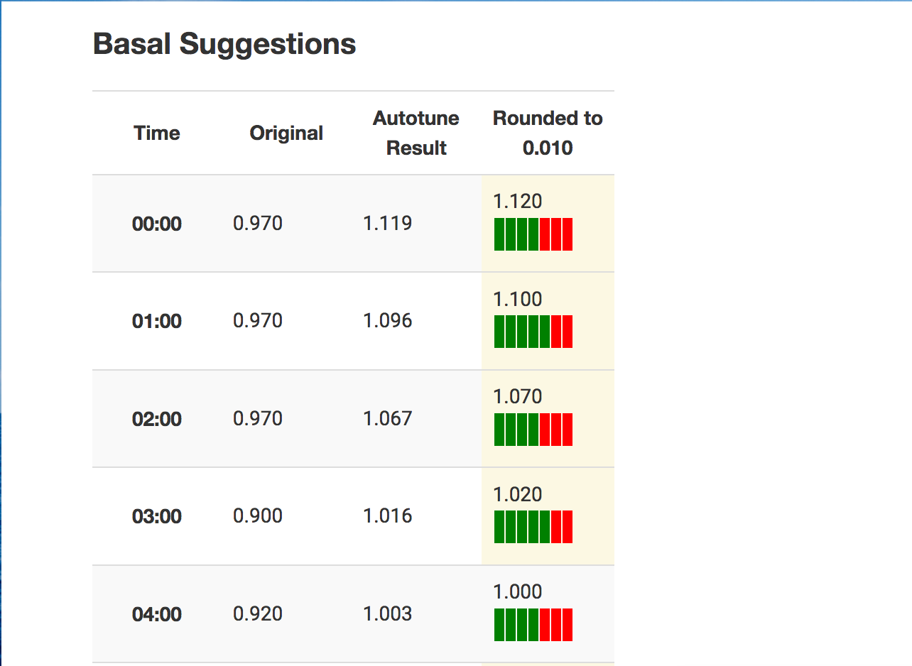
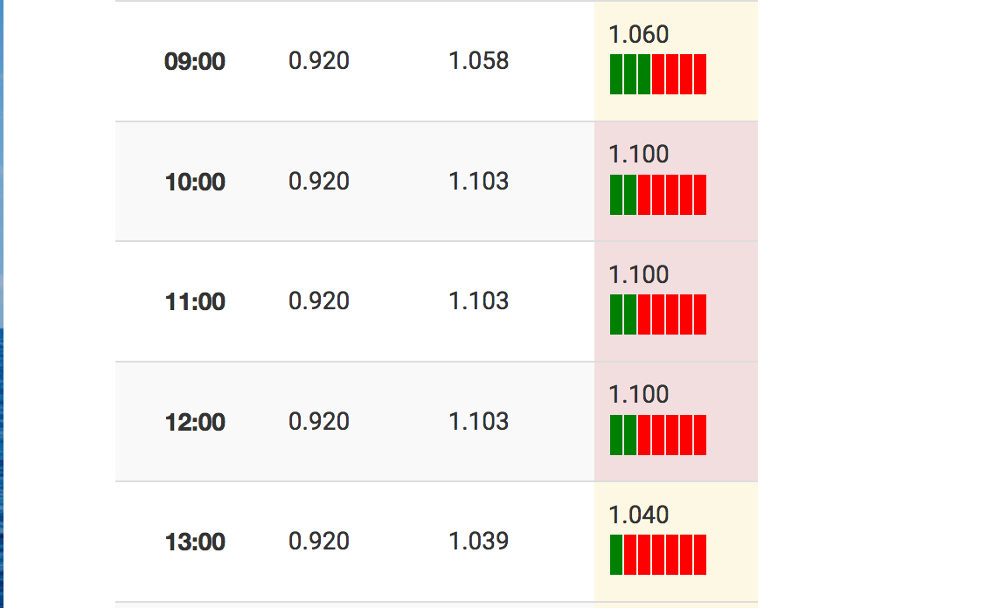

# Autotune

Autotune is a tool to help calculate potential adjustments to ISF, carb ratio, and basal rates. 

## The easiest way to run Autotune

The easiest way to run Autotune, if you don't have an OpenAPS rig, is to use "AutotuneWeb". It's a website where you enter your Nightscout URL, confirm your profile, and get results emailed directly to you. [Click here to go use AutotuneWeb](https://autotuneweb.azurewebsites.net/).



### What to expect when using AutotuneWeb

<details>
    <summary><b>Click here to expand and see more images from AutouneWeb</b></summary>
<br>
After you check your Nightscout profile to make sure it's up to date, and submit your URL, it will take you to the profile page. You should check again and make sure it's pulling from a current profile. This is where you can tell it what type of insulin you're using; how many days to run (up to 30, we recommend at least 7 to start); and provide your email address to get the results emailed to you.
  
* *(Also note that if you want to use the generated files and run Autotune yourself over a longer time frame or with more customized options, you can grab the generated profile files here.)*
  


When you get your email (note it may take 20 minutes), it will reference your NS URL at the top of the page and the date range you ran it on. The text will also tell you whether you ran with UAM on for basals. 

On the left, you'll see your starting values from your current NS profile; on the right is the tuned recommendation from Autotune.



Below the ISF and carb ratio, you'll see the basal report. 
* Suggestions higlighted in yellow indicate a suggested change of at least 10%, and red indicates a change of +20% or -30% (the standard limits imposed by Autotune). Please always take care when adopting any changes suggested by Autotune, but especially for these larger highlighted changes.

* The green & red blocks next to each basal suggestion indicate how many days the Autotune algorithm used actual BG data to produce the suggestion (green) and how many days it averaged the surrounding hours due to the data for that hour being dominated by other factors such as carb absorption. This is currently an experimental new feature to try to give an indication of how much trust to place in each suggestion. 





</details>

### If it's your first time using AutotuneWeb:

1. Make sure your Nightscout profile is up to date. This is where the "starting" settings are pulled from. 
2. If you've not read about Autotune, please see below to get an understanding of [how Autotune works](http://openaps.readthedocs.io/en/latest/docs/Customize-Iterate/autotune.html#how-autotune-works) and how you might use the results. 
3. Want to run over a different time frame? Keep in mind you can also get a profile generated from AutotuneWeb and then [follow the manual instructions below for running Autotune on your own computer](http://openaps.readthedocs.io/en/latest/docs/Customize-Iterate/autotune.html#phase-c-running-autotune-for-suggested-adjustments-without-an-openaps-rig). 
4. Make sure to check out the [privacy policy for AutotuneWeb](https://autotuneweb.azurewebsites.net/Home/Privacy), which includes directions for requesting your data to be deleted. 
5. Results don't look like what you expected to see? [See here for some suggestions](https://openaps.readthedocs.io/en/latest/docs/Customize-Iterate/autotune.html#why-isn-t-it-working-at-all) that might contribute to flukey data. 

## Other sections on this page

* Background in plain language on [how Autotune works](http://openaps.readthedocs.io/en/latest/docs/Customize-Iterate/autotune.html#how-autotune-works)
* The [difference between Autotune and "autosens"](http://openaps.readthedocs.io/en/latest/docs/Customize-Iterate/autotune.html#the-difference-between-autotune-and-autosens) (aka, [autosensitivity](http://openaps.readthedocs.io/en/latest/docs/Customize-Iterate/autosens.html))
* Different ways to use Autotune
   * Run it with [AutotuneWeb](https://autotuneweb.azurewebsites.net/)
   * [Phase A](http://openaps.readthedocs.io/en/latest/docs/Customize-Iterate/autotune.html#phase-a-running-autotune-manually-in-openaps) - running it on the OpenAPS rig, but not using it to automatically update your rig's settings
   * [Phase B](http://openaps.readthedocs.io/en/latest/docs/Customize-Iterate/autotune.html#phase-a-running-autotune-manually-in-openaps) - running it on the OpenAPS rig automatically overnight, and OpenAPS will use these settings (**DEFAULT OPENAPS BEHAVIOR**)
   * [Phase C](http://openaps.readthedocs.io/en/latest/docs/Customize-Iterate/autotune.html#phase-c-running-autotune-for-suggested-adjustments-without-an-openaps-rig) - Those who are not running autotune on an OpenAPS rig should use Phase C to run it on the computer of their choice.

## How Autotune works

There are two key pieces: oref0-autotune-prep and oref0-autotune-core. (For more autotune code, you can see [oref0-autotune-(multiple files) listed in oref0/bin here](https://github.com/openaps/oref0/tree/dev/bin) - and there are also some autotune files in [oref0/lib](https://github.com/openaps/oref0/tree/dev/lib). 

<details>
    <summary><b>1. oref0-autotune-prep: (click to expand)</b></summary>
<br>
 
* autotune-prep takes three things initially: glucose data; treatments data; and starting profile (originally from pump; afterwards autotune will set a profile)
* It calculates BGI and deviation for each glucose value based on treatments
* Then, it categorizes each glucose value as attributable to either carb sensitivity factor (CSF), ISF, or basals
* To determine if a "datum" is attributable to CSF, carbs on board (COB) are calculated and decayed over time based on observed BGI deviations, using the same algorithm used by Advanced Meal Assist. Glucose values after carb entry are attributed to CSF until COB = 0 and BGI deviation <= 0. Subsequent data is attributed as ISF or basals.
* If BGI is positive (meaning insulin activity is negative), BGI is smaller than 1/4 of basal BGI, or average delta is positive, that data is attributed to basals.
* Otherwise, the data is attributed to ISF.
* All this data is output to a single file with 3 sections: ISF, CSF, and basals.
</details>

<details>
    <summary><b>2. oref0-autotune-core: (click to expand)</b></summary>
<br>
 
* autotune-core reads the prepped glucose file with 3 sections. It calculates what adjustments should be made to ISF, CSF, and basals accordingly.
* For basals, it divides the day into hour long increments. It calculates the total deviations for that hour increment and calculates what change in basal would be required to adjust those deviations to 0. It then applies 20% of that change needed to the three hours prior (because of insulin impact time). If increasing basal, it increases each of the 3 hour increments by the same amount. If decreasing basal, it does so proportionally, so the biggest basal is reduced the most.
* For ISF, it calculates the 50th percentile (median) deviation for the entire day and determines how much ISF would need to change to get that deviation to 0. It applies 10% of that as an adjustment to ISF.
* For CSF, it calculates the total deviations over all of the day's mealtimes and compares to the deviations that are expected based on existing CSF and the known amount of carbs entered, and applies 10% of that adjustment to CSF.
* Autotune limits how far it can adjust (or recommend adjustment, if running autotune outside oref0 closed loop) basal, or ISF or CSF, from what is in the existing pump profile.  Autotune uses the same autosens_max and autosens_min multipliers found in your preferences.json for oref0.  So if autotune is running as part of your loop, autotune can't get too far off without a chance for a human to review the changes.
</details>


 *Note: Autotune does not read from the active profile (e.g. Pattern A or Pattern B if set). The Standard Basal Pattern is what will be pulled to be used and tuned by Autotune.*  
 
## The difference between autotune and autosens:

Autosensitivity/resistance mode (aka “autosens”) is an advanced feature in OpenAPS that you can enable that looks at 24 hours of data and makes adjustments to ISF and targets based on the resulting sensitivity calculations. If you have a dying pump site, or have been sick and are resistant, your ISF is likely to be calculated down by autosens and then used in OpenAPS calculations accordingly. The opposite for being more sensitive is true as well. [(Here’s a blog post describing autosensitivity during sick days.)](https://diyps.org/2016/12/01/sick-days-with-a-diy-closed-loop-openaps/)

Autotune, by contrast, is designed to iteratively adjust basals, ISF, and carb ratio over the course of weeks.  Because it makes changes more slowly than autosens, autotune ends up drawing on a larger pool of data, and is therefore able to differentiate whether and how basals and/or ISF need to be adjusted, and also whether carb ratio needs to be changed. Whereas we don’t recommend changing basals or ISF based on the output of autosens (because it’s only looking at 24h of data, and can't tell apart the effects of basals vs. the effect of ISF), autotune is intended to be used to help guide basal, ISF, *and* carb ratio changes because it’s tracking trends over a large period of time. See below for how it can be used as a manual one-off calculation or in a closed loop setting, along with notes about the safety caps designed to go with it.

### Different ways to utilize Autotune

* (Recommended & easiest for non-OpenAPS users) Run it with [AutotuneWeb](https://autotuneweb.azurewebsites.net/) 
* Phase A - run autotune as a one-off on an OpenAPS rig (aka, manually)
* Phase B - run autotune nightly in an OpenAPS rig (**DEFAULT OPENAPS BEHAVIOR**)
* Phase C - run autotune as a "one-off" on a computer of your choice. 

#### Phase A: Running Autotune manually in OpenAPS 

If you have an OpenAPS rig and want to run autotune manually, you can do so on the command line. 


##### Running manually in your myopenaps directory
If you want to have OpenAPS use your autotune results (e.g. you changed pump settings and just want it to be tuned sooner than 4am), run the following:

```
oref0-autotune --dir=~/myopenaps --ns-host=https://mynightscout.herokuapp.com --start-date=YYYY-MM-DD
```

##### Running manually in a *different* directory to not use the results automatically

You will want to run Autotune in a different directory on your rig if you do not want OpenAPS to use the autotune settings by default.

* Run this command to create a `newdirectory` and copy over the profile and pump settings files: 
```
mkdir -p ~/newdirectory/settings && cp ~/myopenaps/settings/profile.json ~/newdirectory/settings/autotune.json && cp ~/myopenaps/settings/pumpprofile.json ~/newdirectory/settings/pumpprofile.json
```

* Then, run Autotune manually, pointing to the new directory:

```
oref0-autotune --dir=~/newdirectory --ns-host=https://mynightscout.azurewebsites.net --start-date=YYYY-MM-DD
``` 
  * obviously, sub in your NS url and the start date you want to start with
  * If you change your pump settings, you will need to re-copy your pump settings back into `newdirectory`

**Note:** If you did this correctly in your `newdirectory`, settings will not be used by OpenAPS. You will need to `cd ~/newdirectory/autotune && cat autotune_recommendations.log` to see your autotune recommendations, and autotune will only run when you manually run it. The recommended behavior is to run Autotune inside of your OpenAPS directory, per Phase B, which is the default and will automatically run every night and have OpenAPS use the settings from Autotune automatically.

#### Phase B: Running Autotune automatically in OpenAPS 

In oref0 0.6.0 and beyond, autotune will run by default. This means that autotune would be iteratively running (as described in [#261](https://github.com/openaps/oref0/issues/261)) and making changes to the underlying basals, ISF, and carb ratio being used by the loop, making small adjustments from the previously autotuned settings based on each day’s new data. However, there are safety caps (your autosens_max and autosens_min) in place to limit the amount of tuning that can be done at any time compared to the underlying pump profile. The autotune_recommendations will be tracked against the current pump profile, and if over time the tuning constantly recommends changes beyond the caps, you can use this to determine whether to tune the basals and ratios in those directions.

**Important** When autotune is enabled in your loop to run automatically, changes to your basal profile within the pump during the middle of the day will NOT cause an immediate change to the basal profile the loop is using.  The loop will continue to use your autotune-generated profile until a new one is updated just after midnight each night.  Each autotune nightly run will pull the current pump profile as its baseline for being able to make adjustments.  If you have reason to want a want a mid-day change to your basal program immediately, you should run autotune manually (see A for directions) to have it re-pull the settings from the pump and tune from the new settings.

#### How to copy over autotune files from another rig:

<details>
    <summary> If you have multiple rigs and would like to sync up autotune results, or move an existing autotune over to a brand new rig, you'll want to copy files over. <b>(Click to expand these instructions)</b></summary>
<br>

Log into the NEW rig and run the following command: 
`scp -r root@my-edison-original.local:~/myopenaps/autotune/ ~/myopenaps/autotune` (where "my-edison-original" is substituted for your rig name that you want to copy files from)

* You'll be asked for your my-edison-original rig's password (where you are copying FROM).
* This will copy everything in the autotune directory over.

</details>
<br>

#### Phase C: Running Autotune for suggested adjustments without an OpenAPS rig

**Note:*** the easiest way of running Autotune is now "AutotuneWeb". See the top of this page for instructions on running it via the web service, without having to set it up on your own computer. If you do want to manually set up your own computer to be able to run it over a time period >30 days or other reasons, see below. 

*Caution for AndroidAPS users:* Currently, the master oref0 version with Autotune does not parse AndroidAPS entries correctly. **You must set AndroidAPS to upload all temp basals as "absolute" rates, instead of %, *and* use the dev branch of oref0.**  If you do not do both of these things, your results will be wrong! Future versions of Autotune will allow using AndroidAPS data as long as the option to upload temp basals as absolute values instead of / in addition to percent is enabled in AndroidAPS.

If you are not running autotune as part of a closed loop, you can still run it as a "one-off".(OpenAPS/existing oref0 users may want to use the above instructions instead, however, from phase A or phase B on this page.) For more about autotune, you can read [Dana's autotune blog post for some background/additional detail](http://bit.ly/2jKvzQl) and scroll up in the page to see more details about how autotune works.

**Requirements**: You should have Nightscout BG and treatment data. If you do not regularly enter carbs (meals) into Nightscout (this happens automatically when you use the "Bolus Wizard" on the Medtronic pump and should not be manually added to Nightscout if you use the Bolus Wizard), autotune will try to raise basals at those times of days to compensate. However, you could still look at overnight basal recommendations and probably even ISF recommendations overall. [Read this page for more details on what you should/not pay attention to with missing data.](./understanding-autotune.md)

**Note**: this is currently based on *one* ISF and carb ratio throughout the day. Here is the [issue](https://github.com/openaps/oref0/issues/326) if you want to keep track of the work to make autotune work with multiple ISF or carb ratios.

**Feedback**: Please note autotune is brand new, and still a work in progress (WIP). Please provide feedback along the way, or after you run it. You can share your thoughts in [Gitter](https://gitter.im/openaps/autotune), or via this short [Google form](https://goo.gl/forms/Cxbkt9H2z05F93Mg2). 

**Step 0: Decide where to run Autotune**
* (Remember you can use [AutotuneWeb](https://autotuneweb.azurewebsites.net/) if you don't want to run it on your computer.) 
* There are five main ways to run Autotune on your own: via (a) a cloud-based virtual machine (Linux VM through Google Cloud Platform, for example), (b) on via a virtual machine on Windows (e.g., VirtualBox), (c) on a Mac directly, (d) on a Windows 10 computer running the Windows Subsystem for Linux (WSL), or (e) direct on a physical machine running Linux. Instructions for the first four are below. 
* Whichever route you are using, we recommend some form of Debian distro (Ubuntu is the most common) for consistency with the Raspbian and jubilinux environments used on the Pi and Edison for OpenAPS.
 * If you're interacting with your VM via its graphical interface, make sure you have installed a browser at your VM (i.e.  Firefox) then open the correct page from your VM. You may think that copying from your Windows/iOS and pasting in your Linux terminal would work but is not as simple ...and yes, there is lots of copying / pasting!  To make copying and pasting simpler, it is often better to `ssh` directly to your VM, rather than using its graphical interface (or the cloud provider's console interface).

**Step 1a: Run via a cloud-based virtual machine**

<details>
    <summary>Click here to expand the instructions for building via a cloud-based virtual machine:</summary>
<br>
 
 * To run a Linux VM on a cloud server, free options include [AWS](https://aws.amazon.com/free/) (free for 1 year) and [Google Cloud](https://cloud.google.com/free/) (free trial for a year; about $5/mo after that).  If you're willing to pay up front, Digital Ocean is $5/mo and very fast to set up. AWS may take a day to spin up your account, so if you're in a hurry, one of the others might be a better option.
 * Once signed up to Google Cloud Platform (if you are using that route), click the terminal icon near the top right to activate the cloud shell - a black window will appear at the bottom of the screen. Note that you can easily cut & paste into this terminal without the need to do anything special.
 * Make sure your VM is using the same timezone as your pump.  You can change timezone using `sudo dpkg-reconfigure tzdata`
 * If your VM is outside the US, particularly in a country that uses `,` as a decimal separator, make sure your system locale is set to `en_US.utf8` or another locale that uses `.` as the decimal separator. If you think this may be incorrect, you can check it by typing `locale`.
 * If you're interacting with your VM via its graphical interface, make sure you have installed a browser at your VM (i.e.  Firefox) then open the currect page from your VM. You may think that copying from your Windows/iOS and pasting in your Linux terminal would work but is not as simple .. and yes, there is lots of copying / pasting!  To make copying and pasting simpler, it is often better to `ssh` directly to your VM, rather than using its graphical interface (or the cloud provider's console interface).
 * Now do this: `sudo curl -s https://raw.githubusercontent.com/openaps/docs/master/scripts/quick-packages.sh | bash -`. This will take a minute or so. If the install was successful, the last line will say something like: `Successfully installed openaps-contrib-0.0.15`  (although the version number may have been incremented). If you do not see this or see error messages, try running it multiple times. It will not hurt to run this multiple times.
 * On Google Cloud Shell do: `sudo npm install -g json`
 * On Google Cloud shell at least, you need to set your NightScout API_SECRET as an environment variable. To do this type `sudo env API_SECRET=xxxxxx` (where xxxxxx is your API_SECRET, either as the string you gave Nightscout, or as `token=xxxxx` which you generated in Nightscout admin interface) followed by `sudo export API_SECRET`
 * Please note that on Google Cloud Shell, the terminal becomes inactive by default after 30 minutes inactivity, and you need to repeat the above each time you (re)start a new terminal instance.
 * Now move to step 2. 
</details>
<br>

 **Step 1b: Run via a Windows-based virtual machine**
 
<details>
    <summary>Click here to expand the instructions for building via a Windows-based virtual machine:</summary>
<br>
 
 * An easy way to start is the [VirtualBox](https://www.virtualbox.org/wiki/Downloads) as VM and Ubuntu as Linux OS. Step-by-step setup instructions can be found here: https://www.youtube.com/watch?v=ncA85gRAJxk. However **skip** the instructions for downloading Ubuntu (time stamp 1:15 to 2:12) because those instructions are now outdated. Download the correct 32 bit version from this link: http://releases.ubuntu.com/17.04/ubuntu-17.04-desktop-i386.iso and then go back to the Youtube video to follow the setup instructions for installing Ubuntu on VirtualBox. If you experience problems with this version 17.04 of Ubuntu you can try the LTS version of Ubuntu, which has worked for some. Here is the link for Ubuntu LTS: https://www.ubuntu.com/download/desktop/thank-you?version=16.04.3&architecture=amd64. After downloading the LTS version go back to the Youtube video to follow the setup instructions for installing Ubuntu on VirtualBox.
 * Make sure your VM is using the same timezone as your pump.  You can change timezone using `sudo dpkg-reconfigure tzdata`
 * If your VM is outside the US, particularly in a country that uses `,` as a decimal separator, make sure your system locale is set to `en_US.utf8` or another locale that uses `.` as the decimal separator. If you think this may be incorrect, you can check it by typing `locale`.
 * Now do this: `sudo curl -s https://raw.githubusercontent.com/openaps/docs/master/scripts/quick-packages.sh | bash -`. This will take a minute or so. If the install was successful, the last line will say something like: `Successfully installed openaps-contrib-0.0.15`  (although the version number may have been incremented). If you do not see this or see error messages, try running it multiple times. It will not hurt to run this multiple times.
</details>
<br>

**Step 1c: Prep your Mac**

<details>
    <summary>Click here to expand the instructions for building via your Mac:</summary>
<br>
 
* MAC USERS: Follow these steps instead of 1a / 1b above if you want to run autotune on your Mac. (Mac users can instead do the above instructions if they prefer to create a Linux virtual machine to run it on):
* To run AutoTune using a Mac you will use the Terminal application. Open the Terminal application on your Mac (it is located in the Utilities application folder on your Mac). For more information about using Terminal see: http://openaps.readthedocs.io/en/latest/docs/Understanding OpenAPS-Overview/overview-of-build-process.html#before-you-get-started
* After you open a Terminal window, copy and paste the command for each of the Mac install command steps below, and then hit the return key after you paste each command, which will execute it. If you are asked for a password, enter the password for your Mac.
* Tip for New Mac Users: If you typically use a Windows machine and you keep trying to do a control-c (copy) and control-v (paste), remember, on a Mac use command-c (copy) and command-v (paste) instead.
* For example, the first step is to install Homebrew on your Mac. To do this you need to copy and paste the following command from step 1.) of the Mac install commands below and then hit the return key:  `/usr/bin/ruby -e "$(curl -fsSL https://raw.githubusercontent.com/Homebrew/install/master/install)"`

Mac install commands:

 * 1.) Install Homebrew: `/usr/bin/ruby -e "$(curl -fsSL https://raw.githubusercontent.com/Homebrew/install/master/install)"`
 * 2.) Install Coreutils: `brew install coreutils`
 * 3.) Install Node for (NPM): `brew install node`
 * 4.) Install JQ from Homebrew: `brew install jq` 

</details>
<br>

 **Step 1d: Run on a Windows 10 computer using the Windows Subsystem for Linux (WSL)**
 
<details>
    <summary>Click here to expand the instructions for building via a Windows 10 computer using the Windows Subsystem for Linux (WSL):</summary>
<br>
 
 * You must be running Windows 10 on your computer to use this option. The Windows Subsystem for Linux (WSL) is a Windows 10 feature  that enables you to run native Linux command-line tools directly on Windows, alongside your traditional Windows desktop and modern store apps.
 * Open PowerShell as Administrator. To open an elevated PowerShell prompt, in the taskbar search, type powershell. The result "Windows PowerShell" appears on the top. Right-click on "Windows PowerShell" and select Run as Administrator. The User Access Control (UAC) prompt will ask you for your consent.
 * In PowerShell run `Enable-WindowsOptionalFeature -Online -FeatureName Microsoft-Windows-Subsystem-Linux`.
 * This instruction is for Windows 10 build 16215 or later. To check your build of Windows 10 navigate to Settings > System > About. Look for the OS Build field. It will need to say 16215 or later for these next instructions to work. If you have a Windows 10 build earlier than 16215 follow these instructions to install Linux: https://docs.microsoft.com/en-us/windows/wsl/install-win10#for-anniversary-update-and-creators-update-install-using-lxrun. Only follow this link if your build of Windows 10 is earlier than 16215.
 * Open the Microsoft Store and install Ubuntu using this link: https://www.microsoft.com/en-us/store/p/ubuntu/9nblggh4msv6?rtc=1. On this Ubuntu page click on the blue button that says "Get the app". The Microsoft Store will open in a new window, showing the Ubuntu app. Click on the blue button that says "Get". Your computer will start to install the Ubuntu app ("Installing, this may take a few minutes..."). When done it will say, "Installation successful!".
 * You will be asked to "create a default UNIX user account". Chose whatever name works for you. It doesn't need to match your Windows username. Enter the name at the prompt, "Enter new UNIX username:".
 * You will be asked for a password: "Enter new UNIX password:". Your cursor will not move when you type the password you choose. You'll then be asked to "Retype new UNIX password:". Make sure you enter the password exactly as you just typed it. Again, your cursor will not move as you retype the password.
 * You will now be at a Linux prompt (like the old DOS prompt). It will look something like this, in a green font: "username@DGdesktop: $ _".
 * Make sure you (that is, WSL/Ubuntu) are using the same timezone as your pump.  You can change timezone using `sudo dpkg-reconfigure tzdata`. WSL/Ubuntu may respond to this command with "[sudo] password for username". If so enter your password from above. Follow the prompts to select your timezone. You likely will not be able to use your mouse to navigate on the timezone screens. Use your keyboard's arrow keys to navigate and the Enter key to select.
 * If your WSL is outside the US, particularly in a country that uses `,` as a decimal separator, make sure your system locale is set to `en_US.utf8` or another locale that uses `.` as the decimal separator. If you think this may be incorrect, you can check it by typing `locale`.
 * This step could take 10-15 minutes. Type: `sudo curl -s https://raw.githubusercontent.com/openaps/docs/master/scripts/quick-packages.sh | bash -`. If the install was successful, one of the last lines will say something like: `Successfully installed future-0.16.0 openaps-contrib-0.0.15 parsedatetime-2.4 recurrent-0.2.5` (although the version number may have been incremented).
 * Install the Linux command "bc" by typing: `sudo apt-get install bc`.

</details>
<br>

**Step 2: Install oref0**
* Install the latest version of oref0: 

```
npm list -g oref0 | egrep oref0@0.5.[5-9] || (echo Installing latest oref0 package && sudo npm install -g oref0)
```

* If you need the dev version of oref0 (for example, to run autotune with AndroidAPS as of August 2018):

```
cd ~/src && git clone -b dev git://github.com/openaps/oref0.git || (cd oref0 && git checkout dev && git pull)
cd ~/src/oref0 && npm run global-install
```

**Step 3: Create a profile.json with your settings**
* A. Create a myopenaps and settings directory. `mkdir -p ~/myopenaps/settings`
* B. Change into that directory: `cd ~/myopenaps/settings`.
* C. Create a profile file by typing `nano profile.json`. Copy and paste the example below, but input your information from your pump.  Change the basal profile times to match yours (update the minutes to match your basal start time; the minutes are number of minutes from midnight to the start of basal, e.g., a basal starting at 5:00am will have a minutes entry of 5 x 60 = 300 minutes and a basal starting at 7:30am will have a minutes entry of 7.5 x 60 = 450 minutes), and add more entries if needed.  It's very common for first-time users to have problems that result from mistakes introduced into this file.  Some common ones to check:
  * Be sure that all of the } lines in basalprofile have a comma after them, *except* the last one. 
  * You need to use a 0 before any entries with a decimal point, such as a basal rate of `0.35`; without the 0 before the decimal point, your autotune will have an error. 
  * If you don't like editing in the terminal, you can edit the profile files in a text editor.  However be aware that TextEdit will replace normal quotes (") with curly quotes (“) if you have "smartquotes" enabled in preferences, and this difference will make autotune fail.  You can download BBEdit (https://www.barebones.com/products/bbedit/) if you want a simple text editor that works well.  The trial version is sufficient, you won't be using advanced featues.
 
Every comma, quote mark, and bracket matter on this file, so please double-check carefully.

* Make sure to adjust these settings to match yours:
  * dia - Duration of Insulin Action (DIA), in hours (e.g., 4.5, or 3). Usually determined by the type of insulin and its effectiveness on you.
  * basal profile - you need at least one basal rate in here. You can create multiple of these for all of your basal rates, which will give you an easier visual comparing your current basals to what autotune recommends (see visual example), but at a minimum you just need one here for autotune to run. But we recommend putting all or most of your basals in, in order for autotune to appropriately cap at the safety limits (and compare to 20% above or below your existing basals). If you do not put your full basal profile in, it will not compare to those with the safety cap because it does not know about it.
  * "sensitivity" should be your iSF - in mg/dL/U (if using mmol/L/U multiply by 18)
  * "carb_ratio" at the end should be your carb ratio

* Make sure to exit the profile.json when done editing this file - Control-X and hit yes to save.

```
{
  "min_5m_carbimpact": 8.0,
  "dia": your_dia,
  "basalprofile": [
    {
      "start": "00:00:00",
      "minutes": 0,
      "rate": your_basal
    },
    {
      "start": "08:00:00",
      "minutes": 480,
      "rate": your_basal
    },
    {
      "start": "13:00:00",
      "minutes": 780,
      "rate": your_basal
    },
    {
      "start": "21:00:00",
      "minutes": 1260,
      "rate": your_basal
    }
  ],
  "isfProfile": {
    "sensitivities": [
      {
          "i": 0,
          "start": "00:00:00",
          "sensitivity": your_isf,
          "offset": 0,
          "x": 0,
          "endOffset": 1440
      }
    ]
  },
  "carb_ratio": your_ic_ratio,
  "autosens_max": 1.2,
  "autosens_min": 0.7
}
```

* D. Verify your profile.json is valid json by running `jq . profile.json` - if it prints a colorful version of your profile.json, you're good to proceed.  If not, go back and edit your profile.json to fix the error.
* E. Create a pumpprofile.json that is the same as your profile.json. On the command line run: `cp profile.json pumpprofile.json`
* F. Create a third file from the command line by running: `cp profile.json autotune.json`

**Step 4: Run autotune on retrospective data from Nightscout**
* Run 
```
oref0-autotune --dir=~/myopenaps --ns-host=https://mynightscout.herokuapp.com --start-date=YYYY-MM-DD 
```
* ^ Sub in your Nightscout URL. Note that you mustn't use the trailing / on the Nightscout URL or that will cause an error.
* Start with one day to confirm that it works, first. Then run it for one week, and then one month. Compare results and see if the numbers are consistent or changing, and see how that aligns with your gut feeling on whether your basals, ISF, and carb ratio was correct.
* If you want to run dates in the past, add the following: --end-date=YYYY-MM-DD (otherwise, it will just default to ending yesterday).  The start date should be the older date, the end date is the more recent date.
* Remember, this is currently based on *one* ISF and carb ratio throughout the day at the moment. Here is the [issue](https://github.com/openaps/oref0/issues/326) if you want to keep track of the work to make autotune work with multiple ISF or carb ratios.
* If useCustomPeak is not set in preferences.json and --tune-insulin-curve=true is not used, the DIA used by autotune is obtained from the pump and the peak time is obtained from the defaults of the insulin curve selected in preferences.json.

#### Optional configurations

* For most people, autotune's UAM detection does a good job of excluding anomalous data from unannounced or imprecisely estimated carbs, stress spikes, etc., and is able to properly tune basals using the non-excluded data. In rare cases, some people's basal settings are so far below their real basal rates when starting out with autotune that they find the algorithm unable to suggest raising basals because it is classifying all periods when basals are too low as unannounced meals. If you notice this issue, you are certain you have precisely entered carb counts for all carb intake events, and you want autotune to raise basal for abrupt BG rises due to stress etc., then you can force the algorithm to classify unannounced meal periods as basal periods using the --categorize-uam-as-basal=true option. Most people should not need this option, and it should only be used with care.  **\*\*SAFETY WARNING\*\*** If you use this option and treat lows without entering the low treatment carbs, an amplifying cycle will begin with autotune raising basals, treated lows get categorizes as basals being too low, basals are raised causing lows, etc.
* If running 0.7.0 or later, autotune has a --tune-insulin-curve=true option that enables autotune to tune the insulin end time (DIA) and insulin peak. The values listed below are calculated for insulin end times 2 hours less than the current end time to 2 hours more. If they agree in moving the insulin end time in the same direction, the insulin end time is moved by 1 hour. Insulin peak time is tuned similarly in steps of 5 minutes for peak times 10 minutes less than the current peak time to 10 minutes more than the current peak time. **\*\*SAFETY WARNING\*\*** This tuning method is still very much experimental and not recommended to be run unattended.
  * Average deviations observed in the data
  * Square root of the average of the squared deviations

#### Re-Running Autotune

Remember, to initially set-up Autotune follow the instructions [above](https://openaps.readthedocs.io/en/latest/docs/Customize-Iterate/autotune.html#phase-c-running-autotune-for-suggested-adjustments-without-an-openaps-rig)

To subsequently re-run Autotune at a later time:
* Open Ubuntu/your machine of choice and login if necessary
* At command prompt which will start with your username: `cd ~/myopenaps/settings`
* Then: `nano profile.json` (this gets you to the pump settings section)
  * Now edit your settings (using up / down arrows and backspace) – CR; ISF; basals etc. 
  * Press Control-X    (to save your new settings)
  * Press Y   (to confirm save new settings)
* Now should see command prompt which will start with your user name again.
* Now follow steps D, E, F from the link above ie:
  * `jq . profile.json `(if it prints a colourful version of your profile.json, you’re good to proceed) 
  * `cp profile.json pumpprofile.json`
  * `cp profile.json autotune.json`
* Then to re-run Autotune, subbing in your URL: `oref0-autotune --dir=~/myopenaps --ns-host=https://mynightscout.herokuapp.com --start-date=YYYY-MM-DD`

#### Why Isn't It Working At All?

(First - breathe, and have patience!) Here are some things to check: 

If you get the error `ERROR: API_SECRET is not set when calling oref0-autotune.sh` and autotune won't run, try this (note: as of oref 0.5.5, this error has been downgraded to a warning as this will only prevent autotune from running if you have "locked down" your NS to prevent anonymous read access):

1. Log into your VM
2. At the command prompt, type `cd /etc/` and hit enter
2. Type `sudo nano environment` and hit enter
3. You are now editing the `environment` file.  Add a new line to the file that says:  `API_SECRET=yourAPIsecret` (Note - replace "yourAPIsecret" with your own)
4. Hit CTRL-O and enter to save the changes to the file
5. Hit CTRL-X and enter to exit the file and go back to the command prompt
6. At the command prompt, type `export API_SECRET=yourAPIsecret`  (Note - replace "yourAPIsecret" with your own)

To test this fix, type `echo $API_SECRET` and hit enter.  If this returns the API Secret that you set in the `environment` file, then it should work for you to run autotune.

Other things to check:

* If you see error like `TypeError: opts.glucose.map is not a function` check that you have `API_SECRET` in the right format, [as described in this issue](https://github.com/openaps/oref0/issues/397). You either need `API_SECRET=xxxx` where `xxxx` is the string you gave Nightscout, or `API_SECRET=token=xxxxx` where `xxxxx` is the token you generated in Nightscout admin interface.
* Does your Nightscout have data? It definitely needs BG data, but you may also get odd results if you do not have treatment (carb, bolus) data logged. See [this page](./understanding-autotune.md) with what output you should get and pay attention to depending on data input.
* Did you pull too much data? Start with one day, and make sure it's a day where you had data in Nightscout. Work your way up to 1 week or 1 month of data. If you run into errors on a longer data pull, there may be something funky in Nightscout that's messing up the data format file and you'll want to exclude that date by picking a batch that does not include that particular date.
* Make sure when you sub in your Nightscout URL you do not include a "/" at the end of the URL
* Check your profile.json and make sure it really matches the example - chances are there's a stray character in there.
     - "start" time stamps must have the format "HH:MM:SS". "HH:MM" (e.g. "00:00" instead of "00:00:00") gives erroneous calculations such as "-Infinity" or "Nan" for the ISF and CR values. This results in the ISF & Carb ratio values being unchanged.
       Example output (console):
        ```oldCR: 9 fullNewCR: NaN newCR: NaN
        p50deviation: -0.76 p50BGI 0 p50ratios: -Infinity Old ISF: 44 fullNewISF: -Infinity adjustedISF: 44 newISF: 44
        ```
        
        Telltale sign is the input and output values for ISF and carb ratio remain unchanged:
        ```Parameter      | Pump     | Autotune 
           -------------------------------------
           ISF [mg/dL/U]  | 44.000   | 44.000   
           Carb Ratio[g/U]| 9.000    | 9.000    
           Basals [U/hr]  | -        |       
           ```
     
* Also check your pumpprofile.json and autotune.json - if it worked once or twice but then stopped working, it may have a bad file copy. If needed, follow Steps 3-E and 3-F again to re-copy a good profile.json to pumpprofile.json and autotune.json again.
* If VM is already set up, and you are returning to your VM for another session of autotune, double-check that your VM timezone matches your pump: `sudo dpkg-reconfigure tzdata` 
* Invalid calculations may be due to the locale settings of your VM (correct settings are `en_US.utf-8` or another locale that uses `.` as the decimal separator). An easy way to overcome such a problem is to add `env LANG=en_US.UTF-8` in front of your command for running autotune, it should look like this: `env LANG=en_US.UTF-8 oref0-autotune --dir=~/myopenaps --ns-host=https://mynightscout.azurewebsites.net --start-date=YYYY-MM-DD`
* Did you turn on Nightscout authentication with the setting `AUTH_DEFAULT_ROLES`?  Currently Autotune will only work with the `readable` setting.  See [issue #397](https://github.com/openaps/oref0/issues/397) in Github.
* If you are using [NightScoutLoader](https://github.com/gh-davidr/NightscoutLoader) to load the Diasend data to your Nightscout site, ensure the Diasend xls date format is the same as the date format selected in the NightScoutLoader Settings.  For USA users, the Diasend xls date format is "mm/yy/yyyy HH:mm" format which isn't supported by NightScoutLoader at this time.  The NightScoutLoader app currently only supports {"Default", "dd/MM/yy hh:mm", "MM/dd/yy hh:mm", "dd/MM/yy", "MM/dd/yy"] formats. "Default" corresponds to your OS date format for the English locale.  If none of these formats correspond to your Diasend xls data, as a workaround until NightScoutLoader is remedied, either set your system default date format to correspond to Diasend's date format or change the date format in the Diasend xls data file for all Times and Dates to correspond to NightScoutLoader Settings.  For example, the tabs "Name and glucose", "CGM", "Insulin use and carbs", and "Alarms and events" all have date and time data. 
* Still not working? Post a question in [Gitter](https://gitter.im/openaps/autotune). To best help you troubleshoot: Specify if you're on MDI or using a pump. Specify if you're using xDrip as a data source, or if you are otherwise logging data into Nightscout in a way that's not through Care Portal app directly, etc. 

#### What does this output from autotune mean? 
Go here to read more about [understanding the output, to see an example visual of what the output might look like, and scenarios when you may want to disregard portions of the output based on the data you provide it](./understanding-autotune.md).

Remember, autotune is still a work in progress (WIP). Please provide feedback along the way, or after you run it. You can share your thoughts in [Gitter](https://gitter.im/openaps/autotune), or via this short [Google form](https://goo.gl/forms/Cxbkt9H2z05F93Mg2). 

(If you have issues running it, questions about reviewing the data, or want to provide input for direction of the feature, please comment on [this issue in Github](https://github.com/openaps/oref0/issues/261).)

#### Yay, It Worked! This is Cool!

Great! We'd love to hear if it worked well, plus any additional feedback - please also provide input via this short [Google form](https://goo.gl/forms/Cxbkt9H2z05F93Mg2) and/or comment on [this issue in Github](https://github.com/openaps/oref0/issues/261) for more detailed feedback about the tool. You can also help us tackle some of the known issues and feature requests listed [here](./understanding-autotune.md). 
