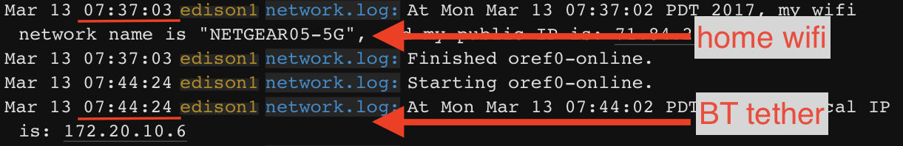
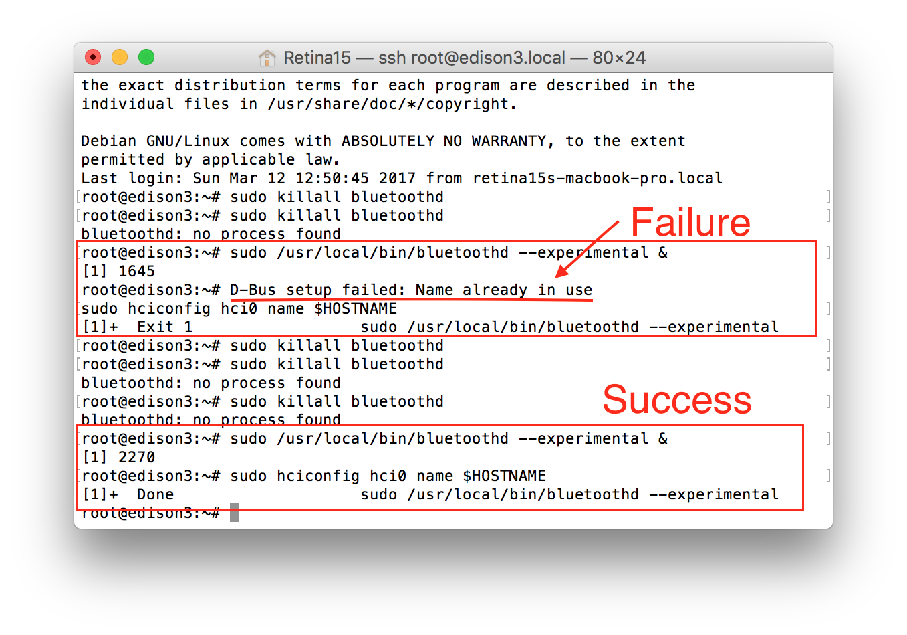
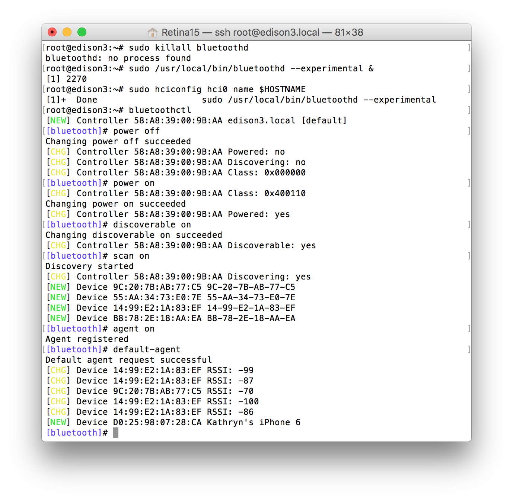

# Bluetooth Tethering (optional) 

Your cell phone can act as a mobile "hotspot" to allow your rig to access the internet.  If you don't have offline BG data setup, setting up Bluetooth (BT) tethering to allow your rig to connect to the internet through your phone can keep your rig looping as you move around areas without known wifi networks.

A few things to know about using your phone's hotspot feature:

1. Hotspot is a feature of your phone AND cell phone provider.  Please check with your cell phone provider and your service contract to confirm that hotspot internet connections and BT tethering are available.  

Even though some specific phones are fully capable of bluetooth tethering and the phone OS (eg: Android) fully supports it, providers like T-Mobile may arbitrarily disable it on all of their phones without explanation, even though they fully support Wifi Hotspots. Word to the wise: (1) If you can, purchase your phone from the OEM fully unlocked so the carrier can't deprovision bluetooth tethering. In the US some are permanently boot locked and can't be changed. (2) If you get caught in this situation you'll need to call the carrier's customer support network as soon as possible (hopefully within the 14 day return policy) to return it.  After the 14 days you'll need to plead your case with them.

2. Hotspot, when activated, uses your cell phone's data.  Know what your cell phone plan data limits are and consider if you want to change/update based on your frequency of hotspot use.  You can get an estimate of cell data use by resetting your cell data use, at the beginning of the day, within your phone.

3. A device (like your rig) can be connected to your phone's hotspot in one of three ways:

      **BT tether**:  BT tethering (also known as BT PAN *Personal Area Network*) requires your phone and rig to be BT-paired before they can connect (that's what this section of the docs is specifically about).  The advantage of connecting to your hotspot via BT tether is that it will happen automatically.  You do not have to remember to toggle hotspot.  Simply leave your hotspot toggled on as usual, leave the house, and within a few minutes (or sooner) your rig will BT tether to the hotspot.  (Screenshot below shows what you'll see in your network logs as you move from known wifi network to BT tether.  Oref0-online will automatically find BT tether and connect.)  Your rig will then use your cell phone as its internet connection.  When your rig comes back into a known wifi network, it will automatically drop the BT tether and connect with the wifi network.

      **Wifi connection**:  You need to set up your wpa_supplicant list to include your hotspot information; network name and password.  The wifi signal for the hotspot is not constantly broadcast by your phone, however.  So when you want to use the wifi connection to your hotspot (for example, you are leaving your home wifi network and traveling), you will need to manually toggle your hotspot on so that the phone will broadcast a wifi signal for the rig to connect to.  The other consideration is that since this is a wifi connection, the rig will not automatically disconnect when you come into one of your other known wifi networks.  You will have to remember to manually disconnect (toggle hotspot off), if you do not wish to continue using cell data when you are home.  Hotspot done by wifi connections also use more phone battery than a BT tether connection.

      **USB plug**: You can plug devices into your cell phone to use hotspot.  However, the phone would pull battery power from your rig and would drain your battery fairly quickly.  This is not a recommended connection method for openaps use.

### Benefit of Using BT Tethering to Your Phone's Hotspot

* BT tethering automatically picks up when your rig loses wifi (i.e. walking out the door) without you even having to pull your phone out of your pocket
* It also automatically allows the rig to pick back up on wifi when it finds a known wifi network
* It consumes less battery on your phone compared to a wifi connection to your phone's hotspot

Below is an image that shows how a rig automatically switches from a known wifi network to an internet connection through a BT tether to a phone:


     
### Phone selection for BT Tethering

Certain phones don't work well using bluetooth tethering with OpenAPS. Various users have experimented, and the list below shows those that have been found to work okay, those that don't and those with variable effectiveness. If you have something that is not on the list, please feel free to add it.

<TABLE border="1"
          summary="This table gives details about various cellphones used with BT Tethering with OpenAPS rigs">
<TR><TH>Cellphone<TH>Works with Bluetooth Tethering?<TH>Issues/Experiences with BT<TH>Use with xDrip/xDripAPS and Dexcom G5
<TR><TH>Google Pixel 3XL with Android 9<TD>Yes<TD>Supports tethering to both Wifi and Cellular network. No issues switching.<TD>
<TR><TH>Google Pixel 2 with Android 8<TD>Yes<TD>Supports tethering to both Wifi and Cellular network. No issues switching.<TD>
<TR><TH>LG Nexus 5X with Android 7<TD>Yes<TD>Supports tethering to both Wifi and Cellular network. No issues switching.<TD>Works well with Dexcom G5 and xDrip. No issues with compatibility. 90%+ capture rate.
<TR><TH>Google Pixel with Android 7<TD>Yes<TD>Supports tethering to both Wifi and Cellular network. No issues switching.<TD>Works well with Dexcom G5 and xDrip. No issues with compatibility. 90%+ capture rate.
<TR><TH>Sony Xperia Z5 Compact with Android 7<TD>Yes<TD>Works with tethering for network access. It regularly disconnects from the rig (which doesn't seem to affect data flow) and roughly every 24-36 hours this results in complete loss of connectivity and requires a full reboot of the rig and the phone. Doesn't work well with phone swapping between Wifi and mobile - causes BT dropouts that require a reboot of the rig.<TD>No issues running xDrip/xDripAPS alongside the tethered connection. Achieves 90%+ packet collection from Dexcom G5. 
<TR><TH>Xiaomi Redmi 4 with MIUI 8 (Android 6)<TD>No<TD>Tethering can be set up, but it drops regularly requiring rig reboots. When phone switches between Wifi and cellular signal requires rig to be rebooted.<TD>Significant packet drops and data becomes almost unusable.
<TR><TH>Xiaomi Redmi Note 4(X) -Snapdragon SoC version!!!<TD>Yes<TD>Tethering works in same time with Blukon(Nightrider) and SW3 connected. Also, read Notes for MIUI below*<TD>Excellent coverage.
<TR><TH>Xiaomi Redmi 3 with MIUI 6 (Android 5)<TD>Yes<TD>No issues seen when tethered to cellular network. Doesn't allow tethering to wifi.<TD>Works fine with Dexcom G5 - 90% collection rate.
<TR><TH>Xiaomi Mi A1 with AndroidOne (vanilla Android 8.0)<TD>Yes<TD>OpenAPS bluetooth tethering works fine with Blue Car Autotether.<TD>Not tested with Dexcom.
<TR><TH>Samsung Galaxy S6 (Android 7)<TD>Yes<TD>Tethering to rig and cellular works okay. No data on swapping between cellular and wifi connections.<TD>Use with Dexcom G5 and rig not effective. Significant packet loss.
<TR><TH>Samsung Galaxy Junior<TD>Yes<TD>Phone tethering switching between wifi and mobile not elegant and causes some issues<TD>Difficulties found when using xDrip with the OpenAPS tethering. Packet loss occurs.
<TR><TH>iPhone<TD>Yes<TD>Users have experienced various levels of success with the iPhone bluetooth tethering and when the rig switches  between wifi and BT<TD>Not Applicable. Experimental version of Loop to do something similar doesn't yet have feedback.
<TR><TH>Acer Phone<TD>No<TD>Many data drops on the bluetooth connection for rig. Recommended to avoid.<TD>xDrip compatibility is poor - numerous drops throughout the day.
<TR><TH>Samsumg Galaxy S7 Edge (G935F) Android 7.0<TD>Yes<TD>Excellent BT tether using apps 'Bt AutoTether' and 'BT Tether'<TD>xDrip+ with G5 > 95% capture.
<TR><TH>Samsung Galaxy A3 (2016) Android 6<TD>Yes<TD>Excellent BT tether using app 'Blue Car Tethering'<TD>xDrip+ with G4, reliable capture using xDrip+ and using normal tether when running with Dexcom in G4-upload mode
<TR><TH>Elephone P9000 Android 7<TD>Yes<TD>Seems to work well, switching on/off BT tehethering as expected. Using 'Blue Car Tethering' with rig selected. Tested with phone screen off, works fine.<TD>
<TR><TH>Samsung Galaxy A5 (2017) Android 7.0<TD>Yes<TD>Excellent BT tether, intermitent disconnecting when the area is flooded with other bluetooth devices. Use 'BT AutoTether' app along side to maintain connection<TD>xDrip+ with G5, works really well with G5 transmitter directly, no compatibility issues and 95%+ consistent capture rate.
<TR><TH>Samsung Galaxy S8 Android 7.0<TD>Yes<TD>Excellent BT tether, no need for 3rd party app to keep BT teter alive, can be set in settings<TD>xDrip+ with Libre/RFDuino transmitter, 99%+ capture rate,
<TR><TH>Motorolo Moto Z Play<TD>Yes<TD>Excellent BT tethering; highly reliable using Blue Car Tethering.<TD>Not tested (using Enlite sensor).
<TR><TH>Wiko Wim Lite<TD>Intermittent<TD>Works most of the time. Note, several issues with this phone: 1) NSClient has a tendency to crash on this phone and 2) Bluetooth tethering works intermittently with Blue Car Autotether and not at all with BT AutoTether. Note that this phone has a tendency to freeze and reboot on its own, so I think the phone itself is the issue.<TD>Not tested (using Enlite sensor).
<TR><TH>Xiaomi Mi Mix 2 with LineageOS 15.1<TD>Yes<TD>Excellent connectivity - has worked almost flawlessly with tethering. Battery life has also been very good.<TD>Works brilliantly with xDrip+ and G6 - capture rate typically more than 95%.      
<TR><TH>Nokia 2.1 with Android 8.1 Oreo Go Edition<TD>Yes<TD>Excellent bluetooth tethering to cellular network. No noted network drops. Works excellent as an offline option with XDripAPS. Awesome battery life(4000mAH)<TD>Works well with Dexcom G5 and xDrip. No issues with compatibility. Generally 95%+ capture rate.
<TR><TH>OnePlus 6 (A6003) with OxygenOS 9.0 <TD>Yes<TD>Excellent connectivity - Tethering has been good and picks up right away. Battery life very good and really fast charge.<TD>xDrip+ w/ G5 - capture rates generally better than 98% on current nightlies.
<TR><TH>Samsung S10/S10e with Android Pie<TD>Not on TMobile Native<TD>Both the S10 and S10e are fully capable of bluetooth pairing and tethering, but unlike Verizon, T-Mobile deprovisions bluetooth tethering for unknown and inexplicable reasons.  On all of their phones as far as we know.<TD>Verizon and OEM Unlocked phones may work.

</TABLE>

**********************************************************************************************
*Notes for MIUI users. MIUI kills processes in background to save battery. To get best results:
* get Xiaomi with SD (Snapdragon) SoC. It works better than it's MTK counterpart
* install BTAutoTether
* Settings-->Permissions-->Autostart (Turn it on for BTAutoTether)
* Settings-->Permissions-->Other persmissions (Find BTAutoTether and make sure that all permissions are ticked for this app)
* Hit Recents button (left button in bottom row of your phone) and find BTAutoTether, swipe it down and you'll see Lock and Info icon. Press Lock icon
**********************************************************************************************


## Configure Bluetooth tethering on Edison running Jubilinux [optional]

This section is completed by the install method found [here](http://openaps.readthedocs.io/en/latest/docs/Build%20Your%20Rig/OpenAPS-install.html#copy-and-paste-to-run-the-wifi-and-oref0-setup-scripts) . If you selected the option of installing Bluetooth at a later time during installation you may skip to Bluetooth Setup, the next section. 
### Install dependencies 
You will need to get the MAC address from your phone or whatever device you are using.
* On Android, go to Settings/About Phone/ Status; you will find your Bluetooth address looking like AA:BB:CC:DD:EE:FF 
* On iPhone, go to Settings/General/About; it will be under Bluetooth and will look like AA:BB:CC:DD:EE:FF

Now we need to re-run oref0-setup with the Bluetooth option, replacing AA:BB:CC:DD:EE:FF with what you found above.  If you have the "To run again with these same options" command-line from the last time you ran oref0-setup, you can simply run that and append `--btmac=AA:BB:CC:DD:EE:FF` to the end.  If not, you can run it interactively using:

`cd && ~/src/oref0/bin/oref0-setup.sh --btmac=AA:BB:CC:DD:EE:FF`

NOTE:  Make sure the MAC address is in ALL CAPS.

Copy and paste the "To run again with these same options" command into your notes for the next time you need to run oref0-setup.

The first time running the script will take quite a bit longer as it is installing Bluez on your edison.
The oref0-setup script may fail after installing Bluez.  If so, just reboot your edison and run the setup command you copied to your notes. 

You can confirm that Bluez has installed properly by using `bluetoothd --version`.  If Bluez installed properly, a version number of `5.37` or greater will be returned.  If it did not install properly, you will likely see `5.28`.  The procedures below will not work with the outdated version, so make sure you get version `5.37` or greater installed before continuing.

```
root@edisonhost:~# bluetoothd --version
5.37
```

### Bluetooth setup

1) First, check that your wpa_supplicant.conf file doesn't contain any content that will interfere with oref0-online.

   a) Open the wpa_supplicant.conf file to make sure it is set up to allow oref0-online to change between connections.

      `nano /etc/wpa_supplicant/wpa_supplicant.conf`

   b) Delete the phrase `update_config=1` from the file if it is present.

      

2) Next, stop cron to make sure oref0-online doesn't interfere:

   `sudo service cron stop`

<details>
    <summary>3) If you are using Jubilinux 0.3.0 (Debian Stretch) or the Raspberry Pi, please skip to #4. <b>If you are using Jubilinux 0.2.0 (Debian Jessie), you will need to manually initialize bluetooth. (click here to expand instructions)</b></summary>
<br>

   a) Restart the Bluetooth daemon to start up the bluetooth services.  (This is normally done automatically by oref0-online once everything is set up, but we want to do things manually this first time):

`sudo killall bluetoothd`

   b) Wait a few seconds, and run it again, until you get `bluetoothd: no process found` returned.  Then start it back up again:

`sudo /usr/local/bin/bluetoothd --experimental &`

As shown in the "success" section below, you should see a single line returned with a short string of numbers and then be returned to a clean prompt.  If you instead see messages about D-bus Setup failed (as shown in the "Failure" part of screenshot), or otherwise see that you don't have a clean prompt returned in order to enter the next command...go back to the `sudo killall bluetoothd` and try again. 


   c) Wait at least 10 seconds, and then run:  
`sudo hciconfig hci0 name $HOSTNAME`

   d) If you get a `Can't change local name on hci0: Network is down (100)` error, run `bluetoothctl`, then `power off` and `power on`, then `exit` and try `sudo hciconfig hci0 name $HOSTNAME` again.

</details>

4) Now launch the Bluetooth control program: `bluetoothctl` and type each of the following:

```
power off

power on

discoverable on

scan on

agent on

default-agent
```


For Android
********************************
The adapter is now discoverable for three minutes. Search for bluetooth devices on your phone and initiate pairing. The process varies depending on the phone and the dongle in use. The phone may provide a random PIN and bluetoothctl may ask you to confirm it. Enter 'yes'. Then click 'pair' on the phone. 

Remember you need to enable the sharing of your phones internet connection via Bluetooth go to Settings -> More -->Tethering & portable hotspot -> Bluetooth tethering [enable]

For iPhone
********************************
<b>Your iPhone must be on the Settings/Bluetooth screen</b>, and then you use the Edison to initiate pairing:
```
pair AA:BB:CC:DD:EE:FF
```
********************************
If successful, you will see on the Edison:

`Request confirmation
[agent] Confirm passkey 123456 (yes/no): yes`

* (WARNING: You must type in **yes** not just **y** to pair)

* On your phone, tap the pair button that popped up.

Troubleshooting note: If after the `pair AA:BB:CC:DD:EE:FF` command you get a response of `Failed to pair: org.bluez.Error.AlreadyExists`, that means you likely have already tried to pair previously...but have run into problems getting it to run properly.  Double-check that your cell provider allows for personal hotspots and bluetooth tethering.  Make sure you have enabled those for your device.  If you have confirmed those, you can `remove AA:BB:CC:DD:EE:FF` and start at the sudo commands again to attempt a fresh pairing.

* Execute the `paired-devices` command to list the paired devices -

Your paired phone should be listed (in this example, a Samsung Galaxy S7):  
```
paired-devices
Device AA:BB:CC:DD:EE:FF Samsung S7
```

* Now trust the mobile device  

  `trust AA:BB:CC:DD:EE:FF`

* Quit bluetoothctl by typing `quit` and then enter.


******************************

### Testing to make sure it works after you successfully did the above

* Make sure your phone's hotspot is enabled, but don't let anything connect via wifi (you have to switch on the personal hotspot toggle, but then immediately back out of the personal hotspot screen before anything connects to your hotspot via wifi).

* Now, try to establish a Bluetooth Network connection with your phone:

  `sudo bt-pan client AA:BB:CC:DD:EE:FF`

* You should see an indicator on your phone (a blue bar on iPhone) that your Bluetooth network connection has established.  

* Next, to test your Internet connectivity, you'll need to get an IP address:

  `sudo dhclient bnep0`
  
(If you need more information about what the dhclient command is doing, you can use `sudo dhclient -d bnep0` to force dhclient to run in the foreground)

* If that succeeds, you should be able to run `ifconfig bnep0` and see something like:  
```
bnep0     Link encap:Ethernet  HWaddr 98:4f:ee:03:a6:91
          inet addr:172.20.10.4  Bcast:172.20.10.15  Mask:255.255.255.240
```
(for iPhone, the inet addr will always start with 172.20.10. - Android will likely be different)

* If you don't see the `inet addr:172.20.10.x` info in the `ifconfig bnep0` output shown above, your bnep0 interface did not get an IP address. Your rig will need this address to access the internet via the BT tether. One possible cause may be an issue with your dhclient.leases file. Try editing your /var/lib/dhcp/dhclient.leases file and deleting the contents. After clearing out the dhclient.leases file, reboot your rig and start testing from the `sudo bt-pan client AA:BB:CC:DD:EE:FF` command above and verify that bnep0 gets an IP address before you continue.

* To disconnect the connection, you can run:

  `sudo bt-pan client -d AA:BB:CC:DD:EE:FF`
  
* Now, re-enable the cron service so oref0-online runs automatically every minute:

  ` sudo service cron start`

* Next, to test that Bluetooth starts up automatically, you can shut down your wifi for 2-3 minutes by running:

  `iwconfig wlan0 txpower off; sleep 120; iwconfig wlan0 txpower auto`

* About 1 min later, your rig should connect to your phone with Bluetooth (blue bar will pop up on the iPhone).  If it doesn't, you should be able to wait 3 minutes and your terminal session should automatically reconnect.  If that doesn't connect, you'll either need to reboot it or use a serial console connection to your Edison to troubleshoot further.

* About a minute after wifi comes back on (terminal session restores), your Edison should automatically disconnect the Bluetooth connection.

Finally, it's time to take a walk.  About a minute after walking out of range of your home wifi, you should see that a device is connected to your phone via Bluetooth. Shortly after that you should see things update on Nightscout.  About a minute after you come home, it should reconnect to wifi and automatically disconnect Bluetooth.

### Additional App requirement on Android to enable automatic BT Tethering reconnects

On Android, the Bluetooth tether will shutdown if there is no tethering request within 3 minutes. Installing the application "BTAutoTethering" on your phone from the Play store will resolve this issue and allow the rig to switch to your phone when out of wifi range with no manual intervention. 

This app has been used by numerous OpenAPS users, and found to work. It can be found [here](https://play.google.com/store/apps/details?id=nu.mine.qos.btautotethering&hl=en).

Another app which others have found to work better (depending on phone and carrier OS tweaks) is [Blue Car Tethering](https://play.google.com/store/apps/details?id=com.xplota.bluecartetheringauto&hl=en).

### Additional Troubleshooting Steps for Some Carriers

If you are able to set up a tethering connection (and even obtain a local IP) but your rig is unable to access the internet through your device's mobile connection, the following steps may be helpful:

1) If you're using an Android phone, see if your rig can access the internet when your phone is logged into a wifi network. If it can, the issue may be with your carrier.

2) Try setting up a tethering connection between your phone and another device (e.g., your laptop) to see if the laptop is able to share the phone's mobile connection. On at least one carrier (Ting), setting up a connection from a PC resulted in a prompt on the phone to activate sharing the phone's mobile connection via Bluetooth, which then resolved the issue.

3) If all else fails and you have isolated the problem to your mobile connection, consider contacting your mobile carrier's tech support for help as they may be able to do something on their end.
