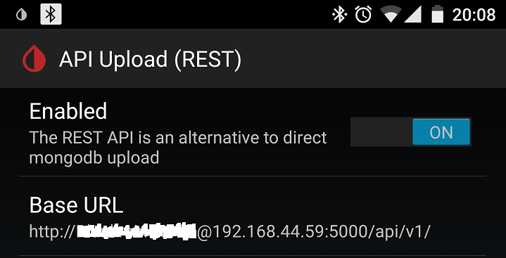

# Offline looping - aka, running OpenAPS without internet connectivity

There are a number of ways to have an "offline" OpenAPS rig, and numerous ways to monitor offline ([see the monitoring section for information about monitoring offline](http://openaps.readthedocs.io/en/latest/docs/While%20You%20Wait%20For%20Gear/monitoring-OpenAPS.html#the-main-ways-of-monitoring-your-rig-offline-include)).  Offline refers to situations where your rig moves into an area where it does not have internet access (i.e., the rig does not have a known WiFi network available and the cell phone used with the rig does not have cell coverage/hotspot available).  By setting up one of these offline solutions, your rig can still loop while in an offline area.  Depending on the setup, the opportunities to visualize or monitor the loop actions (e.g., check what temp basal is actually being set) may vary until you can get back into an online area.

**NOTE: TRY BEFORE YOU FLY!** Remember this when you decide to use an offline looping method for the first time - try it before you go offline for the situation in which you likely need it (e.g. flying, camping, hiking, etc.). Sometimes there's something small and easy like remembering to plug a secondary power source to your rig that can make your offline looping method work, but you'll forget on your first try - so try before you go! 

## Medtronic CGM users
Medtronic CGM users can, by default, automatically loop offline because the rig will read CGM data directly from the pump.

#### Note about recovery from Camping Mode/Offline mode for Medtronic CGM users:

If you have been running offline for a significant amount of time, and use a Medtronic CGM, you may need to run

```
openaps first-upload
```
from inside your openAPS directory, before your loop will start updating correctly to your nightscout site.

********************************

## Dexcom CGM users
Dexcom CGM users have a few different alternatives to retrieve blood glucose values locally for offline use.  The options to choose from are:

### A. xDrip+ for Android users

Android users can use the xDrip+ Android app. The details for setting up  offline looping with xDripAPS are described in the [section below](https://openaps.readthedocs.io/en/latest/docs/Customize-Iterate/offline-looping-and-monitoring.html#xdripaps-offline-looping-for-users-of-the-xdrip-android-app). The naming can be confusing. xDrip+ (maintained by [@jamorham](https://jamorham.github.io/#xdrip-plus)) is the app being actively developed. While Google may lead you to several older versions of the xDrip/xDrip+ Android app, you can always get the latest version here:
   * xDrip+: [https://github.com/NightscoutFoundation/xDrip](https://github.com/NightscoutFoundation/xDrip)
   * There is no direct iOS version of xDrip+. [Spike](https://spike-app.com/) is a different app with a different set of features.

### B. Plug CGM into rig (easiest)

**EASIEST:** For either Android or iPhone users, you can plug the CGM receiver directly into your rig via USB. This will pull BGs into the rig directly from the receiver and be used for looping.  If you are a G4 user, this should also bring RAW BG data into the rig during sensor restarts or ??? times (although multiple users with pediatric model G4 receivers have reported inability to obtain raw data.  This seems to be related to a firmware difference between adult and pediatric G4 receivers).  The rig will loop using RAW BGs so long as the BG value is under 150 mg/dl.  A few notes about how to make the direct-receiver configuration work:

   * Explorer boards built prior to late January of 2017 are not always working well/automatically with a CGM receiver plugged in.  These boards can be identified by looking to see if they say "2016" on the board's label tag, as shown in the photo below.  The boards can be fixed to use a CGM receiver by making a single trace cut, but doing so will disable the board's the ability to re-flash your Edison. Please make sure you have a second Explorer board or another base block or breakout board that you can use to re-flash the Edison if needed before considering this modification. For more details, see [this issue](https://github.com/EnhancedRadioDevices/915MHzEdisonExplorer/issues/14), and if you decide to make the cut, see [this document for details on how to cut the copper trace from pin 61 of the 70 pin connector](https://github.com/EnhancedRadioDevices/915MHzEdisonExplorer/wiki#usb-otg-flakiness). Cut in two places and dig out the copper between. Cut by poking a razor point in. Avoid the narrow trace above the one being cut.
   
   * Explorer Boards that shipped at or after the end of February 2017/first week of March 2017 should enable users to simply plug in the CGM receiver to the OTG port, and a USB battery into the UART port, in order to run offline and pull BGs from the receiver. Those boards will have a label of v1.2 2017.

<details>
<br>
  
  <summary><b>Click here</b> to display images of the Explorer Board to help identify which version you have</summary>
   
   

</details>
<br>

   * The order of the cables and ports is important.  The OTG cable must be plugged into the OTG port on the Explorer board.  There are two kinds of OTG cables; (1) both ends are micro-USB like the one you can [order here](https://www.amazon.com/dp/B00TQOEST0/ref=cm_sw_r_cp_api_Niqfzb3B4RJJW) or (2) one end is USB and one end is micro-USB like the one you can [order here](https://www.adafruit.com/product/1099).  Both will work, but if you have the second kind, that cable must be the one plugged into the rig directly, and the other non-OTG cable must be plugged into the receiver (as shown in photo below).  That port is labeled on the underside of the port, it is the one closest to the lipo battery plug. A USB battery or wall charger must be plugged into the UART port to supply sufficient voltage to the OTG port (the lipo battery alone is not enough to power the OTG port). 
   


<details>
<br>
  
  <summary><b>Click here</b> to display images of the Explorer Board with the OTG cable plugged into the OTG port</summary>
   


</details>
<br>
   
   * If you are using this configuration for G4 receivers and (1) are online and (2) want to see RAW BGs in NS, then you must remember to add `rawbg` to your ENABLE line in your Heroku/Azure settings.  You will also have to go to your Nightscout site's settings and select "always" from the Show RAW BG options.  You will also have to select `g4-raw` (if on master branch) or `g4-upload` (if on dev branch) as the CGM type in the loop setup script.

### C. Send G5 or G6 BGs direct to rig (xdrip-js, Lookout/Logger)

On your OpenAPS rig, the xdrip-js library can read directly from the Dexcom transmitter, similar to xdrip+ on the phone. It replaces the iPhone Dexcom mobile app, or xdrip+ on the phone, they cannot be used simultaneously (and you cannot use more than one rig with xdrip-js at a time). However, you can use a Dexcom receiver at the same time as xdrip-js. (The gitter channel for xdrip-js and related stuff is at [https://gitter.im/thebookins/xdrip-js](https://gitter.im/thebookins/xdrip-js) - head there for questions about setup.) There are two ways to use the xdrip-js library (you can only use one at a time on the rig):

#### Lookout/Logger:
   
   * **Lookout** - this application runs on your rig and uses the xdrip-js library to read from the G5 or G6 transmitter directly. It uses the transmitter's built-in calibration algorithm, and you can enter BG calibrations either from the receiver or from a browser on your phone or computer, when connected to a web server that Lookout manages on your rig. The Lookout web pages also allow you to view CGM, pump, and OpenAPS status. Regardless of whether you use the receiver or Lookout to enter calibrations, they will be sent to the transmitter and both devices will report the same resulting BG values (though they may take a reading or two to 'catch up' after a calibration). Depending on your phone's hotspot capabilities, you may be able to access the Lookout web server even when cellular data is not available. Lookout will read Dexcom transmitter BG data and update OpenAPS locally (via xDripAPS), so your rig will continue to loop while offline, as well as send to Nightscout when your rig is online. Since Lookout uses the official transmitter calibration algorithm, it still requires sensor restarts every 7 days, with 2-hour warmups, and cannot be used with transmitters that have reached the Dexcom expiration (105-112 days from their first use).
   
   * **Logger** (xdrip-js-logger) - this application is restarted regularly from your rig's crontab, and uses the xdrip-js library to read from the Dexcom G5 or G6 transmitter directly. It can use non-expired or expired transmitters. It leverages both the in transmitter session calibration algorithms and falls back to LSR calibrations automatically when the sensor has an issue or stops (i.e. after 7 days). For LSR calibration, Logger uses the raw filtered/unfiltered values from the Dexcom transmitter, instead of the official calibrated value, and so can be used with transmitters that are past their standard expiration (including those with replaced batteries). Logger also has the ability to reset an expired transmitter to new so that in transmitter calibrations can be used (even for battery replaced transmitters). Calibrations for Logger are entered through nightscout as BG Treatments, or through the pump (e.g., via the Contour Next Link meter that automatically loads to the pump), or through the command line. BG data is sent to both OpenAPS (via xDripAPS) locally, so your rig will continue to loop while offline, and include Nightscout when online. You can use a receiver with Logger, but the BG values will not necessarily match between the two, and the calibrations on the receiver must be entered separately. Nightscout is the user interface for entering calibration and getting sensor status / requests such as "Needs calibration" as Announcements. Nightscout also shows the transmitter battery status, voltages, resistance, temperature every 12 hours as a note. Nightscout is also used to let Logger know that a new sensor has been inserted and to start a sensor. You can set the time back on a start - i.e. 2 hours (if you soaked the sensor). Logger has command line scripts that run on the rig (cgm-reset, cgm-start, cgm-stop, cgm-battery, and calibrate). There is currently no local web browser for entering calibrations or interacting with Logger, so the only way to view its data is through a terminal, xDripAPS web server, or Nightscout. **NOTE: for expired transmitters, Logger LSR calibration method is an approximation of what the Dexcom transmitter does internally so caution and serious oversite and testing should be exercised when using.**
   
> NOTE: Lookout, Logger (xdrip-js-logger), and xdrip-js library should be considered a WIP (Work In Progress), i.e., do not use if you cannot watch your BG and loop very carefully, and tolerate issues, failures, idiosynchrosies. Also please plan on contributing either through testing and feedback, updates, documentation, etc.
   
   A summary of their features:
   
  <table>
    <tr>
      <th>Feature</th>
      <th>Lookout</th> 
      <th>Logger</th>
    </tr>
    <tr>
      <td>Still unfinished, i.e., a work-in-progress?</td>
      <td>Yes</td> 
      <td>Yes</td>
    </tr>
    <tr>
      <td>Rig continues updating BG and looping while offline using xdripAPS?</td>
      <td>Yes</td> 
      <td>Yes</td>
    </tr>
    <tr>
      <td>Offline (network) mode supports backfill to Nightscout?</td>
      <td>Yes</td> 
      <td>Yes</td>
    </tr>
    <tr>
      <td>Offline (away from transmitter times) supports backfill?</td>
      <td>Yes</td> 
      <td>Yes</td>
    </tr>
    <tr>
      <td>Uses Dexcom official calibration?</td>
      <td>Yes</td> 
      <td>Yes</td>
    </tr>
    <tr>
      <td>Can use with expired/battery replaced transmitter?</td>
      <td>Yes</td> 
      <td>Yes</td>
    </tr>
    <tr>
      <td>Can interact with rig-hosted web page? (e.g., for calibration, start/stop sensor)</td>
      <td>Yes</td> 
      <td>No, can use rig cmd line while offline</td>
    </tr>
    <tr>
      <td>Also able to calibrate and start/stop sensor thru receiver?</td>
      <td>Yes</td> 
      <td>Yes, for non-expired transmitter/session</td>
    </tr>
    <tr>
      <td>Calibrate through Web/Nightscout?</td>
      <td>Yes (local rig Web UI)</td> 
      <td>Yes</td>
    </tr>
    <tr>
      <td>Calibrate through pump-connected meter (e.g., Contour Next Link)?</td>
      <td>No</td> 
      <td>Yes</td>
    </tr>
    <tr>
      <td>Calibrate from command line?</td>
      <td>Yes</td> 
      <td>Yes</td>
    </tr>
    <tr>
      <td>Linear Squared Regression Calibration</td>
      <td>Yes, for > 7 day extension</td> 
      <td>Yes</td>
    </tr>
    <tr>
      <td>Single Point Linear Calibration</td>
      <td>Yes, for > 7 day extension</td> 
      <td>Yes</td>
    </tr>
    <tr>
      <td>Calculate and send Noise with entries</td>
      <td>Yes</td> 
      <td>Yes</td>
    </tr>
    <tr>
      <td>Calculate glucose trending</td>
      <td>Yes</td> 
      <td>Yes</td>
    </tr>
      <tr>
      <td>Start Stop Sensor</td>
      <td>Yes via UI</td> 
      <td>Yes via NS/cmd line</td>
    </tr>
      <tr>
      <td>Reset Expired Transmitter</td>
      <td>Yes via UI</td> 
      <td>Yes via cmd line</td>
    </tr>
      <tr>
      <td>Support mmol</td>
      <td>Yes</td> 
      <td>Yes, in NS and for Meter-Pump Calibration</td>
    </tr>
      <tr>
      <td>View transmitter battery/resistance levels</td>
      <td>Yes via NS CGM pill</td> 
      <td>Yes</td>
    </tr>
</table>
   
   * Lookout and Logger (xdrip-js-logger) are documented separately:
     * Lookout: [https://github.com/xdrip-js/Lookout/blob/dev/README.md](https://github.com/xdrip-js/Lookout/blob/dev/README.md)
     * Logger: [https://github.com/xdrip-js/Logger/blob/dev/README.md](https://github.com/xdrip-js/Logger/blob/dev/README.md)

### Entering carbs while offline
While offline you will not be able to enter carbs and set temporary targets using Nightscout. You have two options to enter carbs while offline. You can use the Medtronic pump's Bolus Wizard. When using the Bolus Wizard, be careful to avoid an A52 error if you have enabled SMB. By default, use of the Bolus Wizard disables SMB for 6 hours ([learn more here](http://openaps.readthedocs.io/en/latest/docs/While%20You%20Wait%20For%20Gear/preferences-and-safety-settings.html#a52-risk-enable-a52-risk-mitigation)). The second option, which as far as we know avoids the A52 risk, is to use the Medtronic pump's Capture Event feature. To turn on the Capture Event feature, do these steps:

1. Go to the CAPTURE EVENT ON/OFF screen: Main > Utilities > Capture Option
2. Select On, then press ACT.
You will now have a Capture Event option in the MAIN MENU.

To enter carbohydrate information:

1. Determine the total units of carbohydrates in the meal or snack that you plan to eat.
2. Go to the ENTER FOOD screen: Main > Capture Event > Meal marker
3. The ENTER FOOD screen flashes with dashes or with the number of carbohydrate grams you entered last time.
4. Enter the carbohydrate grams, then press ACT. A message asks if you want to save the information that is displayed on the screen. The Yes option is selected.
5. Make sure the number shown on the screen is correct. If the information is correct, press ACT. The information you entered is saved to the system and can now be used in reports. If the information is not correct, select No, then press ACT. The CAPTURE EVENT menu shows. Repeat the steps above to enter the correct information.

### Setting temporary targets offline
You cannot set a temporary target in the Medtronic pump. If you want to change your normal target while offline, you will need to do that using the Bolus Wizard Setup option. IMPORTANT: If you change your target while offline, you'll need to remember to set it back to its original setting when you are done.

> Note that changing the pump target does not have the same effect as setting a temporary target in Nightscout.  In particular, setting the pump target higher or lower than normal will not trigger exercise or resistance modes as temporary targets do if you have the appropriate preferences enabled.

To change your target on your Medtronic pump do the following:

1. Make sure the EDIT SETTINGS screen is open: Main > Bolus > Bolus Setup > Bolus Wizard Setup > Edit Settings
2. Select BG Target, then press ACT, and change your target.

If you wish to set a true temporary target while offline, you can do so by ssh'ing into the rig and running `oref0-set-local-temptarget <target> <duration> [starttime]`.  So for example, to set a 110 local temp target for 60 minutes, you can run `oref0-set-local-temptarget 110 60`.  In the future, we plan to expose this local temp target functionality using the offline web page interface, but for now it only works via `ssh`.

********************************

### xDripAPS - offline looping for users of the xDrip+ Android app

Do you use OpenAPS and the xDrip+ Android app? By default, the xDrip+ Android app uploads CGM data to an online Nightscout instance, OpenAPS then downloads this data for use in your online loop. 

The xDripAPS code resides on your OpenAPS rig and allows the direct transfer of xDrip+ Android app CGM data to your OpenAPS rig via a "local" network (WiFi hotspot or Bluetooth PAN tethering) without an internet connection. This will make CGM data available to the OpenAPS rig without internet access.

#### Overview of xDripAPS
With xDripAPS, data flow is as follows:

(1) CGM transmitter --> (2) xDrip+ Android app --> (3) OpenAPS rig (e.g. Edison)

1. Usually a Dexcom G5 or G4 plus xDrip wireless bridge. Other sources might work as well, but have not been tested.
2. xDrip+ Android app (https://github.com/NightscoutFoundation/xDrip). In the app, the REST API Upload feature is normally used to upload CGM data to Nightscout.  We use this feature to upload CGM data to xDripAPS on your OpenAPS rig (further details below).
3. Your OpenAPS rig - usually a Raspberry Pi or an Intel Edison.

OpenAPS/xDripAPS will NOT upload CGM data to Nightscout. It is possible to enter two upload destinations in the xDrip+ Android app delimited by a space character - the rig for offline looping and Nightscout for upload when internet access is available. If no CGM data is available to xDripAPS for any reason, OpenAPS will fall back to downloading CGM data online from Nightscout if an internet connection is available.

Logger and Lookout also use xDripAPS on the rig to support offline looping. No xDripAPS setup is required to support Logger or Lookout beyond selecting xdrip CGM source in oref0-setup as described below.

#### Setup Steps (using oref0-setup.sh script) for xDripAPS

<details>
<br>
  
  <summary><b>Click here</b> to expand the setup instructions for using oref0-setup.sh</summary>
   

##### Setting up your OpenAPS rig
Install OpenAPS as per the documentation. While running the oref0-setup script you will be prompted to specify a CGM source. Enter "xdrip" (without the quotes). The setup script takes care of the rest! Follow the remainder of the setup script as normal.

##### Connecting your Android phone and your OpenAPS rig
In order to allow xDrip+ app on your Android phone to send CGM data directly to xDripAPS on your OpenAPS rig, both need to be connected to the same "personal" network. Note that an internet connection is not required - this solution allows you to loop without internet connectivity.

There are two approaches for establishing a "personal" network between your phone and your OpenAPS rig. The first is to run a WiFi hotspot on your phone and connect your OpenAPS rig to the WiFi network your phone exposes. This is the easiest option, but there are two drawbacks - it drains your phone battery quickly, and most phones cannot connect to a normal WiFi network while the WiFi hotspot is enabled (they can connect to the internet via 3G/4G when coverage is available).

The other option is to enable Bluetooth PAN tethering on your phone and have your OpenAPS rig connect to it. Battery drain is minimal and the phone can still connect to a normal WiFi network for internet access when available as well as to 3G/4G networks when WiFi is not available. (Some users have their OpenAPS rig permanently tethered to their Android phone. The drawback is that connecting to the rig via SSH in this configuration is only possible by using an SSH app on the phone or by connecting it to a computer using a USB cable)

Instructions on both WiFi and Bluetooth tethering can be found in the main OpenAPS documentation.

##### Configuring the xDrip+ Android app
First, determine your OpenAPS rig's IP address within your "personal" network. If you can open a terminal session to your rig via serial, then `ifconfig wlan0` (when using the WiFi hostpost option) or `ifconfig bnep0` (when using bluetooth tethering) will display your IP address. Alternatively, you can use an Android app - there are lots of "Network IP Scanner" apps in the Play store. The Hurricane Electric Network Tools app works with both the WiFi hotspot and BT tethering options.

Next, open xDrip+ and navigate to Settings > Cloud Upload > Nightscout Sync (REST-API) and enable it. In the `Base URL` setting, configure the following URL

`http://<nightscout_api_secret>@<rig_ip_address>:5000/api/v1/`

A few notes to clarify:
   * enter "http://" NOT "https://
   * <nightscout_api_secret> is the plain-text API secret used when creating your online Nightscout instance.
   * <rig_ip_address> is the IP address of your OpenAPS rig assigned by your WiFi, WiFi hotspot, or Bluetooth PAN tether connection. It will usually take the form of: `192.168.xxx.xxx`.



##### Entering multiple REST URLs

* If you need to constantly switch between two or more "personal" networks, you would have to edit the `Base URL` each time with the new IP address. To simplify this process, multiple URLs can be added to the REST API Upload `Base URL` setting, and xDrip+ will attempt to upload to each URL.  NOTE:  the URLs must be "space" delimited.  For example:
```
http://<nightscout_api_secret>@<rig_ip_address1>:5000/api/v1/ http://<nightscout_api_secret>@<rig_ip_address2>:5000/api/v1/
```
* OpenAPS/xDripAPS will NOT upload CGM data to Nightscout. You can enter both your xDripAPS URL and your Nightscout URL, again separated by a space character. For example:
```
https://<nightscout_api_secret>@<yournnightscoutsite>.herokuapp.com/api/v1/ http://<nightscout_api_secret>@<rig_ip_address2>:5000/api/v1/
```
Be careful when entering the addresses - xDripAPS uses the http protocol, Nightscout uses the https protocol.

NOTE: To ensure your OpenAPS rig recieves glucose data through XdripAPS please confirm the following setting is UN-CHECKED : Open XDrip + and navigate to Settings > Cloud Upload > Nightscout Sync (REST-API) > Extra options > "Skip LAN uploads". This setting is checked by default, however does not allow your openaps rig to recieve glucose data when tethered offline.

</details>
<br>
   
#### Known limitations of xDripAPS
* xDripAPS does not process anything other than CGM data. If you use the xDrip+ Android app to enter carbs, these will not be processed by OpenAPS. If you upload to Nightscout simultaneously, OpenAPS will download the carbohydrate entries from Nightscout once it has internet connectivity. For alternative solutions for offline carb entry see above.
* Changing between xDripAPS and Nightscout as sources for CGM data may lead to problems with the calculation of carbohydrate absorption. This can be avoided by leaving the OpenAPS rig tethered to the phone via Bluetooth or WiFi as long as there are carbs on board.

#### Manual installation steps for xDripAPS

It is strongly recommended that you use the oref0-setup script as described above, rather than installing manually.

<details>
<br>
  
  <summary><b>Click here</b> to expand the setup instructions for installing manually (not recommended)</summary>
   

1. Install SQLite3 -

  a. Raspbian -
    ```
    apt-get install sqlite3
    ```

  b. Yocto -
    ```
    cd ~
    wget https://sqlite.org/2016/sqlite-tools-linux-x86-3150200.zip
    unzip sqlite-tools-linux-x86-3150200.zip
    mv sqlite-tools-linux-x86-3150200 sqlite
    ```

2. Get dependencies -
  ```
  pip install flask
  pip install flask-restful
  ```

3. Clone this repo -
  ```
  cd ~
  git clone https://github.com/colinlennon/xDripAPS.git .xDripAPS
  ```

4. Create directory for database file -
  ```
  mkdir -p ~/.xDripAPS_data
  ```

5. Add cron entry to start the microservice at startup -
  e.g. -
  `@reboot         python /home/root/.xDripAPS/xDripAPS.py`

6. Configure the xDrip Android app -
  `xDrip > Settings > REST API Upload > Set Enabled and enter Base URL: http://[API_SECRET]@[Pi/Edison_IP_address]:5000/api/v1/`
 
  (Note: Enter your plain-text API_SECRET in the Android app, not the hashed version of it).


7. Use the microservice within OpenAPS
  e.g.
  ```
  openaps device add xdrip process 'bash -c "curl -s http://localhost:5000/api/v1/entries?count=288"'
  openaps report add monitor/glucose.json text xdrip shell
  ```

</details>
<br>  
