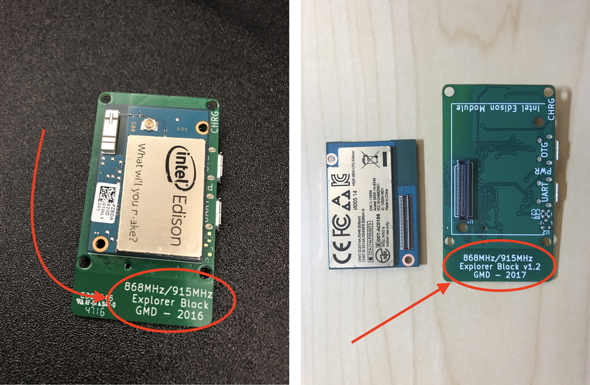

# Offline looping - aka, running OpenAPS without internet connectivity

There are a number of ways to have an "offline" OpenAPS rig, and numerous ways to monitor offline (see the monitoring section for information about monitoring offline).  Offline refers to situations where your rig moves into an area where it does not have internet access (i.e., the rig does not have a known wifi network available and the cell phone used with the rig does not have cell coverage/hotspot available).  By setting up one of these offline solutions, your rig can still loop while in an offline area.  Depending on the setup, the opportunities to visualize or monitor the loop actions (e.g., check what temp basal is actually being set) may vary until you can get back into an online area.

## Offline looping

### Medtronic CGM users
Medtronic CGM users can, by default, automatically loop offline because the rig will read CGM data directly from the pump.

#### Note about recovery from Camping Mode/Offline mode for Medtronic CGM users:

If you have been running offline for a significant amount of time, and use a Medtronic CGM, you may need to run

```
openaps first-upload
```
from inside your openAPS directory, before your loop will start updating correctly to your nightscout site.

********************************

### Dexcom CGM users
Dexcom CGM users have a few different alternatives to retrieve blood glucose values locally for offline use.  The options to choose from are:

1. For android users, you can use xDrip or xDrip+.  NOTE: All active development is being done on xDrip+. The details for setting up this configuration are described in the section below for xDrip offline.
   * xDrip: [http://stephenblackwasalreadytaken.github.io/xDrip/](http://stephenblackwasalreadytaken.github.io/xDrip/)
   * xDrip+: [https://jamorham.github.io/#xdrip-plus](https://jamorham.github.io/#xdrip-plus) 
   
2. For iPhone users, it is possible to setup a modified Loop app to bring data in locally such as the one you will find here: https://github.com/thebookins/Loop. This solution requires a build of an iOS app on a Mac and the use of a free Dev licenses (which will give you an app to test, but will only stay deployed for 7 days) or a full Dev license ($99/year). The modified Loop app will "listen in" for Dexcom data on iPhone, upload it to a scaled down version of Nightscout on your rig where xDrip is running. This solution requires some Mac OS and iOS savvy, and exploration.

3. **EASIEST:** For either Android or iPhone users, you can plug the CGM receiver directly into your rig via USB. This will pull BGs into the rig directly from the receiver and be used for looping.  If you are a G4 user, this should also bring RAW BG data into the rig during sensor restarts or ??? times (although multiple users with pediatric model G4 receivers have reported inability to obtain raw data.  This seems to be related to a firmware difference between adult and pediatric G4 receivers).  The rig will loop using RAW BGs so long as the BG value is under 150 mg/dl.  A few notes about how to make the direct-receiver configuration work:

   * Explorer boards built prior to late January of 2017 are not always working well/automatically with a CGM receiver plugged in.  These boards can be identified by looking to see if they say "2016" on the board's label tag, as shown in the photo below.  The boards can be fixed to use a CGM receiver by making a single trace cut, but doing so will disable the board's the ability to re-flash your Edison. Please make sure you have a second Explorer board or another base block or breakout board that you can use to re-flash the Edison if needed before considering this modification. For more details, see [this issue](https://github.com/EnhancedRadioDevices/915MHzEdisonExplorer/issues/14), and if you decide to make the cut, see [this document for details on how to cut the copper trace from pin 61 of the 70 pin connector](https://github.com/EnhancedRadioDevices/915MHzEdisonExplorer/wiki#usb-otg-flakiness). Cut in two places and dig out the copper between. Cut by poking a razor point in. Avoid the narrow trace above the one being cut.
   
   * Explorer Boards that shipped at or after the end of February 2017/first week of March 2017 should enable users to simply plug in the CGM receiver to the OTG port, and a USB battery into the UART port, in order to run offline and pull BGs from the receiver. Those boards will have a label of v1.2 2017.
   
   

  * The order of the cables and ports is important.  The OTG cable must be plugged into the OTG port on the Explorer board.  There are two kinds of OTG cables; (1) both ends are micro-USB like the one you can [order here](https://www.amazon.com/dp/B00TQOEST0/ref=cm_sw_r_cp_api_Niqfzb3B4RJJW) or (2) one end is USB and one end is micro-USB like the one you can [order here](https://www.adafruit.com/product/1099).  Both will work, but if you have the second kind, that cable must be the one plugged into the rig directly, and the other non-OTG cable must be plugged into the receiver (as shown in photo below).  That port is labeled on the underside of the port, it is the one closest to the lipo battery plug. A USB battery or wall charger must be plugged into the UART port to supply sufficient voltage to the OTG port (the lipo battery alone is not enough to power the OTG port). 
  
  

* If you are using this configuration for G4 receivers and (1) are online and (2) want to see RAW BGs in NS, then you must remember to add `rawbg` to your ENABLE line in your Heroku/Azure settings.  You will also have to go to your Nightscout site's settings and select "always" from the Show RAW BG options.  You will also have to select `g4-raw` (if on master branch) or `g4-upload` (if on dev branch) as the CGM type in the loop setup script.

### Entering carbs while offline
While offline you will not be able to enter carbs and set temporary targets using Nightscout. You have two options to enter carbs while offline. You can use the Medtronic pump's Bolus Wizard. When using the Bolus Wizard, be careful to avoid an A52 error if you have enabled SMB. By default, use of the Bolus Wizard disables SMB for 6 hours. The second option, which as far as we know avoids the A52 risk, is to use the Medtronic pump's Capture Event feature. To turn on the Capture Event feature, do these steps:

1. Go to the CAPTURE EVENT ON/OFF screen: Main > Utilities > Capture Option
2. Select On, then press ACT.
You will now have a Capture Event option in the MAIN MENU.

To enter carbohydrate information:

1. Determine the total units of carbohydrates in the meal or snack that you plan to eat.
2. Go to the ENTER FOOD screen: Main > Capture Event > Meal marker
3. The ENTER FOOD screen flashes with dashes or with the number of carbohydrate grams you entered last time.
4. Enter the carbohydrate grams, then press ACT. A message asks if you want to save the information that is displayed on the screen. The Yes option is selected.
5. Make sure the number shown on the screen is correct. If the information is correct, press ACT. The information you entered is saved to the system and can now be used in reports. If the information is not correct, select No, then press ACT. The CAPTURE EVENT menu shows. Repeat the steps above to enter the correct information.

### Setting temporary targets offline
You cannot set a temporary target in the Medtronic pump. If you want to change your normal target while offline, you will need to do that using the Bolus Wizard Setup option. IMPORTANT: If you change your target while offline, you'll need to remember to set it back to its original setting when you are done.

Note that changing the pump target does not have the same effect as setting a temporary target in Nightscout.  In particular, setting the pump target higher or lower than normal will not trigger exercise or resistance modes as temporary targets do if you have the appropriate preferences enabled.

To change your target on your Medtronic pump do the following:

1. Make sure the EDIT SETTINGS screen is open: Main > Bolus > Bolus Setup > Bolus Wizard Setup > Edit Settings
2. Select BG Target, then press ACT, and change your target.

If you wish to set a true temporary target while offline, you can do so by ssh'ing into the rig and running `oref0-set-local-temptarget <target> <duration> [starttime]`.  So for example, to set a 110 local temp target for 60 minutes, you can run `oref0-set-local-temptarget 110 60`.  In the future, we plan to expose this local temp target functionality using the offline web page interface, but for now it only works via `ssh`.

********************************

### xDripAPS for offline BGs and looping for Android users

**Note as of 1/26/17:** The below documentation is WIP and needs additional testing.

Do you use OpenAPS and the xDrip/xDrip+ Android App? Until now this required an internet connection to upload your xDrip/xDrip+ Android App CGM data to an online Nightscout instance (the OpenAPS community recommends utilizing Heroku). Then your data was downloaded to your OpenAPS rig for use in your online loop. The xDripAPS code resides on your OpenAPS rig and allows the direct transfer of xDrip/xDrip+ Android App CGM data to your OpenAPS rig without an internet connection. xDripAPS creates an offline OpenAPS rig which utilizes a "local" or "personal" network (WiFi hotspot or Bluetooth PAN tethering) for direct communication between the xDrip/xDrip+ Android device and the OpenAPS rig. Data which is 'missing' from Nightscout will be uploaded when the OpenAPS rig regains internet connectivity.

The OpenAPS community recommends an Explorer Board / Intel Edison rig, but xDripAPS also works with a Raspberry Pi rig.

Configuring an offline OpenAPS rig is quite easy because the OpenAPS setup script (oref0-setup.sh v0.4.0 and later) supports an automated installation of xDripAPS and dependencies. When running the OpenAPS setup script you simply specify "xdrip" (without the quotes) when promped to specify a CGM type (e.g. MDT, G4). Alternatively, manual installation instructions can be found at the bottom of this page.

#### Overview of xDripAPS
With xDripAPS, the flow of data is as follows -

(1) CGM transmitter --> (2) xDrip/xDrip+ Android app --> (3) OpenAPS rig (e.g. Edison) --> (4) Nightscout

1. Usually a Dexcom G5, or G4 plus xDrip wireless bridge.
2. Either xDrip or xDrip+ can be used. In the app, the REST API Upload feature is normally used to upload CGM data to Nightscout. Instead, we use this feature to upload to xDripAPS on your OpenAPS rig (further details below).
3. Your OpenAPS rig - usually a Raspberry Pi or an Intel Edison.
4. The xDrip or xDrip+ app is now uploading your data to xDripAPS on your OpenAPS rig rather than to Nightscout. OpenAPS will now upload your CGM data to Nightscout as well as treatments, pump status, etc. So your Nightscout site will still be updated. Note that it will take a couple of minutes longer for CGM data to reach Nightscout, compared with when uploading directly from xDrip or xDrip+

#### Setup Steps (using oref0-setup.sh script)

##### Setting up your OpenAPS rig
Install OpenAPS as per the documentation. While running the oref0-setup script you will be prompted to specify a CGM source. Enter "xdrip" (without the quotes). The setup script takes care of the rest! Follow the remainder of the setup script as normal.

##### Connect your Android phone and your OpenAPS rig
For the xDrip/xDrip+ app on your Android phone to be able to send CGM data to xDripAPS on your OpenAPS rig, they both need to be connected to the same "personal" network. Note that an internet connection is not required - this solution allows you to loop without internet connectivity.

There are two approaches for establishing a "personal" network between your phone and your OpenAPS rig. The first is to run a WiFi hotspot on your phone and connect your OpenAPS rig to the WiFi network your phone exposes. This is the easiest option, but there are two drawbacks - it drains your phone battery quickly, and some phones cannot connect to a normal WiFi network while the WiFi hotspot is enabled (it can connect to the internet via 3G/4G when coverage is available).

The other option is to enable bluetooth PAN tethering on your phone and have your OpenAPS rig connect to it. This does not drain the phone's battery as quickly and means that the phone can still connect to a normal WiFi network for internet access when available (and to 3G/4G networks when WiFi is not available). I use this approach 24/7 - my OpenAPS rig is permanently tethered to my Nexus 6P phone. I can get a full day of phone usage without running out of battery, unless I make a lot of calls or have a lot of screen-on time.

Instructions on both approaches can be found in the main OpenAPS documentation.

##### Configuring the xDrip/xDrip+ Android app
First, determine your OpenAPS rig's IP address within your "personal" network. If you can open a terminal session to your rig via serial, then `ifconfig wlan0` (when using the WiFi hostpost option) or `ifconfig bnep0` (when using bluetooth tethering) will display your IP address. Alternatively, you can use an Android app - there are lots of "Network IP Scanner" apps in the Play store. The Hurricane Electric Network Tools app works with both the WiFi hotspot and BT tethering options.

Next, open xDrip or xDrip+ and navigate to Settings > Cloud Upload > API Upload (REST). In the `Base URL` setting, configure the following URL

`http://<nightscout_api_secret>@<rig_ip_address>:5000/api/v1/`

A few notes to clarify:
   * enter "http://" NOT "https://
   * <nightscout_api_secret> is the plain-text API secret used when creating your online Nightscout instance.
   * <rig_ip_address> is the IP address of your OpenAPS rig assigned by your WiFi, WiFi hotspot, or Bluetooth PAN tether connection. It will usually take the form of: `192.168.xxx.xxx`.


If using xDrip+ navigate to Settings > Cloud Upload > MongoDB and uncheck the "Skip LAN uploads" option. Do not turn on the "Enable Nightscout Mongo DB sync" option. Next, navigate to Settings > Cloud Upload > API Upload (REST) and uncheck the "Skip LAN uploads" option. NOTE: if you don't have these options, update to a recent version of the xDrip+ app. These options were added to a nightly build in December 2016.

##### Advanced Options

* Use both API Upload (REST) and MongoDB
    * You can use both the API Upload (REST) and the MongoDB upload options.  This has the advantage of immediately showing your BG values in Nightscout and allows OpenAPS to continue to get BG values if the link ever fails between your xDrip/xDrip+ uploader phone and your rig.  One disadvantage to this method is that you will have duplicate entries in your Mongo database.
* Enter multiple REST URLs
    * If you are needing to constantly switch between two or more "personal" networks, you would have to edit the `Base URL` each time with the new IP address. To simplify this process, multiple URLs can be added to the REST API Upload `Base URL` setting, and xDrip/xDrip+ will attempt to upload to each URL.  NOTE:  the URLs must be "space" deliminated.  For example:
```
http://<nightscout_api_secret>@<rig_ip_address1>:5000/api/v1/ http://<nightscout_api_secret>@<rig_ip_address2>:5000/api/v1/
```

#### Manual installation steps

##### N.B. It is recommended that you use the oref0-setup script as described above, rather than installing manually.

1. Install SQLite3 -

  a. Raspbian -
    ```
    apt-get install sqlite3
    ```

  b. Yocto -
    ```
    cd ~
    wget https://sqlite.org/2016/sqlite-tools-linux-x86-3150200.zip
    unzip sqlite-tools-linux-x86-3150200.zip
    mv sqlite-tools-linux-x86-3150200 sqlite
    ```

2. Get dependencies -
  ```
  pip install flask
  pip install flask-restful
  ```

3. Clone this repo -
  ```
  cd ~
  git clone https://github.com/colinlennon/xDripAPS.git .xDripAPS
  ```

4. Create directory for database file -
  ```
  mkdir -p ~/.xDripAPS_data
  ```

5. Add cron entry to start the microservice at startup -
  e.g. -
  `@reboot         python /home/root/.xDripAPS/xDripAPS.py`

6. Configure the xDrip Android app -
  `xDrip > Settings > REST API Upload > Set Enabled and enter Base URL: http://[API_SECRET]@[Pi/Edison_IP_address]:5000/api/v1/`
 
  (Note: Enter your plain-text API_SECRET in the Android app, not the hashed version of it).


7. Use the microservice within OpenAPS
  e.g.
  ```
  openaps device add xdrip process 'bash -c "curl -s http://localhost:5000/api/v1/entries?count=288"'
  openaps report add monitor/glucose.json text xdrip shell
  ```
  
