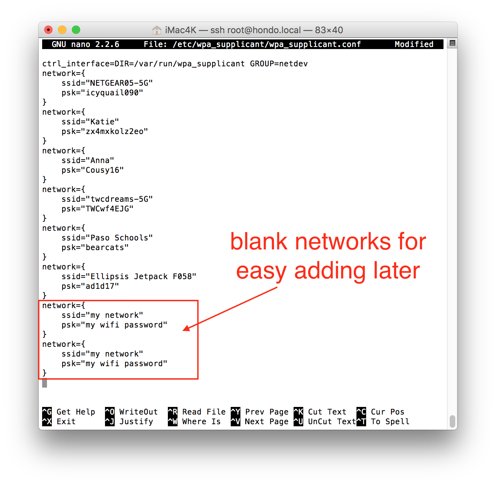

# How to add new wifi network(s)

Adding a wifi network is pretty easy once your initial loop has been setup.  Simply enter `edit-wifi` (which is a shortcut command for `nano /etc/wpa_supplicant/wpa_supplicant.conf` and add networks using the template:

```
network={
    ssid="my network"
    psk="my wifi password"
}
```
Save the edits to the file using `control-x`, `y`, and `enter`.

Helpful tip:  Add a couple "blank" networks to the file (see screenshot below), so that if you ever need to add new wifi networks while on-the-road, the process will be much faster and easier.  You'll only need to edit the network name and password then...instead of needing to type in the whole string of the template. 



Some wifi networks may require you to enter a login name and password at an initial screen before allowing access (such as many school wifi networks).  Some users have success in using the following wpa network settings for those types of networks:

```
network={
   scan_ssid=1
   ssid="network name"
   password="wifi password"
   identity="wifi username"
   key_mgmt=WPA-EAP
   pairwise=CCMP TKIP
   group=CCMP TKIP WEP104 WEP40
   eap=TTLS PEAP TLS
   priority=1
}
```

Troubleshooting tip:  Some wifi networks require you to accept a terms and conditions (or enter a room number and last name) prior to allowing access.  For example, Starbucks coffee shops and many hotels.  These networks are termed "captive" networks and connecting your rig to captive networks is currently not an option for a standard rig setup.  A device like [Hootoo mobile router](https://www.hootoo.com/network-devices.html) is an excellent tool in these situations.  A Hootoo mobile router will login to the hotel/Starbucks network via an app on your phone, and then the Hootoo "bridge" (non-technical word) the hotel's network for your rig to be able to connect to once you add the network to the rig.

Troubleshooting tip:  While this has not been encountered often, some users have found issues with wifi suddenly not working when additional wifi networks are added.  If you find your rig is suddenly no longer able to connect to wifi after adding additional networks...or suddenly stops working with mulitple networks entered already...try logging into your rig using a cabled connection (serial or screen mode) and using `ifup wlan0` and look for the following response:

```
wpa_supplicant: /sbin/wpa_supplicant daemon failed to start  
run-parts: /etc/network/if-pre-up.d/wpasupplicant exited with return code 1  
Failed to bring up wlan0. 
```

If that error message appears, revise your wifi network entries to include a priority line and set priorities for each, example below:

```
network={
    ssid="my network"
    psk="my wifi password"
    priority=1
}

network={
    ssid="my network2"
    psk="my wifi password2"
    priority=2
}
```
 Try `ifup wlan0` after adding the priority designations to the networks and that should resolve the error.
