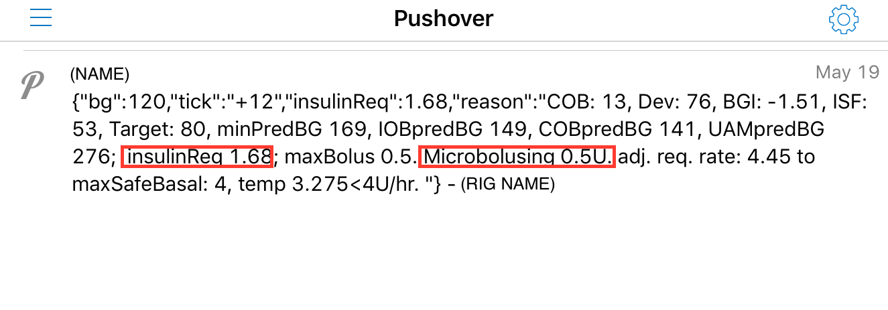

# oref1 (super advanced features)

NOTE OF CAUTION:
* oref1 is different than oref0, the baseline "traditional" OpenAPS implementation that only uses temporary basal rates.
* You should have run oref0 (basic OpenAPS looping) for more than two weeks, and be very aware of all the types of situations in which your rig might fail, before you enable oref1-related features.
* If running more than one rig, you will want to make sure all rigs are running an Super Micro Bolus (SMB) aware oref0 version (release 0.5.1 or higher) before enabling Super Micro Bolus (SMB) on any of them (even if Super Micro Bolus (SMB) is not enacted on all rigs, all rigs need to know about it).
* Super Micro Bolus (SMB) is about front-shifting insulin activity. It is NOT a synonym for no-bolus, although it can enable no-bolus options (with very close monitoring and testing). But you should first test Super Micro Bolus (SMB) with your existing bolus method.
   * Take steps one by one to turn on Super Micro Boluses; validate that Super Micro Boluses are working and understand if it is working for you; and only then should you approach changing behaviors related to meal-time boluses.
   * Do not combine turning on Super Micro Bolus (SMB) and trying to do no-bolus or partial-bolus meals at the same time. 
* Make sure you have your easy bolus button on ([details here](https://openaps.readthedocs.io/en/latest/docs/While%20You%20Wait%20For%20Gear/collect-data-and-prepare.html#easy-bolus-button)) and know how to deliver boluses without using the bolus wizard.
* See this page on [optimizing settings](http://openaps.readthedocs.io/en/latest/docs/Customize-Iterate/optimize-your-settings.html#optimizing-your-settings) for reminders and tips on changing one thing at a time.

## Only run oref1 with the following caveats in mind: 

* Remember that you are choosing to test a still-in-development feature. Do so at your own risk & with due diligence to keep yourself safe. 
* You should have run oref0 (basic OpenAPS looping) for more than two weeks, and be very aware of all the types of situations in which your rig might fail.
* **We are requiring that you also have run autotune prior to enabling Super Micro Bolus (SMB).** Why? Because if you have wonky ISF settings, for example, you may be more likely to go low or high with Super Micro Bolus (SMB). It will help a lot to have run autotune and be aware if the algorithm is recommending changes to ISF, basal, and/or carb ratio. You are not required to run autotune automatically/nightly as part of your loop with Super Micro Bolus (SMB); but you should at least run it manually and get an idea for how confident you are in your settings being right or not; and keep that in mind when evaluating Super Micro Bolus (SMB) outcomes for yourself.
* You should have basals of > 0.5 U/hr. (Super Micro Bolus (SMB) is *not* advisable for those with very small basals; since 0.1U is the smallest increment that can be bolused by Super Micro Bolus (SMB).  We also added a basal check to disable Super Micro Bolus (SMB) when basals are < 0.3 U/hr.  If your "regular" basal in the pump is 0.3 U/hr and autosens or autotune has adjusted your basal rate to below 0.3 U/hr, Super Micro Bolus (SMB)s will be disabled as well.)
* Read the following:
  * A. The updated reference design ([https://openaps.org/reference-design/](https://openaps.org/reference-design/)) that explains the differences between oref0 and oref1
  * B. The following two posts for background on oref1:
    * [https://diyps.org/2017/04/30/introducing-oref1-and-super-microboluses-smb-and-what-it-means-compared-to-oref0-the-original-openaps-algorithm/](https://diyps.org/2017/04/30/introducing-oref1-and-super-microboluses-smb-and-what-it-means-compared-to-oref0-the-original-openaps-algorithm/)
    *  [https://diyps.org/2017/05/08/choose-one-what-would-you-give-up-if-you-could-with-openaps-maybe-you-can-oref1-includes-unannounced-meals-or-uam/](https://diyps.org/2017/05/08/choose-one-what-would-you-give-up-if-you-could-with-openaps-maybe-you-can-oref1-includes-unannounced-meals-or-uam/)
* Make sure you understand what Super Micro Bolus (SMB) & Unannounced Meals (UAM) stand for (**read the above posts, we know you skipped them**!)
* Plan to have a learning curve. You will interact with oref1 differently when on Super Micro Bolus (SMB) and Unannounced Meal (UAM) than how you were interacting with oref0. In particular: **do not do correction boluses based on insulinReq**; instead use temp targets to give the rig a "nudge". You are very likely to overshoot if you try to do things manually on top of what Super Micro Bolus (SMB) has already done!
* Super Micro Bolus (SMB) may not be for everyone. Like everything else, plan to test it, fall back to previous methods of diabetes treatment if needed, and give yourself a time period for deciding whether or not it works well for you. 

## Understanding Super Micro Bolus (SMB)

<strong>SMB:</strong> Super Micro Bolus

Super Micro Bolus (SMB), like all things in OpenAPS, is designed with safety in mind. (Did you skip reading the updated reference design? Go read that first!) Super Micro Bolus (SMB) is designed to give you reasonably SAFE amounts of bolus needed upfront and use reduced temporary basal rates to safely balance out the peak insulin timing. You are likely to see many long low or zero temps (upwards of 120 minutes long) with Super Micro Bolus (SMB) turned on, while oref1 is administering Super Micro Boluses or waiting until it's safe to do so. 

Single Super Micro Bolus (SMB) amounts are limited by several factors.  The largest a single Super Micro Bolus (SMB) bolus can be is the SMALLEST value of:

* 30 minutes of the current regular basal rate (as adjusted by autotune/autosens), or
* 1/2 of the Insulin Required amount, or
* the remaining portion of your maxIOB setting in preferences

It's important to note that maxIOB will limit Super Micro Bolus (SMB)s from being issued if your Insulin On Board (IOB) (for instance, from an easy bolus you have inputted before a meal) exceeds your maxIOB. So if your maxIOB is relatively low and you are running high post-meal, you may want to examine your logs to see if it is routinely preventing Super Micro Bolus (SMB)s.

In addition, as of 0.6.0-master, using Bolus Wizard to input boluses and meal carbs is no longer recommended because of the possibility of errors when the rig attempts to issue an Super Micro Bolus (SMB) while Bolus Wizard is in use. Instead, many users [use IFTTT to notify their rig of upcoming carbs](http://openaps.readthedocs.io/en/latest/docs/Customize-Iterate/ifttt-integration.html).

(History of Super Micro Bolus (SMB) development: https://github.com/openaps/oref0/issues/262 )

## Understanding Unannounced Meals (UAM) 

<strong>UAM:</strong> Unannounced meal
 Unannounced Meals (UAM) provides an alternative method (in addition to or instead of carb entry) for detecting and safely dosing insulin in response to significant BG rises, whether they are due to meals, adrenaline, or any other reason.

(History of Unannounced Meals (UAM) development: https://github.com/openaps/oref0/issues/297 )

## How to turn on Super Micro Bolus (SMB)

* In oref0 0.6.0 and later, you will enable Super Micro Bolus (SMB)s by adding the related preferences to your preferences.json. You may want to experiment with turning only one enableSMB option on at a time so you can closely observe the behavior (via both Nightscout and pump-loop.log) in the enabled situation. In addition to testing oref1 in "normal" situations, pay special attention to how it behaves in more extreme situations, such as with rescue carbs (announced or not), post-meal activity, etc. 

There are multiple preference toggles for Super Micro Bolus (SMB). Check out the [preferences page](http://openaps.readthedocs.io/en/latest/docs/While%20You%20Wait%20For%20Gear/preferences-and-safety-settings.html#advanced-oref1-preferences) for more details on all the settings, but the short version is:

```
 * enableSMB_with_COB means Super Micro Bolus (SMB) will be enabled as long as COB is above zero
 * enableSMB_after_carbs means Super Micro Bolus (SMB) will be enabled for 6h after carb entry
 * enableSMB_with_temptarget means Super Micro Bolus (SMB) will be enabled with a low temp target (< 100 mg/dL). 
By default, a higher temp target (101 if your target is 100) will disable Super Micro Bolus (SMB). 
```

## Troubleshooting

1. Make sure you read the above, especially the "only enable oref1 if..." section. Super Micro Bolus (SMB) will behave differently than oref0 would. Watch carefully, and use your common sense and do what's right for you & your diabetes. 
2. Common errors include:
* Not changing the preferences to be "true" for the relevant settings after you've enabled the oref1 features. 
* Not running autotune. Remember, you don't have to enable it to run as part of your loop at night, but you should run it manually, review the results, and otherwise be VERY confident in your underlying pump settings (basals, ISF, carb ratio) before using oref1.
* Pump clock being >1 minute off from rig's time. This means 60 seconds. Not 61 seconds; 68 seconds; 90 seconds. Needs to be less than 60 seconds apart. `"Checking pump clock: "2017-05-16T15:46:32-04:00" is within 1m of current time: Tue May 16 15:47:40 EDT 2017` is an example of a >60 second gap that needs fixing before it will work properly. We added a script to automatically attempt to fix the pump time in case of a >60 second difference, but you may occasionally see this type of error in the logs until the script is able to properly adjust the pump time.

## Pushover, Super Micro Bolus (SMB), and OpenAPS

_This is for OpenAPS-specific pushovers related to oref1 features about insulin required (insulinReq) and carbs required (carbsReq). Pushover is a way to easily send messages to your phone from another device with simple messages. If you have Pushover set up for Nightscout, you still need to tell your OpenAPS rig your Pushover information to get these rig-driven alerts.  Nightscout Pushover alerts are separate and distinct from OpenAPS-generated Pushover alerts.  Each can exists with or without the other._

If Pushover API token and User key were added during the setup script and you have oref1 enabled, you can get Pushover alerts in the following situations:

* When OpenAPS thinks carbs are needed to bring eventual BG up, and a 30m low temp won't be enough to do it


* When Super Micro Bolus (SMB) is active and hitting maxBolus.  This is intended to alert you when Super Micro Bolus (SMB) is going "all out", and will tell you the total amount of insulin OpenAPS thinks you require (insulinReq) if current BG trends continue. **DO NOT just blindly bolus for the amount of insulinReq.** You will also see that the pushover alert lists the amount it is attempting to Super Micro Bolus (SMB). You should use this notification as a reminder to tell the rig about anything you know it doesn't (like "oh yea, I want to enter my carbs for this meal", or "oh, hold on, I need an activity mode, because I'm gonna go for a walk in a few minutes").  You can also decide if a manual meal bolus is appropriate, or if you'd like to manually bolus part of the insulinReq. **If you're just using insulinReq and not doing a normal meal bolus, you should NOT do the full insulinReq as a manual bolus**, as oref1 is already attempting to deliver part of it as a Super Micro Bolus (SMB).  Super Micro Bolus (SMB) is designed to administer the insulinReq a little at a time, in order to be able to safely react if the BG rise slows or stops, so in cases where you might otherwise consider a correction bolus, it'll often be best to not do anything at all and let Super Micro Bolus (SMB) safely handle the increased need for insulin.  If you do choose to do a small manual correction bolus for a portion of the insulinReq, be sure to subtract out the Super Micro Bolus (SMB) oref1 is already delivering, and round down for safety.



Cautions:
1. You are likely to cause yourself a low if you manually administer too much insulin. Be very careful about doing manual boluses based on Pushover alerts; see above about not doubling up on a microbolus that's just been delivered.
2. If the rig attempts to deliver a microbolus AND you have the bolus wizard menu open, it may cause the pump to error (and maybe reset). **Recommendation**: If you are getting Pushover alerts and decide to manually bolus in addition to the Super Micro Bolus (SMB)s, you may want to use the "easy bolus" (up button arrow) method for bolusing, which is less likely to cause the pump to receive this error. When using the easy bolus, you may not be able to deliver the easy bolus if the rig has sent an Super Micro Bolus (SMB) underneath.  In that case, you'll have to hit escape, wait for the Super Micro Bolus (SMB) to finish delivering, and then perform your manual bolus (adjusting for the insulin just delivered). 

### If you are new to Pushover:

Pushover is a way to easily send messages to your phone from another device with simple messages. (kind of like getting a text message from your OpenAPS rig), but to use this you must first have Pushover installed on your iPhone or Android (download from your OS's store).

 - Log into https://pushover.net/. From this page you will see your User Key. 
 - At the bottom of the page you will see "Your Applications (Create an Application/API Token)". You must first create an API Token:
  - Click on the link provided. You must supply a name for your application, such as "OpenAPS", and change the type to _Script_ 
  - Then Check the box _"By checking this box, you agree that you have read our Terms of Service and our Guide to Being Friendly to our API"_


To put these in your setup you must add them to the oref0-setup.sh parameters, either by saying "Yes" to advanced features in the oref0-setup.sh script and entering the info there, or by using `edit-runagain` and adding `--pushover_token=yourpushoverAPItoken --pushover_user=yourpushoveruserkey` to the end of your runagain line.  Then `bash ~/myopenaps/oref0-runagain.sh` in order to rerun your script.


