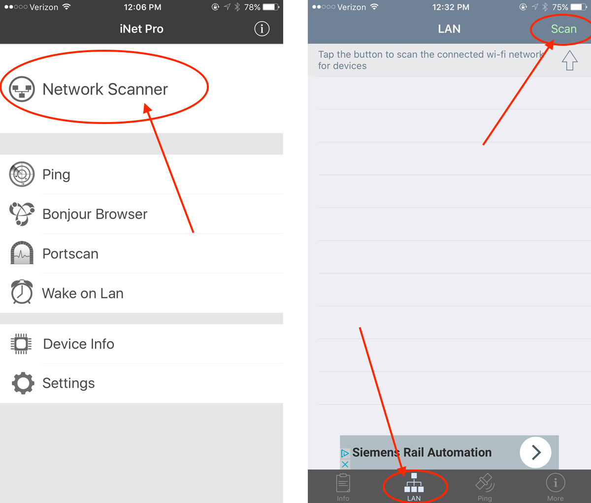
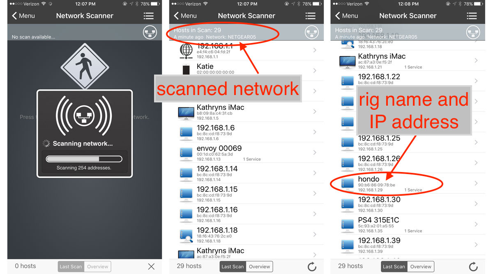
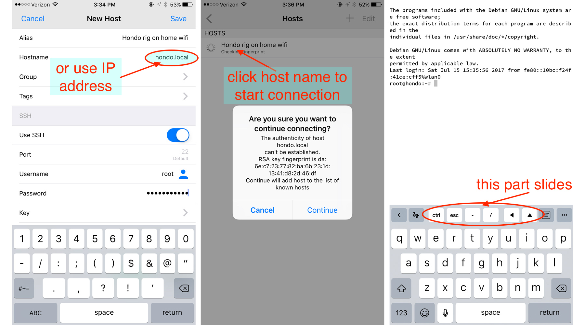
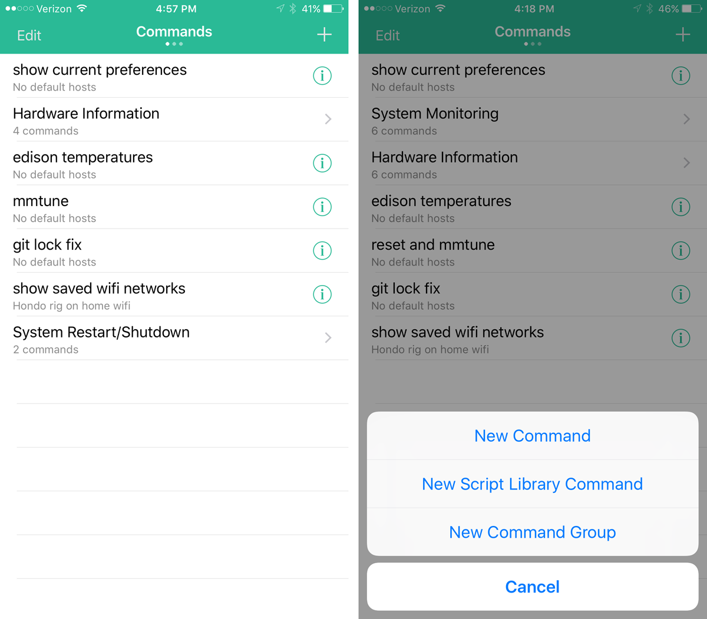
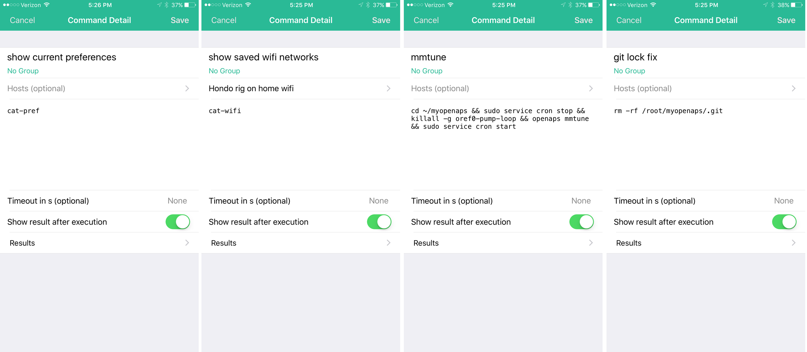
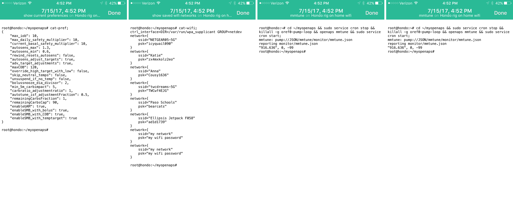
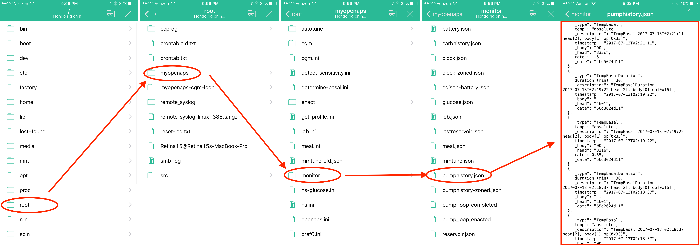

# Helpful Mobile Apps

Beyond just services, such as IFTTT and Papertrail, there are times where your mobile device can provide more access to your rig.  The apps described below can help you login to your rig (both at home and while on the road) to make edits, run commands, troubleshoot, etc.

## IP address of rig

In order to connect to your rig wirelessly, sometimes you'll need it's IP address.  There's several places you can get your rig's IP address if you aren't currently logged in, including:

* Papertrail through doing a search for `network` and reading the rig's private IP address
* Logging into your home router, if rig is on your home network
* using a mobile app on your phone to scan the network for the rig

### iNet or NetAnalyzer (iPhone)

There are many scanning apps for iPhone.  iNet or NetAnalyzer (lite version...don't need to pay for this to work) will scan the network that the phone is using for other connected devices and their IP addresses on that same network.  So, if you run the scan while your phone is on a wifi network, the scan will be for the wifi network and range will likely be `192.168.1.1` to `192.168.1.254`.  If you have your rig connected via mobile hotspot, then the scan will be for devices in the mobile hotspot range of `172.10.20.1` to `172.10.20.20`. (IP address ranges depend on the type of network being scanned.)  Some people have had more success with the NetAnalyzer app over the iNet app, depending on their router settings.

* Open the iNet app and click on the big `NETWORK SCANNER`.  If using NetAnalyzer app, click on the `LAN` button on bottom bar and then `scan` button in top right corner of app.

* The app will begin scanning the network that the phone is currently connected to.  In this example, a home wifi network.  Scan the results for your rig's name.  If you don't see the name, try using the other app.  If you still don't see your rig's name, it's possible that the rig is not actually connected to the network being scanned.  Check the other options (such as papertrail or your home router) to verify whether the rig is actually online with the same network you are scanning.

Now you have your rig's IP address...a valuable piece of information.

If the rig is connected to your iPhone's hotspot, the scan will be performed for the mobile hotspot range.  You can always re-do a scan by clicking on the little circle arrow in the bottom left of the iNet screen, or the `scan` button on the top right of NetAnalyzer app.

## Logging into Rig

There are many apps that will allow you to use an ssh command to login to your rig wirelessly.  These apps make it super convenient to login to your rig while on the go running errands, laying in bed on a Saturday morning, or other situations where you may not want to get to a computer to login to the rig.

**************
**In order to use these apps, your rig and phone must be on the same internet connection**  So if your rig is on your home wifi network, your phone must also be logged on to your home wifi network.  If they are not on the same network, you will get a login error.   
*************

I've tried a few apps, both paid and free, and these have been my favorite two iPhone apps; Termius and SimpleSSH.  Each has its pros/cons, and therefore I pick which app based on what I'd like to do in the rig.

Termius app has a FAR BETTER file editing ability...as in don't even bother trying to edit files (like preferences.json or adding wifi networks) in SimpleSSH.  However, if you want to navigate files on your rig or issue commands that you've preprogrammed, SimpleSSH is better.  So, if you're doing an activity which involves editing files...definitely stick with Termius app.

### Termius app (iPhone)

When you first open the Termius app, it will prompt you to add a new host.  Go ahead and click the `+` button to add a `new host`.  Turn the toggle on for `Use SSH` and then fill out the following information:

* Alias – use an alias name that let’s you know which rig and which connection point this host is for, for example `YourRigName on home wifi`

* Hostname – Enter either `YourRigName.local` or the IP address of the rig

* Username – click to the left of the little blue man and type `root`

* Password – Enter your rig’s root password (default is “edison” but you should have changed it during setup)

Click `Save` in the upper right corner.  You should now see the host you just created.  If you click on that host, you’ll see a message that it is connecting (first time connections will ask if you want to save the rig to known hosts, cick `continue` and then you'll be connected to a terminal app screen.  You can now issue commands and edit files just like you can using Putty or Terminal app on your computer.

**HINT:** In portrait orientation, the middle part of the upper keyboard row can be moved/slid left or right using a fingertip drag.  The arrow navigation keys may need to be dragged to see them all in that row.  Unlock your phone's orientation, turn your iPhone sideways and the keyboard will be more prominently shown.

To end a terminal session, just type `logout`

### SimpleSSH

SimpleSSH has a few more bells and whistles than Termius app.  Namely, you can navigate the folders and files using a touch screen (similar to windows explorer or Mac finder) and you can setup scripts to be run with touch of button (to save yourself typing).  However, SimpleSSH has terrible file editing (`vi` editor will crash and `nano` editor is pretty much unusable).

SimpleSSH is divided into three pages; Commands, Hosts, and Settings & Info.  You can access the different pages by swiping left/right in the app.  To start using the app, you'll need to add your rig as a "host" by clicking on the `+` in the upper right corner of the Hosts page, and then filling out:

 * Name - use a name that let’s you know which rig and which connection point this host is for, for example `YourRigName on home wifi`

 * Host/IP address - Enter either `YourRigName.local` or the IP address of the rig.  Leave the `:22` part unchanged

 * Username - enter `root`

 * Authentication - choose `password` type of authentication and enter your rig's root password.

Click `Save` in the upper right corner.  You should now see the host you just created.  Underneath the host, there are two icons; one with a little `>_` terminal prompt and the other is a folder with magnifying glass.  The first icon is for logging into your rig and using the terminal app (much like the Termius app access provides).  The magnifying glass folder is for navigating your rig's directories and files.  If you click on one of those folders, you’ll see a message that it is connecting (first time connections will ask if you want to save the rig to known hosts, cick `continue` and then you'll be connected.  If you chose the terminal prompt, you'll be sent to the terminal screen.  If you selected the magnifying glass, you'll be dropped in the rig's folders/files.

#### SimpleSSH Commands
One of the best features of SimpleSSH can be found on the Commands page (swipe right on the SimpleSSH home screen to see the Commands page).  You can add scripted commands to this page to give you single-button-press access to common rig interactions...like setting up shortcuts.  There are pre-scripted commands that come with the app...you can see those by pressing the `+` in the upper right corner and then selecting `New Script Library Command`.  You can click on the circled down-arrow to the right of the command name to save it to your commands page.

Some useful/fun commands from the Script Library that I've added to my Commands Page:

**Hardware Information**
* **Show Disk Status** will run `df -h` which shows available memory on your rig.  If you ever have memory errors, this would be a helpful tool to see where your memory has been going.
* **Show Current Version** will run the equivalent of `uname -a` and show which version of the Linux kernel your rig is running.  This can be useful in determining your Jubilinux version.
* **Show USB Devices** will run `lsusb` and can help confirm your dexcom receiver is being properly recognized when plugged in.
* **Show External IP address** will run `ifconfig` and show your rig's wifi (wlan0) IP address or hotspot (bnep0) IP address.

**System Restart/Shutdown**
* **Shutdown** will turn off your rig
* **Reboot** will reboot your rig

But, what I've found particularly useful is making some of my own custom commands.  From your Commands page, press the `+` in the upper right corner and then choose `New Command` and fill out the following:

 * Name - Pick a name that is useful for your command
 
 * Hosts - I recommend leaving this one blank, and instead you'll be prompted which rig (aka host) you'd like to run the command on when you use it.
 
 * Command Script - this is where you'll enter the exact script you'd want to execute (examples below)
 
 * Show Results after execution - toggle this switch `on`

These are some of my favorite Commands:

**Show current preferences** - Sometimes I just want to double check what my preferences.json file has saved to it.  Setting up this command gives me a print out of my preferences.json file with just a single button press.  For this command, simply enter `cat-pref` in the command script body.

**Show known wifi networks** - If I'm headed to a friend's house or traveling, I may want to double check if I have their wifi network already saved to my rig.  This gives me a simple list of the wifi networks I have saved in the rig already, and helps me know if I want to add a new one before I travel.  For this command, simply enter `cat-wifi` in the command script body.  (note: if I actually want to add a wifi network, I would switch to Termius app or login on my computer to add a wifi network...SimpleSSH just isn't a robust editor)

**git lock fix** - Probably the most common error in a rig is the `.git lock` error that happens on occasion and by deleting the .git directory, you can get back to looping quickly.  For this command, enter `rm -rf /root/myopenaps/.git` in the command script body.

**mmtune** - If you want to check how well your pump tune strength is you can use this command script to test it `cd ~/myopenaps && sudo service cron stop && killall -g oref0-pump-loop && openaps mmtune && sudo service cron start`

**Edison temperature** - If you are ever concerned that your rig may be overheating, you can use this command to read if your edison cores are reaching critical temperatures.  For this command, enter `sensors` in the command script body.

If you want to run a particular command, just click on the command & confirm which host (rig) you'd like to run the command on.  Assuming the rig is on the same network (wifi or BT tethered) as the phone, then the results will be displayed.  Below is a few screenshots of some of the custom command outputs:

#### SimpleSSH file navigation

Perhaps a more slightly advanced-user (or curious-user) feature of SimpleSSH is the ability to use the file/directory navigator.  The navigator (accessed using the magnifying glass icon in Hosts page) will allow you to peruse the various directories and files used by your rig and openaps.  If you wanted to see your oref0 code, it is stored in the `root/src/oref0` folder.  Or if you wanted to see your loop directory, you could navigate to your `root/myopenaps` folder.  This can be particularly useful if you are getting troubleshooting help and someone asks "What does your pumphistory.json show?"...you could easily navigate to that file and copy the contents of it.  (Note: For further reading about the file structure of your loop and rig, see [here](http://openaps.readthedocs.io/en/latest/docs/Troubleshooting/General_linux_troubleshooting.html#before-you-get-started)  For example, here's the navigation chain to find your pumphistory.json:

## Nightscout Apps

There are a few useful apps for viewing and maintaining your Nightscout site.

### Nightscout app (iPhone)

This one is pretty self-explanatory.  You can access your Nightscout site by either using the Nightscout app, or by using your NS URL in a mobile browser.

### Glimpse Webpages (Apple Watch)

If you use an Apple watch and want to view your Nightscout site on the watch, give Glimpse Web Pages app a try.

### LePhant for Heroku (iPhone)

Logging into your NS site isn't a frequent need, but sometimes helpful when you need to redeploy your site, restart your dynos, add or change configuration settings, or check NS status.  You can use a browser to login to your Heroku account, but an app can make the process simpler by saving your password and providing an easier viewing screen for mobile device. LePhant app costs about $5 in the iPhone app store, but provides a really slick way to access your Heroku controls.
