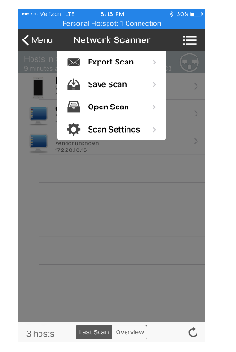
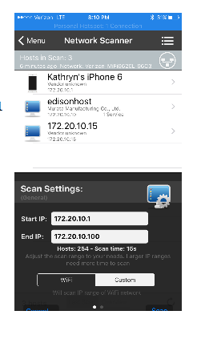
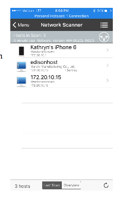
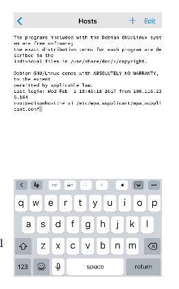
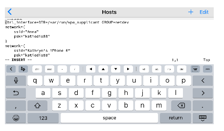

# Helpful Mobile Apps

Beyond just services, such as IFTTT and Papertrail, there are times where your mobile device can provide more access to your rig.  The apps described below can help you login to your rig (both at home and while on the road) to make edits, run commands, troubleshoot, etc.

## IP address of rig

Obtain IP address of rig and check connection status

### iNet (iPhone)

iNet will scan the network that the phone is using for other connected devices and their IP addresses on that same network.  So, if you run the scan while your phone is on a wifi network, the scan will be for the wifi netowrk and range will likely be `192.168.1.1` to `192.168.1.254`.  If you have your rig connected via mobile hotspot, then the scan will be for devices in the mobile hotspot range of `172.10.20.1` to `172.10.20.20`. (IP address ranges depend on the type of network being scanned.)

* Open the iNet app

* Click on the big “NETWORK SCANNER” 


* Click on the three little bars in the upper right, and then choose “Scan Settings” from the drop down list that will appear.



* Edit the Start IP and End IP scan settings to  172.20.10.1 and 172.20.10.20  (devices connected to your iPhone hotspot will be in that range).

* Press the blue/black “Scan” button on the bottom right of the screen (it may be a little hidden because the display gets a little pushed down by the hotspot bar on the top of iPhone).



* The scan results should show a device labeled “edisonhost” (or whatever name you chose for the rig in the setup process.  If you don’t see it quickly, try rescanning.

* Copy down  or screenshot the IP address listed under the device. (in this example, 172.20.10.10) 



Now you have your rig's IP address while it's connected to your mobile hotspot


### NetAnalyzer (iPhone)

## Logging into Rig

There are many apps that will allow you to use an ssh command to login to your rig wirelessly.  These apps make it super convenient to login to your rig while on the go running errands, laying in bed on a Saturday morning, or other situations where you may not want to get to a computer to login to the rig.

**************
**In order to use these apps, your rig and phone must be on the same internet connection**  So if your rig is on your home wifi network, your phone must also be logged on to your home wifi network.  If your rig is on your mobile hotspot, these apps will still work too...just need to set them up for the various connections.  If they are not on the same network, you will get a login error.   
*************


## 4. Set up a connection to the rig on the iPhone

Now we are moving over to the Termius app.  When you first open the app, it will prompt you to add a new host.  Go ahead and click the button to add a new host.  You are going to fill out the following lines:
```
Alias – pick a name that let’s you know this is the rig when it’s hotspotted with your iPhone

Username – click to the left of the little blue man and type “root”

Hostname – Enter the IP address we just got from the iNet app

Password – Enter your rig’s root password (default is “edison” but you likely changed it during setup)
```

Click “Save” in the upper right corner.


Congrats…you should now see the host you just created.  If you click on that host, you’ll see a message that it is connecting and then…


## 5. Edit the list of wifi networks on the rig 

You’re IN!  Congrats!  

**Warning** The instructions below describe how to edit your rig's network settings, which determine whether your rig can connect to your hotspot.  Just in case you might mess up the config and "step on your own air hose", be sure you have a backup method of connecting to your rig (perhaps using Bluetooth, or your laptop and a USB console connection) or a backup rig available.  Be careful when editing wpa_supplicant.conf to copy the syntax exactly, to avoid having it refuse to load the config at all due to a misplaced quote or curly brace or something.

If you are out and about, don't have a backup method of connecting, and this is your only rig, you might want to consider waiting until you get home to change your wpa_supplicant config.

If you're ready to proceed, you’ll want to enter :

`vi /etc/wpa_supplicant/wpa_supplicant.conf`

and that will bring up your network list for the rig:



**HINT:**  Turn your iPhone sideways and the keyboard will show some useful options.  Like those arrow keys to navigate with.

**HINT 2:**  you can also use this host portal to run any other commands (not just adding wifi networks).  This host will work anytime your iPhone and rig are hotspotted together.

* Type “i” to enter INSERT mode.



* Add your new wifi network 

* Press the “esc” key and then type “:wq” to save and quit
(or “:q!” if you panic and don’t want to save the changes)

CONGRATS! You just set up a convenient on-the-go editing tool!


## Nightscout Apps

### Nightscout app (iPhone)

### Glimpse Webpages (iWatch)

### LePhant for Heroku (iPhone)

Logging into your NS site isn't a frequent need, but sometimes helpful when you need to redeploy your site, restart your dynos, add or change configuration settings, or check NS status.  You can use a browser to login to your Heroku account, but an app can make the process simpler by saving your password and providing an easier viewing screen for mobile device. LePhant app costs about $5 in the iPhone app store, but provides a really slick way to access your Heroku controls.
