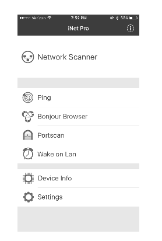
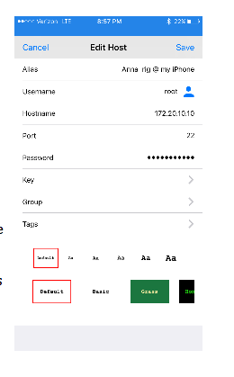
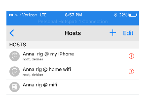

# Helpful Mobile Apps

Beyond just services, such as IFTTT and Papertrail, there are times where your mobile device can provide more access to your rig.  The apps described below can help you login to your rig (both at home and while on the road) to make edits, run commands, troubleshoot, etc.

## IP address of rig

In order to connect to your rig wirelessly, sometimes you'll need it's IP address.  There's several places you can get your rig's IP address if you aren't currently logged in, including:

* Papertrail through doing a search for `network` and reading the rig's private IP address
* Logging into your home router, if rig is on your home network
* using a mobile app on your phone to scan the network for the rig

### iNet or NetAnalyzer (iPhone)

There are many scanning apps for iPhone.  iNet or NetAnalyzer (lite version...don't need to pay for this to work) will scan the network that the phone is using for other connected devices and their IP addresses on that same network.  So, if you run the scan while your phone is on a wifi network, the scan will be for the wifi netowrk and range will likely be `192.168.1.1` to `192.168.1.254`.  If you have your rig connected via mobile hotspot, then the scan will be for devices in the mobile hotspot range of `172.10.20.1` to `172.10.20.20`. (IP address ranges depend on the type of network being scanned.)  Some people have had more success with the NetAnalyzer app over the iNet app, depending on their router settings.

* Open the iNet app and click on the big `NETWORK SCANNER`.  If using NetAnalyzer app, click on the `scan` button in top right corner of app. (screenshots are for iNet)



* The app will begin scanning the network that the phone is currently connected to.  In this example, a home wifi network.  Scan the results for your rig's name.  If you don't see the name, try using the other app.  If you still don't see your rig's name, it's possible that the rig is not actually connected to the network being scanned.  Check the other options (such as papertrail or your home router) to verify whether the rig is actually online with the same network you are scanning.


Now you have your rig's IP address...a valuable piece of information.

If the rig is connected to your iPhone's hotspot, the scan will be performed for the mobile hotspot range.  You can always re-do a scan by clicking on the little circle arrow in the bottom left of the iNet screen, or the `scan` button on the top right of NetAnalyzer app.


## Logging into Rig

There are many apps that will allow you to use an ssh command to login to your rig wirelessly.  These apps make it super convenient to login to your rig while on the go running errands, laying in bed on a Saturday morning, or other situations where you may not want to get to a computer to login to the rig.

**************
**In order to use these apps, your rig and phone must be on the same internet connection**  So if your rig is on your home wifi network, your phone must also be logged on to your home wifi network.  If they are not on the same network, you will get a login error.   
*************

### Termius app

Now we are moving over to the Termius app.  When you first open the app, it will prompt you to add a new host.  Go ahead and click the button to add a new host.  You are going to fill out the following lines:
```
Alias – pick a name that let’s you know this is the rig when it’s hotspotted with your iPhone

Username – click to the left of the little blue man and type “root”

Hostname – Enter the IP address we just got from the iNet app

Password – Enter your rig’s root password (default is “edison” but you likely changed it during setup)
```

Click “Save” in the upper right corner.



Congrats…you should now see the host you just created.  If you click on that host, you’ll see a message that it is connecting and then…



 Edit the list of wifi networks on the rig 

You’re IN!  Congrats!  

**HINT:** In portrait orientation, the middle part of the upper keyboard row can be moved/slid left or right using a fingertip drag.  The arrow navigation keys may need to be dragged to see them all in that row.

**HINT:**  Turn your iPhone sideways and the keyboard will be more prominently shown.

## Nightscout Apps

### Nightscout app (iPhone)

### Glimpse Webpages (iWatch)

### LePhant for Heroku (iPhone)

Logging into your NS site isn't a frequent need, but sometimes helpful when you need to redeploy your site, restart your dynos, add or change configuration settings, or check NS status.  You can use a browser to login to your Heroku account, but an app can make the process simpler by saving your password and providing an easier viewing screen for mobile device. LePhant app costs about $5 in the iPhone app store, but provides a really slick way to access your Heroku controls.
