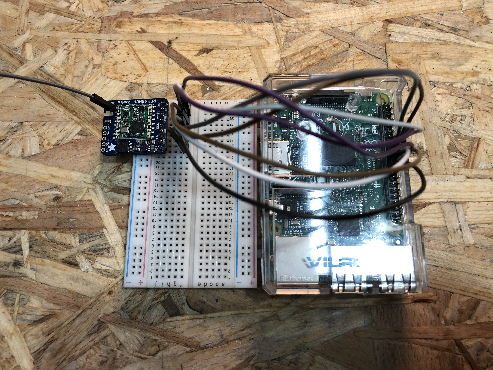
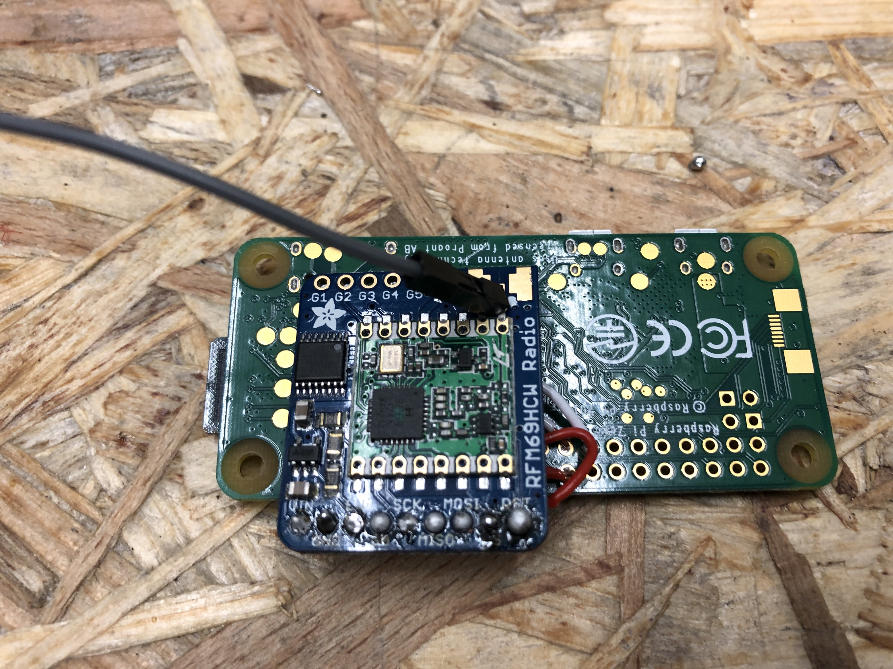
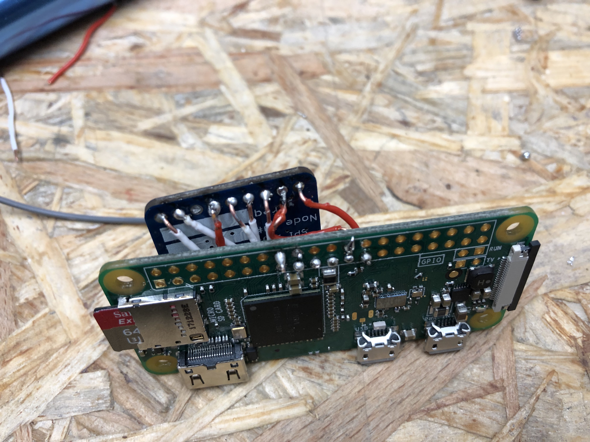
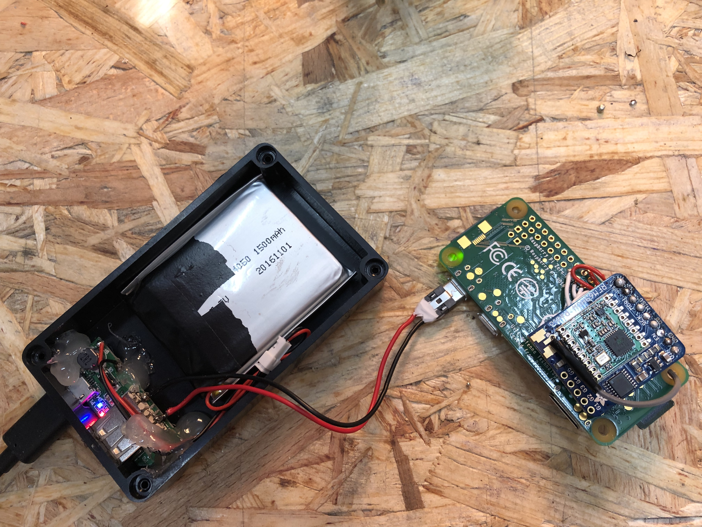
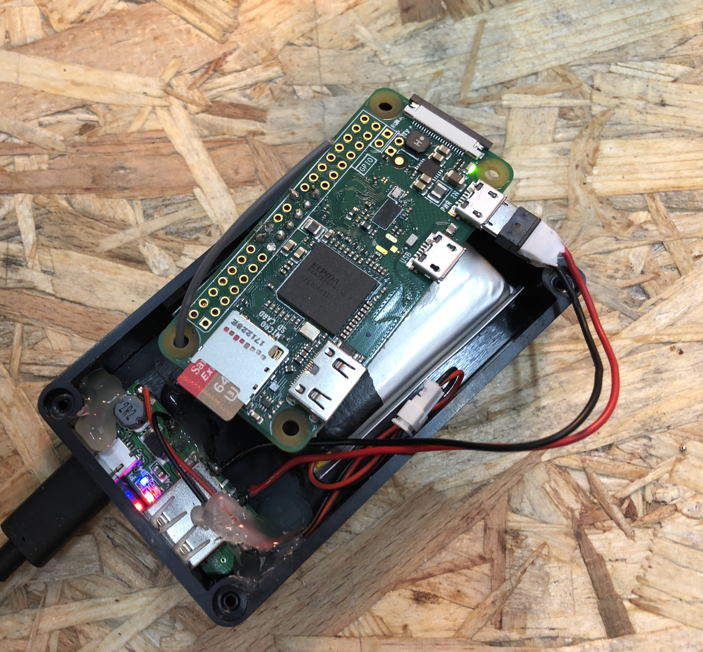
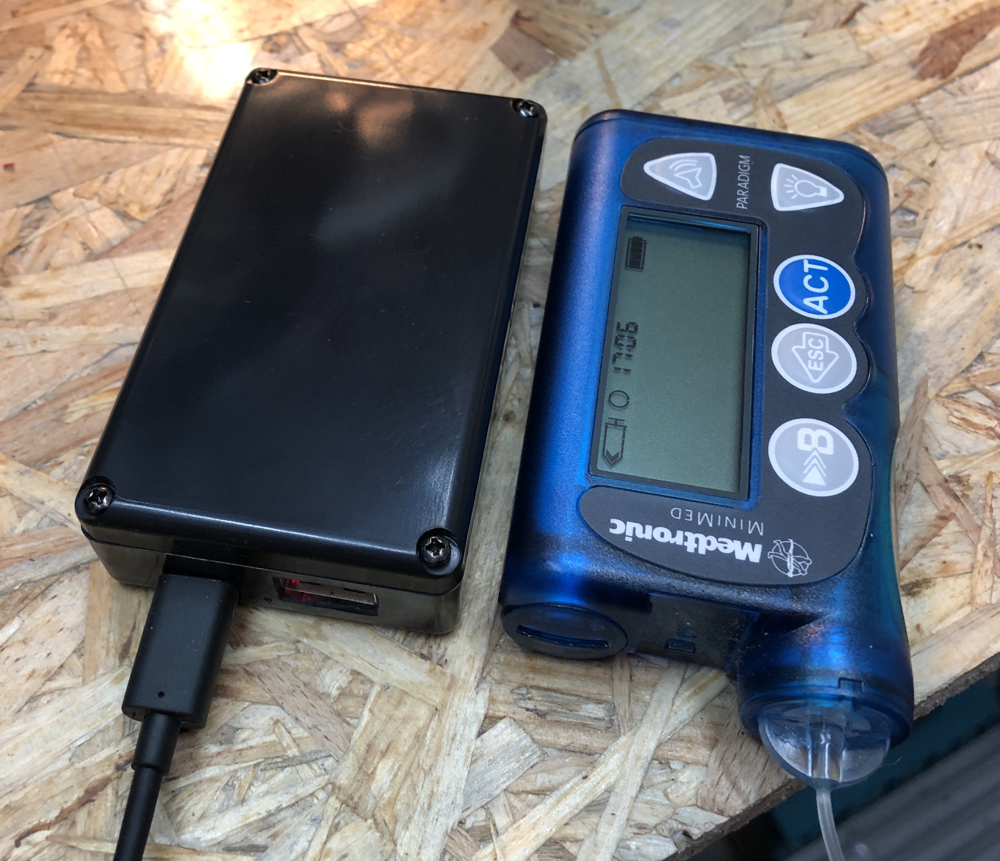
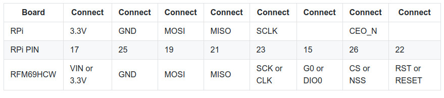

# Get your rig hardware

You have two main options for hardware:

`1.` The most recommended rig has been an Edison + Explorer Board. Unfortunately Intel stopped making the Edison boards as of 2018. If you can find an Intel Edison (eBay, local stores, etc - this is still very possible), this is still a highly recommmended rig. It is the smallest rig (and easily portable), with better battery life because it is power efficient. [See below for the list of hardware for Edison setups](http://openaps.readthedocs.io/en/latest/docs/Gear%20Up/edison.html#hardware-information-for-intel-edison-based-setups).
  
`2.` The other option is a Raspberry Pi-based setup, with the new Explorer HAT. This rig setup makes it easier to see information when offline because it has an onboard screen for displaying readouts. [See below for the list of hardware required for Pi/HAT setups](http://openaps.readthedocs.io/en/latest/docs/Gear%20Up/edison.html#hardware-information-for-pi-based-setups-with-the-explorer-hat).

**Note** - there is an experimental alternative to an Explorer HAT, which can serve as the radio on a Pi-based rig, but will not have the screen, and requires you to solder. See [below](https://openaps.readthedocs.io/en/latest/docs/Gear%20Up/edison.html#hardware-information-for-pi-based-setups-with-rfm69hcw-experimental) for more details on a setup with RFM69HCW. 

****

## Hardware information for Pi-based setups with the Explorer HAT

Summary of what you need for a Pi/HAT rig:
* [Explorer HAT](http://openaps.readthedocs.io/en/latest/docs/Gear%20Up/edison.html#hat)
* [Pi0WH (recommended) or Pi 3](http://openaps.readthedocs.io/en/latest/docs/Gear%20Up/edison.html#pi)
* [Battery](http://openaps.readthedocs.io/en/latest/docs/Gear%20Up/edison.html#battery)
* [SD Card](http://openaps.readthedocs.io/en/latest/docs/Gear%20Up/edison.html#sd-card)

#### HAT: 
As of April 2018, there is be a Pi+HAT rig as an option for closing the loop with OpenAPS. The HAT can be ordered from the same place that makes the Explorer Board ([click here to pre-order](https://enhanced-radio-devices.myshopify.com/products/900mhz-explorer-hat?variant=1950212653065)). We call it the "Explorer HAT", to differentiate from the Explorer "Board" that goes with the Edison (see below).

#### PI 
You also need a Raspberry Pi. Many users are opting for the "Raspberry Pi Zero WH" - with headers - so you don't have to solder, and can simply add the HAT onto the Pi. See this [PiZeroWH from Adafruit](https://www.adafruit.com/product/3708), or [from other sellers around the world](https://www.raspberrypi.org/products/#buy-now-modal)

As an alternative, you can also use the HAT with a Raspberry Pi 3. 

#### Battery
Lipo batteries are typically used to power the rig on the go because they charge quickly and come in a variety of compact sizes.  When choosing a battery, you have a trade-off between a larger battery with longer duration or a smaller battery with shorter duration that is easier to carry around.  A 2000 mah battery is roughly the size of the Raspberry Pi0, and can last around 4 hours.  You'll want a "1S" type, which uses a single cell and outputs at 3.7 VDC.  It needs a JST connector to plug into the Raspberry Pi.  See this [battery from HobbyKing](https://hobbyking.com/en_us/turnigy-2000mah-1s-1c-lipoly-w-2-pin-jst-ph-connector.html?___store=en_us).

If you will need to run longer than that while unplugged from wall power, consider a portable charger.  These are in widespread use for cell phones and commonly available in a large number of sizes.  Here is an example [portable charger from Amazon](https://www.amazon.com/Anker-PowerCore-Ultra-Compact-High-speed-Technology/dp/B0194WDVHI/ref=sr_1_6?ie=UTF8&qid=1532089932&sr=8-6&keywords=backup+battery&dpID=31B5rBNP%252B8L&preST=_SY300_QL70_&dpSrc=srch).  Using a USB to micro-USB adapter you can power the rig from the portable charger by plugging the charger into the Power port, which is the micro-USB port nearest the corner of the Pi0.

**Note**: You will probably want to underclock your Raspberry Pi to get a longer battery life. [See this for details](http://openaps.readthedocs.io/en/latest/docs/Customize-Iterate/usability-considerations.html#improving-the-battery-life-of-your-raspberry-pi).

#### SD card
An 8 GB SD card should provide plenty of space for the linux operating system, OpenAPS code and storage for log files.  The ability to use larger and removable storage is one of the advantages of the Raspberry Pi.  You can get a [MicroSD card and adapter from Adafruit](https://www.adafruit.com/product/2692) when you order your Pi and Hat.  Or you can get an equivalent [8 GB SD card from Amazon](https://www.amazon.com/Kingston-microSDHC-Class-Memory-SDC4/dp/B00200K1TS/ref=sr_1_8?s=wireless&ie=UTF8&qid=1532090813&sr=1-8&keywords=8gb+micro+sd) or other sellers.

#### Note about Pi+HAT cases
Because we are still optimizing the software to be as power-efficient as possible, we have not narrowed down on the best recommended battery.  You may want to use a soft case for ease of access to the components, flexible arrangement and the ability to use a variety of battery sizes.  If you are using the 2000 mah battery above, you can use this [3d printed hard case](https://www.thingiverse.com/thing:3010231) to protect the rig and battery in a relatively compact package.  The [design is built in OnShape](https://cad.onshape.com/documents/74459dfcb527ad12c33660aa/w/2be92a72bb7f1c83eb091de2/e/b4fa9c3be204ffa3dea128a1), which has a free access level subscription for public domain documents.  You can make a copy and tweak the design to your liking.

*** 

## Hardware information for Pi-based setups with RFM69HCW (experimental)

The Pi + RFM69HCW is still experimental!

If you are a maker person or a bit into soldering electronics at least, you may also build your rig with a piece of hardware, that is a lot cheaper than the Explorer HAT, although it does **not** have the screen. You also won't have LEDs indicating status, no battery charging and there will not be (m)any 3d printable case models. If it's your only option because you're on a budget and can't afford to spend 150 bucks on a rig, please think about this step twice. This one will cost you only 30, but a lot of extra time.

    
 <b>
Click here to expand and see pictures of a rig with a Pi0WH and RFM69HCW:</b>:

 

Here's a rough-and-ready budget version of a rig put together: contents of a 2000mAh powerbank, a plastic housing, a micro USB cable and some more soldering and hot glue. BE AWARE that this case will most likely overheat the Pi after a while. You need to at least drill some venting holes into the lid. 

### Summary of what you need: 
* Raspberry Pi Zero 
* RFM69HCW 
* [microSD Card]((http://openaps.readthedocs.io/en/latest/docs/Gear%20Up/edison.html#sd-card))
* Bread board
* Jumper wires
* Soldering iron
* Power source via Micro USB

### The Raspberry Pi Zero

For this setup, you want a Raspberry Pi Zero WH. (The "H" means it has Header pins). (Also, a regular Raspberry Pi 3 model B works fine.)

### RFM69HCW
You can buy this board e.g. [here](https://www.adafruit.com/product/3070), but you can really buy it wherever you want. These boards are, like the RPi Zero, very common. Just make sure you get the right frequency. 868/915 MHz is correct. All others are wrong. 

### Breadboard
Any breadboard will do, no special requirements.

### Soldering
You need to solder the pin stripe into the RFM69HCW. Insert the pin stripe from the bottom of the board, with the short endings reaching through the holes. Fixate a bit, so you can rest the soldering iron tip on the pins and the board. 

Solder the included pin stripe diligently into the 9 holes named 
VIN GND EN G0 SCK MISO MOSI CS RST

Cut an antenna at your preferred length corresponding to your frequency. This can be a simple piece of isolated, unshielded wire. (I simply took one of the jumper wires for my first try.)
Calculate your length here: https://m0ukd.com/calculators/quarter-wave-ground-plane-antenna-calculator/ and just use the value from A (first green box). This should be the length of your antenna, from the soldering point on the board to the tip.

Solder it to the board. It's the hole near the "o" from Radio. Make sure to not connect the soldering to the ground plates left and right from the hole. This antenna is really only connected to the one hole.

This is your connection scheme for the RPi to RFM69HCW. Stick the RFM69HCW on a bread board, and connect:

Board | Connect | Connect | Connect | Connect | Connect | Connect | Connect | Connect
------|------|------|------|------|------|------|------|------
RPi	| 3.3V	| GND	| MOSI | MISO | SCLK	| | CEO_N	|| 
RPi PIN	| 17	| 25	| 19	| 21	| 23	| 16	| 24	| 18
RFM69HCW	| VIN or 3.3V	| GND	| MOSI	| MISO	| SCK or CLK	| G0 or DIO0	| CS or NSS	| RST or RESET

[Here is a copy of a a sophisticated schematic](https://easyeda.com/editor#id=4128da76dc1644c9a1cf6fd53ec1885f|003da073fac94f058c872b643d1d9e22). (Press "miniloop v1.0" to see the diagram).

After that, you're ready to install OpenAPS. 

***

## Hardware information for Intel Edison-based setups

The high level parts list (see below for more details, and links):

* [Explorer Board Block](http://openaps.readthedocs.io/en/latest/docs/Gear%20Up/edison.html#explorer-block)
* [Edison](http://openaps.readthedocs.io/en/latest/docs/Gear%20Up/edison.html#edison)
* [Nuts and Bolts to attach the Edison to the Explorer Board Block](http://openaps.readthedocs.io/en/latest/docs/Gear%20Up/edison.html#nuts-and-bolts)
* [At least one Lithium battery](http://openaps.readthedocs.io/en/latest/docs/Gear%20Up/edison.html#lithium-ion-polymer-lipo-battery-or-other-battery-supply)
* [2 USB cables](http://openaps.readthedocs.io/en/latest/docs/Gear%20Up/edison.html#usb-cables)

### Explorer Board Block

The recommended board to use is the [Explorer Board Block](https://enhanced-radio-devices.myshopify.com/products/900mhz-explorer-block-pre-order), which was co-designed by this community. It also has the benefits of a built-in radio. It's only available from Hamshield/Enhanced Radio Devices.

### Edison 

There are 4 types of Edison's. All of them work, but Versions 3 and 4 require an extra antenna, so 1 and 2 are preferred (1-EDI2.LPON, 2-EDI2.SPON, 3-EDI2.LPOF, and 4-EDI2.SPOF).  If the seller does not specify the Edison model/version, you can see from the picture whether or not it has a white ceramic antenna in the corner.  If it does not, then it will require an external antenna, but that version is fairly rare.

* Option 1 - Buy it from places like Ebay, Craiglist, or your nearest store  - and follow the instructions to flash it.  

  * You may need to hunt for an Edison as supplies of them are dwindling - if you get it as part of a "kit" (i.e. breakoutboard + Edison), keep in mind _you'll still need to get the Explorer Board Block from Hamshield_.

  * **Note:** If you are doing Option 1 (an Edison from wherever you can find it) - you are getting an UNFLASHED Edison. Not a big deal - flashing it with jubilinux is just a few more steps (~15 minutes) - but remember you'll need to start with the flashing instructions. Follow the steps for flashing on (a) [all-computers page](http://openaps.readthedocs.io/en/latest/docs/Resources/Edison-Flashing/all-computers-flash.html) (with the most comprehensive [troubleshooting section](http://openaps.readthedocs.io/en/latest/docs/Resources/Edison-Flashing/all-computers-flash.html#troubleshooting)); b) the [Mac-specific flashing page](http://openaps.readthedocs.io/en/latest/docs/Resources/Edison-Flashing/mac-flash.html); or c) the [Windows-specific flashing page](http://openaps.readthedocs.io/en/latest/docs/Resources/Edison-Flashing/PC-flash.html)), but stop before installing wifi and other steps and instead jump over to the "[Install OpenAPS](http://openaps.readthedocs.io/en/latest/docs/Build%20Your%20Rig/OpenAPS-install.html)" page from there. 

* Option 2 - (previously [buy an Edison that is already flashed with jublinux when supplies were available](https://enhanced-radio-devices.myshopify.com/products/intel-edison-w-jubilinux). If you get a pre-flashed Edison, you can start [installing and setup OpenAPS](http://openaps.readthedocs.io/en/latest/docs/Build%20Your%20Rig/OpenAPS-install.html). (You would not need to "flash" the Edison). 

### Lithium-ion polymer (LiPo) battery or other battery supply

The Explorer Boards have battery charger circuitry on board, making it easy to use a LiPo battery. 

* The example setup uses a [2000mah LiPo battery](http://www.robotshop.com/en/37v-2000mah-5c-lipo-battery.html); also [Lithium Ion Battery - 3.7v 2000mAh](https://www.adafruit.com/products/2011) or [Adafruit Battery Packs Lithium Ion Battery 3.7v 2000mAh](https://www.amazon.com/Battery-Packs-Lithium-3-7v-2000mAh/dp/B0137ITW46) are similar options, although many people prefer a higher capacity battery to get a full day from the rig (such as [Adafruit Lithium Ion Polymer Battery - 3.7v 2500mAh (PRODUCT ID: 328) and the Adafruit Lithium Ion Cylindrical Battery - 3.7v 2200mAh (PRODUCT ID: 1781)](https://www.adafruit.com/category/574)). This battery uses a 2mm 2 pin JST connector to match the Explorer boards' power plugs. 
* For people in the UK, you may find you have to shop around to find the correct battery, as shipping restrictions appears to have reduced the supply somewhat. [Pimoroni](https://shop.pimoroni.com/products/lipo-battery-pack) appear to stock the same Adafruit 2000mAh battery as mentioned above. Another source looks to be [Cool Components](https://www.coolcomponents.co.uk/en/lithium-polymer-battery-2000mah.html), but you may find shipping costs expensive. CAUTION: [RS Online](https://uk.rs-online.com/mobile/p/lithium-rechargeable-battery-packs/1251266/) sell a similar battery, but unfortunately it comes with the wrong JST connector (it comes with a 2.5mm JST XHP-2, and you need a 2mm JST PH). It is possible, however, to buy the [right connectors](https://www.technobotsonline.com/jst-ph-2mm-2-way-housing-excludes-female-pins.html) and fit them yourself (numerous 'how to' videos on YouTube).
* For people in Australia you can find 2000mAh, 2200mAh and 2500mAh batteries from [Little bird electronics](https://www.littlebirdelectronics.com.au/batteries/), prices are very competitive and shipping is quick. These are the same Adafruit batteries that can be obtained from the US above.

**Note**: It's best to buy from a reputable supplier, because if the internal two cells are mismatched the Explorer board cannot charge them separately and they are prone to catching fire. Make sure that it *includes a protection circuit* to protect over-discharge. **NEVER** connect the battery to an Explorer board the wrong way round. There is no manufacturing standard so never assume correct polarity. The connector JP1 on the Explorer Block has two terminals. The left side is positive, the right side is negative. The side with the JP1 label is the positive side. Typically a battery's red wire is the positive wire.  Ideally you want a battery that has a 10k ohm thermistor for temperature protection by the Edison too.

You can also use any charger with a USB plug, including a wall power charger. The Explorer boards have pass through charging, so this is also how you will charge the LiPo battery.

#### Battery safety

You should monitor the rig periodically - **especially the LiPo battery**, checking for swelling or damage. Immediately discontinue use of any battery that shows sign of swelling or damage.

### Radio stick (only if not using Explorer board)

We recommend an Explorer Board with a built-in radio ([see above](http://openaps.readthedocs.io/en/latest/docs/Gear%20Up/edison.html#explorer-block)), because if you get an Explorer Board, you don't need an additional radio stick or CC-Debugger. 

If you don't use an Explorer board, you can use a number of radio sticks: a [TI-USB-Sticks](http://www.ti.com/tool/cc1111emk868-915), running [subg_rfspy](https://github.com/ps2/subg_rfspy); [Wireless Things ERF](https://www.wirelessthings.net/erf-0-1-pin-spaced-radio-module); [Wireless Things Slice of Radio](https://www.wirelessthings.net/slice-of-radio-wireless-rf-transciever-for-the-raspberry-pi) a Slice of Radio; or a Rileylink. For details about setup with these other stick and board options, [the best instructions will be found in the mmeowlink wiki](https://github.com/oskarpearson/mmeowlink/wiki) for setting up your board and stick. Note you may also need a CC debugger for these, and also note that it will be more work as the documentation is designed for the Edison/Explorer Board setup as the easiest path forward. 

### USB Cables

You will need two micro USB cables - with a micro connector on one end and a standard (Type A) connector on the other. Most cables will work fine, but some prefer to select lengths. You may already have one for charging a Dexcom receiver, or an Android phone, lying around at home. If you don't, here's an example of one that will work: [Monoprice Premium USB to Micro USB Charge, Sync Cable - 3ft](http://www.monoprice.com/Product?c_id=103&cp_id=10303&cs_id=1030307&p_id=9763&seq=1&format=2).

Warning: bad cables cause a lot of headaches during the Edison flashing process, so it may be worth verifying before you start if you have good cables that can transfer data.

### Optional: Micro USB to Micro USB OTG Cable for offline looping

You may want to connect your Dexcom receiver (G4 or non-touchscreen G5) to your Explorer Block for offline looping.  For this you will need to use a micro USB to micro USB OTG cable (or an OTG adapter). Here is an example of a cable that will work: [BestGameSetups Micro USB to Micro USB OTG (On-The-Go) 12" (30cm) Data Cable](https://www.amazon.com/dp/B00TQOEST0/ref=cm_sw_r_cp_api_Niqfzb3B4RJJW).

### Nuts and Bolts

You will likely want to screw your Edison onto the Explorer Block to stabilize the rig. There are two methods to do this.  The simplest is to order a kit like the [Sparkfun Intel Edison Hardware Pack](https://www.sparkfun.com/products/13187), which provides standoffs, screws, and nuts specifically designed for the Edison. Alternatively, you can use (2) M2 screws and (2) M2 nuts and (4)  M3 nuts (M3 or a bit larger to used as spacers).  In this configuration, the screws should be just long enough to fit through the spacer nuts and screw into the M2 nuts on the other side. (Note: Sparkfun is no longer selling these screw kits. There are some available on Amazon [lock nuts](https://www.amazon.com/Uxcell-a15072100ux0228-Plated-Nylock-Insert/dp/B015A3BZJQ) and [cap screws](https://www.amazon.com/iExcell-Stainless-Steel-Socket-Screws/dp/B07FLLGW19).

### Cases

You can use a variety of cases, either soft or hard. Make sure to check the case design to make sure it will support your preferred rig setup and battery size/type. Also, be careful with inserting your rig into some 3D-printed cases so you do not harm the board and/or the battery.

### Soft Cases 
* [TallyGear soft case](http://www.tallygear.com/index.php?route=product/category&path=120) - these are the soft cases Dana uses ([see this example](https://twitter.com/danamlewis/status/792782116140388353)). The OpenAPS-sized case can be made any any pattern/fabric she uses elsewhere on the site.
* [JD Burrows SD card case](https://www.officeworks.com.au/shop/officeworks/p/j-burrows-sd-and-usb-case-blue-jbsdcasbu) - this is a hard / soft case which fits the rig with a 2500mAh battery perfectly, can also fit a spare AAA pump battery (Australia)

### Hard cases 

**Warning: be careful if you select a hard case. Some may be designed for a certain size/shape battery; and attempting to jam a rig in may harm the board and/or the battery.**

Also: a hard case may make you less likely to look at your rig directly. You should monitor the rig periodically - **especially the battery**, checking for swelling or damage. Immediately discontinue use of any battery that shows sign of swelling or damage.

Generic hard cases:

* [RadioShack Project Enclosure (3x2x1 inch)](https://www.radioshack.com/products/radioshack-project-enclosure-3x2x1?utm_medium=cpc&utm_source=googlepla&variant=20332262405&gclid=Cj0KEQiA-MPCBRCZ0q23tPGm6_8BEiQAgw_bAkpDZCXfIgbEw8bq76VHtV5mLwR2kHKfJrsGsF3uqqgaAtxP8P8HAQ) 
* [Small clear plastic case perfect for larger Sparkfun 2000 mAh battery: #8483](http://www.ebay.com/itm/272062812611)
* [Small Plastic Clear Case for 2500 mAh battery](http://www.ebay.com/itm/272062812611) - Since a Tic-Tac box is too small for the 2500 mAh battery.

Cases for Edison plus battery:

* [Ken Stack's 3D design for a case with the battery next to the board](https://github.com/Perceptus/explorer_board_case) 
* [Rob Kresha's design with the battery compartment stacked on-top of the board compartment](http://www.thingiverse.com/thing:2020161)
* [Gustavo's 3D design](https://github.com/Perceptus/explorer_board_case_2)
* [Sulka Haro's 3D design](https://www.tinkercad.com/things/4a6VffpcuNt)
* [tazitoo's 3D design: CAD](https://www.tinkercad.com/things/aRYGnHXt7Ta-explorer-case/editv2) ([or STL for 3D printing](http://www.thingiverse.com/thing:2106917))
* [danimaniac's Protective Cases & Accessories](https://github.com/danimaniac/OpenAPS-Explorer-Board-Edison-vented-case)
* [Luis's ventilated acrylic simple design](https://drive.google.com/drive/folders/0BxeFg9yJZ_FZdWJEcG5KMXdUMjg?usp=sharing)
* [Robert Silvers and Eric Burt's case for Explorer and 2500 mAh battery](http://www.thingiverse.com/thing:2282398)
* [Robert Silvers' case for Explorer and 2000 or 2500 mAh battery](http://www.thingiverse.com/thing:2291125)
* [tynbendad's case for 18650 battery](https://www.thingiverse.com/thing:2798858)

Cases for Edison plus G4 receiver:

* [jimrandomh's 3D printed design for Edison and a G4 receiver together](http://conceptspacecartography.com/my-openaps-g4-case/)

### Other non-case protection options

* [Heat Shrink Tubing](https://www.amazon.com/gp/product/B009IILEVY)  
