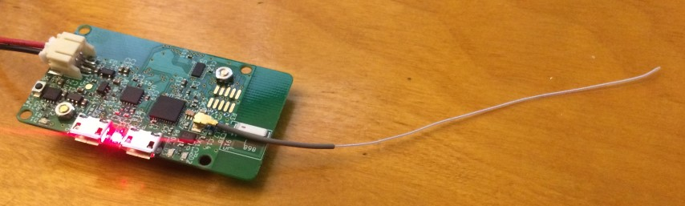

# Hardware information for Intel Edison-based setups

Note: The Edison/Explorer Board combination is the rig setup recommended by the community for size, range, and portability reasons. The high level parts list (see below for more details, and links):

* Explorer Board
* Edison (which you can now order pre-flashed with jubilinux)
* Nuts and Bolts to attach the Edison to the Explorer Board
* At least one Lithium battery
* 2 USB cables

## Edison 

[Intel Edison Compute Module](http://www.intel.com/content/www/us/en/do-it-yourself/edison.html)

* Option A (**RECOMMENDED - this will save you several hours**): [Buy an Edison that is already flashed with jublinux - see here](https://enhanced-radio-devices.myshopify.com/products/intel-edison-w-jubilinux). You can order it from the same manufacturer that makes the Explorer Boards (see below). You'll be able to skip the flashing steps and [start by logging in as root](http://openaps.readthedocs.io/en/latest/docs/walkthrough/phase-0/setup-edison.html#initial-edison-setup) to set up your wifi & otherwise set up OpenAPS from there. 
  * If it is "out of stock", you can sign up to get notifications for when they're back in stock. Even if they're out of stock at the moment, we recommend waiting a few days to get a pre-flashed Edison.  If you get impatient and try to buy an Edison elsewhere and flash it yourself, you'll probably end up frustrated with the process, and may end up wasting more time asking someone to walk you through the process on Gitter than it would've taken to just wait for the next batch of pre-flashed Edisons.

* Option B (**NOT RECOMMENDED** unless you've previously flashed jubilinux and are comfortable doing so again): Get it out of the box from [Amazon](http://www.amazon.com/gp/product/B00PTVSVI8?dpID=51yqQB46DIL&dpSrc=sims&preST=_SL500_SR135%2C135_&refRID=6AE996400627CC0KPY52&ref_=pd_rhf_se_s_cp_2), Adafruit, Sparkfun or your nearest provider - and follow the instructions to flash it. Be aware that there are four versions: 1-EDI2.LPON, 2-EDI2.SPON, 3-EDI2.LPOF, and 4-EDI2.SPOF. Option 1 claims lower power consumption, and if so would be better for a portable rig.  Option 2 is the more common version, with theoretically higher consumption because of the additional power dedicated to wifi. If you purchase a development kit, this is the version you will get. Versions 3 and 4 require an external antenna.  To date no one has done any side-by-side testing of power consumption between the LPON and SPON Edison versions, so it is unclear how much difference (if any) the model number would make to power consumption in real-world conditions with an OpenAPS rig. So, get whichever one is cheapest or you decide you want.

The different model numbers or variants of the Intel Edison Compute Module do not appear to be documented on Intel's website or at many of the online retailers. However, the different variants can be seen in the product listings at [Mouser](http://www.mouser.com/Embedded-Solutions/Computing/_/N-aez39?Keyword=intel+edison) and [Arrow](https://www.arrow.com/en/products/search?q=intel%20edison&filters=Manufacturer_name:Intel;).

It appears as though the main differences pertain to onboard vs. external antenna and low power vs. high power wireless radio options. The low power radio variant is classified by Intel as "Wearable". According to some discussion on the Intel message boards (see [here](https://communities.intel.com/thread/81519) and [here](https://communities.intel.com/message/251806#251806)) the "Wearable" variant limits the wireless radio power to "keep the thermal properties at a lower level". Some users have noted that their Edison modules get very hot at times. Although the discussions referenced above suggest that using the low power "Wearable" variant may help avoid heat issues, the different Edison models have not been tested side-by-side in an OpenAPS configuration to determine whether or not any one model would use lower power, generate less heat, or have better wireless performance compared to the other models.

## Lithium-ion polymer (LiPo) battery or other battery supply

Use a LiPo battery because the Explorer Board has battery charger circuitry on board for these batteries. The example setup uses a [2000mah LiPo battery](http://www.robotshop.com/en/37v-2000mah-5c-lipo-battery.html). This battery lasts approximately 16+ hours, though you could get more or less time. This battery uses a 2mm 2 pin JST connector to match the Explorer Board power plug. It's best to buy from a reputable supplier, because if the internal two cells are mismatched the Explorer board cannot charge them seperately and they are prone to catching fire. Make sure that it *includes a protection circuit* to protect over-discharge. **NEVER** connect the battery to the Edison base board the wrong way round. There is no manufacturing standard so never assume correct polarity. The connector JP1 on the Explorer board has two terminals. The left side is positive, the right side is negative. The side with the JP1 label is the positive side. Typically a battery's red wire is the positive wire.  Ideally you want a battery that has a 10k ohm thermistor for temperature protection by the Edison too.

You can use any charger with a USB plug, including a wall power charger. The Explorer Board has pass through charging, so this is also how you will charge the LiPo battery.

The following link is to a LiPo battery that is currently most commonly being used with the Explorer board rigs: [Lithium Ion Battery - 3.7v 2000mAh](https://www.adafruit.com/products/2011). (If it is out of stock on Adafruit, it can be purchased from various sellers on Amazon here: [Adafruit Battery Packs Lithium Ion Battery 3.7v 2000mAh](https://www.amazon.com/Battery-Packs-Lithium-3-7v-2000mAh/dp/B0137ITW46).)

Alternative, but common, higher capacity batteries include the Adafruit Lithium Ion Polymer Battery - 3.7v 2500mAh (PRODUCT ID: 328) and the Adafruit Lithium Ion Cylindrical Battery - 3.7v 2200mAh (PRODUCT ID: 1781). They can be viewed here: [POWER / LIION & LIPOLY / BATTERIES](https://www.adafruit.com/category/574) and comparables can be easily located with an Internet search.

For people in the UK, you may find you have to shop around to find the correct battery, as shipping restrictions appears to have reduced the supply somewhat. [Pimoroni](https://shop.pimoroni.com/products/lipo-battery-pack) appear to stock the same Adafruit 2000mAh battery as mentioned above. Another source looks to be [Cool Components](https://www.coolcomponents.co.uk/en/lithium-polymer-battery-2000mah.html), but you may find shipping costs expensive. CAUTION: [RS Online](https://uk.rs-online.com/mobile/p/lithium-rechargeable-battery-packs/1251266/) sell a similar battery, but unfortunately it comes with the wrong JST connector (it comes with a 2.5mm JST XHP-2, and you need a 2mm JST PH). It is possible, however, to buy the [right connectors](https://www.technobotsonline.com/jst-ph-2mm-2-way-housing-excludes-female-pins.html) and fit them yourself (numerous 'how to' videos on YouTube).

## Explorer Board or another base board 

You can use just about any base board, including the Intel base board or the Sparkfun base board, both of which are commonly sold with the Edison as a kit. However, the recommended board to use is the [Explorer Board](https://enhanced-radio-devices.myshopify.com/products/900mhz-explorer-block-pre-order), which was co-designed by this community. It is going to be the main board supported by the docs moving forward. It also has the benefits of a built-in radio. Use the link above to find/purchase an Explorer board.

### Explorer Board antenna tuning (optional)

The antenna on the Explorer board is a strip of copper underneath the green outer coating. The antenna is labeled A1. It will have its maximum power at 868 MHz. The antenna has a line across it at one point with a label that says "915". The antenna defaults to the 868 MHz range, which is what WW pumps use. If you have a US pump, mmtune will run and tune to something near 916MHz. Even with the 868 MHz antenna, you should get half a dozen feet or more of range on average.  If you (optionally) want to boost the range of your antenna by a couple more feet, then you cut through the outer coating and the copper on that line with an X-ACTO knife. A single clean cut is sufficient, but if the cut doesn't look clean you could make two cuts and then dig out the circumscribed piece and then reseal the copper with nail polish. With that cut, the antenna will have maximum power near 915 MHz.

If you're unsure whether you need to cut your Explorer Board's antenna, you probably don't.  And if you decide you need slightly more range after using the Edison+Explorer rig for a few weeks, you can always come back later and do so then.

Optional: You can also add an external antenna to the Explorer board such [as this](http://www.mouser.com/Search/ProductDetail.aspx?R=66089-0930virtualkey65480000virtualkey620-66089-0930) from mouser.com. (Note: specific range improvement length has not been confirmed.)

## Radio stick (only if not using Explorer Board)

We recommend the Explorer Board with a built-in radio (see above), because if you get an Explorer Board, you don't need an additional radio stick or CC-Debugger. 

If you don't use the Explorer Board, you can use a number of radio sticks: a [TI-USB-Sticks](http://www.ti.com/tool/cc1111emk868-915), running [subg_rfspy](https://github.com/ps2/subg_rfspy); [Wireless Things ERF](https://www.wirelessthings.net/erf-0-1-pin-spaced-radio-module); [Wireless Things Slice of Radio](https://www.wirelessthings.net/slice-of-radio-wireless-rf-transciever-for-the-raspberry-pi) a Slice of Radio; or a Rileylink. For details about setup with these other stick and board options, [the best instructions will be found in the mmeowlink wiki](https://github.com/oskarpearson/mmeowlink/wiki) for setting up your board and stick. Note you may also need a CC debugger for these. Then, come back to Phase 1 of the docs once you complete that.

## USB Cables

You will need two micro USB cables - with a micro connector on one end and a standard (Type A) connector on the other. Most cables will work fine, but some prefer to select lengths. You may already have one for charging a Dexcom receiver, or an Android phone, lying around at home. If you don't, here's an example of one that will work: [Monoprice Premium USB to Micro USB Charge, Sync Cable - 3ft](http://www.monoprice.com/Product?c_id=103&cp_id=10303&cs_id=1030307&p_id=9763&seq=1&format=2).

Warning: bad cables cause a lot of headaches during the Edison flashing process, so it may be worth verifying before you start if you have good cables that can transfer data.

## Micro USB to Micro USB OTG Cable

You may need to connect your Dexcom Receiver to your Explorer Board for offline looping.  For this you will need to use a micro USB to micro USB OTG cable (or an OTG adapter). Here is an example of a cable that will work: [BestGameSetups Micro USB to Micro USB OTG (On-The-Go) 12" (30cm) Data Cable](https://www.amazon.com/dp/B00TQOEST0/ref=cm_sw_r_cp_api_Niqfzb3B4RJJW).

## Nuts and Bolts

You will likely want to attach your Edison to the Explorer Board to stabilize the rig. You can order a kit, or use (2) M2 screws and (6) M2 nuts (four used as spacers). Here's an example of a hardware pack with screws and nuts that will work: [Sparkfun Intel Edison Hardware Pack](https://www.sparkfun.com/products/13187).

## Cases

There are a few 3D-printed cases that are being designed, so check back here for more links in the future. A few options that we know will work with an Explorer Board/Edison rig and a standard 2000 mAh battery (as well as some 2500 mAh options):

### Hard cases 
* [RadioShack Project Enclosure (3x2x1 inch)](https://www.radioshack.com/products/radioshack-project-enclosure-3x2x1?utm_medium=cpc&utm_source=googlepla&variant=20332262405&gclid=Cj0KEQiA-MPCBRCZ0q23tPGm6_8BEiQAgw_bAkpDZCXfIgbEw8bq76VHtV5mLwR2kHKfJrsGsF3uqqgaAtxP8P8HAQ) 
* [Ken Stack's 3D design for a case with the battery next to the board](https://github.com/Perceptus/explorer_board_case) 
* [Rob Kresha's design with the battery compartment stacked on-top of the board compartment](http://www.thingiverse.com/thing:2020161)
* [Gustavo's 3D design](https://github.com/Perceptus/explorer_board_case_2)
* [Sulka Haro's 3D design](https://www.tinkercad.com/things/4a6VffpcuNt)
* [tazitoo's 3D design: CAD](https://www.tinkercad.com/things/aRYGnHXt7Ta-explorer-case/editv2) ([or STL for 3D printing](http://www.thingiverse.com/thing:2106917))
* [danimaniac's Protective Cases & Accessories](https://github.com/danimaniac/OpenAPS-Explorer-Board-Edison-vented-case)
* [Luis's ventilated acrylic simple design](https://drive.google.com/drive/folders/0BxeFg9yJZ_FZdWJEcG5KMXdUMjg?usp=sharing)
* [Small clear plastic case perfect for larger Sparkfun 2000 mAh battery: #8483](http://www.ebay.com/itm/272062812611)
* [Robert Silvers and Eric Burt's case for Explorer and 2500 mAh battery](http://www.thingiverse.com/thing:2282398)
* [Robert Silvers' case for Explorer and 2000 or 2500 mAh battery](http://www.thingiverse.com/thing:2291125)
* [Small Plastic Clear Case for 2500 mAh battery](http://www.ebay.com/itm/272062812611) - Since a Tic-Tac box is too small for the 2500 mAh battery.

### Soft Cases 
* [TallyGear soft case](http://www.tallygear.com/index.php?route=product/category&path=120) - these are the soft cases Dana uses ([see this example](https://twitter.com/danamlewis/status/792782116140388353)). The OpenAPS-sized case can be made any any pattern/fabric she uses elsewhere on the site.

## Other Options

* [Heat Shrink Tubing](https://www.amazon.com/gp/product/B009IILEVY)  
