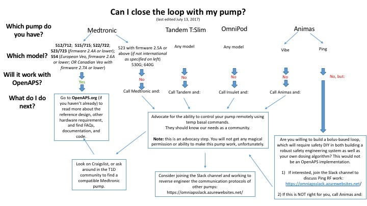

# Information about compatible insulin pumps

As you can see from the flowchart above, most of the commercial pumps currently available are not compatible with OpenAPS; only a small selection of older Medtronic pumps are compatible.  For those pumps which are not compatible, we suggest the advocacy option of calling the pump manufacturer and informing them of the need for availability of pumps for DIY closed looping systems.  Thus far, there has not been a receptive pump company to these requests.  Omnipod, Animas, T-Slim, and newer Medtronic pumps are still not compatible.

Currently, only the following Medtronic MiniMed models allow us to remotely set temporary basal rate commands, which is required to do OpenAPS:

    512/712 (all firmware)
    515/715 (all firmware)
    522/722 (all firmware)
    523/723 (with firmware 2.4A or lower)
    554/754 (European Veo, with firmware 2.6A or lower; OR Canadian Veo with firmware 2.7A or lower)

NOTE: For European/WorldWide users who have access to a `DANA*R` insulin pump, you may be able to use AndroidAPS, which leverages OpenAPS's oref0 algorithm but allows you to interface using an Android phone and Bluetooth to communicate directly with the `DANA*R` pump. [See here for instructions and details related to AndroidAPS](https://github.com/MilosKozak/AndroidAPS).

## How to check pump firmware (check for absence of PC Connect)

The firmware version will briefly display after the initial count-up on a new battery insertion.  After the pump has been on for a while, you can check the firmware version by using the Esc button on the pump and scroll all the way to the bottom of the screen messages using the down arrow on pump. 

A double-check for pump compatibility is to look for the ABSENCE of PC connect in the pump menu.  Press the ACT button, scroll down to the "Utilities" menu.
* If there is a "Connect Devices" menu look for a "PC Connect" option. 
  * This is the case for the 523/723 and 554/754 models.
  * If "PC Connect" is present, then the pump will NOT work for looping. 
  * If "PC Connect" is absent, then the pump should be able to receive temp basal commands and be compatible.
 * If there is no "Connect Devices" menu, then the pump should be able to receive temp basal commands and be compatible.
   * This is the case for the 512/712, the 515/715 and 522/722 models. 
   * For 512/712 pumps, certain commands like Read Settings, BG Targets and certain Read Basal Profile are not available, and require creating special files for the missing info to successfully run the loop ([Instructions for 512/712 users, click here](http://openaps.readthedocs.io/en/latest/docs/Build%20Your%20Rig/x12-users.html)). 512/712 users are not going to be able to use an advanced feature - (e)SMB - but will be able to do basic looping.

Note that not _all_ possible sellers of pumps will accuratly describe the model number: if they are willing to sell a pump they may not have interest in setting it up for looping, and the distinctions about model numbers and firmware version may not be important to them. It will be for you though! Therefore, it's prudent to verify the model by seeing pctures and/or videos of the pump in action. 

If you have one of the above mentioned pumps, but it has buttons that do not work, use the instructions found on this [Imgur photo album](http://imgur.com/a/iOXAP) to repair your pump.  This repair is quite straight-forward and easy.

## Why do I need a certain pump firmware?

Due to changes in the firmware, the openaps tools are only able to function in-full on the above pump models. Security features were added after firmware v2.4 in the US that prevent making some remote adjustments via the decoded communications OpenAPS uses. 

If you are not based in the US, some later model pumps and firmware may be compatible as listed above. Check for PC Connect absence to determine compatibility.

## Can I downgrade my pump firmware?

One of the most frequently asked questions is "I have a 723 pump but it has version 2.5B software version.  Has anyone figured out a way to make newer model Medronic pumps compatible?  Like flash older version of software onto my 723 2.5B pump?"  The answer is "No.  The ability to downgrade software versions in the pumps does not exist.  It has been investigated and nobody has made any successful progress to that end."

## Tips for finding a compatible pump

If you need to acquire a compatible pump, check CraigsList, ask around local or pay-it-forward Facebook groups, or talk to friends in your local community to see if there are any old pumps lying around in their closets gathering dust. [SearchTempest](http://www.searchtempest.com) is a great tool for searching Craigslist nationally all at once. In addition to searching for listings, consider posting an offer to Craigslist or ask around local community groups.

If you're buying a pump online, we recommend you ask the seller to confirm the firmware version of the pump. (You may also want to consider asking for a video of the pump with working functionality before purchasing.)

## Word of warning: Pump repairs rendering pumps useless for looping

If you need to send your pump away to Medtronic for repair, be aware that during the repair process the firmware will get upgraded. This makes your pump not usable for looping. Ask the community if you run into a pump error - the community has tips for solving several common pump errors.

