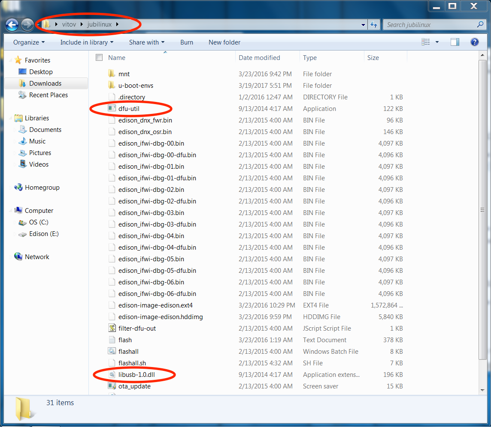
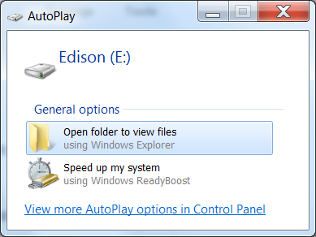
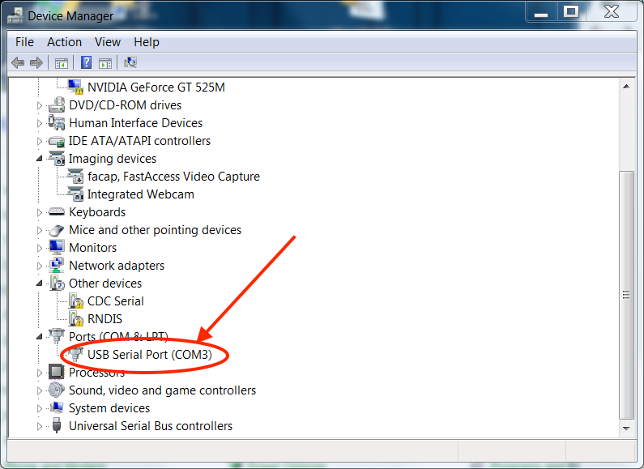
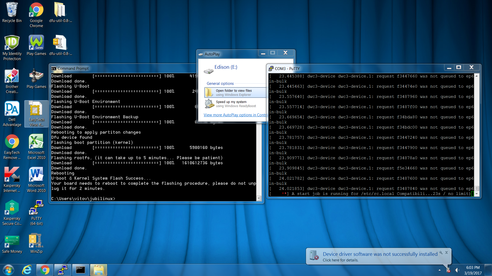
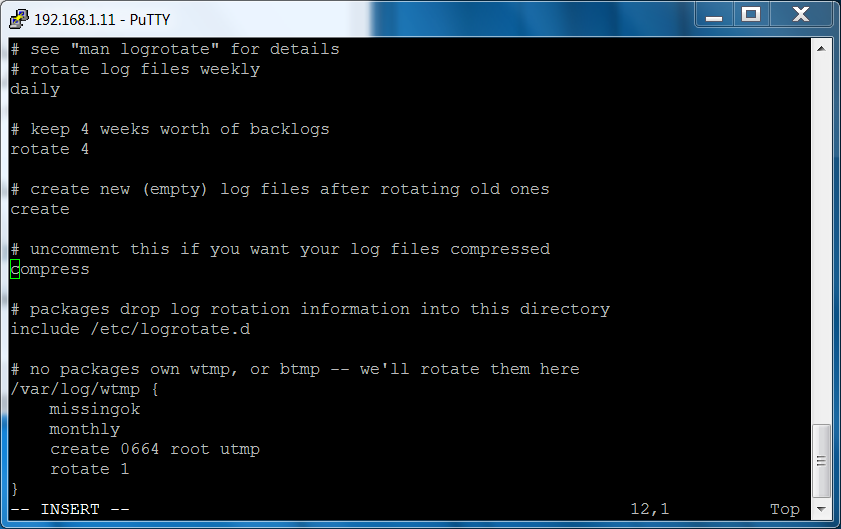
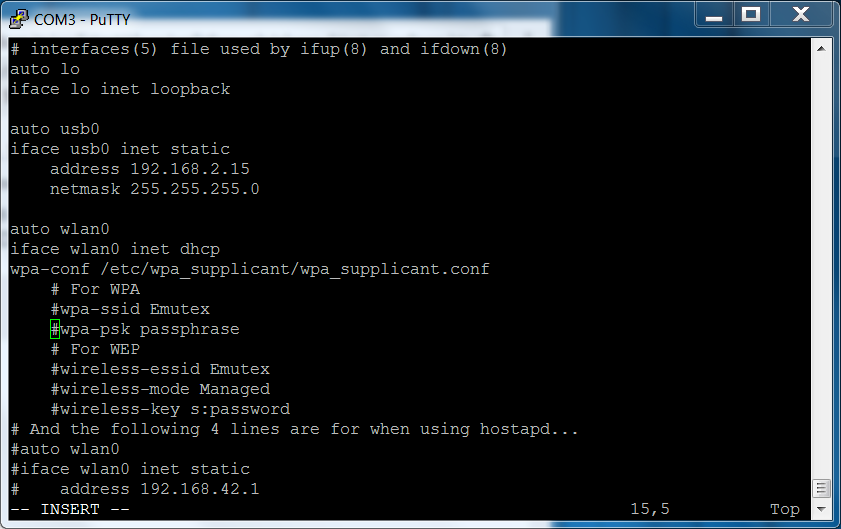

# Setting up Edison/Explorer Board on Windows/PC 

(This is testing a separate workflow for Windows only. Please refer to the [main Edison setup guide](./all-computers-flash.html) as well for troubleshooting & full instructions for other computer setup processes.)

### Hardware Assumptions for this page

1.  Using an Explorer Board and Edison
2.  Using an Windows computer

## Preparing/flashing the Edison

We recommend [buying an Edison that is preinstalled with jubilinux](hardware/edison.md#edison).  If you did that, head back to the [main install instructions to begin installing Wifi and Dependencies](http://openaps.readthedocs.io/en/latest/docs/Build%20Your%20Rig/OpenAPS-install.html#steps-2-3-wifi-and-dependencies).

If you didn't buy your Edison with jubilinux preinstalled, it comes with an operating system, called Yocto, that doesn’t work easily with OpenAPS.  The first step is to replace the operating system with a new one.  This is called “flashing” the Edison.  Both your Windows computer and the Edison board will need some work.

### **1-1 Prepare Windows Computer**

- Install the [Intel Edison drivers for Windows](https://www.intel.com/content/www/us/en/download/19060/26993/intel-edison-configuration-tool.html). Select the "IntelEdisonDriverSetup1.2.1.exe" download. After it is done downloading, click on the downloaded file and it will execute installation. 

Additional drivers required for Windows 10: https://ftdichip.com/wp-content/uploads/2021/02/CDM21228_Setup.zip (see https://ftdichip.com/drivers/ for more detail).

********

- Install [PuTTY]( http://www.chiark.greenend.org.uk/~sgtatham/putty/download.html). PuTTY is the program you will normally use to login to your rig in the future from the computer.  Creating a desktop shortcut for it is a good idea, since you will likely use it often.  Download the installation file that matches your PC's architecture (32-bit or 64-bit).  If you are unsure, you can check your computer's build and memory in the Control Panel.  Example shown is for a 64-bit computer.  If unsure, installing the 32-bit version won't harm anything...it just might be a little slower to use PuTTY.

****************************
#### <b>Side Note regarding computers with less than 6 GB RAM</b>

Windows PCs with less than 6 GB of RAM  may need to have the size of the page file increased to flash the Edison. You can check your RAM as shown in the Control Panel picture above.  If less than 6 GB is showing, then close all unnecessary programs and attempt to flash the device. If the flash operation fails follow these steps to ensure enough swap space is allocated when the computer boots, then restart and try again. Only do this if flashing the device doesn't work without changing these settings.

*Important: Write down the settings in the Virtual Memory window before you make any changes to your system. When you finish the flash process you must return these settings to their original values or Windows may become unstable.*

 - Go to the Control Panel, click All Control Panel Items, then click System. At top left click the Remote Settings link.
 - Select the Advanced tab in the System Properties window, then under Performance click Settings.
 - On the Advanced tab click the Change... button to change the page size.
 - In the Virtual Memory window uncheck "Automatically manage paging file size for all drives," 
 - Click "Custom size," below
   - Set the initial size to 4096 MB
   - Set maximum size to 6144 MB (2048 MB larger thand the initial size)
   (If you have already attempted this process at least once and the flashing still hasn't worked, increase both size settings by 1024 MB and try again.)
 - Click the Set button, then click OK until all windows are closed.
 - Reboot and attempt the flash process.
******************************

#### Download jubilinux and dfu-util

- Download [Jubilinux](http://www.jubilinux.org/dist/) (Instructions below are explicitly for **jubilinux version 0.4.0**; jubilinux 0.3.0 is known to work, but requires additional installation instructions; and jubilinux 0.2.0 runs Debian jessie, which is NOT supported by Debian any longer).  Jubilinux will download in a zipped format to your Downloads folder.  Locate the folder in your Downloads and right-click the `jubilinux-v9+0.4.0.zip` folder.  Select `extract all` from the menu.  Saving it to your root user directory is a good idea.  Your root directory is the set of folders that exist under your User name in Windows.  For example, the destination for saving jubilinux to your root directory would be `C:\Users\yourusername\jubilinux-v0.4.0\`. 

**Note** The `extract all` command comes standard for all Windows machines.  However, in some instances, it may not be active for zipped files. If you do not see the `extract all` option in the right-click menu, right-click the zipped file, choose `Properties` at the bottom of the context menu.  On the General tab, click on the button next to the "opens with" and change it to use Windows Explorer.  Apply the change and select `OK` to save the change.  You should now be able to right-click the jubilinux.zip file to extract all.

- Now we are going to download two files from DFU-UTIL: [libusb-1.0.dll](http://dfu-util.sourceforge.net/releases/dfu-util-0.8-binaries/win32-mingw32/libusb-1.0.dll) and [dfu-util.exe](http://dfu-util.sourceforge.net/releases/dfu-util-0.8-binaries/win32-mingw32/dfu-util.exe). Click on those two links to download the files to your Downloads folder.  Navigate to your Downloads folder and choose to "move" those folders to the jubilinux folder that you unzipped earlier.  When you successfully move those two folders into the jubilinux folder, you should see files/folders inside the jubilinux folder like so:



### **1-2  Prepare Edison**
Now we move to the Edison.  You’ll see two microB USB ports on your explorer board.  One is labeled OTG (that’s for flashing) and one is labeled UART (that’s for logging into the Edison from a computer).  We will need to use both to flash.  We’re going to plug both of those into our computer’s USB ports using the cables listed in the parts list (Dexcom’s charging cable will work too). 

 

Once you plug in the cables, you should see your Edison board pop-up as a connected “device”.  If you don’t…try different cables. 



 - Go to Control Panel\All Control Panel Items\Device Manager\Ports\ and look for USB Serial Port COMXX. If you have multiple and unsure of which is the port you need: Make note of existing ports. Unplug the cable from the Explorer Board. Notice which port disappears. this is the port you are looking for.  If only one shows up, that is your Edison's port.
 

 
  - Open PuTTY, change from SSH to Serial. It normally defaults to COM1 and speed of 9600. Change the COM number to the number you found when you plugged into the Explorer Board. Change the speed (baud rate) to 115200. 
  - Once you've made those changes, Click on OPEN at the bottom of your Putty configuration window.
  
  

 - Once the screen comes up, press enter a few times to wake things up. This will give you a "console" window of what is happening on your Edison. Move that window over to the right side of your screen without resizing it, if you can.  (We are going to open another window later on the left side.)
- Now you will see a login prompt for the Edison on the console screen. Login using the username "root" (all lowercase) and no password. This will have us ready to enter the commands coming up in the next steps later.
  
- Now we are going to open a second window...a "flash" window...using a different program than PuTTY.  Go to your Windows Start menu and search for a program called Command Prompt.  Open Command Prompt and you should be given at a prompt for your User Root directory.  Assuming you saved your jubilinux folder to your user root directory (as described above), enter `cd jubilinux` in the prompt and press return.  If you saved it somewhere else, you will need to navigate to that location.  Move that flash window to the left side of the screen.

Your screens should look like this:

  
  
### **1-3 Flash the Edison**

* In your flash window on the left (command prompt window), enter `flashall.bat`

* You’ll get a prompt that asks you to "plug and reboot" the Edison board.  You’re done with this screen for now.  Just leave it alone (**don’t close window**) and go to next step.

  

* Return to the screen on the right (the PuTTY window) and enter `reboot` 

You will see many, many messages go by on the screens (mostly on the right-side screen).  



After several reboots (don’t panic), you should get a jubilinux login prompt (If you see Yocto instead of jubilinux, then you need to go back to Step 1-2 and start the flash process over again).  Use login `root` and password `edison`.


**CONGRATULATIONS! You just flashed the Edison! Wahoo!** Now, let's keep going. Below are instructions for the easiest route of installing wifi, dependencies, and installing OpenAPS, followed by Advanced installation instructions. Both use automated scripts to help the installation process flow. For additional questions, you may find answers on other pages in the docs.

### **1-3A Re-Flashing the Edison**:

If you are re-flashing an Edison with Jubilinux pre-installed and are requiring a clean installation of Jubilinux, additional steps are required.

* Ensure that your computer has established a serial connection to your rig and both USB cables are plugged into the UART and OTG ports, **turn your rig off**. You can do this by holding the black button on your Explorer Block for a few seconds until the LED light between the two USB ports has turned off.
* **Turn your rig back on** by pressing the black button until the LED light between the two USB ports has turned on. You will see PuTTY begin to show the start-up procedure.
* Repetatively, press any button during the start-up process to **interrupt the sequence** when you see ```Hit any key to stop autoboot: 0``` and before the timer hits ```0```. This will allow you to enter a new environment called ```U-Boot```.

You will see the following: ```U-Boot >```.
Enter the following code:
* ```gpt write mmc 0 $partitions```
* Press ENTER or RETURN on your keyboard.
* Console will display ```Writing GPT: success!```

Return to the Command Prompt (Administrator) and run ```flashall.bat```.

Return to PuTTY and execute the final command: ```reset```

Flashing should start now. You can monitor the status on Command Prompt. A status bar will show you the visual progress. It takes about 10 minutes. There will be multiple reboots. Don’t touch the board, connections, power, or really, with your computer at this time. You will see progress first in Command Prompt, and then when the script completes, the rest of the installation will continue in the PuTTY terminal. **DO NOT** touch the computer. The commands will continue to run on the rig and you will see the progress continue in PuTTY. Eventually, after multiple reboots from the rig, flashing will be completed, and you should see the jubilinux login prompt. If the rig appears to continuously reboot, **unplug the OTG cable** while the USB stays connected to the UART cable.

CONGRATULATIONS! You just flashed the Edison! Wahoo! Now, let's keep going.

*****************************

**NOTES/WARNINGS/DO NOT PANIC:**
*If your chip was named before, if everything went well, it has lost it's previous name at this point. If it prompts you with its previously given name, the flashing has failed.  If that is the case, do repeat the steps above.* 

*Not convinced? Read on:*
*	Your time is valuable. Before moving forward or asking for assistance, it is vital you complete a successful reset and flashing of the Edison chip. OpenAPS is an incredibly reliable and stable machine, when built correctly. If you experience errors in the flash, reflash until the unit is flashed successfully.

Should the rig automatically reboot during flash, you can disable "Watchdog," which *disables the automatic timed reboot for one boot*. If you break /etc/rc.local or otherwise manage to not disable the watchdog timer from Linux, use this command for one boot so you have time to fix things: ```mw.l 0xff009000 0x10f8 1```

 Should you be unable to move forward, *boot the Edison into rescue-mode console*. The following commands boot to a root console, disabling all but the aboluely essential boot sequences commands. Note that htis includes /etc/rc.local, so you will need to disable the watchdog timer as above first.
 ```
 setenv bootargs_target rescue
 boot
 ```
 Repartition U-Boot with the above sequence.
 
 Other errors:

What to look out for: You will observe errors in the Command Promt, such as when the status bar displays: ``` [================= Flashing interrupted, reverting back to normal operation.``` If this be the case, just rerun ```flashall.bat``` in the Command Prompt and the process will start over.

Unsuccessful flashes can be frustrating. Countless hours have been spent developing these scripts. Before continuing or asking for help, start the flash process over. Often times errors resolve themselves on the next attempt.

**From now on, everything is executed on the Edison chip, and in the window showing the serial connection.**

*****************************
### **1-4 Setting Up WiFi connection for Edison chip**

Pre-req: You must have a reliable internet connection at this time, and know the name and password to join the network. 

Check: Before moving forward, you need:
* Correctly flashed Edison
* Network with working internet connection
*	Name and Password to have the Edison join the network. 

1. If you have not already done so, disconnect the USB cable from the OTG port. For those who experience subsequent reboots, you may plug your battery in to the board. This is not neccessary to continue for the majority of users.

2. If you are not already logged into the Edison rig, use the following credentials:
* Username: ```root```
* Password: ```edison```
Please note, these are case sensitive log-ins.

3. When the prompt returns ```root@jubilinux>```, run the below script. Copy the entire text, and paste it into your PuTTY terminal by right clicking on your PuTTY session.

```
#!/bin/bash
(
dmesg -D
echo Scanning for wifi networks:
ifup wlan0
wpa_cli scan
echo -e "\nStrongest networks found:"
wpa_cli scan_res | sort -grk 3 | head | awk -F '\t' '{print $NF}' | uniq
set -e
echo -e /"\nWARNING: this script will back up and remove all of your current wifi configs."
read -p "Press Ctrl-C to cancel, or press Enter to continue:" -r
echo -e "\nNOTE: Spaces in your network name or password are ok. Do not add quotes."
read -p "Enter your network name: " -r
SSID=$REPLY
read -p "Enter your network password: " -r
PSK=$REPLY
cd /etc/network
cp interfaces interfaces.$(date +%s).bak
echo -e "auto lo\niface lo inet loopback\n\nauto usb0\niface usb0 inet static\n  address 10.11.12.13\n  netmask 255.255.255.0\n\nauto wlan0\niface wlan0 inet dhcp\n  wpa-conf /etc/wpa_supplicant/wpa_supplicant.conf" > interfaces
echo -e "\n/etc/network/interfaces:\n"
cat interfaces
cd /etc/wpa_supplicant/
cp wpa_supplicant.conf wpa_supplicant.conf.$(date +%s).bak
echo -e "ctrl_interface=DIR=/var/run/wpa_supplicant GROUP=netdev\nupdate_config=1\nnetwork={\n  ssid=\"$SSID\"\n  psk=\"$PSK\"\n}" > wpa_supplicant.conf
echo -e "\n/etc/wpa_supplicant/wpa_supplicant.conf:\n"
cat wpa_supplicant.conf
echo -e "\nAttempting to bring up wlan0:\n"
ifdown wlan0; ifup wlan0
sleep 10
echo -ne "\nWifi SSID: "; iwgetid 
)
```

* Follow the prompts to set up a WiFi connection.
* When asked, enter network name and password to join network.

To verify you have internet connection, run ```ifconfig``` to verify you are displaying two Internet Protocol (IP) addressess: a local IP of 127.0.0.1 and wlan0 IP. Examples of wlan0 IPs may be 192.168.44.1, or 10.0.0.9. Regardless of what these numbers are, they will be assigned to by your router.

*****************************

### **1-5 Installing OpenAPS**

1. Run ```apt-get update``` twice.
* Enter ```apt-get update```, hit ENTER key. Wait until the prompt returns.
* Enter ```apt-get update```, hit ENTER key. Wait until the prompt returns.

2. Copy and paste the following command:
```curl https://raw.githubusercontent.com/openaps/oref0/master/bin/openaps-install.sh > /tmp/openaps-install.sh && bash /tmp/openaps-install.sh```

3. Press ENTER key to run command.

If the prompt runs successfully, you will see the following:

```
Press Enter to run oref0-setup with the current release (master branch) of oref0,
or press ctrl-c to cancel.
```

In that case, Hooray! BUT: **Press CTRL+C on your keyboard to cancel.**

You can now skip ahead to **1-6 Switch to Dev Branch, and running oref0 setup script**

*****************************

**If script crashes at any point, run the following commands sequentially:**

4. ```dpkg --configure -a```
5. ```apt --fix-broken install```

6. Then re-run:
```curl https://raw.githubusercontent.com/openaps/oref0/master/bin/openaps-install.sh > /tmp/openaps-install.sh && bash /tmp/openaps-install.sh```

You may need to repeat steps 4-6 several times until you receive the success prompt. ***If you repeatedly receive errors, see Advanced Installation Method in section 2-1***

In the next step, we will be **switching from MASTER Branch to DEV Branch** (or Developer Branch).** Master branch is currently deprecated, due to some underlying software dependencies outside of OpenAPS. Dev is currently (January 2021 more likely to install properly). 

*****************************

### **1-6 Switch to Dev Branch, and running oref0 setup script**

1.	To switch to the DEV Branch, run: ```cd ~/src/oref0 && git checkout dev && git pull```
2.	To install oref0: ```~/src/oref0/bin/oref0-setup.sh```. Follow the setup script as prompted.
3. If script completes successfully (Hooray!), you will see the following:

```Remove existing crontab y/[N]``` Press ```y```.
```Would you like to remove your existing crontab first? y/[N]``` Press	```y```. 

***Congratulations!*** **You have successfully installed OpenAPS on your rig.** 

Hang in there -- we're not done quite yet. 

Type ```reboot```. Upon reboot, you will be asked to enter your old password, and a new one for security reasons. Write down your password. You'll need it to log back in, in the future.

*****************************

**IF SOMETHING GOES NOT QUITE RIGHT**
If the setup script crashes, several errors may occur -- the most common is before a kernel panic, or simply, system crash, the rig will then restart. It is important to scroll back up in PuTTY's history and identify where the error occurred. For example, the most common crashes appear at ```GO``` (a software from Google that will fetch (or retreive) files from GitHub). Further, the following commands will resolve any Github or GoLang errors:

* ```rm -rf ~/go/src/*```
* ```rm -rf ~/go/bin/*```

The syntax of the command is ```rm``` (remove) ```-rf``` (remove folder) ```~/go/src/*``` or ```~/go/bin/*``` (what directory and files. The asterisk represents all files).

Any files removed will be reinstalled during the next setup script rerun (referring to 1-6.2). 

For example, if the last file was ```~/go/src/somefilename.py```, you would use the command ```rm -rf ~/go/src/*``` to delete all files in the src folder. Regardless, it would be a good idea to remove both the ```bin``` and ```src``` folders together to prevent any future issues.

--
Another example of a crash is when you receive a ```bash_profile``` error. This indicates that there was an error in the coding compiler, Python. If this error occurs, it may seem you have not correctly switched to the Dev Branch or have installed a previous version of Jubilinux. Now's a good time to verify from your downloads folder that you've installed version 0.4.0. If you are currently on Dev branch, a quick fix can resolve your issue. Run the following:
```vi ~/.bash_profile``` 
You have two options, add ```#``` (also called a comment) in front of the line with normal text, or just delete the line in entirety. It will be pretty obvious as the rest is written in machine language (symbols and such). To edit, first press ```i``` to insert a change, add the comment, or delete the line of text, then press ```ESC``` on the keyboard, followed by ```:wq```, and the ENTER key.

Follow this by running ```pip install parsedatetime==2.5``` before rerunning steps listed in 1-6.1 and 1-6.2.

--
Should you receive a message similar to 

```
Configuration file '/etc/securetty'
 ==> Modified (by you or by a script) since installation.
 ==> Package distributor has shipped an updated version.
   What would you like to do about it ?  Your options are:
    Y or I  : install the package maintainer's version
    N or O  : keep your currently-installed version
      D     : show the differences between the versions
      Z     : start a shell to examine the situation
 The default action is to keep your current version.
*** securetty (Y/I/N/O/D/Z) [default=N] ? --N
```
Type ```--N```

*****************************

### **1-7 Setting up Bluetooth and pairing your Android device.**

After you've changed your password, and you're logged into the rig, the next two steps are important to do so quickly and sequentially:
```
service cron stop
pkill -f oref0-pump-loop
```
You will not see any confirmations, just a new entry line. These commands stop cron (a script that essentially tells the system what to do), and pauses any remaining commands.

To enter the bluetooth control environment, run the following commands, given a second or two in between.

```bluetoothctl```

Followed by:
```
power off

power on

discoverable on

scan on

agent on

default-agent
```
The system will start scanning for available bluetooth devices. It is important to **turn your phone's WiFi off**. Go into your settings, and open **Mobile Hotspot and Tethering** and **turn Bluetooth tethering on**. Not all cell phone carriers have this feature enabled. You may have to contact them and pay for tethering service. Bluetooth allows you to monitor your glucose and rig status outside of your house. Please refer to other documents in this website for further detail. 

To quickly identify which ```MAC address``` is associated with your phone, go into your phone's settings, About phone, Status Information, and look for your ```Bluetooth address```. It may appear as ```DC:DC:E2:89:17:1A```. It is important you remember this MAC address when pairing.

Once the rig identifies your phone, run the following commands:
```
pair DC:DC:E2:89:17:1A (as example)
trust DC:DC:E2:89:17:1A (as example)
```

It will ask to ```Confirm passkey (yes or no)```; subsequently on your phone, you should receive a pairing notification. Press ```yes``` on your phone, and type ```yes``` on the rig, followed by the ENTER key.

Type ```quit``` to exit Bluetooth control, followed by:
```sudo bt-pan client DC:DC:E2:89:17:1A``` (replace DC:DC:E2:89:17:1A with your MAC address)

If you receive the following script, it's OK; it simply means your phone tethering is not on, yet.
```
Traceback (most recent call last):
  File "/usr/bin/bt-pan", line 228, in <module>
    if __name__ == '__main__': sys.exit(main())
  File "/usr/bin/bt-pan", line 196, in main
    try: iface = net.Connect(opts.uuid)
  File "/usr/lib/python2.7/dist-packages/dbus/proxies.py", line 145, in __call__
    **keywords)
  File "/usr/lib/python2.7/dist-packages/dbus/connection.py", line 651, in call_blocking
    message, timeout)
dbus.exceptions.DBusException: org.bluez.Error.Failed: Input/output error
```

Continue with:
```
sudo service cron start

iwconfig wlan0 txpower off

reboot
```
At this point, bluetooth should be connected after the rig boots up. Run ```ifconfig``` to check for new IP address.
Finish by turning WiFi back on: ```iwconfig wlan0 txpower auto```

```Reboot```

***Congratulations!*** **You are ready to start looping.**

Remember to set your prefences and adjust your settings: ```edit-pref```


*****************************
### 2. Advanced Installation Method
*****************************

### **2-1  Oref0 Installation: Line-by-Line.**

**1-8.1** Initiating WiFi
1. Copy and paste the following script in its entirety:
```
#!/bin/bash
(
dmesg -D
echo Scanning for wifi networks:
ifup wlan0
wpa_cli scan
echo -e "\nStrongest networks found:"
wpa_cli scan_res | sort -grk 3 | head | awk -F '\t' '{print $NF}' | uniq
set -e
echo -e /"\nWARNING: this script will back up and remove all of your current wifi configs."
read -p "Press Ctrl-C to cancel, or press Enter to continue:" -r
echo -e "\nNOTE: Spaces in your network name or password are ok. Do not add quotes."
read -p "Enter your network name: " -r
SSID=$REPLY
read -p "Enter your network password: " -r
PSK=$REPLY
cd /etc/network
cp interfaces interfaces.$(date +%s).bak
echo -e "auto lo\niface lo inet loopback\n\nauto usb0\niface usb0 inet static\n  address 10.11.12.13\n  netmask 255.255.255.0\n\nauto wlan0\niface wlan0 inet dhcp\n  wpa-conf /etc/wpa_supplicant/wpa_supplicant.conf" > interfaces
echo -e "\n/etc/network/interfaces:\n"
cat interfaces
cd /etc/wpa_supplicant/
cp wpa_supplicant.conf wpa_supplicant.conf.$(date +%s).bak
echo -e "ctrl_interface=DIR=/var/run/wpa_supplicant GROUP=netdev\nupdate_config=1\nnetwork={\n  ssid=\"$SSID\"\n  psk=\"$PSK\"\n}" > wpa_supplicant.conf
echo -e "\n/etc/wpa_supplicant/wpa_supplicant.conf:\n"
cat wpa_supplicant.conf
echo -e "\nAttempting to bring up wlan0:\n"
ifdown wlan0; ifup wlan0
sleep 10
echo -ne "\nWifi SSID: "; iwgetid -r
)
```

Run ```ifconfig``` to verify you have connectivity. If this fails, please refer to **section 2-3**.

*****************************

**2-2 Install packages, ssh keys, and other settings**
```
apt update

apt update

apt –y dist-upgrade
```

If apt -y dist-upgrade fails, which it may, run the following two commands in sequence:
```dpkg --configure -a```
```apt --fix-broken install```
... and run ```apt -y dist-upgrade``` again.
This may take several attempts.

Once ```dist-upgrade``` has been completed successfully, continue to run the following:
```apt –y autoremove```

Next we install some packages. It is possible that some of these packages may fail in installation. It is important all of these install successfully. If any of the below fail, you will need to run ```dpkg --configure -a``` and ```apt --fix-broken install```. You can attempt to install all packages at once, or one by one. The format is as follows:
apt install -y (package name) space (package name)... and so on. Below is the code for a single attempt.
```
apt install -y sudo strace tcpdump screen acpid vim python-pip locate ntpdate gir1.2-packagekitglib-1.0 iso-codes libblas-common libblas3 libgfortran3 libgstreamer1.0-0 liblapack3 libpackagekit-glib2-18 libpolkit-agent-1-0 libpolkit-backend-1-0 libpolkit-gobject-1-0 libsensors4 lm-sensors packagekit packagekit-tools policykit-1 python-apt-common python-numpy python3-apt python3-dbus python3-gi python3-pycurl python3-software-properties software-properties-common unattended-upgrades watchdog jq libjq1 libonig4 nodejs
```
Followed by:
```adduser edison sudo```
```adduser edison dialout```
```dpkg-reconfigure tzdata``` (this will reconfigure your time zone if you have not already done so).

Next, we correct the ```logrotate.conf``` file.
`vi /etc/logrotate.conf` and change the log rotation to `daily` from `weekly` and enable log compression by removing the hash on the #compress line, to reduce the probability of running out of disk space. Press ```i``` to edit. Once you are finished, press ESC key, and type ```:wq``` to write and quit the file.



At this point, we should have prepped the rig to not crash when running the setup script. 
```curl https://raw.githubusercontent.com/openaps/oref0/master/bin/openaps-install.sh > /tmp/openaps-install.sh && bash /tmp/openaps-install.sh```

Press ENTER key to run command.

If the prompt runs successfully, you will see the following:

```
Press Enter to run oref0-setup with the current release (master branch) of oref0,
or press ctrl-c to cancel.
```

In that case, Hooray! BUT: **Press CTRL+C on your keyboard to cancel.**

You can now revert to **1-6 Switch to Dev Branch, and running oref0 setup script**

In the next step, we will be **switching from MASTER Branch to DEV Branch** (or Developer Branch).** Master branch is currently deprecated, due to some underlying software dependencies outside of OpenAPS. Dev is currently (January 2021 more likely to install properly).

---

**If script crashes at any point, run the following commands sequentially:**

```dpkg --configure -a```
```apt --fix-broken install```

Then re-run:
```curl https://raw.githubusercontent.com/openaps/oref0/master/bin/openaps-install.sh > /tmp/openaps-install.sh && bash /tmp/openaps-install.sh```

When completed, move to section 1-6.

*****************************

### **2-3  Set up Wifi**

Enter `vi /etc/network/interfaces`

Type “i” to enter INSERT mode for editing on the file.

**HELPFUL TIP**:  If you are new to insert mode, realize that it inserts characters at the highlighted cursor (it does not overwrite the character showing beneath the cursor).  And, the default is that the cursor will be at the top left of the screen to start, so you will need to use the arrow keys to move the cursor to the area where you want to start typing.  If you freak out that you’ve made a change that you don’t want to commit...you can simply press the ESC key and then type (no quotes) “:q!” to quit without saving any of your typing/changes.

* Uncomment 'auto wlan0' (remove the `#` at the beginning of the line)
* Edit the next two lines to read:
```
auto wlan0
iface wlan0 inet dhcp
    wpa-conf /etc/wpa_supplicant/wpa_supplicant.conf
```
Comment out or delete the wpa-ssid and wpa-psk lines.

After editing, your file should look like:

```
# interfaces(5) file used by ifup(8) and ifdown(8)
auto lo
iface lo inet loopback

auto usb0
iface usb0 inet static
    address 192.168.2.15
    netmask 255.255.255.0

auto wlan0
iface wlan0 inet dhcp
    wpa-conf /etc/wpa_supplicant/wpa_supplicant.conf
```



Press Esc and then type ':wq' and press Enter to write the file and quit

Enter `vi /etc/wpa_supplicant/wpa_supplicant.conf`

Type 'i' to get into INSERT mode and add the following to the end, once for each network you want to add.  Be sure to include the quotes around the network name and password.

```
network={
    ssid="my network"
    psk="my wifi password"
}
```

If you want to add open networks to your list, then add:

```
network={
        key_mgmt=NONE
        priority=-999
}
```

If you have a hidden wifi network add the line `scan_ssid=1`.

Some wifi networks require you to accept a terms and conditions prior to allowing access.  For example, Starbucks coffee shops and many hotels.  These networks are termed "captive" networks and connecting your rig to them is currently not an option.

Other wifi networks may require you to enter a login name and password at an initial screen before allowing access (such as many school district wifi networks).  Some users have success in using the following wpa network settings for those types of networks:

```
network={
   scan_ssid=1
   ssid="network name"
   password="wifi password"
   identity="wifi username"
   key_mgmt=WPA-EAP
   pairwise=CCMP TKIP
   group=CCMP TKIP WEP104 WEP40
   eap=TTLS PEAP TLS
   priority=1
}
```

Press Esc and then type ':wq' and press Enter to write the file and quit.

### **2-3.1  Test internet connection**

`reboot` to apply the wifi changes and (hopefully) get online

After rebooting, log back in and type `iwgetid -r` to make sure you successfully connected to wifi.

Run `ifconfig wlan0` to determine the IP address of the wireless interface, in case you need it to SSH below. Alternatively, if you know how to login to your router, you can also see the Edison's IP address there.


Leave the serial window open in case you can't get in via SSH and need to fix your wifi config.
 
If you need more details on setting up wpa_supplicant.conf, see one of these guides:

* [http://weworkweplay.com/play/automatically-connect-a-raspberry-pi-to-a-wifi-network/](http://weworkweplay.com/play/automatically-connect-a-raspberry-pi-to-a-wifi-network/)
* [http://www.geeked.info/raspberry-pi-add-multiple-wifi-access-points/](http://www.geeked.info/raspberry-pi-add-multiple-wifi-access-points/)
* [http://raspberrypi.stackexchange.com/questions/11631/how-to-setup-multiple-wifi-networks](http://raspberrypi.stackexchange.com/questions/11631/how-to-setup-multiple-wifi-networks)
* [http://www.cs.upc.edu/lclsi/Manuales/wireless/files/wpa_supplicant.conf](http://www.cs.upc.edu/lclsi/Manuales/wireless/files/wpa_supplicant.conf)
