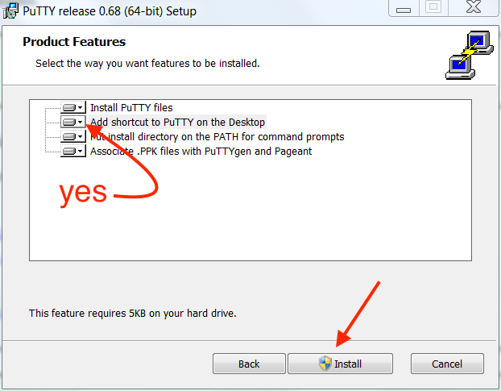
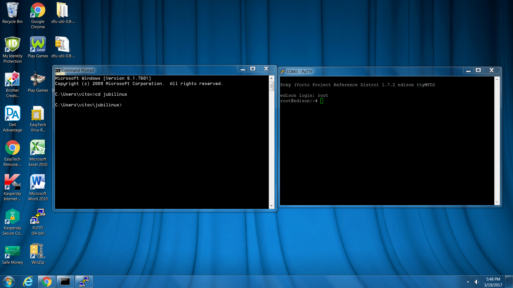
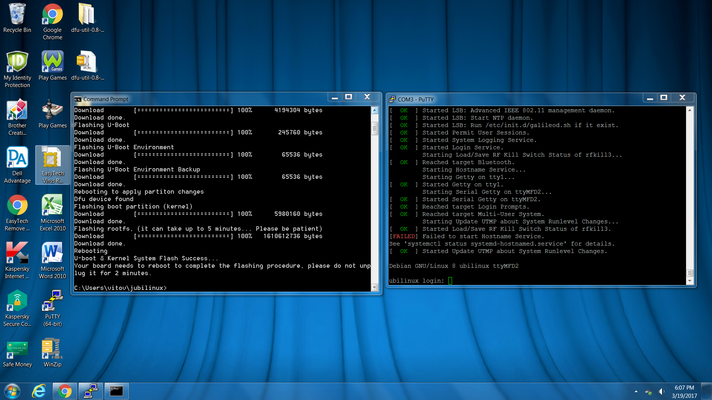

# Setting up Edison/Explorer Board on Windows/PC 

(This is testing a separate workflow for Windows only. Please refer to the [main Edison setup guide](./setup-edison.md) as well for troubleshooting & full instructions for other computer setup processes.)

### Hardware Assumptions for this page

1.  Using an Explorer Board and Edison
2.  Using an Windows computer

## Preparing/flashing the Edison

We recommend [buying an Edison that is preinstalled with jubilinux](hardware/edison.md#edison).  If you did that, you can skip down to [section 1-4 Hostname for Edison](windows-edison.md#1-4-hostname-for-edison).

If you didn't buy your Edison with jubilinux preinstalled, it comes with an operating system, called Yocto, that doesn’t work easily with OpenAPS.  The first step is to replace the operating system with a new one.  This is called “flashing” the Edison.  Both your Windows computer and the Edison board will need some work.

### **1-1 Prepare Windows Computer**

- Install the [Intel Edison drivers for Windows](https://software.intel.com/en-us/iot/hardware/edison/downloads). Select the "Windows standalone driver" download. After it is done downloading, click on the downloaded file and it will execute installation.

******

Note: Intel has announced the Edison will be discontinued at the end of 2017.  As part of this, apparently, the old link to Edison drivers has been removed.  We are unsure if this is a temporary issue or long term.  Therefore, if the link above for Intel Edison Drivers is not working, you can use [this link](https://www.dropbox.com/s/d5ooojru5jxsilp/IntelEdisonDriverSetup1.2.1.exe?dl=0) to download them directly from an OpenAPS user's dropbox.  Obviously screenshots below will be different if Intel has not fixed or repaired their driver downloads page for Edisons.

********

- Install [PuTTY]( http://www.chiark.greenend.org.uk/~sgtatham/putty/download.html). PuTTY is the program you will normally use to login to your rig in the future from the computer.  Creating a desktop shortcut for it is a good idea, since you will likely use it often.  Download the installation file that matches your PC's architecture (32-bit or 64-bit).  If you are unsure, you can check your computer's build and memory in the Control Panel.  Example shown is for a 64-bit computer.  If unsure, installing the 32-bit version won't harm anything...it just might be a little slower to use PuTTY.

****************************
#### <b>Side Note regarding computers with less than 6 GB RAM</b>

Windows PCs with less than 6 GB of RAM  may need to have the size of the page file increased to flash the Edison. You can check your RAM as shown in the Control Panel picture above.  If less than 6 GB is showing, then close all unnecessary programs and attempt to flash the device. If the flash operation fails follow these steps to ensure enough swap space is allocated when the computer boots, then restart and try again. Only do this if flashing the device doesn't work without changing these settings.

*Important: Write down the settings in the Virtual Memory window before you make any changes to your system. When you finish the flash process you must return these settings to their original values or Windows may become unstable.*

 - Go to the Control Panel, click All Control Panel Items, then click System. At top left click the Remote Settings link.
 - Select the Advanced tab in the System Properties window, then under Performance click Settings.
 - On the Advanced tab click the Change... button to change the page size.
 - In the Virtual Memory window uncheck "Automatically manage paging file size for all drives," click "Custom size," and set the initial size to at least 4096 MB. If you have already attempted this process at least once continue to increase this number by 1024 MB. Set the maximum size to 2048 MB higher than the initial size you used.
 - Click the Set button, then click OK until all windows are closed.
 - Reboot and attempt the flash process.
******************************

#### Download jubilinux and dfu-util

- Download Jubilinux [jubilinux.zip](http://www.jubilinux.org/dist/).  Jubilinux will download in a zipped format to your Downloads folder.  Locate the folder in your Downloads and right-click the `jubilinux.zip` folder.  Select `extract all` from the menu.  Saving it to your root user directory is a good idea.  Your root directory is the set of folders that exist under your User name in Windows.  For example, the destination for saving jubilinux to your root directory would be `C:\Users\yourusername\jubilinux`

**Note** The `extract all` command comes standard for all Windows machines.  However, in some instances, it may not be active for zipped files. If you do not see the `extract all` option in the right-click menu, right-click the zipped file, choose `Properties` at the bottom of the context menu.  On the General tab, click on the button next to the "opens with" and change it to use Windows Explorer.  Apply the change and select `OK` to save the change.  You should now be able to right-click the jubilinux.zip file to extract all.

- Now we are going to download two files from DFU-UTIL: [libusb-1.0.dll](http://dfu-util.sourceforge.net/releases/dfu-util-0.8-binaries/win32-mingw32/libusb-1.0.dll) and [dfu-util.exe](http://dfu-util.sourceforge.net/releases/dfu-util-0.8-binaries/win32-mingw32/dfu-util.exe). Click on those two links to download the files to your Downloads folder.  Navigate to your Downloads folder and choose to "move" those folders to the jubilinux folder that you unzipped earlier.  When you successfully move those two folders into the jubilinux folder, you should see files/folders inside the jubilinux folder like so:

### **1-2  Prepare Edison**
Now we move to the Edison.  You’ll see two microB USB ports on your explorer board.  One is labeled OTG (that’s for flashing) and one is labeled UART (that’s for logging into the Edison from a computer).  We will need to use both to flash.  We’re going to plug both of those into our computer’s USB ports using the cables listed in the parts list (Dexcom’s charging cable will work too). 

 

Once you plug in the cables, you should see your Edison board pop-up as a connected “device”.  If you don’t…try different cables. 

 - Go to Control Panel\All Control Panel Items\Device Manager\Ports\ and look for USB Serial Port COMXX. If you have multiple and unsure of which is the port you need: Make note of existing ports. Unplug the cable from the Explorer Board. Notice which port disappears. this is the port you are looking for.  If only one shows up, that is your Edison's port.
 

 
  - Open PuTTY, change from SSH to Serial. It normally defaults to COM1 and speed of 9600. Change the COM number to the number you found when you plugged into the Explorer Board. Change the speed (baud rate) to 115200. 
  - Once you've made those changes, Click on OPEN at the bottom of your Putty configuration window.
  
  

 - Once the screen comes up, press enter a few times to wake things up. This will give you a "console" window of what is happening on your Edison. Move that window over to the right side of your screen without resizing it, if you can.  (We are going to open another window later on the left side.)
- Now you will see a login prompt for the Edison on the console screen. Login using the username "root" (all lowercase) and no password. This will have us ready to enter the commands coming up in the next steps later.
  
- Now we are going to open a second window...a "flash" window...using a different program than PuTTY.  Go to your Windows Start menu and search for a program called Command Prompt.  Open Command Prompt and you should be given at a prompt for your User Root directory.  Assuming you saved your jubilinux folder to your user root directory (as described above), enter `cd jubilinux` in the prompt and press return.  If you saved it somewhere else, you will need to navigate to that location.  Move that flash window to the left side of the screen.

Your screens should look like this:

  
  
### **1-3 Flash the Edison**

* In your flash window on the left (command prompt window), enter `flashall.bat`

* You’ll get a prompt that asks you to "plug and reboot" the Edison board.  You’re done with this screen for now.  Just leave it alone (**don’t close window**) and go to next step.

  

* Return to the screen on the right (the PuTTY window) and enter `reboot` 

You will see many, many messages go by on the screens (mostly on the right-side screen).  

After several reboots (don’t panic), you should get a ubilinux login prompt (If you see Yocto instead of ubilinux, then you need to go back to Step 1-2 and start the flash process over again).  Use login `root` and password `edison`.

CONGRATULATIONS! You just flashed the Edison! Wahoo! Now, let's keep going by starting at http://openaps.readthedocs.io/en/latest/docs/Build%20Your%20Rig/OpenAPS-install.html#installing-openaps-on-your-rig-with-a-jubilinux-flashed-edison

