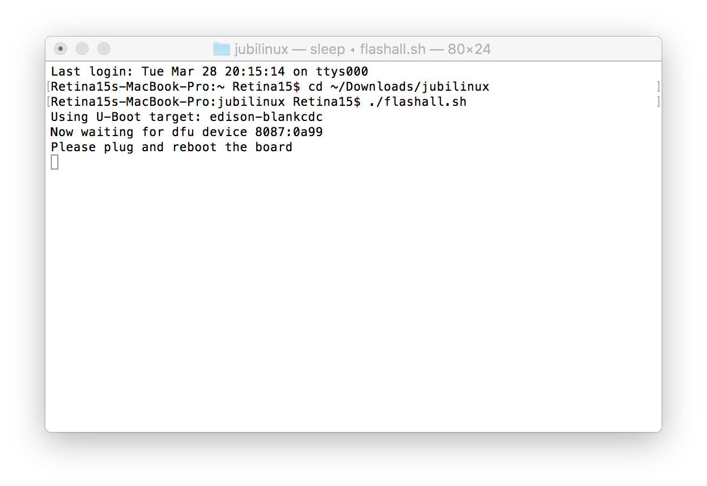
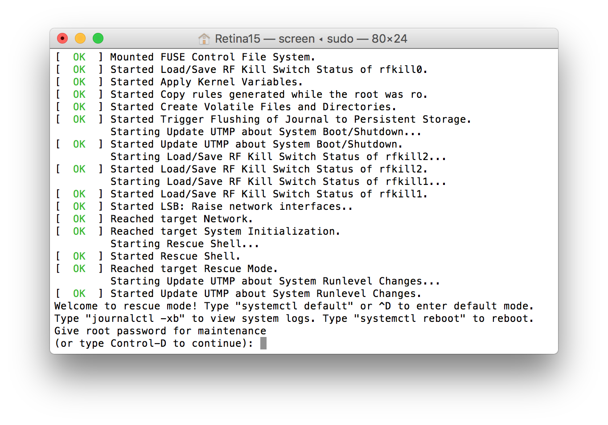
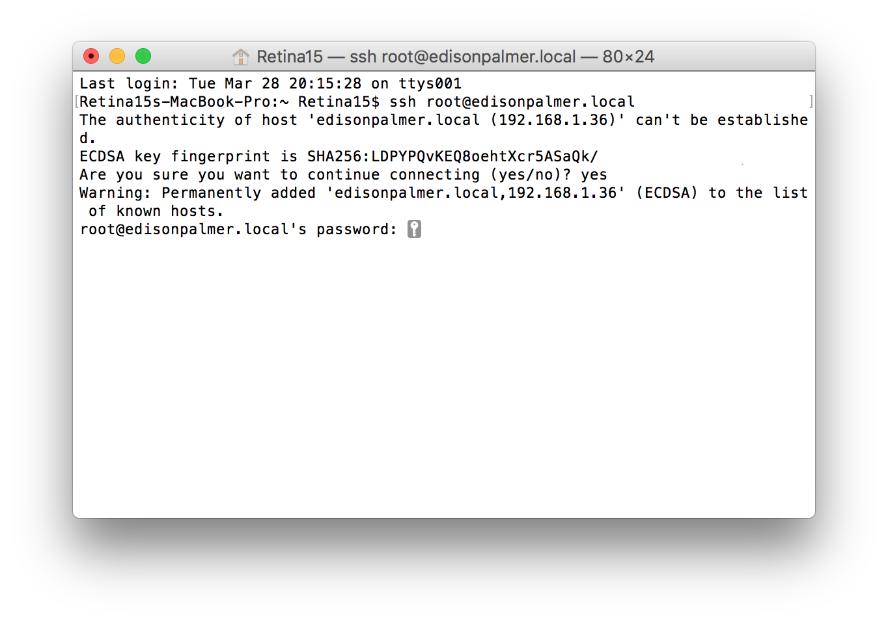
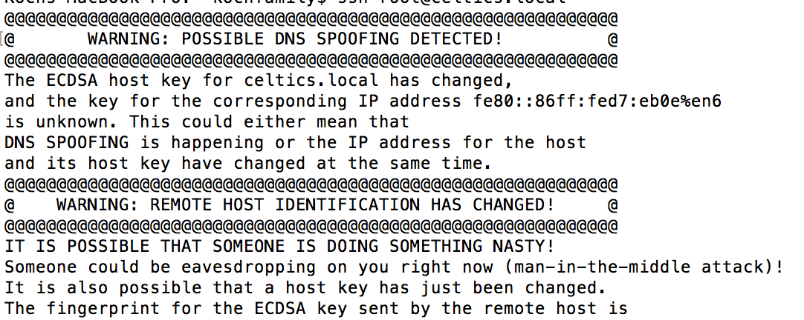

### 1. Preparing/flashing the Edison/reflashing the Edison

The OpenAPS uses Terminal, kind of like Loop uses Xcode.  It’s our interaction with the code that forms the basis of the loop.  You may have never even used the Terminal app.  Go to your Applications folder and find the Terminal App in the Utilities folder.  Double click to open it.


Terminal app is an ugly, plain interface…but it does what we need to do, communicate with the Edison.  Basically, the Edison is a computer that lacks a keyboard and display.  By using a cable connected to the rig, we can login to the Edison and use Terminal as a way of interacting with the Edison. 

When you first launch Terminal, you will probably see something rather plain like below.  The important thing to know is that the Terminal helps show you WHERE you are in your computer or Edison.  So, in the screenshot below, it’s telling me I am in my “iMac4K” user account.  If you are ever a little confused where you are…you can look to the left of the $ prompt and get an idea.


If you’re like me, you don’t “speak linux” (or python or java or…) nor do you really know what linux is.  So, you’ll be comforted to know that most of this setup is copy and paste commands into Terminal.  You won’t need to suddenly learn linux…just will need to follow directions and be willing  learn some basics.

The next steps will be done in the Terminal app.  If you see red colored text/code lines in a box, that’s what you want to copy and paste into Terminal, and then press enter.  Don’t try typing it…you’ll likely miss a space or add a typo.  So, let’s start…

#### **1-4.     Start Edison in screen mode**

`sudo screen /dev/tty.usbserial-* 115200`

You’ll most likely be asked for your computer password again.  Enter it.  A blank screen will likely come up, then press enter to wake things up to show an Edison login prompt.  Login with username “root” (no quotes) and no password will be needed.  Leave this window alone for a bit as we proceed with next steps.


If you have a problem getting to the Edison login prompt, and possibly get a warning like "can't find a PTY", close that terminal window.  Then unplug the usb cables from your computer (not from the Edison...leave those ones as is) and swap the USB ports they were plugged in.  Open a new terminal window, use the `sudo screen /dev/tty.usbserial-* 115200` command again.  Usually just changing the USB ports for the cables will fix that "can't find a PTY" error.

#### **1-5. Flash the Edison**

* Open a new Terminal Window (leave the existing one from that last screenshot open…we need a second window) by selecting command-N or using menu bar Shell>New Window>New Window with Settings-Basic.  

* In the new window, enter `cd ~/Downloads/jubilinux` This will change your directory. 


* Enter `./flashall.sh`
* You’ll get a prompt that asks you to "plug and reboot" the Edison board.  You’re done with this screen for now.  Just leave it alone (**don’t close window**) and go to next step.



#### **1-6.  Return to the other Terminal Window that we left off of in Step 4.**

* Enter `reboot`

#### **1-7.  Now we wait and watch.**  

You may see a message notification that the Edison “Disk Not Ejected Properly”.  Don’t worry...it is rebooting.  You will see some processes going on in the background.  


You should see:

```
Hit any key to stop autoboot:  0
Target:blank
Partitioning using GPT
Writing GPT: success!
Saving Environment to MMC...
Writing to redundant MMC(0)... done
Flashing already done...
GADGET DRIVER: usb_dnl_dfu
#
DFU complete CRC32: 0x77ccc805
DOWNLOAD ... OK
Ctrl+C to exit ...
######################################################################################################################
```
in the terminal window where you typed `reboot`, and
```
Using U-Boot target: edison-blankcdc
Now waiting for dfu device 8087:0a99
Please plug and reboot the board
Flashing IFWI
Download	[=========================] 100%      4194304 bytes
Download	[=========================] 100%      4194304 bytes
Flashing U-Boot
Download	[=========================] 100%       245760 bytes
Flashing U-Boot Environment
Download	[=========================] 100%        65536 bytes
Flashing U-Boot Environment Backup
Download	[=========================] 100%        65536 bytes
Rebooting to apply partition changes
Now waiting for dfu device 8087:0a99
Flashing boot partition (kernel)
Download	[=========================] 100%      5980160 bytes
Flashing rootfs, (it can take up to 10 minutes... Please be patient)
```
in the terminal window where you ran `./flashall.sh`.  As it says, this should take about 10 minutes.  It may appear like nothing is happening for awhile, but wait it out.  If it didn’t take long at all...chances are that the flash didn’t really work, in which case you should read through the [full docs] and try again, and/or check out the Troubleshooting section at the bottom.

**OLDER JUBILINUX VERSIONS**: After flashing is complete, watch the window as you should get asked to type **control-D to continue**.  If so, go ahead and press (don’t type that out, just press the keys) control-D to keep going.  



**NEWER JUBLINUX VERSIONS (0.1.0 and later)**: You probably won't get asked to Control-D and that is fine.

After one of the reboots, you'll probably see:

```
[**    ] A start job is running for /etc/rc.local Compatibili...14s / no limit)
```
for a few minutes: that's fine.  You can also expect to see an ugly red:
```
[FAILED] Failed to start Hostname Service.
```
That is also fine, and you can ignore it too.

Eventually, you should get a ubilinux login prompt (If you see Yocto instead of ubliniux, then you need to go back to Steps 1-4 and start the flash process over again. Or if you are reflashing and your old rig name appears, then the reflashing did not work. Go back to Steps 1-4.)


Use login `root` and password `edison` to login to your newly flashed Edison.  After logging in, you will notice that the Terminal prompt says `root@ubilinux:~#`.  This is the correct prompt for the jubilinux system.  You will not see jubilinux in the prompt.  If you bought a pre-flashed Edison, this is how your initial Terminal prompt will look.


CONGRATULATIONS! You just flashed the edison! Wahoo! Now, [head back to the install instructions for the easy bootstrap script process of setting up wifi](http://openaps.readthedocs.io/en/latest/docs/Build%20Your%20Rig/OpenAPS-install.html#steps-2-3-wifi-and-dependencies). (Below has the manual instructions, but most people prefer the quick bootstrap script option).

#### **1-8. Wifi for Edison**

Now that you’ve finished flashing, the Edison is going to need a couple things to finish setting it up; Hostname/passwords and Multiple WiFi networks

**Hostname and password**

* From that same screen we just left off , enter these commands to rename your Edison's hostname.

`myedisonhostname=<thehostname-you-want>`  <---But replace the <> section with your chosen hostname.  I used “edisonhost” as the name, as shown in screenshot below.  

Then run each of these commands with no modifications, just copy and paste:

`echo $myedisonhostname > /etc/hostname`

`sed -r -i"" "s/localhost( jubilinux)?$/localhost $myedisonhostname/" /etc/hosts`

Now your Edison has a new hostname.  (note: screenshot below is a little different than you will see on your screen.  You will see root@ubilinux)


**IMPORTANT**

* To change the password for your Edison to a more secure password than “edison”, enter `passwd root`

* Follow the commands to reset the password.    Repeat for `passwd edison`

* SAVE PASSWORDS somewhere, you’ll want them.


#### **1-9. Multiple wifi networks**

**A-1.** Enter
`vi /etc/network/interfaces`

**A-2.** A screen similar to the one below will appear.  Type “i” to enter INSERT mode for editing on the file.


.. note:: 
   **Helpful Tip for Insert Mode**
   
   If you are new to INSERT MODE, realize that INSERT MODE inserts characters at the highlighted cursor (it does not overwrite the character showing beneath the cursor).  And, the default is that the cursor will be at the top left of the screen to start, so you will need to use the arrow keys to move the cursor to the area where you want to start typing.  If you freak out that you’ve made a change that you don’t want to commit...you can simply press the ESC key and then type (no quotes) “:q!” to quit without saving any of your typing/changes.

   If you experience any erratic behavior while using the screen editor, such as the cursor overwriting or deleting adjacent words when typing or even when using the cursor arrow keys, this may be due to incorrectly set Mac Terminal window settings. Try going to the "Shell" on the menu bar above and selecting "Show Inspector." Ensure the Columns setting is set to "80" and the Rows setting is set to "25."

**A-3.** Make the changes so they match the areas highlighted in yellow, above:
* uncomment (remove the #) from the auto wlan0 line
* add `    wpa-conf /etc/wpa_supplicant/wpa_supplicant.conf` right below the iface wlan0 line.
* comment out (add #) to the wpa-ssid and wpa-psk lines as shown

**A-4.** Press ESC then type “:wq” (no quotes) and enter to write (save) and quit that screen.  When you press ESC, you won't initially see much different, but when you type ":wq", you will see the characters appear in the lower left of the screen.


**B-1.** Enter `vi /etc/wpa_supplicant/wpa_supplicant.conf`

**B-2.** Type “i” to enter INSERT mode for editing on the file.

**B-3.** Add the following for each wifi network you’d like to add.  

```
network={
    ssid="my network"
    psk="my wifi password"
}
```

The networks you enter here are the wifi networks that your rig will be able to use to stay connected to internet. Examples shown below.  One is my home wifi, the other is my iphone’s personal hotspot.


* Note: If you don’t know your personal hotspot’s information, you can find it under your iPhone's Settings, Personal Hotspot as shown in the screenshot.

* You should add your personal hotspot to the list of wifi networks as a backup if your BT-tethering to hotspot does not work.  By toggling your hotspot off-on, it will generate a wifi-tether signal for approximately 90 seconds, so that your rig can find it and connect.  Since wifi-tethers are similar to a regular wifi connection, your rig will not automatically hop off this connection when it gets to your home wifi network.  You will need to remember to turn off your wifi-tether if you want your rig to connect back to your home wifi network.  By contrast, a hotspot connection done by BT-tether does not require any toggling and your rig will connect/disconnect as it leaves/comes to a known wifi network in your wp_supplicant list.  

* If you haven't done it, a good idea is to update the name of your iPhone to remove any apostrophes.  Apple's default is to name iPhones with an apostrophe such as "Katie's iPhone".  This can cause some problems for wifi connections sometimes.  You can rename your iPhone by going into your iPhone's Settings, General, About, and then Name.

Some wifi networks require you to accept a terms and conditions prior to allowing access.  For example, Starbucks coffee shops and many hotels.  These networks are termed "captive" networks and connecting your rig to captive networks is currently not an option.

Other wifi networks may require you to enter a login name and password at an initial screen before allowing access (such as many school wifi networks).  Some users have success in using the following wpa network settings for those types of networks:

```
network={
   scan_ssid=1
   ssid="network name"
   password="wifi password"
   identity="wifi username"
   key_mgmt=WPA-EAP
   pairwise=CCMP TKIP
   group=CCMP TKIP WEP104 WEP40
   eap=TTLS PEAP TLS
   priority=1
}
```

**B-4.** Press ESC then type “:wq” to write (save) and quit that screen when you have finished adding the wifi networks.  You can always come back and add more networks as needed, using the same process.

**C** Run `ifup wlan0` to make sure you can connect to wifi.  A successful connection should look similar (IP address numbers will be different than mine):


If you don't see a message showing you are successfully connected, go back to the start of Step 1-9 and make sure that you don't have any typos in those two files.

#### **1-10. Installing packages, SSH keys, and other settings**

ALRIGHTY...Your Edison is coming along.  Now we are going to set aside the Edison “screen” terminal window (in case we can't get in via ssh), reboot, and login using an “ssh” command from a new Terminal window.

* Type `reboot`
* Wait as many lines of action go by in the Terminal window...eventually you will get to a prompt that has your new edisonhost name login.  We aren't going to login right now.  Just saving that window in case we need it later.
* Open a new Terminal window by pressing Command-N
* Login to your Edison by entering `ssh root@edisonhost.local` (changing edisonhost to the hostname you selected earlier above).  If you see warnings about the authenticity of host can't be established, you can say yes to continue and add the new edison to your known hosts list.  This message typically appears when you've set-up multiple edisons on the same computer.
* Enter your password that you set earlier



* Run `ping google.com` to make sure your rig is online.  If your rig shows up as online successfully, you can enter control-c to exit the ping.  A successful ping should look like the screen below.


* If you are reflashing an Edison, you might get a scary looking error about "WARNING: POSSIBLE DNS SPOOFING DECTECTED WARNING: REMOTE HOST IDENTIFICATION HAS CHANGED!" that is likely because you are attempting to login to a rig that has the same hostname as a previous rig that has been logged into on the computer. You can delete the history of known hosts for the rig by entering the commands `cd .ssh` and then `rm known_hosts`.  This will delete the log of known hosts on your computer.  There's no significant downside to removing the known_host log, except that you will need to answer yes to the key fingerprint additions again for the first time you login to old rigs again. 




If the rig isn't online, go back and check your /etc/network/interfaces and /etc/wpa_supplicant/wpa_supplicant.conf files above: you probably either missed a step or made a typo.  Usually you will see `ping: unknown host google.com` if you are not connected to the internet, as shown below.


* Enter these three lines, one-at-a-time (the first line will run fast, and the second and third lines may take several minutes to complete)

`dpkg -P nodejs nodejs-dev`


`apt-get update && apt-get -y dist-upgrade && apt-get -y autoremove`


`apt-get install -y sudo strace tcpdump screen acpid vim python-pip locate`


* Enter these three lines, one-at-a-time (the first two will be fast, the last line will take you to a screen for setting up your timezone.  Screenshots are just for examples...in this case PST

`adduser edison sudo`

`adduser edison dialout`

`dpkg-reconfigure tzdata    # Set local time-zone`


* Enter `vi /etc/logrotate.conf` then press “i” for INSERT mode, and make the following changes:

 * set the log rotation to daily from weekly
 * remove the # from the “#compress” line

* Press ESC and then type “:wq” to save and quit


**Congratulations you have successfully flashed your edison and configured some basic settings. Time to move onto OpenAPS install**
