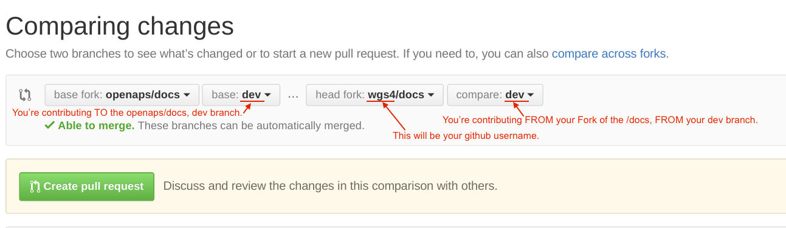

### Making your first PR (pull request)

At some point it will be suggested to you that you make a PR. PR is short for pull request. 
It's actually not too hard to do one and it is a great way to contribute. This documentation is here because people like you made PRs.

* The general idea is to make edits and improvements to code or document by making a copy of the repository you'd like to change. 
* Double checking that they your edits look good to you on your copy. 
* Make a few notes for what you did so people can understand why you made the change. 
* Then do a pull request, which is to ask the administrataors of the repository to pull your changes 
back into the dev branch of the main repository. 
* At which time they will do a quick review and merge your changes in.

OK, let's get started. For our example we are going to make an edit to the openaps docs repository.
    
1. Go to https://github.com/openaps/docs and hit Fork in the upper right to make your own copy of the repository.
2. Github will automatically take you to your copy (notice in the address bar you are now in your own personal github directory)
3. In the branch drop down on the upper left of the page we are going to select the dev branch, since that is the one we want to edit. 
4. Now we need to find the file we want to edit. Click through the directory structure until you find and are looking at the content of the file you want to change.
5. Next, press the pencil icon in the upper right next to the trash can icon.
6. Make edits to the file as necessary.
7. Next we want to commit our changes. But first we should note what we changed and why. Be sure to put a one liner explaining the why of making the changes you did.
8. Commit the changes.
9. Now look and make sure everyting you changed looks like you meant it to (no typos, etc). If any problems, go back and edit again and save again.

We now have an improved file that we want to be pulled back into the dev repository at https://github.com/openaps/docs

1. Go to https://github.com/openaps/docs
2. Click the green "New pull request" button
3. Under the Compare Changes heading, click "compare across forks"
4. Set up the the branches you are targeting. The easiest way of thinking about the branch range is this: the base branch is where you think changes should be applied, the head branch is what you would like to be applied.
5. So, choose the base fork as openaps/docs and then the base as dev. The head fork is going to be <i>youraccount</i>/docs and the base as dev.

6. It should show the list of changes you made. If not, you did something wrong so stop here and ask for help. If the list looks like your changes then put a note in there to what the overarching reason for the changes are (in your case you only made one, but you could have made a bunch). Create the PR.

It will now be in a list of PR's that the team will review and potentially give feedback on before committing to the main documentation for openaps!

Congrats, you made your first contribution!

PS, your fork will still be sitting on your own personal github account. You can delete it if you are done with it. In the future, be sure to pull a fresh copy from github.com/openaps/docs before making new edits.
