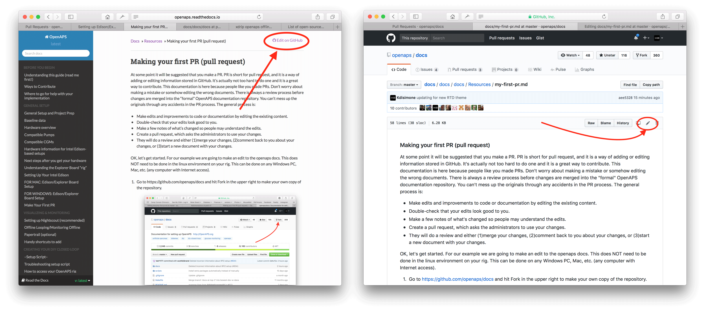

### Making your first PR (pull request)

At some point it will be suggested that you make a PR. PR is short for pull request, and it is a way of adding or editing information stored in GitHub.  It's actually not too hard to do one and it is a great way to contribute. This documentation is here because people like you made PRs.  Don't worry about making a mistake or somehow editing the wrong documents.  There is always a review process before changes are merged into the "formal" OpenAPS documentation repository.  You can't mess up the originals through any accidents in the PR process.  The general process is:

* Make edits and improvements to code or documentation by editing the existing content.
* Double-check that your edits look good to you.
* Make a few notes of what's changed so people may understand the edits.
* Create a pull request, which asks the administrators to use your changes.
* They will do a review and either (1)merge your changes, (2)comment back to you about your changes, or (3)start a new document with your changes.

OK, let's get started. For our example we are going to make an edit to the openaps docs.  This does NOT need to be done in the linux environment on your rig.  This can be done on any Windows PC, Mac, etc. (any computer with Internet access).

1. Go to https://github.com/openaps/docs and hit Fork in the upper right to make your own copy of the repository.

2. Go to http://openaps.readthedocs.io/en/latest/docs/introduction/index.html or similar and navigate to the page you want to edit.  Click on the black box at bottom left of page with the green word "v: latest" or similar. In the pop up window that appears, click the word "edit" for editing in GitHub.  

Or you can click on the "Edit in Github" link in the upper right corner, and then click the pencil icon that appears in the top bar of the page contents to be edited.

3.  Either of the options in Step 2 will create a new branch in YOUR repository where your edits will be saved.  Make your edits to the file.

4. You have been working in the "<>Edit file" tab. Select the "Preview changes" tab for a fresh look to make sure everything you changed looks like you meant it to (typpos sic.). If you see a needed improvement, go back to the edit tab to make more improvements.

5. When you have finished your edits, scroll to the bottom of the page.  In the box at the bottom, provide your comments in the text field that reads, "Add an optional extended description...". The default title has the file name. Try to include a sentence explaining the __reason__ for the change. Relating the reason helps reviewers understand what you are attempting to do with the PR.

6. Click the green "Propose file changes" or "Commit changes" button. In the page that appears click "Create Pull Request" and again in the next page click "Create Pull Request".

7. That completes the opening of a pull request, PR. GitHub assigns the PR a number, located after the title and a hash mark. Return to this page to check for feedback (or, if you have Github notifications emailed to you, you will get emails notifying you of any activity on the PR). The edit will now be in a list of PR's that the team will review and potentially give feedback on before committing to the main documentation for openaps! If you want to check on the progress of the PR, you can click on the bell logo in the upper right corner of your GitHub account and see all your PRs.

Congrats, you made your first contribution!

PS, your fork and branch will still be sitting on your own personal GitHub account. After you get a notification that your PR has been merged, you can delete your branch if you are done with it (Step 8's notification area will provide a link to delete the branch once it has been closed or merged). For future edits, if you follow this procedure the edits will always start with an updated version of the openaps repositories.  If you choose to use another method to start a PR request (e.g., editing starting from your forked repo's master branch as the starting point), you will need to ensure your repo is up-to-date by performing a "compare" first and merging in any updates that have happened since you last updated your fork.  Since people tend to forget to update their repos, we recommend using the PR process outlined above until you get familiar with performing "compares".

### Advanced tips for adding multiple images to documentation

If you are planning to make a lot of edits, including adding images to help illustrate parts of the documentation (thank you!), you may want to take the following approach:

* As you go and save screenshots, rename the screenshots to a descriptive name - but try not to use spaces as that confuses Github. Instead, use underscores. I.e. Example_batch_images_upload.png rather than "Example batch images upload.png". 

* You can upload images in batches easily by:
 
 1. Navigate to the images folder (https://github.com/openaps/docs/tree/master/docs/docs/Images - but make sure you are in your fork/copy of the docs Images folder to be able to do this (replace "openaps" in the URL with your github username)).
 
 2. Click in the upper right corner where it says "Upload files"
 
 3. Drag and drop your images into the screen
 
 4. Commit these to your branch
 
 5. Now, you can look for the URL/relative path of each file (example, you can see [this individual image has its own URL and path](https://github.com/openaps/docs/blob/master/docs/docs/Images/Example_batch_images_upload.png) and use that to refer to when adding images into a page in the documentation.
 
 6. To see examples of how to add the images, you can look at the "raw" code of a page to see an example from a page that already has the images embedded successfully. The main thing is to have a plain text description, followed by a link with a relative path to the image, like this: ``
 
 (That code is exactly how the image below is embedded to be displayed.)
 

 7. Now, once done adding images/making adjustments, you can submit a PR back to the master copy of the OpenAPS docs.
