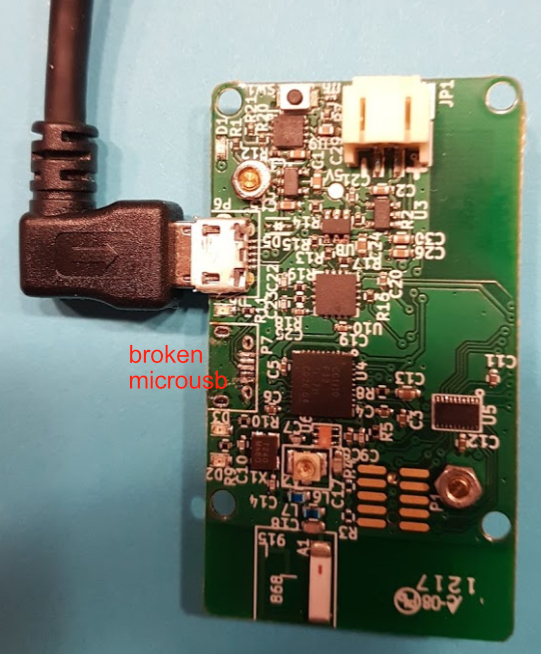
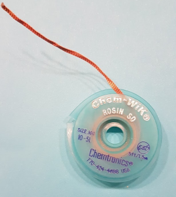
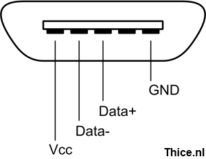
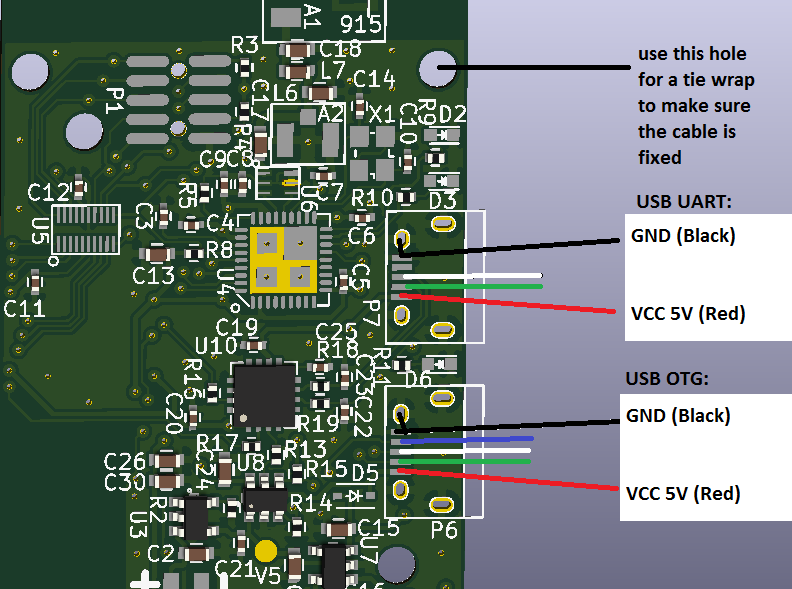
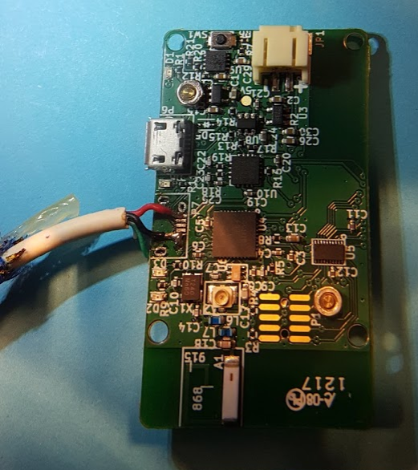
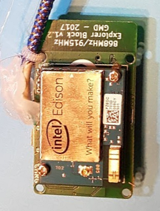

# Troubleshooting hardware problems with Edison rig

## Fix Edison Block micro usb ports

The Edison Block micro usb ports are quite fragile. If it breaks it can be restored by soldering a short USB cable to the Explorer Block. 
This is only needed if you use a Dexcom receiver and you need to power the rig with a USB battery. If you use a LiPo battery both micro usb connectors can charge the LiPo battery.

This isn't an easy soldering job. This is of course at own risk and it might make break your rig completely if you screw up.

Example steps if your USB UART port is broken. That will look like this:

Steps:
1. Remove your Edison from the Edison block.
2. Use a good soldering iron, helping hands (with magnifying glass and lamp), good lighting and a glue gun.
3. Use desoldering braid to remove excess of solder from the micro usb connectors. E.g. with [Chemtronics Chem-Wik Rosin](https://www.chemtronics.com/chem-wik-rosin).

4. Check the micro usb pin out and cable colors. For powering you need a red wire connected to Vcc (5V) and a black wire connected to GND. You don't need to connect the green wire (Data-) and white wire (Data+), but you will loose the UART capability.
   If you need the serial line of the USB UART you will need to connect them, but it's much easier to use your Edison in another Edison breakout board or Edison block if you need to have a USB serial connection.
   Don't cut the green and wire too short (like I did), because can you can use them to make the glue connection from the cable to the board a bit more sturdy.
   Pin 4 of the USB OTG (USB On The Go) (blue in the picture) is used for `USB_ID`. It's unused for the USB UART connection.
   If you need the full PCB, schematics and electronic design, check [EnhancedRadioDevices GitHub](https://github.com/EnhancedRadioDevices/915MHzEdisonExplorer)
   

5. If you succeed it should look a bit like this:

6. Use a digital multimeter to check that the wires don't short.

7. Screw back the Edison on the Edison block and test the connection (log into Edison with SSH, check to see if `lsusb` recognizes the Dexcom Reveier and see if it's still looping)

8. Remove the Edison before glueing 

9. Use a tie wrap in the Edison Block hole to make sure the cable won't move and bend it a bit towards the side to which the cable is connected to the Eidson Block.

10. Put it in a case. I don't have a new 3D case yet, so I use a TickTac freshmints box (with some extra holes for cooling) for now. The result:

11. Use [this GitHub issue](https://github.com/EnhancedRadioDevices/915MHzEdisonExplorer/issues/22) to report your findings. I hope you succeeded.
    You can ask [Enhanced Radio Devices Support](https://enhanced-radio-devices.myshopify.com/pages/shipping-and-faqs) or tag PieterGit on the Gitter Intend to Bolus channel for help.
