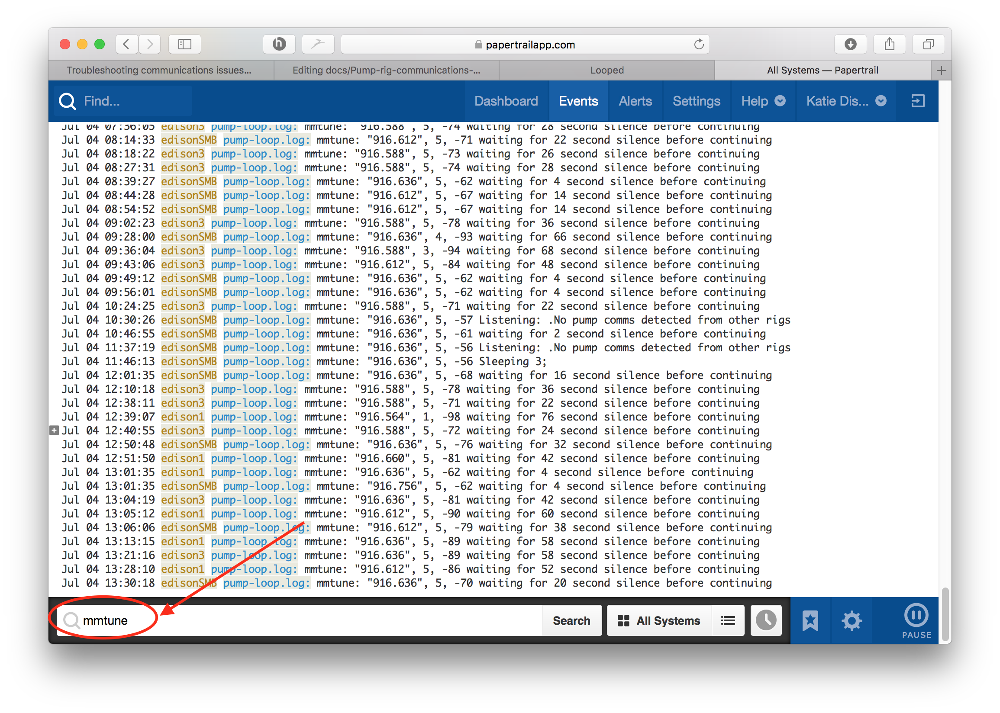

# Troubleshooting communications issues between the pump and the rig

## Basics of communications

If your looping is to be successful, you will need good communications between the pump and rig.  They communicate with each other using radio frequency (rf).  If you have an North American (NA) pump, the rf band used is 916 mHz.  If you have a European (WW) pump, the rf band is 858 mHz.  As part of the setup script, you will be telling the rig which type of pump you have so that it can properly use the right rf band to communicate with the pump.  When the rig wants to talk with the pump, it will start by "tuning the rf"...basically it will try several frequencies around the 916 mHz frequency and choose the exact frequency that has the strongest response.  The tuning process for the pump is called "mmtune".

For example, here's the results of a pump tune:
```
{
  "scanDetails": [
    [
      "916.300", 0, -99
      "916.324", 0, -99
      "916.348", 0, -99
      "916.372", 0, -99
      "916.396", 0, -99
      "916.420", 0, -99
      "916.444", 0, -99
      "916.468", 0, -99
      "916.492", 0, -99
      "916.516", 0, -99
      "916.540", 5, -90
      "916.564", 5, -87
      "916.588", 5, -86
      "916.612", 5, -86
      "916.636", 5, -86
      "916.660", 5, -87
      "916.684", 2, -98
      "916.708", 0, -99
      "916.732", 0, -99
      "916.756", 0, -99
      "916.780", 0, -99
      "916.804", 0, -99
      "916.828", 0, -99
      "916.852", 0, -99
      "916.876", 0, -99
  "setFreq": 916.612, 
  "usedDefault": false
  ```
  
The rig scanned frequencies between 916.300 and 916.876 mHz, and set the frequency for pump communications to 916.612 because that exact frequency had the strongest communications.  How can you see the strength by looking at these tuning results?  The lower the last number is on the tune, the better the strength.  **Results of `0, -99` indicate NO pump communications.  This is an undesirable result.**  Pump tunes in the 80s or lower are usually strong enough for stable looping.  If tunes are in the 90s, then you will likely experience periodic missed pump-rig communications and your looping will be intermittent.  In this example, 916.588, 916.612, and 916.636 had equally strong responses at `5, -86` and therefore the mid-point of that range is the selected frequency.

### How can you see the results of your pump tuning?

You can see the results of rf tunes (mmtune) several different ways:

1. Login to your rig and use `grep mmtune /var/log/openaps/pump-loop.log` to search your pump-loop.log for mmtune results.  Sample result:
  ```
  mmtune: "916.588", 5, -78 waiting for 36 second silence before continuing
mmtune: "916.588", 3, -94 waiting for 68 second silence before continuing
mmtune: "916.612", 5, -84 waiting for 48 second silence before continuing
mmtune: "916.588", 5, -71 waiting for 22 second silence before continuing
mmtune: "916.588", 5, -78 waiting for 36 second silence before continuing
mmtune: "916.588", 5, -71 waiting for 22 second silence before continuing
mmtune: "916.588", 5, -72 waiting for 24 second silence before continuing
mmtune: "916.636", 5, -81 waiting for 42 second silence before continuing
mmtune: "916.636", 5, -89 waiting for 58 second silence before continuing
```

2. If you setup Papertrail, search for mmtune.  For example, as shown:

 


3. If you want to manually preform an mmtune, login to your rig and `cd ~/myopenaps && sudo service cron stop && killall -g openaps ; killall -g oref0-pump-loop; openaps mmtune && sudo service cron start` will show the selected frequency of the entire scan, for example, here's the terminal results of that command on a rig called edison3:
  ```
  root@edison3:~# cd ~/myopenaps && sudo service cron stop && killall -g openaps ; killall -g oref0-pump-loop; openaps mmtune && sudo service cron start
openaps: no process found
oref0-pump-loop: no process found
mmtune: pump://JSON/mmtune/monitor/mmtune.json
reporting monitor/mmtune.json
"916.636", 5, -92 root@edison3:~/myopenaps#
```

4.  If you want to manually perform an mmtune with the full frequency scan displayed, use `cd ~/myopenaps && sudo service cron stop && killall -g openaps ; killall -g oref0-pump-loop; openaps-use pump mmtune && sudo service cron start` and you'll see results similar to the full scan details as shown at the beginning of this section.

### What causes poor tuning results?

There are several situations which may cause poor pump communications:

1. Most commonly, poor communications are simply a matter of **distance**.  The farther away your pump and rig are from each other, the weaker the communications are going to be.  Bringing the rig closer to the pump may resolve the problem and improve communications. How close you need to be may depend on the following variables below, as well.
2. Check for a **low pump battery**.  As pump battery gets lower in voltage, communications may fail more often.  Typically pump communications are fairly stable to around 1.3v of pump battery, but that may vary by pump and location.  Try changing the battery and see if that helps pump communications.
3. **Body blocking** between pump and rig is another common reason for poor pump communications.  The human body is an incredibly effective rf blocker (water, skin, fat...not easy for rf to penetrate).  So, if you are prone to sleeping with your pump completely covered by your body, you may end up with more frequent pump communication failures.  Or, if you have your rig on one hip and your pump on the other...even that may decrease the strength of your pump communications.
4. **Noisy rf environments** can cause problems with rig-pump communications.  If you have lots of equipment nearby all trying to use the same frequency, communications can be laggy and interrupted.  What home devices commonly operate on the 900mHz frequency?  Some older cordless phone systems, baby monitors, and older home wireless speakers are common sources.  Try switching channels on the devices (if available as an option) and using a different frequency, such as 2.4 GHz or 5 GHz.  Try temporarily unplugging those devices and seeing if you get improved pump communications.  If you are outside of the home, the troubleshooting and mitigation of noisy rf areas may be more problematic.
5. **Extreme environmental changes** can cause the rig-pump communications to be slightly shifted in frequency.  For example, going from a heated house to the outside winter snow may cause a change in the strongest tuning frequency.  When the rig attempts a fresh mmtune, it will set a new frequency and communications shouldn't be impacted for long, if at all.
6. **Explorer board not sitting propperly on the Edison** The Explorer board could have become loose and lost connection to the Edison board. Disconnect power from the rig and verify the explorer board is securely connected to the Edison. Turn the power on and try again.
7. **Equipment failure** can be another cause.  If there is damage to the explorer board's antenna, you may notice poor or no pump communications.  Additionally, some pumps may have poor rf strength...after all these are older pumps and in many cases we don't know the history.  To troubleshoot if the issues are equipment related, try the pump with a new explorer board.  Or if you have a backup pump, try setting up OpenAPS with that pump.  See if the problem persists.

### How often does the rig tune?

The rig does not attempt to tune on every single pump communication.  The tuning is done on a random interval, and more frequently if pump communications are failing.  So, don't expect to see an mmtune result every minute or even every 5 minutes.  If you rig is looping regularly without failures, you can expect that mmtunes will be done less frequently because they are not needed.
