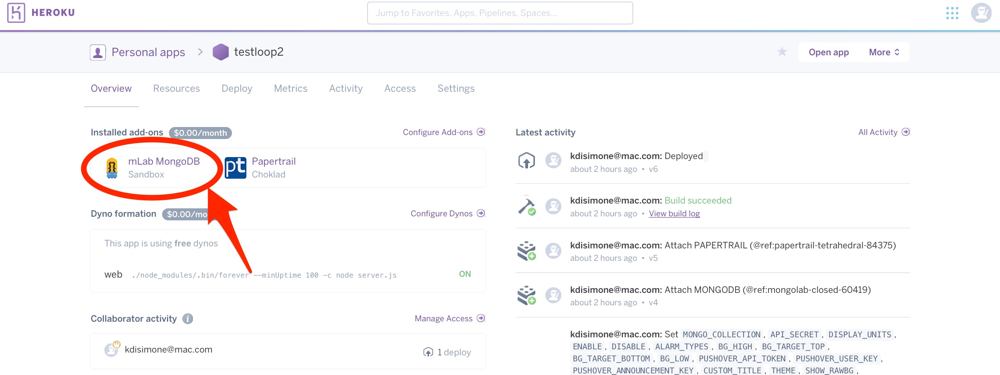
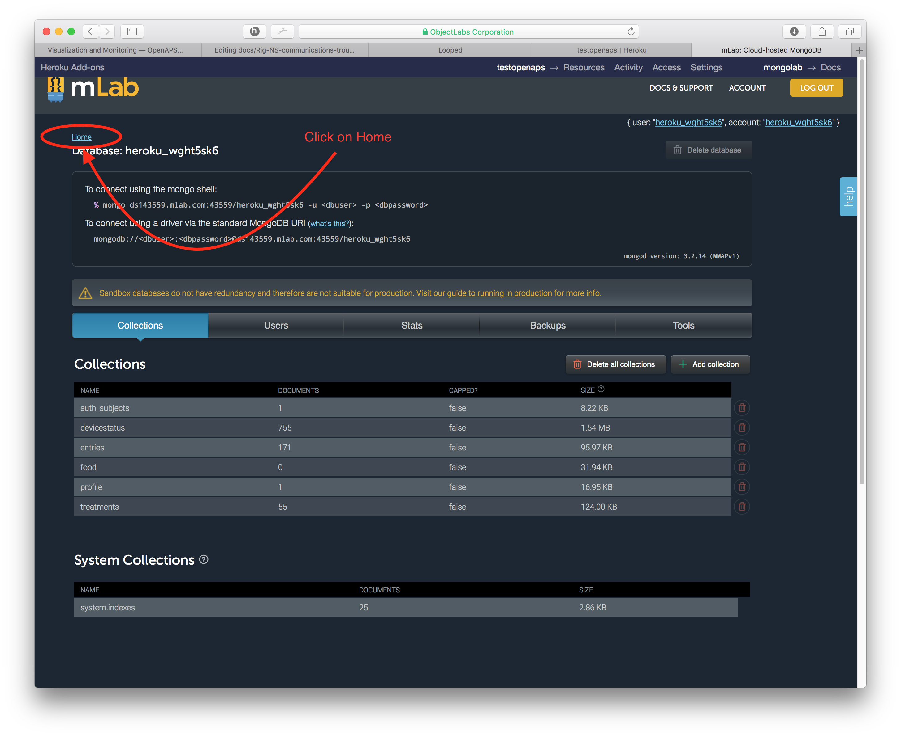
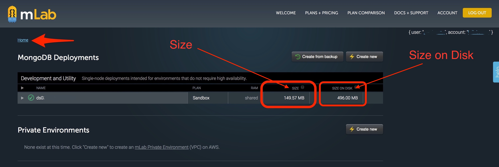
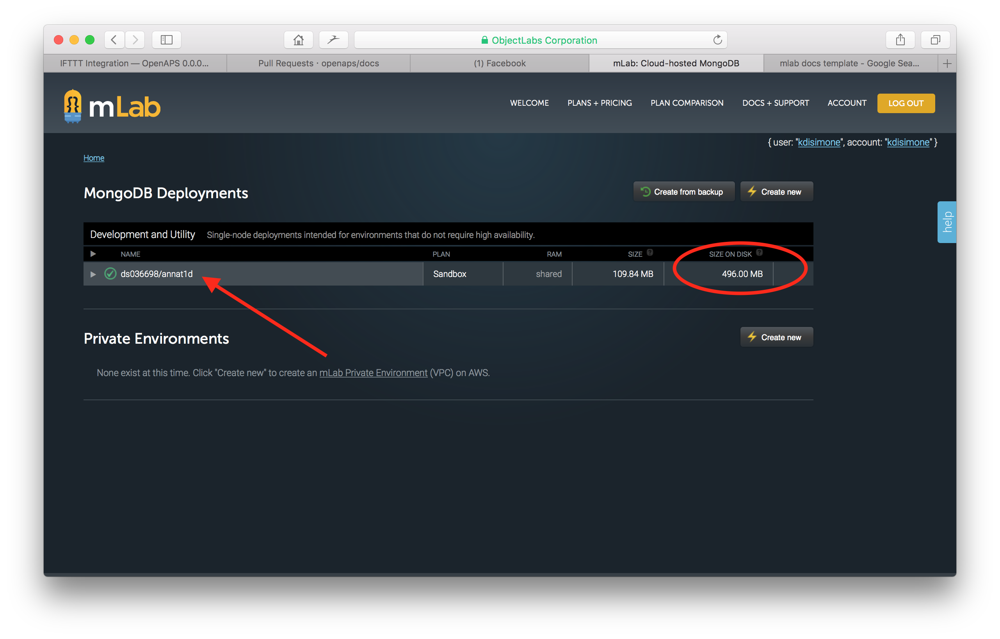
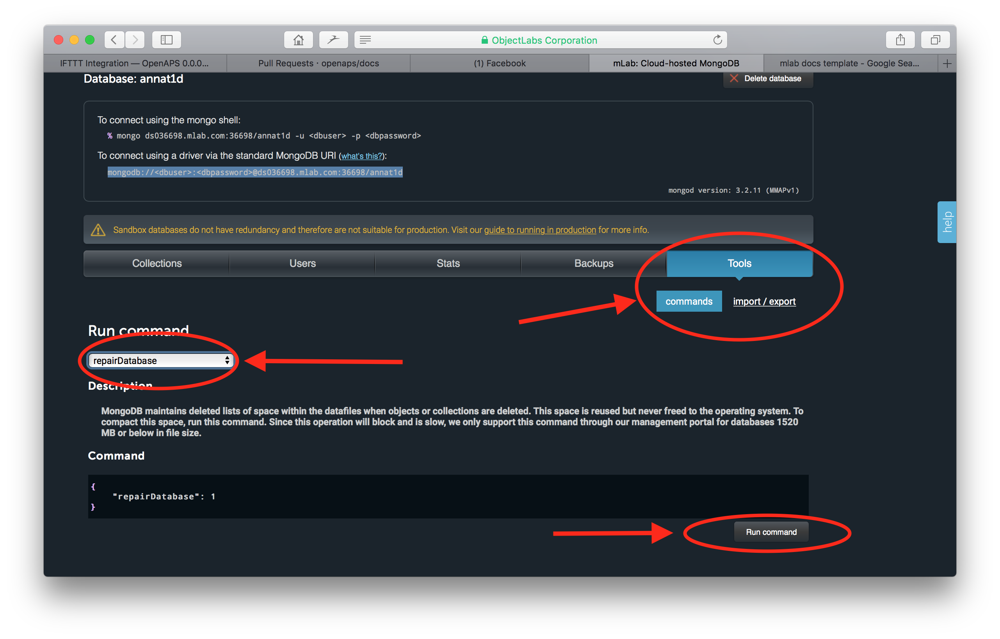
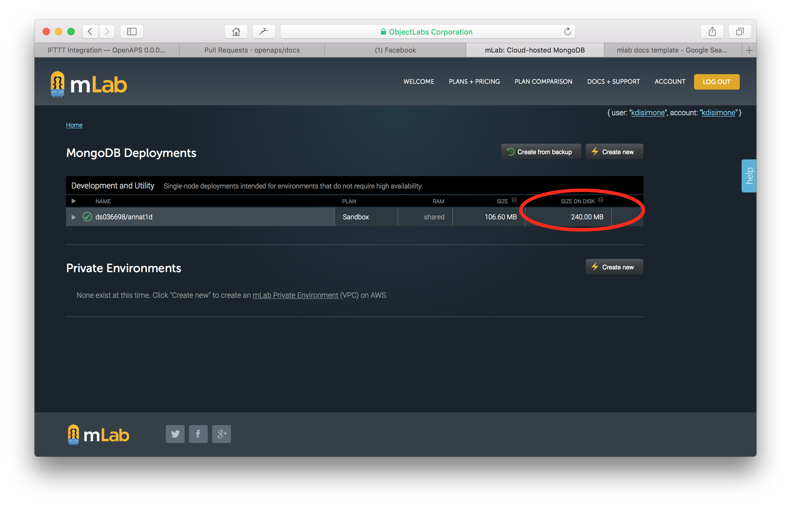
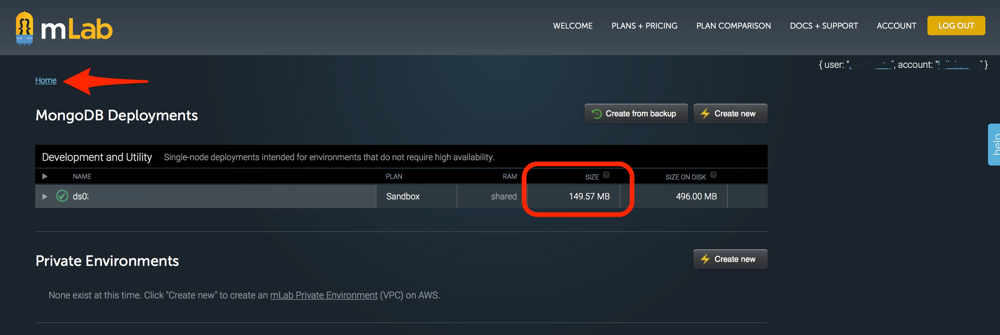
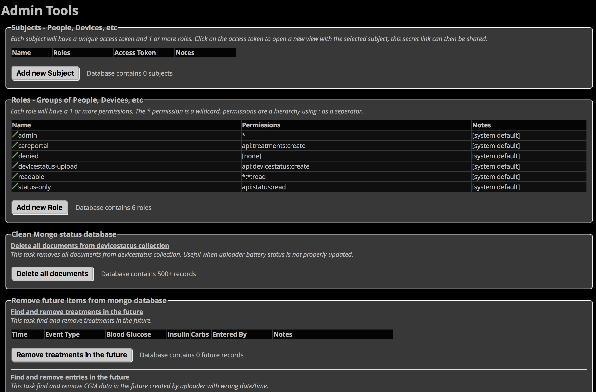

# Troubleshooting Nightscout issues

The major categories of Nightscout troubleshooting include:

**Connectivity**. The rig and Nightscout are good friends. Information is usually two-way so long as the rig has access to the internet (aka, online use).  When rigs go "offline", NS will go stale until internet is again available. If you're having issues with NS and it's a brand new setup, you'll want to double check [per the below](http://openaps.readthedocs.io/en/latest/docs/Troubleshooting/Rig-NS-communications-troubleshooting.html#setting-up-your-ns-hosting-site) that URL, API secret, etc. are correct.

**Future data**. Sometimes entries will get time stamped incorrectly, or the device time zones are off. [See below](http://openaps.readthedocs.io/en/latest/docs/Troubleshooting/Rig-NS-communications-troubleshooting.html#nightscout-admin-tools) for how to resolve.

**Mlab size is too big and you need to clean it**. [See below](http://openaps.readthedocs.io/en/latest/docs/Troubleshooting/Rig-NS-communications-troubleshooting.html#mlab-maintenance) for how to check the size of, and compact if needed, your mlab database, which can influence what displays in Nightscout.

**Note about jubilinux versions**. Some people experienced issues with jubilinux 0.2.0. There is a fix in the oref0 dev branch, so if none of the above steps resolve an "unknown" pill in Nightscout, try oref0 dev. (As of August 6, 2017). After you install dev, make sure to reboot your rig, after which the changes should resolve the problem in Nightscout. 

## Setting up your NS hosting site

You will need to make sure that you have setup you site configuration settings in your NS hosting site (usually that means Heroku) according to the docs.  See the [Nightscout Setup page](http://openaps.readthedocs.io/en/latest/docs/While%20You%20Wait%20For%20Gear/nightscout-setup.html) for help in setting up your NS site.  If you don't add the OpenAPS-specific settings to your setup, the communications with the rig will not work properly.

### What information is passed from rig to NS?

The rig uploads the following information to NS:

* Assuming pump communications are good, the rig will read information from the pump as follows:
  * boluses and carbs; entered through either the pump bolus wizard or the easy bolus button
  * current temp basal rate and duration/time set
  * pump status; bolusing or suspended, reservoir volume, pump battery voltage
  * pump notes; time changes, profile changes, battery changes, alarms (these show as grey dots on NS site)
  * if a MDT enlite user, BGs will be read directly from the pump
  
* From OpenAPS looping, the additional information is also uploaded:
  * determine-basal information (such as IOB, COB, temp basal enacted, etc) goes to fill out the OpenAPS pill in NS
  * rig battery voltage and estimated %
  
* If (1) a dexcom receiver is connected to the rig and (2) the loop is setup with G4-upload as the CGM type and (3) the rig has internet, then the rig will also upload BGs and/or rawBG directly to NS.  This keeps the loop functional even if the Share app fails.  For example, if the phone battery dies during the night, and Share App therefore goes down...the rig can read BGs/rawBGs directly from the receiver and use your home wifi to upload to NS still.

### What information is passed from NS to rig?

The careportal "treatment" entries and BG data are the two most important items transmitted from NS to the rig.

* Careportal entries transmitted and **USED** by the loop are:
  * carb entries
  * temp BG targets

* BG values from Dexcom share servers via the NS bridge

## mLab maintenance

Your NS data is stored in a place called an mLab database.  This mLab database is free so long as you stay below a 500mb data limit.  Inevitably, after several months of OpenAPS use, you may fill that free data storage limit.  Typically, you won't be notified of that issue...instead you'll start to notice sudden problems with your NS site when you haven't done anything different.  Strange symptoms include, but aren't limited to:

* BG values going stale and dexcom bridge stopping (looping may stop then)
* temp basals no longer rendered, but looping still works
* careportal treatments (carbs, boluses) no longer displaying properly

If you are seeing strange behavior in your previously-working-fine NS site, go ahead and check your mLab database.  To access your mLab database, you will need to click on the mLab integration from within your Heroku dashboard as shown below

 

From that screen, you will need to click on the HOME link near the top left of the page.

 

The resulting screen will show you the important information to direct where you need to take action. There are **TWO areas where the 500 MB data limit can be an issue**.  One issue area is the `size on disk`, which is the virtual space that your database takes up.  As data is written onto your database, sometimes it is written inefficiently and virtually "spreads out" to take up more room than it normally would. The other issue area is the `size` which is the actual data stored in your database.  Depending on where your issue is, you may need to **compact data (if `size on disk` is the issue)** or **cleanout data (if `size` is the issue)**. 

 

### Compact data

If `size on disk` is close to 500mb, you'll need to compact your database.  To begin the compaction process, click on your database name.

 

Then click on the `Tools` tab in the screen that opens.  Click on the `commands` button and then select the `repairDatabase` from the dropdown menu of available commands.  At the bottom of the screen, select the `Run Command` button. 

 

Return to your home screen and you will be able to verify the `Size on Disk` has decreased.

 

### Cleanout data

 **NOTE:**  Before you cleanout your data, please check out the option to upload (or "donate") your data anonymously to the [OpenAPS Data Commons](http://openaps.readthedocs.io/en/latest/docs/Give%20Back-Pay%20It%20Forward/data-commons-data-donation.html) project.  The OpenAPS Data Commons was created to enable a simple way to share data sets from the community, both with traditional researchers who will create traditional research studies, and with groups or individuals from the community who want to review data as part of their own research projects. So before you delete or cleanout any data from your mLab, consider doing an upload to OpenAPS Data Commons first.

If your mLab database issue is `size `, then you will need to cleanout some of the historical data collected by your NS site. There are two methods to cleanout space and delete data in your mLab database:

* mLab direct access
* Nightscout admin tools

#### mLab Direct Access

*  Login to your mLab database, as shown above, by clicking on the mLab logo in your Heroku dashboard.  Your various collections are shown, similar to the screen shot above.  The amount of data each collection is using is listed to the far right of each collection’s line.  Do not cleanout your `profile` collection, that is needed by NS.  Additionally, if you use tokens for your NS site, you will want to leave the `auth_subjects` collection intact.  The `entries` collection are typically BG data from your bridge. The `treatments` collection are data from your careportal entries either through NS or uploaded via the rig (e.g., carbs, boluses, temp basals, notes of pump events, and temp targets).  The `devicestatus` collection houses basically all the information that is presented in the OpenAPS pill display (determine-basal, BG predictions, IOB, COB, etc).  If you use NS reports for your endo appointments, try to time the data cleanout for after an appointment so that you can rebuild a treatment history before the next appointment.  

* Click on a collection’s name to open it. 

 

* Click on the button that says “Delete all documents in collection” and then confirm the deletion.

 

*  You can confirm that your cleanout has resolved the problem, by checking that your database size is below 500 MB now.  Click on the `Home` link in top left.  Then review the size of the database as shown (note: Screenshots are from different databases...they are just to show how to navigate and what results you are looking for. Minor inconsistencies in continuity of the screenshots should be ignored).

 

#### Nightscout Admin Tools

If you go to your Nightscout site's settings (the three horizontal bars in the upper right of your Nightscout site), you will be able to access your Admin Tools for the site.  These include some useful quick mLab actions, includig deleting documents from the `devicestatus` collection similar to the action we took in the steps above.  But, it's worth noting that if you have errant future data in your Nightscout site that is causing problems (usually during time changes or overseas travel), you can clean-out future entries through this portal, too.

 

## Future data

Sometimes data gets recorded into your NS site that can be date stamped into the future.  For example, if your CGM or pump had the wrong time or date set.  These future-data will cause problems in rendering (displaying) data correctly, and can usually cause loop failures as well.  Check your NS Admin Tools section (described above) to easily identify and cleanout your database of future data points.  Every once in awhile however, that future data point tool will not work effectively because the future data will actually be stored within the `devicestatus` collection's information.  If that is the case, you should try cleaning out the `devicestatus` collection, as described above in the Cleanout Data section.

## Nightscout info incorrect

There are three pills (aka, information boxes) that are noteworthy about your NS display, and that people commonly interpret as "incorrect" despite all the warnings/explanations in these docs.

* **IOB** pill will normally display the IOB reported by your OpenAPS pill.  If your loop is failing or NS communications are down because the rig has gone offline, there's a good possibility that your IOB pill will be displaying an incorrect IOB based on the careportal's method of calculating IOB (rather than OpenAPS's way).  You can determine the source of your IOB pill's information by clicking or hovering on the pill.  If the pills says "OpenAPS", then it's good to use that data.  Additionally, it should report the portion of IOB termed "basal IOB", which is the IOB from of temp basal adjustments and SMBs, if enabled.

* **COB** pill should NOT be included on your heroku settings "ENABLE" line.  If you go against this advice, you may experience laggy NS performance and see incorrect COB reported in your COB pill on the NS site.  Don't say you haven't been warned.  Until NS dev team can address these issues, the recommendation stands to NOT include COB in your NS site settings.

* **BASAL** pill should NOT be used in your NS site.  The information on that pill updates so slowly sometimes, that you may incorrectly jump to assumptions that your rig is behaving differently than it actually is.  Instead, use the OpenAPS pill to find current information about your current basal rate...or press the ESC button on your pump in order to directly read the current temp basal.  Additionally, the basal rendering (the blue lines of the NS display) can sometimes lag by up to 2-5 minutes, depending on loop activities...so again use the OpenAPS pill or pump if you are interested in the most up-to-date information on temp basals.
