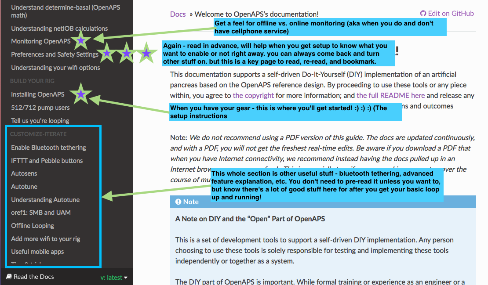
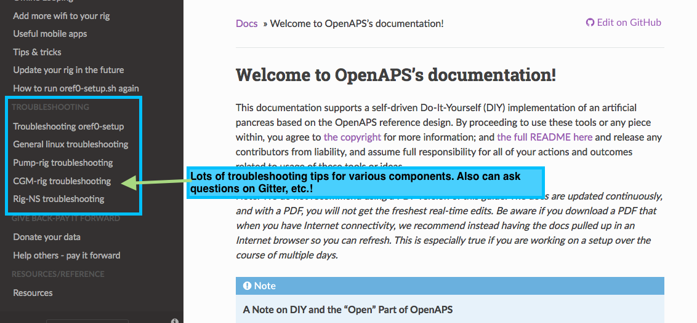
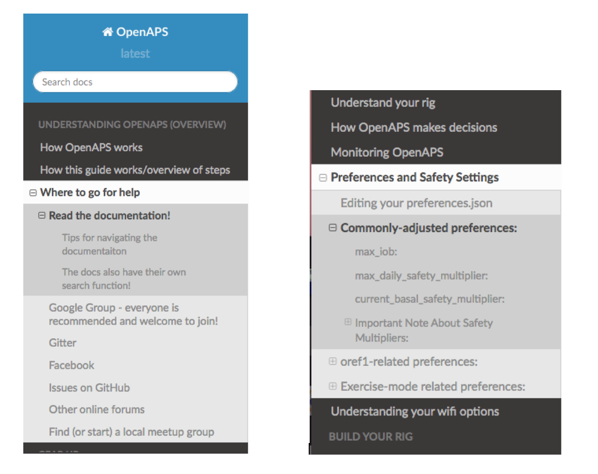
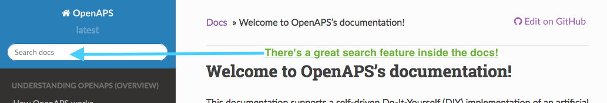

# Where to go for help

There are several ways to communicate with other participants and contributors in the #OpenAPS project. See also the [Resources](../Resources/index.rst) section for additional assistance.

**Note:** It's best practice not to share your pump's serial number, so make sure not to include it in pictures or pasted text output when seeking help on pump communication. Ditto for Nightscout URL and API secret and other private information that could enable someone to access your setup.

**Related**: You may want to read [this blog post for tips on how to best seek help when troubleshooting online](https://diyps.org/2017/03/19/tips-for-troubleshooting-diy-diabetes-devices-openaps-or-otherwise/) - there is a lot of information you can provide proactively when seeking help that will aid in getting your issue resolved more quickly.

### Read the documentation!

One huge resource is this documentation. We recommend bookmarking the [link](http://openaps.readthedocs.org/en/latest/) to the docs, as they are frequently updated (sometimes daily!) as we add more information, troubleshooting tips, and more. Anytime we are asked a question on one of the below channels, we try to add it to the documentation. So chances are, your question may already be answered here!

#### Tips for navigating the documentation

You may notice that the left hand side of the documentation has navigation. It is organized in order of setting up OpenAPS, and has various sections on finding your gear; what you should do before you build a rig; how to setup up your rig; and additional  features and tips and tricks for optimizing your looping setup. This navigation is long, you can mouse over the section and scroll down to see all the pages listed in the top-level navigation!

You'll also notice that there is more content than just these high-level pages! If you click on a link in the left, many of them expand to show the sub-sections include, which make it easy to jump directly to the section you're looking for. If there is a `+`, that means there is more content you can expand.

#### The docs also have their own search function!

See the top left of the docs for the search box. It's helpful to search *inside* the documentation itself, rather than Google, because you'll stay inside the most up to date version of the documentation. You may want to try a different word or shorter phrase if you don't get any results for your search phrase, as we may have worded a section differently.

### Google Group - everyone is recommended and welcome to join!
A google group focused on #OpenAPS development work can be found [here](https://groups.google.com/d/forum/openaps-dev). You can add yourself directly to the group. It's worth setting your preferences to receive all email from the group; there's not a huge volume, and this is one of the ways we share updates about hardware or release announcements if you're not hanging out on Gitter or Facebook or Twitter.

### Gitter
[Gitter](https://gitter.im/) is a messaging/chat service similar to IRC. It provides integration with GitHub and several other services. It's the best place to get real-time support with anything related to OpenAPS. (Here's [why we often recommend asking questions on Gitter](https://diyps.org/2016/08/17/why-you-should-post-questions-in-gitter/).)

* The [nightscout/intend-to-bolus]( https://gitter.im/nightscout/intend-to-bolus) channel is where you will find active #OpenAPS discussions ranging from technical issues with openaps tools to control theory to general information. It is a great place to introduce yourself and get some help from those who are a few steps further down the road.
* For Autotune conversations, use the [openaps/autotune channel](https://gitter.im/openaps/autotune)

  
<b>Click here</b> to expand a list of tips for using Gitter, from using the <b>search</b> function to <b>tagging someone</b> to <b>posting screenshots</b> or <b>posting logs</b>

 

**Search** 
Gitter has a search function to find old information, but since it isn't threaded conversations, you may need to spend some time reading the posts after the search result to find the ultimate resolution to the question.  So, if you find a particularly useful bit of information that you couldn't find in the docs...please make a [PR to the docs](http://openaps.readthedocs.io/en/latest/docs/Resources/my-first-pr.html) so that the information is permanently stored for others to find.

**Tag/mention someone**
Tag someone! You can tag particular people if you are responding to them directly by using the `@` symbol and then typing their username.  This will help notify the person that you are "speaking to them".  If someone asks you for information that shouldn't be shared in the public channel, you can also private message people by hovering over their profile picture and choosing the "chat privately" button. Please do not abuse the tagging or PM features: most questions are best asked untagged in the appropriate channel, so that anyone can respond to them as soon as they read Gitter and see the question. There are people from all over the world online at all hours who can help with most kinds of questions, and the core developers usually read every message in Gitter a few times per day and try to answer any questions that got missed.

**Posting photos or screenshots in Gitter**

Gitter has a mobile app which works great for posting text, but does not allow for posting images directly.  If you need to post a photo using the mobile app, you'll have to host your photo file somewhere like Dropbox and post the link to the file location.

Using the desktop application, you can simply drag and drop the file into the Gitter chat window.  The file will upload and then display in the chat thread after a short period of time to upload.

**Posting logs**

Posting copy-paste code from your rig is also another valuable activity for troubleshooting.  To post a single line of information, you can use the single-backtick-quote that is found on the key to the left of the number 1 key on the keyboard.  (hint: it is under the ~ on the same key).  You can also long-press the single quote key on your iPhone keypad to bring up the single-backtick-quote that will work in Gitter.  If you start and stop a portion of your text with those single quotes, it will `look like this`.

Posting multiple lines of copy-paste from your rig will also sometimes be needed.  You can do that by:

* start a single line of 3 single quotes (the same one we used in the example above)
* press `control-enter` to get a new line started
* paste the lines of code that you want to post
* press `control-enter` again to get another new line
* enter 3 single quotes to end the section

The copy-pasted lines should have 3 backticks on the line above and the line below.  The example below shows, on the bottom, how the formatted text yielded the black box of text in Gitter.  Using this format helps troubleshooters read your information easier than unformatted copy and paste.

### Facebook

There are multiple DIY closed loop groups on Facebook. 

* Everyone in the community is welcome to join the [Looped Group](https://www.facebook.com/groups/TheLoopedGroup/?fref=nf). All DIY closed loop users (OpenAPS, AndroidAPS, etc.) chat here.  You will need to request membership for the group and respond to a message from the group administrators prior to joining.

There are also numerous country-specific Facebook groups. You will still want to join the main Looped group, but country-specific groups may be helpful regarding local-specific details about access to hardware, supplies, etc. Similar to Looped, you will need to request membership for the group and respond to a message from the group administrators prior to joining any of these groups.

* UK, join [Looped UK](https://www.facebook.com/groups/LoopedUK/). 
* Germany, join [Looped-DE](https://www.facebook.com/groups/loopedDE/). 
* Australia, join [Aussie, Aussie, Aussie, Loop, Loop, Loop](https://www.facebook.com/groups/1558147697576040/). 
* New Zealand, join [Aotearoa DIY Artificial Pancreas Society](https://www.facebook.com/groups/1405899059555406/).

### Issues on GitHub
One of the above channels is the best place for real-time or near-time troubleshooting. However, you may occasionally stumble across a new bug or edge case that we want to work on resolving. If you're asked to "create an issue", that usually means going to [the oref0 repository on Github and logging an issue there](https://github.com/openaps/oref0/issues). (You may also be asked to create issues for the openaps toolkit or decocare, etc. but usually it's oref0 related.) 

### Other online forums
Those in the #OpenAPS community are frequently found in other forums, such as on Twitter (using [the #OpenAPS hashtag](https://twitter.com/search?f=tweets&vertical=default&q=%23OpenAPS&src=typd), as well as [#WeAreNotWaiting](https://twitter.com/search?f=tweets&vertical=default&q=%23WeAreNotWaiting&src=typd)) and on Facebook in the ["CGM In The Cloud"](https://www.facebook.com/groups/cgminthecloud/) and ["Looped"](https://www.facebook.com/groups/TheLoopedGroup/)group.

* There is also a [Slack channel](https://omniapsslack.azurewebsites.net/) to discuss communication around other pumps that are being explored and worked on, but aren't yet DIY loopable.

### Find (or start) a local meetup group

Here are some places where there are regular-ish meetups, and how to find out about them:
* Seattle - join the [Seattle OpenAPS Google Group](https://groups.google.com/forum/#!forum/seattleopenaps) to find out about upcoming meetups
* NYC - join the [NYC OpenAPS Google Group](https://groups.google.com/forum/#!forum/openaps-nyc) to find out about upcoming meetups
