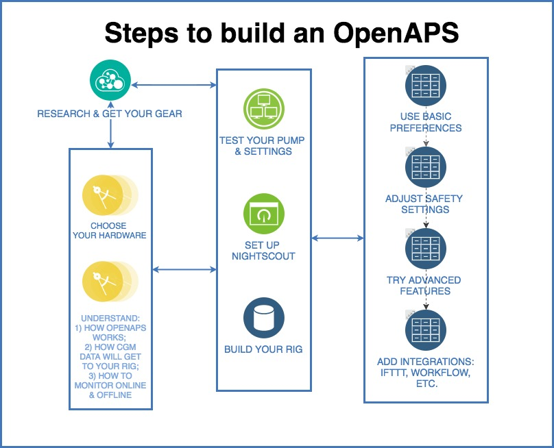

# How you will build your rig

The OpenAPS setup process can be broken up into several parts:

As with all things new, there is a little bit of a learning curve to building your first OpenAPS rig.  Read slowly, double-check your spelling and make sure you don't skip steps.  If you get stuck or are unsure, you can use the screenshots to compare how the resulting screens should look.  You can also post to Gitter or Facebook to ask for specific help if you find yourself stuck.

Over time, you may also choose to enable advanced features or update your rig, as more features and algorithm improvements become available. You should make sure to stay plugged in to key channels (like openaps-dev google group; Looped on Facebook; and on Twitter by following @OpenAPS) so you can be aware when updates become available. You should also make sure to tell us when you’ve closed your loop, which includes notes on how to join the safety-critical announcement list in case we need to alert you to any safety-related changes or updates.

