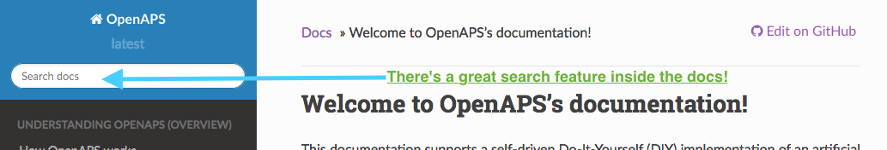
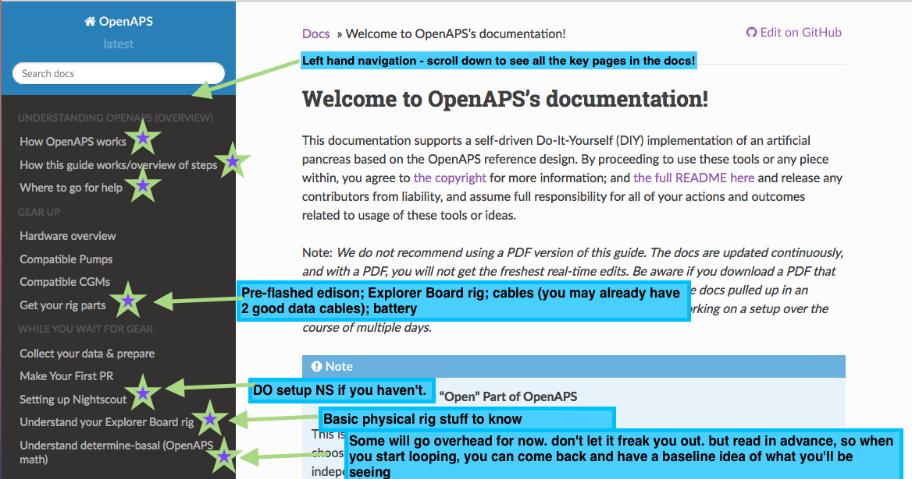
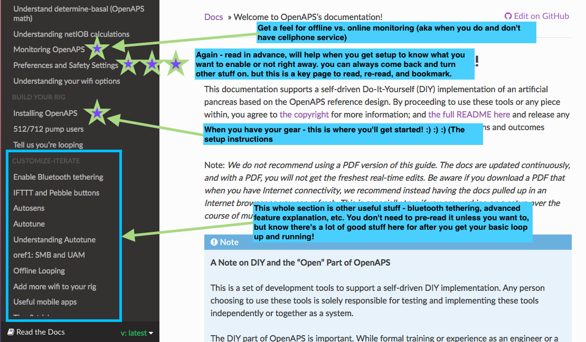
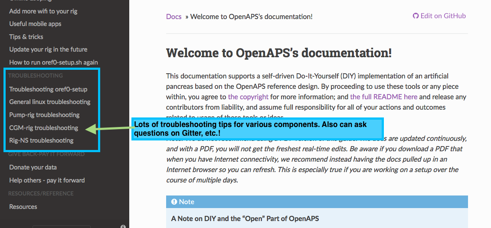
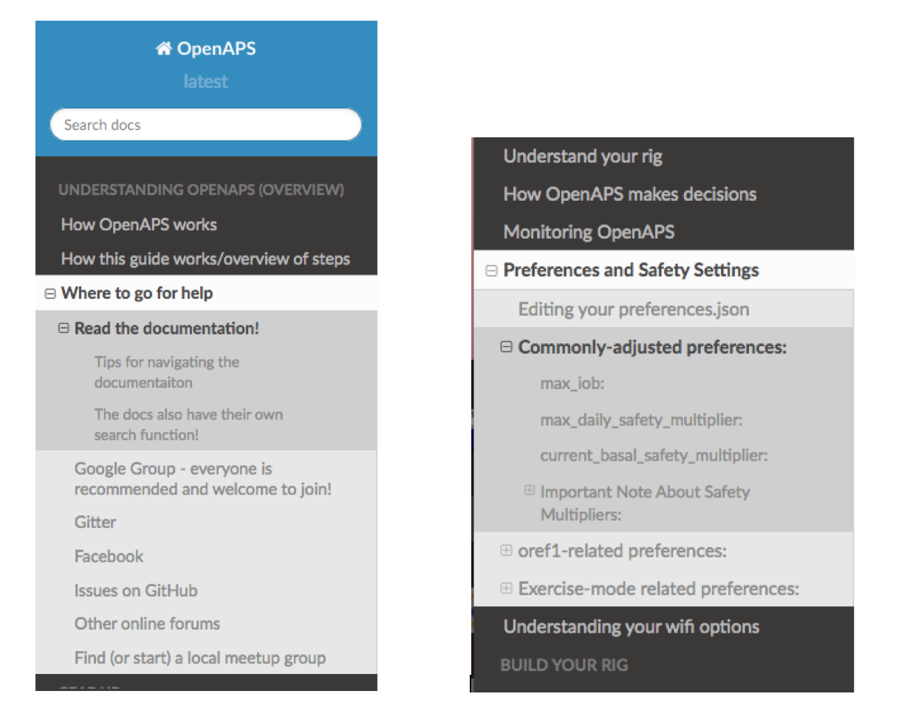

# Using this documentation

We recommend bookmarking the [link](http://openaps.readthedocs.org/en/latest/) to the docs, as they are frequently updated (sometimes daily!) as we add more information, troubleshooting tips, and more. Anytime we are asked a question on one of the below channels, we try to add it to the documentation. So chances are, your question may already be answered here!

**Warning:** We do not recommend using a PDF version of this guide. The docs are updated continuously, and with a PDF, you will not get the freshest real-time edits. If you have Internet connectivity, we recommend instead having the docs pulled up in an Internet browser so you can refresh. This is especially true if you are working on a setup over the course of multiple days.

## Formatting in this guide

* Wherever you see text that is formatted `like this`, it is usually a code snippet. You should copy and paste instead of attempting to type this out; this will save you debugging time for finding your typos.

* Wherever there are `<bracketed_components>`, these are meant for you to insert your own information. Most of the time, it doesn't matter what you choose **as long as you stay consistent throughout this guide**. That means if you choose `myopenaps` as your  `<myopenaps>` directory, you must use `myopenaps` every time you see `<myopenaps>`. Choose carefully when naming things so it’s easy to remember. Do not include the `< >` brackets in your name.

## The docs have their own search function!

See the top left of the docs for the search box. It's helpful to search *inside* the documentation itself, rather than Google, because you'll stay inside the most up to date version of the documentation. You may want to try a different word or shorter phrase if you don't get any results for your search phrase, as we may have worded a section differently.

## Tips for navigating the documentation

You may notice that the left hand side of the documentation has navigation. It is organized in order of setting up OpenAPS, and has various sections on finding your gear; what you should do before you build a rig; how to setup up your rig; and additional  features and tips and tricks for optimizing your looping setup. This navigation is long, you can mouse over the section and scroll down to see all the pages listed in the top-level navigation!

You'll also notice that there is more content than just these high-level pages! If you click on a link in the left, many of them expand to show the sub-sections include, which make it easy to jump directly to the section you're looking for. If there is a `+`, that means there is more content you can expand.

