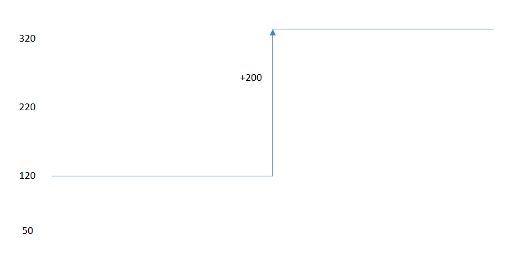
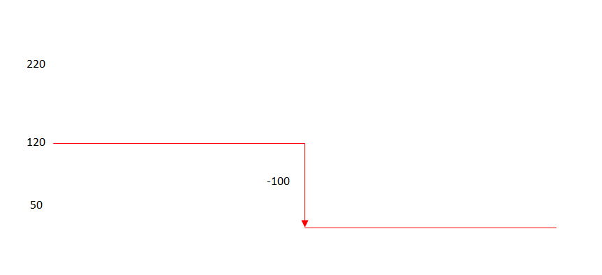
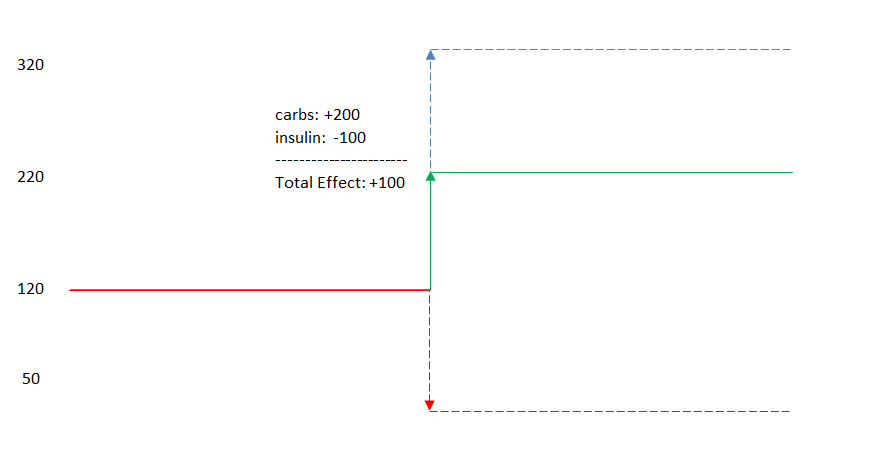
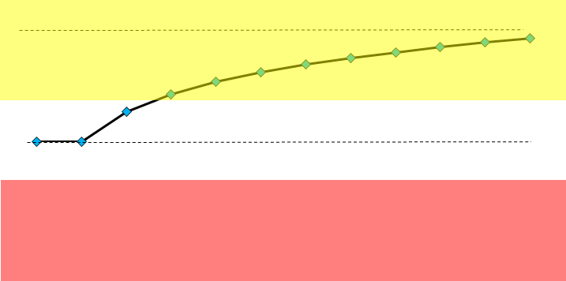
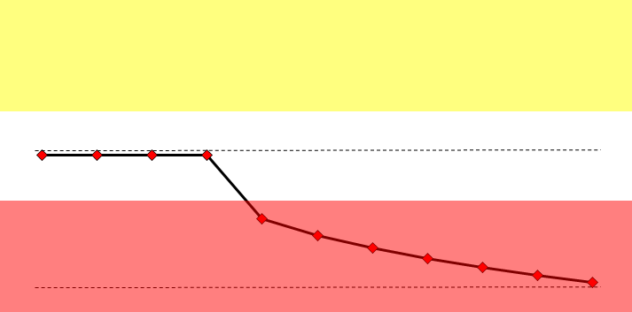
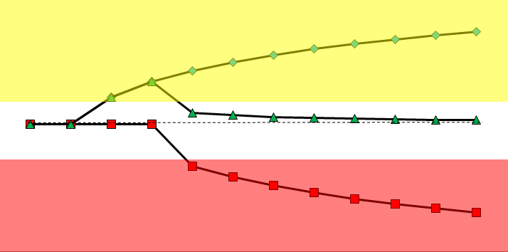
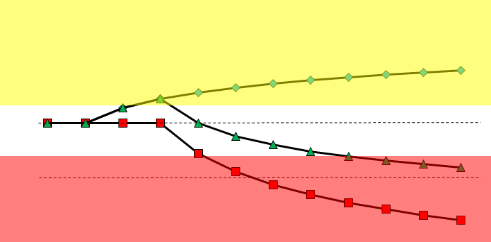

# Diabetes Math

Before diving into the inner workings of the OpenAPS algorithms, lets review how carbohydrates and insulin affect blood glucose.  If you're already a pro, consider skipping down to [Understanding the determine-basal logic](#understanding-the-determine-basal-logic).

The basic, familiar rules are that carbs make blood glucose (BG) increase, and insulin makes it decrease.  There are a number of other things that affect it (exercise, sleep, fat, illness, stress, glucagon etc.) but they are not part of the OpenAPS calculations.  Exercise can be indirectly handled in OpenAPS by setting a higher BG target temporarily [(see below)](#using-temporary-targets-for-eating-soon-mode-and-activity-modes).

In this simplified view, you are starting at 120.  You eat enough carbs to raise BG by 200.  This happens when the carbs are digested, converted to glucose and released into the bloodstream, increasing the glucose concentration.




Here, you also start at 120 and then take some insulin to lower BG by 100.  Insulin allows cells to absorb the glucose, removing it from the bloodstream and lowering the glucose concentration.  The amount your BG drops from taking 1 unit of insulin is your insulin sensitivity factor (ISF).




It's important to remember that carbs and insulin both affect BG, but neither one affects the other.  In other words, eating carbs doesn't change your ISF.  Taking more insulin doesn't change the carb digestion process.  If you do both at the same time, you have to add the independent effects of carbs and insulin to see where BG will come out.




## The Plot Thickens

Unfortunately this gets more complicated because both carb digestion and insulin work over time, not immediately.  Carbs will generally have a quicker effect compared to insulin.

In this chart you eat carbs and your BG starts to rise.  There is a flat part at the beginning.  This is the time between when you eat and when BG starts to rise, called "dead time" in process control theory.  BG rises more quickly at the beginning and then tapers off as it approaches its eventual value.




Insulin also has a dead time, but it is typically longer than for carbs.




Assuming that the carbs are eaten at the same time as the insulin is taken, the carbs will start to have their effect on BG before the insulin starts working.  Even if the amount of insulin taken is perfect to eventually get your BG back to the starting point, it is very likely to rise first if the insulin is taken at the same time as the carbs eaten.  The best way to fix this is by taking the insulin a bit before the meal.




However, you have to be careful not to delay the meal too much or you'll get a dip in BG before the carbs kick in.


People commonly overreact to the short term BG rise by taking more insulin.  They get concerned when their CGM shows the BG high and rising, while OpenAPS is setting the basal rate to 0.  Intuitively, your reaction would be to take insulin to try to fix this.  However, OpenAPS is anticipating what will happen later on and adjusting accordingly.  If you take a larger dose or a second dose of insulin, it won't prevent the high after the meal, but it can lead to low BG once the insulin starts taking effect.




## Prediction and Reaction

OpenAPS uses a predictive model.  It estimates what BG will do in the future and changes the rate of insulin infusion to bring BG closer to the target.  The real BG will never exactly match the calculation, and due to some of the unmeasured factors mentioned above, it can be off by a lot.

Each loop in the cycle, OpenAPS compares what it predicted would happen to BG to what actually happened.  In control systems terminology this is an estimate of the unmeasured disturbance.  By subtracting out the predicted behavior, adjustments can be made for the observed remainder.  This is reactive in the sense that the action can't be taken until after the BG has already changed.  Given the dead time and time needed for insulin to fully act, reactive adjustments are going to take quite some time to have an effect.  The more OpenAPS can accurately predict the changes in BG, the better the control will be.  That's why its important to give it the best information available such as good carb counts, well-calibrated CGM readings and good estimates for duration of insulin activity.  We want fewer lows, shorter highs, and more time in our optimal range.

Predictive models like OpenAPS generally perform better than PID (proportional-integral-derivative control) because plain PID is purely reactive.  A good PID implementation will make up for this somewhat by using a feedforward input that modifies the behavior of the controller in response to known factors like carbs.  PID also has advantages that include a small number of tuning parameters and having been extensively studied and implemented in the process control industry for over 50 years.  However, setting PID tuning parameters is non-intuitive and is best done through controlled experiments called step tests.  In contrast, OpenAPS algorithms operate using concepts familiar to diabetics who have practice managing their BG.

# Understanding the determine-basal logic

The core, lowest level logic behind any oref0 implementation of OpenAPS can be found in [`oref0/lib/determine-basal/determine-basal.js`](https://github.com/openaps/oref0/blob/master/lib/determine-basal/determine-basal.js). That code pulls together the required inputs (namely, recent CGM readings, current pump settings, including insulin on board and carbohydrates consumed, and your profile settings) and performs the calculations to make the recommended changes in temp basal rates that OpenAPS could/will enact. 

Short of reading the actual code, one way to start to understand the key `determine-basal` logic is to understand the inputs passed into the script/program and how to interpret the outputs from the script/program. 

## Summary of inputs

The `determine-basal` algorithm requires 4 input files:
* iob.json
* currenttemp.json
* glucose.json
* profile.json

In addition, the algorithm can accept 2 optional input files:
* meal.json
* autosens.json

When running `oref0-determine-basal.js`, the first thing you'll see is a summary of all the inputs, which might look something like this:

```
{"carbs":0,"boluses":0}
{"delta":5,"glucose":161,"short_avgdelta":4.5,"long_avgdelta":3.92}
{"duration":0,"rate":0,"temp":"absolute"}
{"iob":0,"activity":0,"bolussnooze":0,"basaliob":0,"netbasalinsulin":0,"hightempinsulin":0,"time":"2017-03-17T00:34:51.000Z"}
{"carbs_hr":28,"max_iob":1,"dia":3,"type":"current","current_basal":1.1,"max_daily_basal":1.3,"max_basal":3,"max_bg":120,"min_bg":115,"carbratio":10,"sens":40}
```

* meal.json = `{"carbs":0,"boluses":0}`
  * `carbs` = # of carbs consumed
  * `boluses` = amount of bolus insulin delivered
  
  Those data come from what you entered into your pump or Nightscout web app. If provided, allows determine-basal to decide when it is appropriate to enable Meal Assist.
* glucose.json = `{"delta":5,"glucose":161,"short_avgdelta":4.5,"long_avgdelta":3.92}`
  * `delta` = change in BG between `glucose` (most recent BG) and an average of BG value from between 2.5 and 7.5 minutes ago (usually just a single BG value from 5 minutes ago)
  * `glucose` = most recent BG
  * `short_avgdelta` = change in BG between `glucose` (most recent BG) and an average of BG values from between 2.5 and 17.5 minutes ago (that average represents what BG levels were approximately 10 minutes ago)
  * `long_avgdelta` = change in BG between `glucose` (most recent BG) and an average of BG values from between 17.5 and 42.5 minutes ago (that average represents what BG levels were approximately 30 minutes ago)
  
  Those data come from your connected CGM or from your Nightscout web app.
* temp_basal.json = `{"duration":0,"rate":0,"temp":"absolute"}`

  * `duration` = Length of time temp basal will run. A duration of 0 indicates none is running.
  * `rate` = Units/hr basal rate is set to
  * `temp` = Type of temporary basal rate in use. OpenAPS uses `absolute` basal rates only.
  
  Those data come from your pump.
* iob.json = `{"iob":0,"activity":0,"bolussnooze":0,"basaliob":0,"netbasalinsulin":0,"hightempinsulin":0,"time":"2017-03-17T00:34:51.000Z"}`
  * `iob` = Units of Insulin on Board (IOB), ***net*** of your pre-programmed basal rates. Net IOB takes all pre-programmed basal, OpenAPS temp basal, and bolus insulin into account. Note: `iob` can be negative when OpenAPS temp basal rate is below your pre-programmed basal rate (referred to as "low-temping").
  * `activity` = Units of insulin active in the previous minute. Approximately equal to (net IOB, 1 minute ago) - (net IOB, now).
  * `bolussnooze` = Units of bolus IOB, if duration of insulin activity (DIA) was half what you specified in your pump settings. (`dia_bolussnooze_divisor` in profile.json is set by default to equal 2, but you may adjust this if you'd like OpenAPS to activate a low-temp sooner or later after bolusing.) `bolussnooze` is used in *oref0-determine-basal.js* to determine how long to avoid low-temping after a bolus while waiting for carbs to kick in.
  * `basaliob` = Units of ***net*** basal Insulin on Board (IOB). This value does not include the IOB effects of boluses; just the difference between OpenAPS temp basal rates and your pre-programmed basal rates. As such, this value can be negative when OpenAPS has set a low-temp basal rate. Note: `max_iob` (described below) provides a constraint on how high this value can be. The `determine-basal` logic will not recommend a temp basal rate that will result in `basaliob` being greater than `max_iob`.
  * `netbasalinsulin` = this variable isn't used in OpenAPS logic anymore, but hasn't been removed from iob.json yet.
  * `hightempinsulin` = this variable isn't used in OpenAPS logic anymore, but hasn't been removed from iob.json yet.
  * `time` = current time

  Those data are calculated based on information received from your pump.
* preferences.json = `{"carbs_hr":28,"max_iob":1,"dia":3,"type":"current","current_basal":1.1,"max_daily_basal":1.3,"max_basal":3,"max_bg":120,"min_bg":115,"carbratio":10,"sens":40}`
	* Contains all of the user’s relevant pump settings

	* max_iob = maximum amount of net IOB that OpenAPS will ever allow when setting a high-temp basal rate. **This is an important safety measure and integral part of the OpenAPS design.** You should set this value based on your current basal rates and insulin sensitivity factor (ISF, or `sens` in the OpenAPS code) and after studying how the OpenAPS algorithm performs in low-glucose suspend mode for (at least) several days.

	Those data are set during the OpenAPS setup script (or modified by you directly) and based on information received from your pump.

## Summary of outputs

After displaying the summary of all input data, oref0-determine-basal outputs a recommended temp basal JSON (stored in suggested.json), which includes an explanation of why it's recommending that.  It might look something like this:

```
{"temp":"absolute","bg":110,"tick":-2,"eventualBG":95,"snoozeBG":95,"mealAssist":"Off: Carbs: 0 Boluses: 0 Target: 117.5 Deviation: -15 BGI: 0","reason":"Eventual BG 95<115, setting -1.15U/hr","duration":30,"rate":0}
```

In this case, BG is 110 mg/dL (6.1 mmol/L), and falling slowly.  With zero IOB, you would expect BG to be flat, so the falling BG generates a "deviation" from what's expected.  In this case, because avgdelta is -2.5 mg/dL/5m (-0.1 mmol/L/5m), vs. BGI of 0, that avgdelta is extrapolated out for the next 30 minutes, resulting in a deviation of -15 mg/dL (-0.8 mmol/L).

deviation = avgdelta * 6 (or every 5 minutes for the next 30 minutes) = -15 mg/dL (-0.8 mmol/L).

The deviation is then applied to the current BG to get an eventualBG of 95 mg/dL (5.3 mmol/L).  There is no bolussnooze IOB, so snoozeBG is also 95  mg/dL (5.3 mmol/L), and because (among other things) avgdelta is negative, mealAssist remains off.  To correct from 95 mg/dL (5.3 mmol/L) up to 115 mg/dL (6.4 mmol/L) would require a -1.15U/hr temp for 30m, and since that is impossibly low, determine-basal recommends setting a temp basal to zero and stopping all insulin delivery for now.

Full definition of suggested.json:
* temp = type of temporary basal - always "absolute"
* bg = current blood glucose
* tick = change since last blood glucose
* eventualBG = predicted value of blood glucose (based on openaps logic) after full effect of IOB
* snoozeBG = predicted value of blood glucose adjusted for bolussnooze IOB
* predBGs = predicted blood sugars over next N minutes based on OpenAPS logic, in 5 minute increments
* IOB = net insulin on board
* reason = summary of why the decision was made
* duration = time for recommended temp basal
* rate = rate of recommended temp basal in units/hour

## Understanding “Advanced Meal Assist” (AMA) and the three purple lines

OpenAPS can high-temp more quickly after a meal bolus if it knows about carbs (which you can enter from either the bolus wizard, or if your rig is online, via Nightscout and/or IFTTT (Alexa, Siri, Pebble). 

With AMA, once you enable forecast display in your Nightscout configuration, you will be able to see multiple purple line predictions.  To do this, click the three dots next to your timeframe horizon (3HR, 6HR, 12HR, 24HR) and then enable "Show OpenAPS Forecasts".  Once enabled, you will have multiple purple line predictions in Nightscout. (Unless you have NO carbs onboard, then you will have only one purple line.)

* (Usually) Top line == assumes 10 mg/dL/5m carb (0.6 mmol/L/5m) absorption  - aka "aCOB" (see notes below about removing it in 0.6.0 and later)

* (Usually) Middle line == based on current carb absorption (if current carb absorption is > 10 mg/dL/5m, this will end up being the top line)

* Bottom line == based on insulin only

The purple lines in Nightscout have changed beginning in oref0 0.6.0 and beyond. We are removing aCOB (unused by everyone) and subbing in a "zero temp"-predBG line (ZTpredBG, etc.) showing how long it will take BG to level off at/above target if deviations suddenly cease and we run a zero temp until then. It then uses the lowest of those ZTPredBGs to ensure that we're dosing safely with UAM: if UAM predicts BG to stay high (based on deviations), but we wouldn't be able to prevent a low if those deviations suddenly stopped, we'll adjust the UAM-based insulinReq to be somewhat less aggressive. Conversely, if UAM shows BG ending up below target in 4h, but the ZTPredBGs show that we can safely zero temp and level out well above target, it will allow oref0 to be slightly more aggressive and bring BG down faster, safe in the knowledge it can zero temp if needed. NOTE: you will require an update to NS to view the new line. 

## Using temporary targets for “Eating Soon” mode and “Activity” modes

Setting temporary targets is a great way to smoothly (safely) make adjustments using your closed loop instead of manually having to make as many adjustments. The two most frequent scenarios for temp targets are when you plan on eating or exercising, and you want to get all of your parameters (e.g., Insulin On Board - IOB) at an ideal value to keep BGs as flat as possible. Temporary or "temp" targets are ideal for when you want the loop to adjust to a different target level for a short period of time (temporarily) and don't want to hassle with changing targets in the pump (which is where OpenAPS normally pulls targets from). 

Let's take "Eating Soon Mode" as an example. You know you'll be eating lunch in an hour, so you set a temporary target of 80 mg/dL (4.4 mmol/L) over the next hour. Because your blood glucose will go lower, it's a good practice to make sure your sensor is reliable and check you blood glucose before setting the temporary target. Otherwise you may cause a hypo. If your OpenAPS rig is connected to the Internet, it will pull the target from Nightscout and treat to the temporary target, rather than your usual closed loop target. The outcome of this means you'll have more IOB peaking closer to when you're eating, and that (along with your usual meal bolus) will help reduce the post-meal BG spike. There's some **really important background information** you should understand for this, so be sure and read through the DIYPS blog entries about it ([How to do "eating soon" mode](https://diyps.org/2015/03/26/how-to-do-eating-soon-mode-diyps-lessons-learned/) and [Picture this: How to do "eating soon" mode](https://diyps.org/2016/07/11/picture-this-how-to-do-eating-soon-mode/)).

"Activity Mode" sets temporary targets that are higher than your normal targets, so you will want to set these with knowledge of how different activity affects your BG. You're doing essentially the same things as with Eating Soon Mode, but instead of setting a *lower* target to increase IOB, you're setting a *higher* target to provide a "cushion" to avoid a low that may occur as a result of the activity you're planning. With a higher target, if connected to the Internet so your rig knows about it, it will only do temps with the temporary high target, to provide that "cushion". You may want to consider setting activity mode *prior* to activity, in order to reduce the peak net IOB you have when activity commences. (Example would be setting activity mode to 140 mg/dL (7.8 mmol/L) one hour before you go for a hard run after dinner, to help reduce the impact of any meal time insulin that would otherwise be peaking at the time. You may still have to do carbs or other strategies to fully prevent lows, but this is one approach to help - as is being aware of net IOB going into any type of activity.)

Once you have a good idea of how you would set those parameters for your system, you'll be ready to set some temporary targets. You can test this out manually by entering a temporary target using [Care Portal](http://www.nightscout.info/wiki/faqs-2/wifi-at-school/nightscout-care-portal) in Nightscout. You'll see your temporary target appear as a grey bar in Nightscout, spanning the length of the time frame you entered. You can also cancel the temporary targets via Care Portal. 

When you're ready to use this regularly, you can also configure IFTTT to trigger a temporary basal from your Pebble/Apple Watch, etc., or via an [Alexa skill](https://github.com/nightscout/cgm-remote-monitor#alexa-amazon-alexa). You'll find a breakdown of how to use IFTTT on the next page.


## Exploring further

For each different situation, the determine-basal output will be slightly different, but it should always provide a reasonable recommendation and list any temp basal that would be needed to start bringing BG back to target.  If you are unclear on why it is making a particular recommendation, you can explore further by searching lib/determine-basal/determine-basal.js (the library with the core decision tree logic) for the keywords in the reason field (for example, "setting" in this case would find a line (`rT.reason += ", setting " + rate + "U/hr";`) matching the output above, and from there you could read up and see what `if` clauses resulted in making that decision.  In this case, it was because (working backwards) `if (snoozeBG > profile.min_bg)` was false (so we took the `else`), but `if (eventualBG < profile.min_bg)` was true (with the explanatory comment to tell you that means "if eventual BG is below target").

If after reading through the code you are still unclear as to why determine-basal made a given decision (or think it may be the wrong decision for the situation), please join the #intend-to-bolus channel on Gitter, paste your output and any other context, and we'll be happy to discuss with you what it was doing and why, and whether that's the best thing to do in that and similar situations.

## Note about Square Boluses, Dual Wave Boluses, and Basal Pump Settings of Zero

Due to the way the Medtronic pumps operate, temp basals can only be set when there is no bolus running, including extended (square) / dual wave boluses.  

Thus, if you use an extended bolus for carb heavy meals (e.g., pizza), which may still be the optimal approach for you, OpenAPS will not be able to provide temp basals during the extended bolus.

If you have periods in the day where your pump normally has basal settings of zero, your loop will not work!  You can resolve this by setting the lowest possible basal setting your pump will permit.  OpenAPS will then issue temp basals of zero, as needed.
