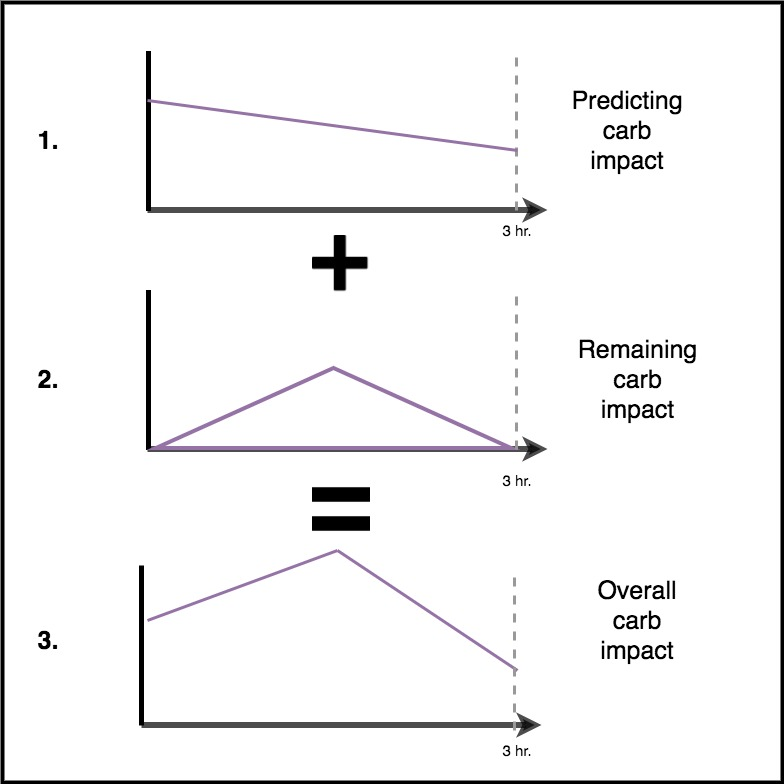

# Understanding the determine-basal logic

The core, lowest level logic behind any oref0 implementation of OpenAPS can be found in [`oref0/lib/determine-basal/determine-basal.js`](https://github.com/openaps/oref0/blob/master/lib/determine-basal/determine-basal.js). That code pulls together the required inputs (namely, recent CGM readings, current pump settings, including insulin on board and carbohydrates consumed, and your profile settings) and performs the calculations to make the recommended changes in temp basal rates that OpenAPS could/will enact. 

## Basic diabetes math

OpenAPS follows the same logic that a person with diabetes uses to make dosing decisions. Generally, this means looking at the current BG; subtracting the target; and applying your ISF (correction factor) to determine how much insulin is needed to correct the blood sugar to target. You can subtract any "insulin on board" from the amount needed. You can also add insulin needed to cover carbohydrates.

In OpenAPS, we can do both a positive (more insulin) and a negative (less insulin) correction by making adjustments to your underlying basal rates to adjust insulin up or down to help bring the "eventual" BG into target. 

## OpenAPS decision inputs

In OpenAPS, we take the same inputs you would use to manually decide what to do, but we also factor other things into our calculation.

This includes:

* Blood glucose information
  * `delta` = change in BG between `glucose` (most recent BG) and an average of BG value from between 2.5 and 7.5 minutes ago (usually just a single BG value from 5 minutes ago)
  * `glucose` = most recent BG
  * `short_avgdelta` = average rate of change (per 5m) in BG values between `glucose` (most recent BG) and each BG reading from 2.5 to 17.5 minutes ago 
  * `long_avgdelta` = average rate of change (per 5m) in BG values between `glucose` (most recent BG) and each BG reading  from 17.5 to 42.5 minutes ago 
* Past insulin dosing information, pulled from your pump
  * `iob` = Units of Insulin on Board (IOB), ***net*** of your pre-programmed basal rates. Net IOB takes all pre-programmed basal, OpenAPS temp basal, and bolus insulin into account. Note: `iob` can be negative when OpenAPS temp basal rate is below your pre-programmed basal rate (referred to as "low-temping"). *This will always be different than pump-calculated IOB, because it only takes into account boluses - ignore pump IOB.* This is a high level overview, but you can dive into more detail around how insulin activity is calculated [here](http://openaps.readthedocs.io/en/latest/docs/While%20You%20Wait%20For%20Gear/understanding-insulin-on-board-calculations.html).
  * `basaliob` = Units of ***net*** basal Insulin on Board (IOB). This value does not include the IOB effects of boluses; just the difference between OpenAPS temp basal rates and your pre-programmed basal rates. As such, this value can be negative when OpenAPS has set a low-temp basal rate. 
  * `bolusiob` = Units of bolus Insulin on Board. Does not take into account any temp basals.

* We also add other calculations that we do to better predict and analyze what is happening:
  * `dev` or `deviation` = how much actual BG change is deviating from the BGI 
  * `BGI` (Blood Glucose Impact) = the degree to which BG “should” be rising or falling based on insulin activity alone. 
  * `ISF` (Insulin Sensitivity Factor; sometimes known as correction factor) = ISF is anchored from the value in your pump; but if you use autotune and/or autosens, the ISF value shown is what is currently being used by OpenAPS, as modified by the Sensitivity Ratio
  * `CR` (Carb Ratio) = As with ISF, it is anchored from the value in your pump; but if you use autotune and/or autosens, the CR value shown is what is currently being used by OpenAPS
  * `Eventual BG `= what BG is estimated to be by the end of DIA
  * `minGuardBG, IOBpredBG, UAMpredBG` = eventual BG predictions based on 1) the lowest your BG is estimated to get over DIA; 2) predictions based on IOB only; and 3) predictions based on current deviations ramping down to zero at the same rate they have been recently. These represent the last entry on the purple prediction lines.
  * `Sensitivity Ratio` = the ratio of how sensitive or resistant you are. This ratio is calculated by "Autosensitivity" (or "autosens"), and this ratio is applied to both basal and ISF to adjust accordingly. <1.0 = sensitive; >1.0 = resistant.  If your preferences allow it, sensitivityRatio can also be modified by temp targets.
  * `Target` = pulled from your pump target; overridden if you have enacted a temporary target running.
  * `Carb Impact` = we estimate carb impact by looking at what we predict to happen with your carbs entered (`predCI`) and adding it to our estimate of the remaining carb impact (`remainingCI`)
  * `Safety Threshold` = `min_bg - 0.5*(min_bg-40)` where `min_bg` is your BG target
  
You may also see information about settings, either from your pump or from your `preferences.json` file, that are limiting the insulin dosing decisions that OpenAPS would otherwise make. Make sure to [read the preferences page](http://openaps.readthedocs.io/en/latest/docs/While%20You%20Wait%20For%20Gear/preferences-and-safety-settings.html) before you set up OpenAPS to understand what settings you have by default, and know how to get back to that page if you ever see a setting displayed in your pill. There is also [a handy chart with examples](http://openaps.readthedocs.io/en/latest/docs/While%20You%20Wait%20For%20Gear/preferences-and-safety-settings.html#a-few-examples) to help you understand how settings may impact the dosing output.

## OpenAPS decision outputs

After taking into account all of the above, oref0 will put out a recommendation of what needs to be done. This also includes the explanation of the variables above, so you can check and assess if you think it's doing the right thing. Generally, it will display all of the above values, plus the output of the decision of any temporary basal rates and/or boluses it decides it needs. This is the "reason" field.

* Temp basals will be displayed with the `duration` (length of time temp basal will run. A duration of 0 indicates none is running) and `rate` (units/hr basal rate).
* You may also see `insulinReq`, showing how much insulin is needed. This usually displays when OpenAPS is prepping to issue SMB's ([an advanced setting](http://openaps.readthedocs.io/en/latest/docs/Customize-Iterate/oref1.html)).

## Understanding the purple prediction lines

Once you enable forecast display in your Nightscout configuration, you will be able to see multiple purple line predictions.  To do this, click the three dots next to your timeframe horizon (3HR, 6HR, 12HR, 24HR) and then enable "Show OpenAPS Forecasts".  Once enabled, you will have multiple purple line predictions in Nightscout. These purple lines show you the different predictions based on current carb absorption; insulin only; (optional feature: unannounced meal/effect detection); and showing how long it will take BG to level off at/above target if deviations suddenly cease and we run a zero temp until then.

These purple lines are helpful in understanding, at a glance, *why* OpenAPS is making the decisions it is, based on your near-term and longer-term BG predictions.

## Understanding the basic logic (written version) 

Here is a written explanation of the code that you can explore. For some visual and practical examples, see the [OpenAPS algorithm examples](https://openaps.readthedocs.io/en/latest/docs/While%20You%20Wait%20For%20Gear/Understand-determine-basal.html#openaps-algorithm-examples) section.

The OpenAPS reference design algorithm, oref0, determines insulin dosing based on a number of scenarios that it forecasts with different types of predictions. Two of these scenarios, the “eventual” (eventualBG) and “IOB-based” (IOBpredBGs) ones, attempt to predict BGs in situations without (much) carb absorption. Another scenario, the “zero-temp” (ZTpredBGs) one, attempts to predict the “worst likely case” if observed carb absorption suddenly ceases and if a zero-temp were applied until BG begins rising at/above target. The final two scenarios, the COB-based (COBpredBGs) one and the unannounced meal (UAM)-based (UAMpredBGs) one, attempt to predict how long an observed BG rise will continue, to dose appropriately for announced and unannounced meals, and for anything else that causes a sustained rise in BG.

COB-based BG predictions require the announcement of meals, with a rough estimate of carbs. Carb counting need not be precise: any estimate within 1.5x of the actual value will generally be sufficient for near-optimal dosing, as the COB-based and UAM-based predictions are blended (with the UAM-based dosing constrained by the zero-temp predictions) to generate dosing recommendations. If no carb announcement is provided, UAM-based predictions can be used to reactively dose for a meal rise, which is sufficient, with Fiasp, to bring BG back into range fairly quickly after unannounced meals.

When no carb announcements are available, or when announced carbs are mostly absorbed and COB-based predictions are less reliable, it is also possible to predict that observed deviations will gradually return to zero over some period of time. (A “deviation” term is calculated represent how much BG is currently rising or falling relative to what it should be doing based solely on insulin activity.) Once deviations have peaked and are decreasing at a reasonable rate, oref0’s UAM calculations assume that the deviations will continue to decrease at the same rate until they reach zero. If they’re decreasing, but too slowly, it assumes they’ll decrease linearly to zero over 3 hours. If deviations are still increasing, it assumes they’ll peak immediately and start decreasing at ⅓ of the rate they increased from their recent minimum. 

#### eventualBG

 
<b>Click here to expand the eventualBG description</b>

The simplest and oldest prediction, called eventualBG, uses traditional bolus calculator math. 

Specifically, the naive_eventualBG is set to current BG - IOB*ISF.

It also calculates a “deviation” term, which represents how much BG is currently rising or falling relative to what it should be doing based solely on insulin activity. These deviations are projected to continue for the next 30 minutes (or, equivalently, to linearly decrease from the current value to zero over the next 60 minutes).

Then, eventualBG = naive_eventualBG + deviation

#### IOBpredBGs

 
<b>Click here to expand the IOBpredBGs description</b>

The eventualBG, by its nature, predicts only an eventual BG value, once all insulin activity takes effect.

In order to make predictions about what BGs will do between now and then, oref0 performs a calculation similar to the eventualBG calculation, but every 5 minutes (for 4 hours). In that calculation, the predicted blood glucose impact of insulin (predBGI) and predicted deviation (predDev) are calculated for every 5-minute interval, allowing us to predict a BG value for each interval, which are stored in the IOBpredBGs array. As with the eventualBG calculation, deviations are projected to linearly decrease from the current value to zero over the next 60 minutes, thereby predicting an element of “momentum”.

#### ZTpredBGs

 
<b>Click here to expand the ZTpredBGs description</b>

 Another fairly simple prediction is for what will happen in the “worst likely case,” if observed carb absorption suddenly ceases, and a zero-temp is applied until BG begins rising at/above target.

To do so, oref0 simply calculates what BGI will be every 5 minutes if it sets a long zero-temp immediately, and use those BGIs (without any deviations) to predict a BG value for each interval, which are stored in the ZTpredBGs array.

#### COBpredBGs

 
<b>Click here to expand the COBpredBGs description</b>

The calculation of predicted BG in the COB-based scenario depends on a calculation of COB. In oref0, the COB is calculated based on observed deviations since carb entry, based on the assumptions that positive deviations were caused by carb absorption, and any low or negative deviations were caused by something else (like physical activity), but that carbs would continue to be digested/absorbed over that time at a configurable minimum rate.

If a user chooses to bolus for their meal, then oref0 can simply wait to observe positive deviations indicating carb absorption and can assume that those deviations will gradually decrease to zero over a timeframe long enough to “use up” all remaining COB. In this scenario, oref0 can simply perform the same calculation as for IOBpredBGs, but use the gradually decreasing predicted carb impact (predCI) value instead of the predDev.

Before such carb absorption is observed, oref0 must make a prediction about how quickly carbs are likely to begin absorbing, so that it can make sure at least some of the insulin needed for the meal is delivered via SMB if the user didn’t already bolus (sufficiently). One of the design goals of oref0 was that users should *not* have to enter a guess as to the absorption speed of their meal. Instead, oref0 makes a conservative estimate of likely carb absorption, based on the size of the meal, how long ago it was entered, the current sensitivityRatio (from autosens or temp target overrides). For meals <= 60g, the initial absorption time estimate starts at 3 hours, and for >= 90g, the first 90g is assumed to absorb in 4.5 hours. Anything > 90g is ignored until actual carb absorption is observed by capping COB at 90g.

If carb absorption remains low or drops low at some later time, oref0 predicts that remaining COB will be absorbed more slowly than when carbs were just entered. This is calculated as 1.5x the lastCarbAge, so any carbs not observed to be absorbing after 1 hour are assumed to take 1.5 additional hours to absorb, which means 4.5h for <=60g COB, and 6h for >= 90g.

Once the absorption time is calculated for carbs not yet being absorbed, that is translated into a /\ shaped carb absorption curve that increases from the current level of absorption up to a peak value halfway to the assumed absorption time, and then decreases linearly to zero at the assumed absorption time (remainingCATime). The rate of carb absorption predicted at the remainingCIpeak is calculated to ensure that all COB (up to the 90g cap) is absorbed over the remainingCATime.

  

#### UAMpredBGs
 

 
<b>Click here to expand the UAMpredBGs description</b>

 When no carb announcements are available, or when announced carbs are mostly absorbed and COB-based predictions are less reliable, it is also possible to predict that observed deviations will gradually return to zero over some period of time. Once deviations have peaked and are decreasing at a reasonable rate, oref0’s UAM calculations assume that the deviations will continue decreasing at that same rate until they reach zero. If they’re decreasing, but too slowly, it assumes they’ll decrease linearly to zero over 3 hours. If deviations are still increasing, it assumes they’ll peak immediately and start decreasing at ⅓ of the rate they increased from their recent minimum. 
 

### Blending relevant predictions

After oref0 generates all relevant predictions (the different predBG arrays, depending on the presence or absence of COB and positive deviations), it:
* blends and combines them to produce estimates of the lowest predicted BGs likely to be observed over the timeframe relevant for dosing, 
* calculates how much insulin is required (insulinReq) to bring the minimum predicted BG down toward the target, 
* and then uses the insulinReq to calculate an appropriate microbolus or temp basal. 

  **If no carb announcement is present**, minPredBG is generally set to the higher of minIOBPredBG, the lowest IOBpredBG (starting 90m in the future), and minZTUAMPredBG, which is the average of the lowest UAMpredBG (starting ~60m in the future, minUAMPredBG) and the lowest ZTpredBG (starting immediately, minZTGuardBG).

  **When COB from a meal announcement is present**, oref0 sets minPredBG by blending the UAM-and-ZT-based minPredBG described above (minZTUAMPredBG) with the lowest COBpredBG (starting ~90m in the future, minCOBPredBG), according to the fraction of carbs remaining as COB (fractionCarbsLeft).

insulinReq is then set to the difference between the minPredBG and target BG, divided by ISF. Each loop, half of the insulinReq is delivered as a microbolus, and on each subsequent loop the minPredBG is recalculated to calculate a new insulinReq and microbolus.

## OpenAPS algorithm examples

### Scenario 1 - Zero Temp for safety

In this example, BG is rising in the near-term time frame; however, it is predicted to be low over a longer time frame. In fact, it is predicted to go below target *and* the safety threshold. For safety to prevent the low, OpenAPS will issue a zero temp, until the minimum predicted BG is above threshold.

### Scenario 2 - Zero temp for safety

In this example, BG is predicted to go low in the near-term, although you are predicted to eventually be above target. However, because the near-term low is actually below the safety threshold, OpenAPS will issue a zero temp, until there is no longer any point of the prediction line that is below threshold.

### Scenario 3 - More insulin needed

In this example, a near-term prediction shows a dip below target. However, it is not predicted to be below the safety threshold. The eventual BG is above target. Therefore, OpenAPS will restrain from adding any insulin that would contribute to a near-term low (by adding insulin that would make the prediction go below threshold). It will then assess adding insulin to bring the lowest level of the eventual predicted BG down to target, once it is safe to do so. *(Depending on your settings and the amount and timing of insulin required, this insulin may be delivered via temp basals or SMB's).*

### Scenario 4 - Low temping for safety

In this example, OpenAPS sees that you are spiking well above your target. However, due to the timing of insulin, you already have enough in your body to bring you into range eventually. In fact, you are predicted to eventually be below target. Therefore, OpenAPS will not provide extra insulin so it will not contribute to a longer-timeframe low. Although you are high/rising, a low temporary basal rate is likely here.

## Exploring further

For each different situation, the determine-basal output will be slightly different, but it should always provide a reasonable recommendation and list any temp basal that would be needed to start bringing BG back to target.  If you are unclear on why it is making a particular recommendation, you can explore further by searching lib/determine-basal/determine-basal.js (the library with the core decision tree logic) for the keywords in the reason field (for example, "setting" in this case would find a line (`rT.reason += ", setting " + rate + "U/hr";`) matching the output above, and from there you could read up and see what `if` clauses resulted in making that decision.  In this case, it was because (working backwards) `if (snoozeBG > profile.min_bg)` was false (so we took the `else`), but `if (eventualBG < profile.min_bg)` was true (with the explanatory comment to tell you that means "if eventual BG is below target").

If after reading through the code you are still unclear as to why determine-basal made a given decision (or think it may be the wrong decision for the situation), please join the [#intend-to-bolus channel on Gitter](https://gitter.im/nightscout/intend-to-bolus) or another support channel, paste your output and any other context, and we'll be happy to discuss with you what it was doing and why, and whether that's the best thing to do in that and similar situations.
