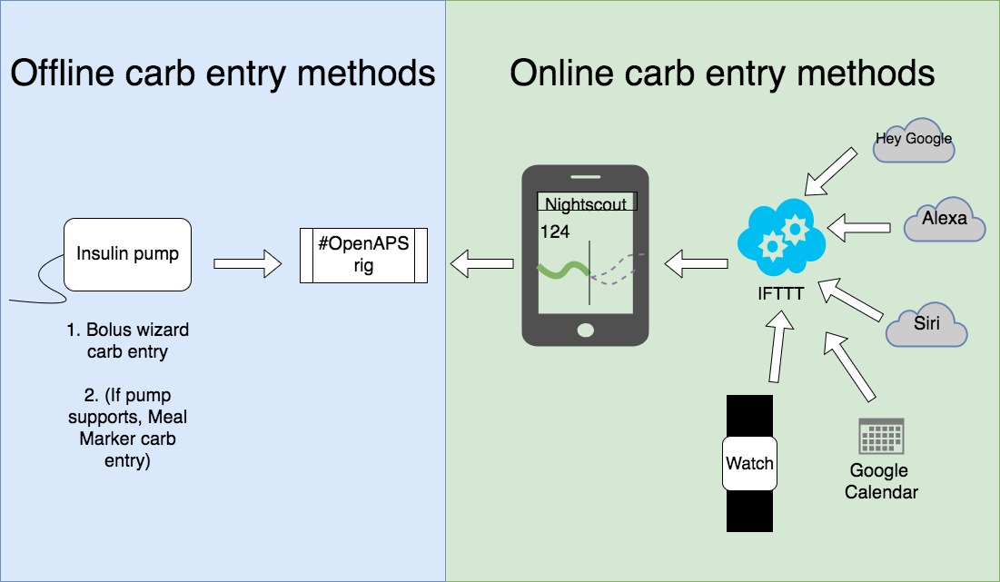

# Entering carbs & doing boluses

How do you enter carbs & do boluses with OpenAPS? You have a variety of ways to do things.

## Doing boluses

* **Easy bolus button**: Previously before OpenAPS, you probably used the [easy bolus button](http://openaps.readthedocs.io/en/latest/docs/While%20You%20Wait%20For%20Gear/collect-data-and-prepare.html#easy-bolus-button) to add up a bolus in increments. (E.g. if your pump had increments of 0.5u, you could quickly dial up to a bolus by pressing the up button as many times as needed; hitting enter to confirm it; hitting enter again to deliver the bolus.)

* **Bolus wizard**: Or, you may have used the bolus wizard, sometimes with BG or carb entry, or just as a bolus.

**In OpenAPS, you can still use those same methods for delivering manual doses of insulin (boluses).**

## Entering carbs into OpenAPS

Before OpenAPS, you may or may not have entered carbs into your pump. With OpenAPS, most people *do* want the rig to know about carbs. You have a variety of ways to enter them, depending on whether your rig is **online** or **offline**.

Look at this image for the big picture:

### Offline carb entry

* You can still use the bolus wizard to enter carbs, although a non-zero amount of bolus must be delivered in order for OpenAPS to record the carbs. If you adjust the bolus recommended by the bolus wizard down to zero and deliver the zero units (as you might ordinarily do if you ate carbs in order to treat a low), the pump may (depending on your pump version) fail to record a bolus wizard record in pumphistory, causing OpenAPS to ignore the carbs as if you hadn't entered them. In that situation, consider delivering the smallest unit of bolus possible (like 0.05u or 0.1u) so that OpenAPS will record the carbs entered into the bolus wizard.
* Some pumps can use the ['meal marker' feature](http://openaps.readthedocs.io/en/latest/docs/Customize-Iterate/offline-looping-and-monitoring.html#entering-carbs-while-offline).
* See section on [extended and dual wave substitutes](https://openaps.readthedocs.io/en/latest/docs/While%20You%20Wait%20For%20Gear/collect-data-and-prepare.html#extended-and-dual-wave-substitute) for information on how extended boluses are handled in OpenAPS.

### Online carb entry

If your rig is online, you have a variety of ways to enter carbs online.

* Nightscout care portal
* AndroidAPS NS Client ([Download the app-nsclient-release APK from here](https://github.com/MilosKozak/AndroidAPS/releases).)
* Many options for using IFTTT to get carbs into Nightscout Care portal. ([See the IFTTT page here for instructions](http://openaps.readthedocs.io/en/latest/docs/Customize-Iterate/ifttt-integration.html).)
  * Pebble or Apple watch
  * Google Calendar
  * Siri, Alexa, Google, etc. 
* Android users: you can use the Care portal option in [NSClient app found here](https://github.com/nightscout/NSClient-Android/releases).
  
