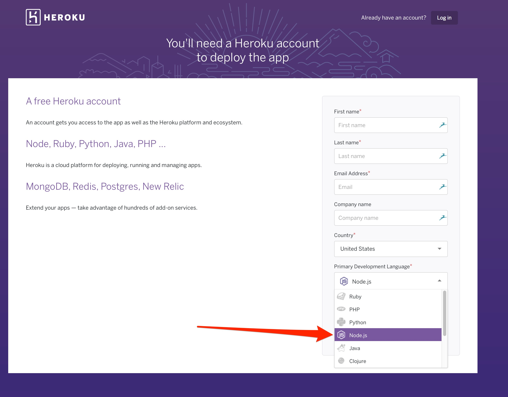
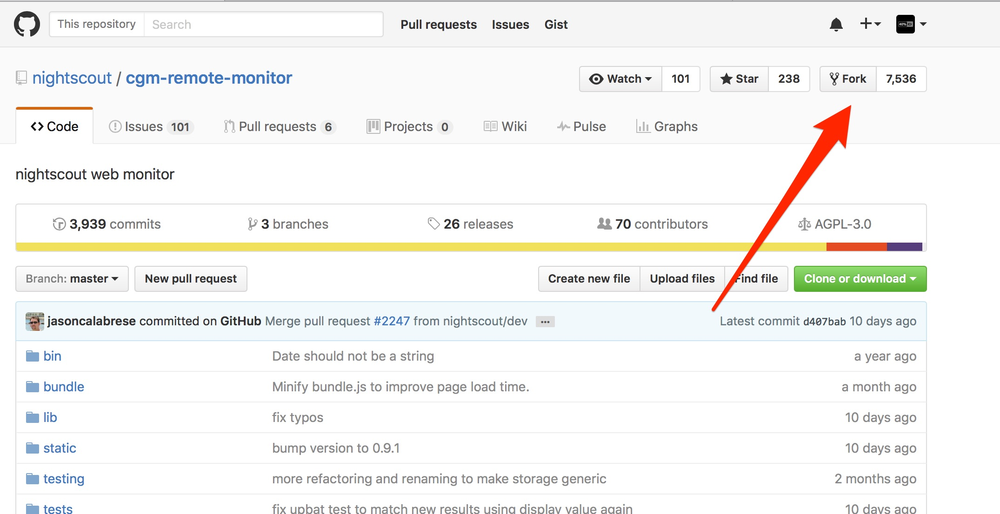
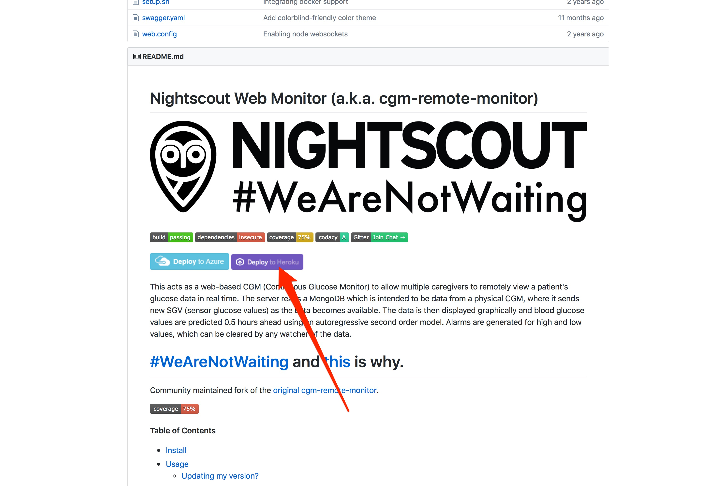
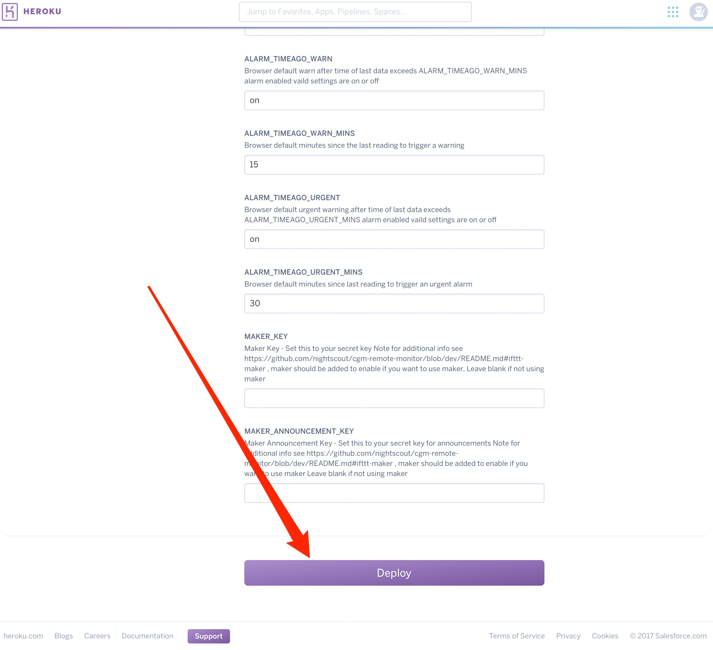
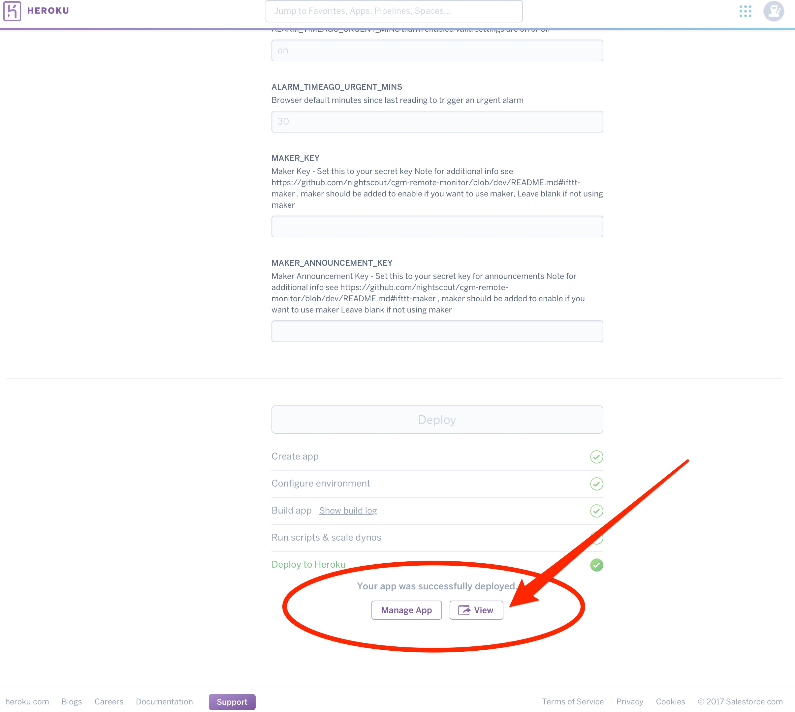
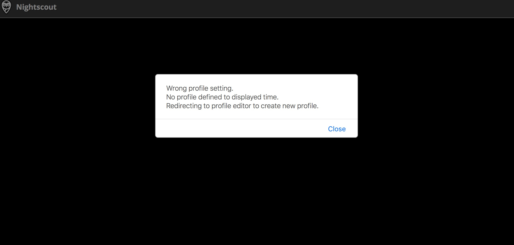
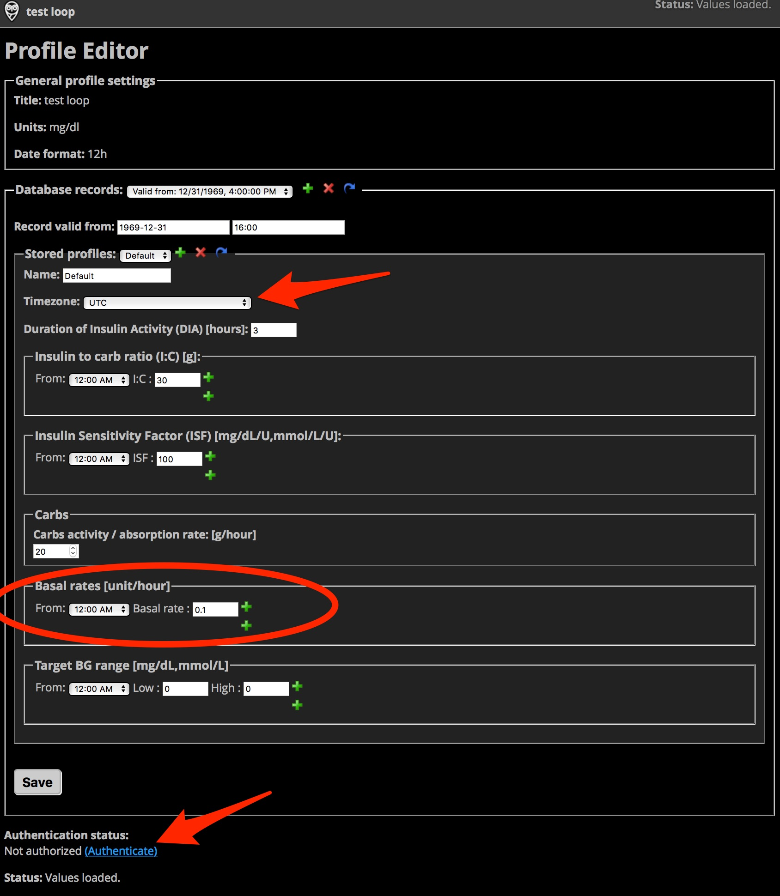
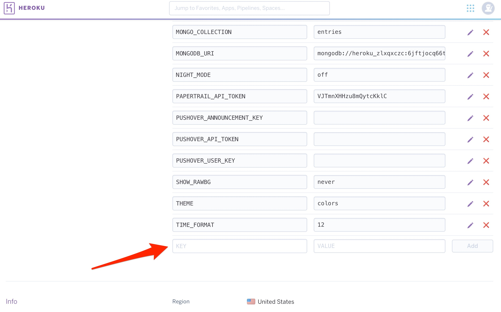
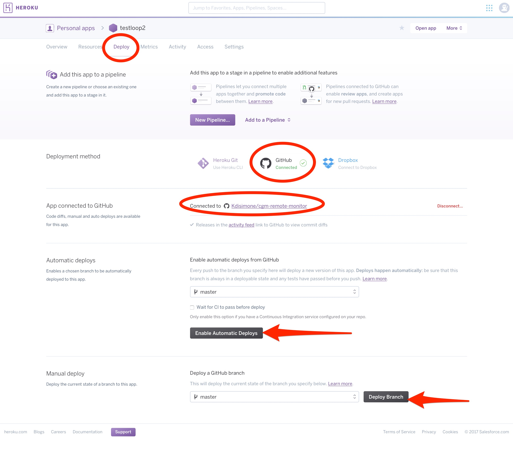
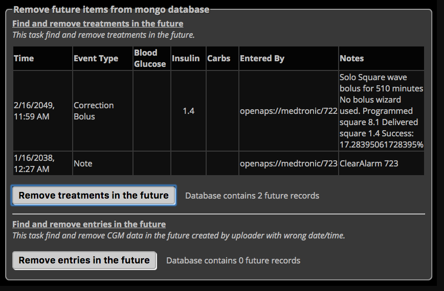

# Visualization and Monitoring

## Nightscout Introduction

[Nightscout](http://nightscout.info) (NS) is an open source, DIY project that allows real-time access to CGM data
via a personal website, smartwatch viewers, or apps and widgets available for
smartphones. Setting up a Nightscout web app is the recommended way to visualize your
OpenAPS closed loop.

Nightscout allows a user to upload CGM data from a variety of sources to an
online database and cloud computing service. The information is then processed
and displayed visually as a graph. There are plugins that allow more
information to be shown about OpenAPS, too. As the data is uploaded to an online
website and then retrieved by OpenAPS, it allows OpenAPS a wider range of
compatibility with various CGM solutions.

**[Nightscout](http://nightscout.info) is the recommended way to visualize your
OpenAPS closed loop.** 

Even if you don't choose to share your Nightscout site
with another person, it will be helpful for you to visualize what the loop is
doing; what it's been doing; plus generate helpful reports for understanding
your data, customized watchfaces with your OpenAPS data, and integration with IFTTT.  You can read more about the latest Nightscout features [here](http://www.nightscout.info/wiki/welcome/website-features/0-9-features).

## Nightscout Setup with Heroku

* If you plan to use Nightscout with OpenAPS, we recommend using Heroku, as OpenAPS can reach the usage limits of the free Azure plan and cause it to shut down for hours or days. If you end up needing a paid tier, the $7/mo Heroku plan is also much cheaper than the first paid tier of Azure.  Currently, the only added benefit to choosing the $7/mo Heroku plan vs the free Heroku plan is a section showing site use metrics for performance (such as response time).  This has limited benefit to the average OpenAPS user.  **In short, Heroku is the free and OpenAPS-friendly option for NS hosting.**

* Create an account at [Heroku](https://www.heroku.com) and choose the Primary Development Language to be Node.js when you create your account.  You’re going to use a free account, but you will still need to enter credit card information for your account setup before the app will deploy.  You'll need to confirm your Heroku account by clicking a link sent via email.



* Create an account at [GitHub](https://github.com)
*****************
**Note:** If you already have an existing GitHub account and NS site, you may just need to update your repository by doing a Compare in GitHub.  Use `https://github.com/yourgithubname/cgm-remote-monitor/compare/master...nightscout:master` and replace "yourgithubname" with your GitHub name.  Click the big green `Create pull request` button. Another screen will appear, fill in a title and click button to `create the pull request`, and then you can `Merge pull request`, and finally `Confirm merge`.  That process updates your Nightscout repository in GitHub.  Once updated, you can skip the "click the Fork Button" step below and start following along with the purple `Deploy to Heroku` button step from your updated Nightscout cgm-remote-monitor repository.
*****************
* Go to the [Nightscout cgm-remote-monitor repository](https://github.com/nightscout/cgm-remote-monitor)

* Click the `Fork` button in the upper right corner



* Scroll down until you see the purple `Deploy to Heroku` button.  Click that button.



* Give your app a name, this will be the prefix of your NS site’s URL. For example, `https://yourappname.herokuapp.com`

* Fill out the information lines in the `Config Variables` Section of that page, as shown below.  Some of the lines can stay with the default entries already provided.


<table border="1">
<thead>
<tr>
<th>KEY</th>
<th>VALUE</th>
</tr>
</thead>
<tbody>
<tr>
<th>API_SECRET</th>
<td>Create your own API_SECRET.  This is like the password to your NS site.  Please write it down somewhere safe or commit it to memory, you will be using it in the future.  It needs to be at least 12 characters long and should NOT use the `@` symbol.</td>
</tr>
<tr>
<th>AUTH_DEFAULT_ROLES</th>
<td>When `readable`, anyone can view Nightscout without a token. Setting it to `denied` will require authentication. Setting it to `denied` requires oref 0.5.0-dev.</td>
</tr>
<tr>
<th>DISPLAY_UNITS</th>
<td>enter either mg/dl or mmol</td>
</tr>
<tr>
<th>ENABLE</th>
<td>bridge openaps pump iob basal careportal sage cage maker</br></br>(Enter all of the words without commas.  Just a single space between each word. Make sure autocorrect does not add space between careportal.  **Notice we are not including cob here.** If you have other plugins that you would like to enable, please add them here.)</td>
</tr>
<tr>
<th>DISABLE</th>
<td>Leave blank</td>
</tr>
<tr>
<th>ALARM_TYPES</th>
<td>simple</td>
</tr>
<tr>
<th>BG_HIGH</th>
<td>Enter the numeric value of BG you’d like as an urgent high alarm. (Note: For users outside the US, this needs to be set in mgdl. Take your desired mmol number and multiply it by 18).  </td>
</tr>
<tr>
<th>BG_TARGET_TOP</th>
<td>Enter the numeric value of the top of your target BG.(Note: For users outside the US, this needs to be set in mgdl. Take your desired mmol number and multiply it by 18).</td>
</tr>
<tr>
<th>BG_TARGET_BOTTOM</th>
<td>Enter the numeric value of the bottom of your target BG.(Note: For users outside the US, this needs to be set in mgdl. Take your desired mmol number and multiply it by 18).</td>
</tr>
<tr>
<th>BG_LOW</th>
<td>Enter the numeric value of the BG you’d like as an urgent low alarm.(Note: For users outside the US, this needs to be set in mgdl. Take your desired mmol number and multiply it by 18).</td>
</tr>
<tr>
<th>PUSHOVER lines</th>
<td>Can be left blank for now.  If you decide to use Pushover later, you can come back and add your info to these lines.</td>
</tr>
<tr>
<th>CUSTOM_TITLE</th>
<td>This will be the text displayed in the upper left part of the NS website.</td>
</tr>
<tr>
<th>THEME</th>
<td>change from default to colors</td>
</tr>
<tr>
<th>BRIDGE_USER_NAME</th>
<td>Enter your Dexcom Share Account login name.  This should be the same account name used in the Share2 or G5 Mobile app.</td>
</tr>
<tr>
<th>BRIDGE_PASSWORD</th>
<td>Enter your Dexcom Share Account password.</td>
</tr>
<tr>
<th>BRIDGE_MAX_COUNT</th>
<td>Default value is 1.  Setting this to 7 will update the last 35 minutes of data.</td>
</tr>
</tbody>
</table>

**The remaining variables can be left at their default values.**</br></br>

*****************
**Note:** for BRIDGE_MAX_COUNT: This value sets the number of BG values to pull from Share per update.  Each Dexcom BG value represent 5 minutes.  Nightscout defaults to BRIDGE_MAX_COUNT=1.  If you lose connectivity with your Dexcom transmitter, your Share app will automatically backfill data points when you regain connectivity.  Nightscount does not do this and you will have gaps in the data for when you were out of range.  More information [here](https://github.com/nightscout/cgm-remote-monitor#bridge-share2nightscout-bridge).

You can change the BRIDGE_MAX_COUNT value to pull more samples per query, which will backfill BRIDGE_MAX_COUNT values for you.  This change increases your data usage and may affect your Nightscout billing tier.   Setting BRIDGE_MAX_COUNT to 7 will update the previous 35 minutes of data and will keep OpenAPS up to date on your current BG trends.  If you frequently have larger data gaps and you use autotune, you may consider increasing this number more to backfill data more aggressively.
*****************

* Click the purple `Deploy` button at the bottom of screen.



* Wait a little bit while Heroku builds your NS app.  You’ll see some text scroll by in the Build App box, and then finally, you will have a message that the NS app was successfully deployed.  If the app fails to deploy, it may be that you have not added your credit card information to your account yet.  Go add that information in your account billing section, and then come back and press the deploy button again.  Don't worry, your account is still free unless you choose otherwise.  The credit card simply gives you added dyno hours on your free account (win-win).



* You can verify your site’s successful build by clicking `View` (you should see black site with a profile warning).  You will be redirected to a profile set-up page.  (If it doesn't redirect automatically, refresh your webpage).  



You do not have to enter all the information in the profile if you are using OpenAPS (since OpenAPS will be providing the information for IOB and COB rather than letting NS calculate them), but you do have to fill out the `Basal Profile` and `TimeZone` at a minimum in order to have your temp basals properly display.  Click `Save` when you have entered the information.  You will be prompted to authenticate, if it is the first time you’ve used the device to make changes in your profile.  Click on the `Authenticate` link at the bottom of the site, and enter your API_SECRET to complete the authentication.

**Note:**  OpenAPS will only work based on the values in your pump; not the values that you put into your Nightscout profile. You will need to keep your Nightscout basal profile in-sync with any changes you make in your pump to prevent later confusion in watching the temp basal rendering.



* Assuming your previous browser tab is still open for "Create a new App | Heroku", let's go back to that tab.  This time instead of choosing the `View` option, we are going to select the `Manage App` button. Then, select the `Settings` tab near the top of the screen on your Heroku app.


* Click on `Reveal Config  Vars`. Scroll down the bottom of the Config Vars lines until you find the last blank one.  You are going to add several additional lines of config vars for OpenAPS use; the DEVICESTATUS_ADVANCED is a required line, the others just make Nightscout more useful when using OpenAPS.



<table border="1">
<thead>
<tr>
<th>KEY</th>
<th>VALUE</th>
</tr>
</thead>
<tbody>
<tr>
<th>DEVICESTATUS_ADVANCED</th>
<td>true</td>
</tr>
<tr>
<th>PUMP_FIELDS</th>
<td>battery reservoir clock status</td>
</tr>
<tr>
<th>PUMP_RETRO_FIELDS</th>
<td>battery reservoir clock status</td>
</tr>
<tr>
<th>SHOW_FORECAST</th>
<td>openaps</td>
</tr>
<tr>
<th>SHOW_PLUGINS</th>
<td>openaps pump iob sage cage careportal</td>
</tr>
<tr>
<th>PUMP_ENABLE_ALERTS</th>
<td>true</td>
</tr>
<tr>
<th>PUMP_URGENT_BATT_V</th>
<td>1.3</br></br>(This is the pump battery voltage that will trigger a red, urgent alert in NS.)</td>
</tr>
<tr>
<th>PUMP_URGENT_RES</th>
<td>10</br></br>(This is the reservoir volume that will trigger a red, urgent alert in NS.)</td>
</tr>
<tr>
<th>PUMP_URGENT_CLOCK</th>
<td>30</td>
</tr>
<tr>
<th>OPENAPS_ENABLE_ALERTS</th>
<td>true</td>
</tr>
<tr>
<th>OPENAPS_FIELDS</th>
<td>status-symbol status-label iob meal-assist rssi</td>
</tr>
<tr>
<th>OPENAPS_RETRO_FIELDS</th>
<td>status-symbol status-label iob meal-assist rssi</td>
</tr>
<tr>
<th>OPENAPS_WARN</th>
<td>20</br></br>(This is the minutes since OpenAPS last successfully looped. This will be a yellow alert in NS.)</td>
</tr>
<tr>
<th>OPENAPS_URGENT</th>
<td>60</br></br>(Same as the alert above, but will be red in color and have a shorter snooze option.)</td>
</tr>
</tbody>
</table>

If you are using the Nightscout Bridge to bring in CGM data from Dexcom servers (G4 Share2 app or G5 Mobile app) and are outside the US, you will need to add a setting for `BRIDGE_SERVER` and set the value to `EU`.

* Click on `Open App` in the top right corner of your Heroku site.


* Click on the settings (those three horizontal lines in upper right corner).  Now check that your basal render is selected to either default or icicle (personal preference for how the temp basals show as blue lines in NS site), check the boxes that you’d like display pills in the SHOW PLUGINS (usually all of them), and then press save. 

* **Battery monitoring**: Because running OpenAPS requires frequent communication with your pump, your pump battery tends to drain more quickly than you'd experience when not looping. Some users have had good experiences with Energizer Ultimate Lithium AAA batteries (getting ~1.5weeks) rather than alkaline batteries (getting ~2-3 days). Regardless of whether you use alkaline or lithium, you may want to consider a Nightscout alarm to alert you to when the battery is running low. You can do this by setting (in your Nightscout config vars) `PUMP_WARN_BATT_V` to 1.39 (if using lithium batteries, as is most common) and adding `battery` to your `PUMP_FIELDS` so that voltage is displayed on your Nightscout site. The 1.39 voltage warning will give you many hours (reportedly ~8+) heads up that you will need to change your battery. If you don't change the battery in time and end up with a "low battery" warning on the pump, the pump will still function, but RF communications will be turned off and you will not be able to loop until you put a new battery in.


Your NIGHTSCOUT site is now all set-up.  Congrats!


## Nightscout Migrations

### Switching from API_SECRET to token based authentication for your rig

You can secure your Nightscout and CGM data with [token based authentication](http://www.nightscout.info/wiki/welcome/website-features/0-9-features/authentication-roles).
This requires Nightscout 0.9 (Grilled Cheese) and oref0 0.5.0 or later.

This has the following advantages:
- You can deny public access to your Nightscout. 
- Each rig uses its own security token to authenticate to Nightscout.
- With the old `API_SECRET` authentication all the rigs had all the privileges to your Nightscout (similar to root or Administrator users).
- The `API_SECRET` method for authentication rigs/devices is deprecated in Nightscout, and token based authentication is the preferred way.
- In case you lose a rig or it gets stolen you can deny access to Nightscout for that one rig. Otherwise you need to change your API_SECRET and reconfigure all the other rigs.

You can migrate each rig independently from `API_SECRET` authentication to token based authentication.
If you want to secure your Nightscout and CGM data, then all rigs need to have oref0 version 0.5.0+ and all be configured with token based authentication.

Here are the steps you need to follow:

1. Visit https://yourappname.herokuapp.com/admin. Replace "yourappname" with the name you chose for your app above, that is, the prefix of your NS site's URL.
    - Add a new Role

    Name: `oref0rig`

    Permissions:  Add the following 6 permissions. Note that the default window is too small to see them all after you paste them in.
    ```
    api:devicestatus:create, 
    api:devicestatus:read, 
    api:entries:create, 
    api:entries:read, 
    api:treatments:create, 
    api:treatments:read
    ```

    

2. Add a new Subject

    Name: the name of your rig (same as the hostname of your rig). You will need to add a new Subject for each rig you run.
    Note: Nightscout will shorten the name to 10 characters in your accesstoken, e.g., `myedisonhostname` becomes `myedisonho-0dccda4ae591e763`

    Roles: `oref0rig`

    

    Press Save button.

    In the Subject - People, Device etc. view you'll see the access token for your rig, e.g., `myrigname-27c914cabc506fa3`

3. You need your rig to use the token based authentication. This can be done in three different ways:

    - Using the `cd && ~/src/oref0/bin/oref0-setup.sh` interactive setup. Enter the access token (subjectname and hash of 16 characters, e.g., `myrigname-27c914cabc506fa3`)
        Example of the interactive setup:
        ```
        Are you using Nightscout? If not, press enter.
        If so, what is your Nightscout host? (i.e. https://mynightscout.herokuapp.com)? https://mynightscout.herokuapp.com
        Ok, https://mynightscout.herokuapp.com it is.

        Starting with oref 0.5.0 you can use token based authentication to Nightscout. This makes it possible to deny anonymous access to your Nightscout instance. It's more secure than using your API_SECRET. Do you want to use token based authentication y/[N]? y
        What Nightscout access token (i.e. subjectname-hashof16characters) do you want to use for this rig? myrigname-27c914cabc506fa3
        ```

    - Using the `oref0-setup` or `oref0-runagain.sh` command line.
        Use `--api-secret=token=myrigname-27c914cabc506fa3`. Don't forget to start with `token=`.
        During install it will connect to your Nightscout site and check if the permissions are ok. If OK you'll see this in your log:
        ```
        2017-06-10 19:46:14,758 INFO Nightscout host: https://mynightscout.herokuapp.com
        2017-06-10 19:46:14,816 INFO Starting new HTTPS connection (1): mynightscout.herokuapp.com
        2017-06-10 19:46:15,911 INFO Succesfully got Nightscout authorization token
        2017-06-10 19:46:15,925 INFO All permissions in Nightscout are ok
        ```
        If it's not ok it will exit the setup script and tell you which permissions are missing.

    - Change the token in `ns.ini`. It's the third argument of the `args=` line:  [***NOTE to Dana Scott or ?***: this did not change the chrontab.txt file to the token= for me. It left the hashed API secret. I had to run the oref0-setup.sh again. That changed the crontab.txt file to the token= text.]
        ```
        [device "ns"]
        fields = oper
        cmd = nightscout
        args = ns https://mynightscout.herokuapp.com token=myrigname-27c914cabc506fa3
        ```

4. Test the rig by running `openaps upload` or `openaps upload-ns-status` or just running the pump loop. You'll see the update from myrigname in the OpenAPS pill in Nightscout. [***NOTE to Dana Scott or ?***: this was not obvious to me. I did not see evidence of this even after I had run the oref0-setup.sh command.]

5. When all the rigs are 0.5.0 and are all using token based authentication, you can change the environment variables of your Nightscout:
- `AUTH_DEFAULT_ROLES` from `readable devicestatus-upload` to `denied` if you wish to block read-only access to your Nightscout instance. If you don't mind your CGM data being accessible to anyone with your Nightscout URL, you can just leave `AUTH_DEFAULT_ROLES` as `readable`. [***NOTE to Dana Scott or ?***: this variable AUTH_DEFAULT_ROLES was not in config variables for me. I had to add it. Not sure if I'm a one-off.]

Important:
- Just like keeping your pump serial number and API_SECRET for yourself, you should not post your authentication token `myrigname-27c914cabc506fa3` on the Internet
- The authentication is also stored in your `crontab`, as `API_SECRET=token=myrigname-27c914cabc506fa3`. When token based authentication is used the API_SECRET on the rig will always start with `token=` instead of a hash.
- You must always secure your Nightscout site with secure http (https).  Don't use http://mynightscout.herokuapp.com but rather always use https://mynightscout.herokuapp.com.
- Keep your API_SECRET as a root/Administrator password and only use it for configuring Nightscout. For just reading use a token with the `readable` role, and if you want to use the Careportal add the `careportal` role for that user.  [***NOTE to Dana Scott or ?***: this is very unclear to me. I don't know what to do with this information.]

### Switching from Azure to Heroku

* If you are a current OpenAPS user and want to switch from Azure to Heroku, you will need to change your NS URL in both `ns.ini` and in `cron`.  Alternatively, you can edit your runagain.sh file and run the setup script again. 

* If you’d like to seamlessly keep all your old Azure NS data showing in your new Heroku NS site, you’ll need to copy and paste your old `MONGODB` string from your Azure site. Find it in either Application Settings or Connection strings in your Azure control panel and then go to Heroku’s `MONGODB_URI` line. Replace the content with your copied string from Azure. Double check that your Azure collection used the “entries” name…if it doesn’t, then you will need to update that variable in Heroku to match as well.

**Note:** It's a good idea to check your deployment connection in Heroku's dashboard after your deploy (typically this still needs to be manually connected after initial setup).  Go your `Deploy` tab in your Heroku dashboard, click on the GitHub service, and select your GitHub cgm-remote-monitor repository.  You can select the cgm-remote-monitor branch you'd like to deploy at the bottom of the screen.  Both master and dev branches work for OpenAPS.



## Nightscout Troubleshooting and FAQ 

### It's not working - I'm missing data in Nightscout? 

If you are using a "test pump" that has not received sufficient data in some time, Nightscout pills will NOT be displayed onscreen. Nightscout may also not work if it hasn't had CGM data in a while - so if you haven't been using a CGM and uploading CGM data to Nightscout for the past few days, the site may be empty as well.  If this happens, simply use this pump in tandem with a CGM so glucose values are recorded and eventually uploaded to Nightscout.  Once sufficient data has been collected (and OpenAPS plugin is enabled and saved) the OpenAPS pills should appear automatically. Medtronic CGM users may also [need to do this to get their CGM data flowing into Nightscout after a gap in uploading data](http://openaps.readthedocs.io/en/latest/docs/Customize-Iterate/offline-looping-and-monitoring.html#note-about-recovery-from-camping-mode-offline-mode-for-medtronic-cgm-users).

### A Note about Nightscout's COB Pill

If you have the Advanced Meal Assist (AMA) OpenAPS feature turned on, OpenAPS calculates COB *dynamically*. To see your COB on your Nightscout web app, look inside the OpenAPS pill. _(If it says "undefined", this means you do NOT have AMA turned on.)_

Nightscout, however, has its own COB pill, which decays carbs *statically*, and it is **NOT** used in OpenAPS calculations.

* **We highly recommend NOT using the Nightscout COB pill.** We even recommend removing it from your Nightscout ENABLE web app settings as it causes bugs, and great confusion, because it will do a static decay and/or mess up your Nightscout. 

* **Note also**: Nightscout's Bolus Wizard Preview (BWP) pill also decays carbs *statically*. 

* **To avoid confusion: Turn off all other Nightscout pills that use *static* COB calculations.**

### How to display basal changes ("render basal")

* In case you missed it during setup: we recommend that you "render"/display the basal rates (the blue lines to show what temp basals have been enacted, if any.) To do so, select "Default" or "Icicle" from the "Render Basal" pull-down menu in the Settings.

### How to display OpenAPS purple prediction/forecast lines

* Click the three dots next to your timeframe horizon (3HR, 6HR, 12HR, 24HR) and then enable “Show OpenAPS Forecasts”. Don't see this option? Check and make sure you added this variable and that your OpenAPS has successfully run.

### Understanding the OpenAPS pill

The OpenAPS pill box has four states, based on what happened in the last 15
minutes: Enacted, Looping, Waiting, and Warning:

* Waiting is when OpenAPS is uploading, but hasn't seen the pump in a while
* Warning is when there hasn't been a status upload in the last 15 minutes
* Enacted means OpenAPS has recently enacted the pump
* Looping means OpenAPS is running but has not enacted the pump
* Unknown means Error or Timeout; OpenAPS has reported a failure, or has reported no status for many hours.

### All of a sudden, Nightscout is no longer showing treatments (bolus, carbs, finger BGs) on the graph or rendering my basals.

If you suddenly find that Nightscout is not showing treatments (bolus, carbs, finger BGs etc.) on the graph; and/or that your basals are no longer being rendered in the blue basal line; but otherwise, everything looks normal and you are looping properly:

You probably somehow got a future-dated treatment. One possible reason is a clock-time mismatch between your devices - for example, your BG meter, pump, CGM, or OpenAPS rig may have different dates or times set.

**To remove future treatments:**
* Go into Nightscout under "Settings" and "Admin tools" and delete any future-dated treatments (press the "remove treatments in the future" button). If the future treatments were caused by a time mismatch, you'll need to resolve that first, or the future dated treatments may simply be re-uploaded.


