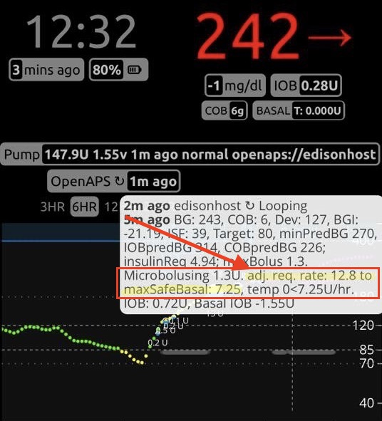

# Understanding your preferences and safety settings

All of the settings specific to OpenAPS (that can't be read from the pump) will live in this file, so when running the setup scripts or building your loop, you will have the `preferences.json` file built for the system to read, in addition to your pump profile settings. Many of these are important safety settings, with reasonable default settings, so other than described below, you likely won’t need to adjust these. If you do decide to adjust a setting, the best practice is to adjust one setting at a time, and observe the impact for 3 days. Changing multiple variables at once is a recipe for a lot of headaches and a lot of painful troubleshooting. 

(*Note that there are some preferences that show up by default; these are the most commonly adjusted. There are additional preferences available to set that are not used by everyone, and are described below - any of these can also be added to the preferences.json*)

## Editing your preferences.json

Your preferences are found in the directory `myopenaps/preferences.json`.  To edit any of your preferences, you can enter `edit-pref` (as a shortcut) or `cd ~/myopenaps && nano preferences.json`

To check your edits when you're done, use `cd ~/myopenaps && cat preferences.json` When editing preferences, it's advised to do so in terminal (not a word processor) in order to ensure ascii characters are used within your preferences file. 

## Commonly-adjusted preferences:

```
{
        "max_iob": 0,
        "max_daily_safety_multiplier": 3,
        "current_basal_safety_multiplier": 4,
        "autosens_max": 1.2,
        "autosens_min": 0.7,
        "rewind_resets_autosens": true,
        "adv_target_adjustments": true,
        "unsuspend_if_no_temp": false,
        "enableSMB_with_bolus": false,
        "enableSMB_with_COB": false,
        "enableSMB_with_temptarget": false,
        "enableUAM": false,
        "curve": "rapid-acting"
}
```

#### max_iob: 

`max_iob` is an important safety setting for your OpenAPS set up. `max_iob` is the maximum amount of basal (or SMB correction) insulin that your loop is allowed to accumulate to treat higher-than-target BG.  Unlike the other two OpenAPS safety settings (`max_daily_safety_multiplier` and `current_basal_safety_multiplier`), `max_iob` is set as a fixed number of units of insulin. 

Although `max_iob` is set as a fixed number of units of insulin, you should consider your current basal rate settings when setting this safety parameter. A good rule of thumb is for `max_iob` to be no more than 3 times your highest basal rate. You can start conservatively and change this setting over time as you evaluate how the OpenAPS system works for you. 

When you run the OpenAPS setup script, it will prompt you to set your `max_iob`.  In previous oref0 releases (0.4.3 or older), the set up script automatically set `max_iob` to 0 units.  This effectively made your initial OpenAPS installation only capable of setting temp basal rates in response to BG levels that were below your target BG levels. (And if your BG level is sufficiently below your target BG level, OpenAPS will set a 30 min. temporary basal rate of 0u/hr., which is often referred to as a "low glucose suspend".)  Again, you can start conservatively and change this setting over time as you evaluate how the OpenAPS system works for you.

The setting you choose during the setup script will be saved in the oref0-runagain script and can be used again if you need to rerun the script.

#### max_daily_safety_multiplier: 

This is an important OpenAPS safety limit. The default setting (which is unlikely to need adjusting) is 3. This means that OpenAPS will never be allowed to set a temporary basal rate that is more than 3x the highest hourly basal rate programmed in a user's pump. 

#### current_basal_safety_multiplier: 

This is another important OpenAPS safety limit. The default setting (which is also unlikely to need adjusting) is 4. This means that OpenAPS will never be allowed to set a temporary basal rate that is more than 4x the current hourly basal rate programmed in a user's pump. 


### Important Note About Safety Multipliers:

`max_daily_safety_multiplier` and `current_basal_safety_multiplier` work together, along with your pump's max basal rate safety setting (set on your pump), as a safety limits.   

OpenAPS will use whichever of those three values is the lowest, at any given time, as the ceiling for the temp basal rate it will set.** 

---
 #### A few examples:


* In **Example 1**, the user's max basal safety setting is the constraining limit on the OpenAPS recommended temp basal rate.  
* In **Example 2**, 4x the user's current basal rate is the constraining limit on the OpenAPS recommended temp basal rate.  
* In **Example 3**, the user's current basal rate is at his/her highest programmed rate, but none of the safety constraints are binding; the OpenAPS recommended temp basal rate is delivered.  
* In **Example 4**, 3x the user's highest programmed basal rates is the constraining limit on the OpenAPS recommended temp basal rate.  

If  the temporary basal rate setting recommended by OpenAPS (as determined in [`oref0/lib/determine-basal/determine-basal.js`](https://github.com/openaps/oref0/blob/master/lib/determine-basal/determine-basal.js)) exceeds either:

* the user's max basal rate setting (which is set in the user's pump), or
* `max_daily_safety_multiplier` \* the highest programmed basal rate (as specified by the basal rates in the user's pump), or
* `current_basal_safety_multiplier` \* the user's current basal rate (as specified by the current basal rate programmed in the user's pump), then 

 the following message will be reported to the *pump-loop.log*:  

       adj. req. rate: X.X to maxSafeBasal: Y.Y

You can also view this message in the Nightscout OpenAPS pill (which pops up a detailed message about recent OpenAPS activity if you hover your mouse over the OpenAPS pill):

 
---


#### autosens_max:

This is a multiplier cap for autosens (and autotune) to set a 20% max limit on how high the autosens ratio can be, which in turn determines how high autosens can adjust basals, how low it can adjust ISF, and how low it can set the BG target.

#### autosens_min: 

The other side of the autosens safety limits, putting a cap on how low autosens can adjust basals, and how high it can adjust ISF and BG targets.

#### rewind_resets_autosens:

This feature, enabled by default, resets the autosens ratio to neutral when you rewind your pump, on the assumption that this corresponds to a probable site change.  Autosens will begin learning sensitivity anew from the time of the rewind, which may take up to 6 hours.  If you usually rewind your pump independently of site changes, you may want to consider disabling this feature.

#### unsuspend_if_no_temp:

Many people occasionally forget to resume / unsuspend their pump after reconnecting it.  If you're one of them, and you are willing to reliably set a zero temp basal whenever suspending and disconnecting your pump, this feature has your back.  If enabled, it will automatically resume / unsuspend the pump if you forget to do so before your zero temp expires.  As long as the zero temp is still running, it will leave the pump suspended.

#### carbsReqThreshold

grams of carbsReq to trigger a pushover. Defaults to 1 (for 1 gram of carbohydrate). Can be increased if you only want to get Pushover for carbsReq at X threshold.

#### curve: "rapid-acting" 

Rapid-acting is the default in 0.6.0 and beyond. You can change this to "ultra-rapid" for Fiasp, or "bilinear" for using the old curve. Most people prefer the rapid-acting curve.

#### useCustomPeakTime

Defaults to false. Setting to true allows changing insulinPeakTime

#### insulinPeakTime

Defaults to 75 for rapid acting (Humalog, Novolog). This is the number of minutes after a bolus activity peaks. 
Defaults to 55m for Fiasp if `useCustomPeakTime: false`

### oref1-related preferences:

These preference should **not** be enabled until you've been looping (and running autotune) for several weeks and are confident that all of your basals and ratios are correct.  Please read the [oref1 section of the docs](http://openaps.readthedocs.io/en/latest/docs/Customize-Iterate/oref1.html) before doing so.

#### enableSMB_with_bolus

This enables supermicrobolus for DIA hours after a manual bolus.

#### enableSMB_with_COB

This enables supermicrobolus (SMB) while carbs on board (COB) is positive.

#### enableSMB_with_temptarget 

This enables supermicrobolus (SMB) with eating soon / low temp targets. With this feature enabled, any temporary target below 100mg/dL, such as a temp target of 99 (or 80, the typical eating soon target) will enable SMB.

#### enableUAM

This enables detection of unannounced meal (UAM) carb absorption.

#### enableSMB_always

Defaults to false. When true, always enable supermicrobolus (unless disabled by high temptarget).

#### enableSMB_after_carbs

Defaults to false. When true, enables supermicrobolus for 6h after carbs, even with 0 COB.

#### allowSMB_with_high_temptarget

Defaults to false. When true, allows supermicrobolus (if otherwise enabled) even with high temp targets.

#### maxSMBBasalMinutes

Defaults to start at 30. This is the maximum minutes of basal that can be delivered as a single SMB with uncovered COB. This gives the ability to make SMB more aggressive if you choose. It is recommended that the value is set to start at 30, in line with the default, and if you choose to increase this value, do so in no more than 15 minute increments, keeping a close eye on the effects of the changes. It is not recommended to set this value higher than 90 mins, as this may affect the ability for the algorithm to safely zero temp. It is also recommended that pushover is used when setting the value to be greater than default, so that alerts are generated for any predicted lows or highs.

### Exercise-mode related preferences:

#### exercise_mode

Defaults to false. When true, > 105 mg/dL high temp target adjusts sensitivityRatio for exercise_mode. 

**This majorly changes the behavior of high temp targets from before.** 

synonmym for high_temptarget_raises_sensitivity

#### high_temptarget_raises_sensitivity

Defaults to false. When set to true, raises sensitivity for temp targets set to  >= 111.  synonym for exercise_mode

#### low_temptarget_lowers_sensitivity 

Defaults to false. When set to true, can lower sensitivity for temptargets <= 99. 

#### sensitivity_raises_target

When true, raises BG target when autosens detects sensitivity

#### resistance_lowers_target: 

Defaults to false. When true, will lower BG target when autosens detects resistance

#### half_basal_exercise_target

Set to a number, e.g. 160, which means when temp target is 160 mg/dL *and* exercise_mode=true, run 50% basal at this level (120 = 75%; 140 = 60%). This can be adjusted, to give you more control over your exercise modes. 

### Other preferences:

Generally, you won't need to adjust any of the preferences below.  But if you do wish to change the default behavior, you can add these into your preferences.json to do so (or use oref0-get-profile --updatePreferences to get the full list of all preferences added to your preferences.json).

#### autosens_adjust_targets: 

This is used to allow autosens to adjust BG targets, in addition to ISF and basals.

#### adv_target_adjustments:

This feature was previously enabled by default but will now default to false (will NOT be enabled automatically) in oref0 0.6.0 and beyond. (There is no need for this with 0.6.0). This feature lowers oref0's target BG automatically when current BG and eventualBG are high.  This helps prevent and mitigate high BG, but automatically switches to low-temping to ensure that BG comes down smoothly toward your actual target.  If you find this behavior too aggressive, you can disable this feature.  If you do so, please let us know so we can better understand what settings work best for everyone. 

#### override_high_target_with_low: 

Defaults to false, but can be turned on if you have a situation where you want someone (a school caregiver, for example) to use the bolus wizard for meal boluses. If set to “True”, then the bolus wizard will calculate boluses with the high end of the BG target, but OpenAPS will target the low end of that range. So if you  have a target range of 100-120; and set this to true; bolus wizard will adjust to 120 and the loop will target 100. If you have this on, you probably also want a wide range target, rather than a narrow (i.e. 100-100) target.

#### skip_neutral_temps: 

Defaults to false, so that OpenAPS will set temps whenever it can, so it will be easier to see if the system is working, even when you are offline. This means OpenAPS will set a “neutral” temp (same as your default basal) if no adjustments are needed. If you are a light sleeper and the “on the hour” buzzing or beeping wakes you up (even in vibrate mode), you may want to turn this to “true” to skip this setting. However, we recommend it for most people who will be using this system on the go and out of constant connectivity.

#### bolussnooze_dia_divisor: 

Bolus snooze is enacted after you do a meal bolus, so the loop won’t counteract with low temps when you’ve just eaten. The example here and default is 2; so a 3 hour DIA means that bolus snooze will be gradually phased out over 1.5 hours (3DIA/2).

#### min_5m_carbimpact:

This is a setting for default carb absorption impact per 5 minutes. The default is an expected 8 mg/dL/5min. This affects how fast COB is decayed in situations when carb absorption is not visible in BG deviations.  The default of 8 mg/dL/5min corresponds to a minimum carb absorption rate of 24g/hr at a CSF of 4 mg/dL/g.

#### carbratio_adjustmentratio: 

This is another safety setting that may be useful for those with secondary caregivers who aren’t dedicated to looking up net IOB and being aware of the status of the closed loop system. The default is 1 (i.e. do not adjust the carb ratio; off). However, in the secondary caregiver situation you may want to set a higher carb ratio to reduce the size of a manual bolus given at any time. With this ratio set to 1.1, for example, the loop would multiple the carb inputs by 10%, and use that number to calculate additional insulin. This can also be used by OpenAPS users who rely on the bolus wizard to calculate their meal bolus, but who want to only bolus for a fraction of the meal, and allow advanced meal assist to high-temp for the rest.

#### maxCOB:

This defaults maxCOB to 120 because that's the most a typical body can absorb over 4 hours. (If someone enters more carbs or stacks more; OpenAPS will just truncate dosing based on 120. Essentially, this just limits AMA as a safety cap against weird COB calculations due to fluky data.)

#### remainingCarbsCap:

This is the amount of the maximum number of carbs we'll assume will absorb over 4h if we don't yet see carb absorption. 

#### remainingCarbsFraction:

This is the fraction of carbs we'll assume will absorb over 4h if we don't yet see carb absorption.

#### autotune_isf_adjustmentFraction:

The default of 0.5 for this value keeps autotune ISF closer to pump ISF via a weighted average of fullNewISF and pumpISF.  1.0 allows full adjustment, 0 is no adjustment from pump ISF.

#### offline_hotspot

Defaults to false. If true, enables an offline-only local wifi hotspot if no Internet available. (Do not set to true without testing and understanding how this will impact your connectivity.)

Default hotspot network name is the rig name; default password is "#OpenAPS" (no quotations). 

#### wide_bg_target_range

Defaults to false, which means by default only the low end of the pump's BG target range is used as OpenAPS target. This is a safety feature to prevent too-wide targets and less-optimal outcomes. Therefore the higher end of the target range is used only for avoiding bolus wizard overcorrections. Use `wide_bg_target_range: true` to force neutral temps over a wider range of eventualBGs. 

#### A52_risk_enable (A52 risk mitigation)

Defaults to false. Using the pump bolus wizard to enter carbs will prevent SMBs from being enabled for COB as long as those carbs are active. Using the pump bolus wizard will prevent SMBs from being enabled for up to 6 hours by the "after carbs" or "always" preferences. If anyone wants to get around that, they can add A52_risk_enable (with the capital A) to preferences and set it to "true" to acknowledge and intentionally use that approach, which we know leads to increased A52 errors.

(the recommended method for using SMBs is to enter carbs via NS and easy bolus any desired up-front insulin (generally less than the full amount that would be recommended by the bolus wizard) and then let SMB fill in the rest as it is safe to do so. For situations where the bolus wizard is preferred, such as for carb entry by inexperienced caregivers, or for offline use, we feel that it is safer for OpenAPS to disable SMBs and fall back to AMA until the next meal. In addition to reducing the risk of A52 errors, disabling SMBs when the bolus wizard is in use leads to more predictable AMA behavior (instead of SMB zero-temping) for untrained caregivers in an environment that is usually more prone to walk-away pump communication issues.)
