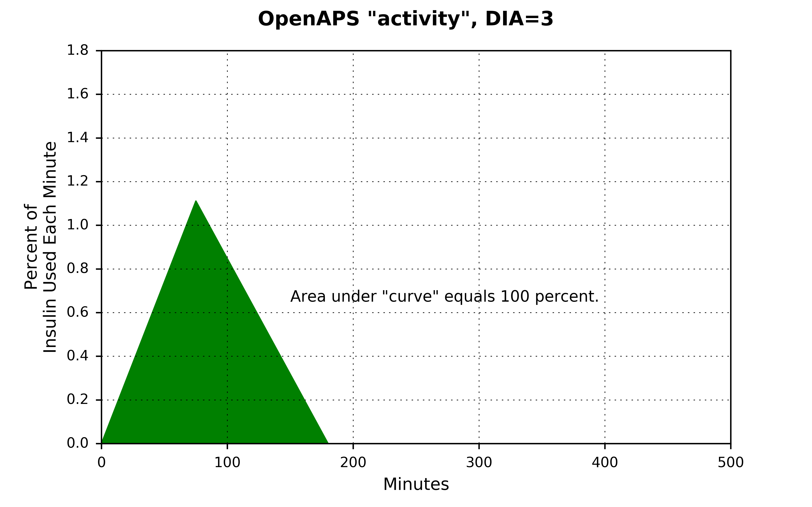
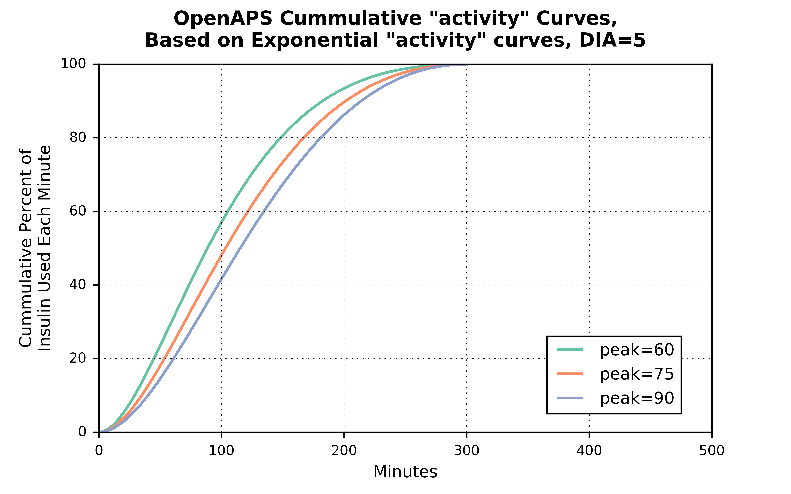
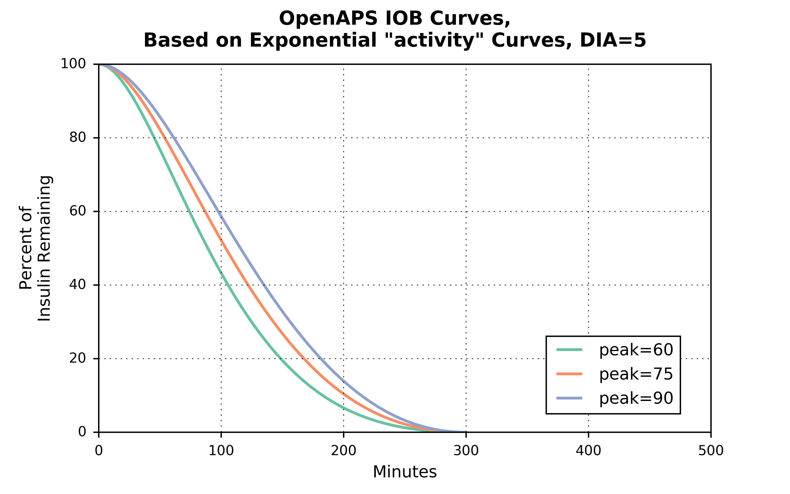
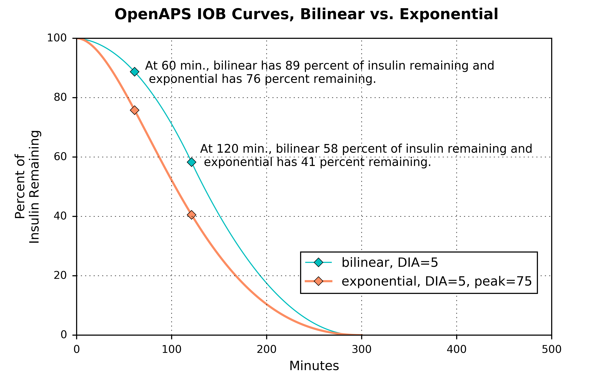

# Understanding Insulin on Board (IOB) Calculations

The amount of Insulin on Board (IOB) at any given moment is a key input into the `determine-basal` logic, which is where all the calculations for setting temporary basal rates or small microboluses (SMBs) takes place. This amount of insulin on board gets passed into [`oref0/lib/determine-basal/determine-basal.js`](https://github.com/openaps/oref0/blob/master/lib/determine-basal/determine-basal.js) as part of the `iob.json` file. That information is then used to project forward blood glucose (BG) trends, which the `determine-basal` logic then responds to in order to correct course. This piece of the OpenAPS documentation provides an explanation of the assumptions used about how insulin is absorbed and how those assumptions translate into the insulin on board calculations used to project BG trends.

## First, some definitions:
* **dia:** Duration of Insulin Activity. This is the user specified time (in hours) that insulin lasts in their body after a bolus. This value comes from the user's pump settings. 

* **end:** Duration (in minutes) that insulin is active. `end` = `dia` * 60.

* **peak:** Duration (in minutes) until insulin action reaches it's peak activity level.

* **activity:** This is percent of insulin treatment that was active in the previous minute." 

     
## Insulin Activity

The code in [oref0/lib/iob/calculate.js](https://github.com/openaps/oref0/blob/master/lib/iob/calculate.js) calculates a variable called `activityContrib`, which has two components: `treatment.insulin` and a component referenced here as `actvity`.  The unit of measurement for `treatment.insulin` is *units of insulin*; the unit of measurement for `activity` is *percent of insulin used each minute* and is used to scale the `treatment.insulin` value to *units of insulin used each minute*. (There is no variable `activity` created in [oref0/lib/iob/calculate.js](https://github.com/openaps/oref0/blob/master/lib/iob/calculate.js). There is, however, a variable called `activity` created in [oref0/lib/iob/total.js](https://github.com/openaps/oref0/blob/master/lib/iob/total.js), which represents a slightly different concept. See the FINAL NOTE, below, for more details.)

There are three key assumptions the OpenAPS algorithm makes about how insulin activity works in the body:

* **Assumption #1:** Insulin activity increases linearly (in a straight line) until the `peak` and then decreases linearly (but at a slightly slower rate) until the `end`. 

* **Assumption #2:** All insulin will be used up.

* **Assumption #3:** When insulin activity peaks (and how much insulin is used each minute) depends on a user's setting for how long it takes for all their insulin to be used up. That setting is their duration of insulin activity (`dia`) and generally ranges between 2 and 8 hours. The OpenAPS logic starts off with a default value of 3 hours for `dia`, which translates into 180 minutes for `end`, and assumes that insulin activity peaks at 75 minutes. (This is generally in line with findings that rapid acting insluins (Humalog, Novolog, and Apidra, for example) peak between 60 and 90 minutes after an insulin bolus.) This assumption, however, is generalizable to other user `dia` settings. That is, `peak` can be expressed as a function of `dia` by multiplying by the ratio (75 / 180):
    
    `peak` = f(`dia`) = (`dia` \* 60 \* (75 / 180))
    
    So, for example, for a `dia` of 4 hours, `peak` will be at 100 minutes:
    
    100 = (4 \* 60 \* (75 / 180))

> **NOTE:** The insulin action assumptions described here are set to change with the release of [oref0, version 0.6.0](https://github.com/openaps/oref0/tree/0.6.0-dev). The new assumptions will use exponential functions for the insulin action curves and will allow some user flexibility to use pre-set parameters for different classes of fast-acting insulins (Humalog, Novolog, and Apidra vs. Fiasp, for example). For a discussion of the alternate specifications of insulin action curves, see [oref0 Issue #544](https://github.com/openaps/oref0/issues/544). When oref0, version 0.6.0 is released and the current assumptions are no longer recommended, this documentation will be updated.
 

## What The Insulin Activity Assumptions Look Like
Given a `dia` setting of 3 hours, insulin activity peaks at 75 minutes, and between the 74th and 75th minutes, approximately 1.11 percent of the insulin gets used up.

Adding up all the insulin used *each minute* between 0 and `end`, will sum to 100 percent of the insulin being used. 

The area under the "curve" can be calculated by taking the [definite integral](https://en.wikipedia.org/wiki/Integral) for the `activity` function, but in this simple case the formula for the area of a triangle is much simpler:  

 	Area of a triangle = 1/2 * width * height 

 			    = 1/2 * 180 * 1.11 

 			    = 99.9 (close enough to 100 -- the actual value for activity is 1.1111111, which gets even closer to 100)

For shorter `dia` settings, the `peak` occurs sooner and at a higher rate. For longer `dia` settings, the `peak` occurs later and at a lower rate. But for each triangle, the area underneath is equal to 100 percent.

## Cumulative Insulin Activity

Given these `activity` profiles, we can plot cumulative `activity` curves, which are S-shaped and range from 0 to 100 percent.  (Note: This step isn't taken in the actual  [`oref0/lib/determine-basal/determine-basal.js`](https://github.com/openaps/oref0/blob/master/lib/determine-basal/determine-basal.js) program, but  plotting this out is a useful way to visualize/understand the insulin on board curves.)

Just like how the insulin activity curves shift depending on the setting for `dia`, the cumulative activity curves do as well.

## Insulin on Board

Insulin on board (`iob`), is the inverse of the cumulative activity curves. Instead of ranging from 0 to 100 percent, they range from 100 to 0 percent. With `dia` set at 3 hours, about 70 percent of insulin is still available an hour after an insulin dosage, and about 17 percent is still available two hours afterwards.

Similar to how the `activity` "curves" (triangles) and cumulative `actvity` curves vary by `dia` settings, the `iob` curves also vary by `dia` setting.

Similar to calculations above, the code in [oref0/lib/iob/calculate.js](https://github.com/openaps/oref0/blob/master/lib/iob/calculate.js) calculates a variable called `iobContrib`, which has two components: `treatment.insulin` and and a component referenced here as `iob`.  The unit of measurement for `treatment.insulin` is *units of insulin*; the unit of measurement for `iob` is *percent of insulin remaining each minute* and is used to scale the `treatment.insulin` value to *units of insulin remaining each minute*. (There is no variable `iob` created in [oref0/lib/iob/calculate.js](https://github.com/openaps/oref0/blob/master/lib/iob/calculate.js). There is, however, a variable called `iob` created in [oref0/lib/iob/total.js](https://github.com/openaps/oref0/blob/master/lib/iob/total.js), which represents a slightly different concept. See the FINAL NOTE, below, for more details.)

Finally, two sources to benchmark the `iob` curves against can be found [here](http://journals.sagepub.com/doi/pdf/10.1177/193229680900300319) and [here](https://www.hindawi.com/journals/cmmm/2015/281589/).

---

> **A NOTE ABOUT VARIABLE NAMES:**  A separate program&mdash;[oref0/lib/iob/total.js](https://github.com/openaps/oref0/blob/master/lib/iob/total.js)&mdash;creates variables named `activity` and `iob`. Those two variables, however, are not the same as the `activity` and `iob` variables plotted in this documentation page. Those two variables are summations of all insulin treatments still active. 

>The `activity` and `iob` concepts plotted here are expressed in percentage terms and are used to scale the `treatment.insulin` dosage amounts, so the units for the `activityContrib` and `iobContrib` variables are *units of insulin per minute* and *units of insulin remaining at each minute*, repectively. Because the `activity` and `iob` variables in [oref0/lib/iob/total.js](https://github.com/openaps/oref0/blob/master/lib/iob/total.js) are just the sums of all insulin treatments, they're still in the same units of measurements: *units of insulin per minute* and *units of insulin remaining each minute*.

---

# Understanding the New IOB Curves Based on Exponential Activity Curves

As mentioned at the top of this page, the next OpenAPS release will have new activity curves available for users to use. 

In the new release, users will be able to select between using a "bilinear" (looks like what was  plotted above: /\) or "exponential" curves. Unlike the bilinear `activity` curve (which varies only based on `dia` values in a user's pump), the new exponential curves will allow users to specify both the `dia` value to use AND where they believe their `peak` insulin activity occurs.

A user can select one of three curve defaul settings:

* **bilinear:** Same as how the curves work in oref0, version 0.5 -- IOB curve is calculated based on a bilinear `activity` curve that varies by user's `dia` setting in their pump.

* **rapid-acting:** This is a default setting for Novolog, Novorapid, Humalog, and Apidra insulins. Selecting this setting will result in OpenAPS to use an exponential `activity` curve with `peak` activity set at 75 minutes and `dia` set at 300 minutes (5 hours).

* **ultra-rapid:** This is a default setting for the relatively new Fiasp insulin. Selecting this setting will result in OpenAPS to use an exponential `activity` curve with `peak` activity set at 55 minutes and `dia` set at 300 minutes (5 hours).

 >**Note:** If **rapid-acting** or **ultra-rapid** curves are selected, a user can still choose a custom `peak` and `dia` time, but subject to two constraints:
 >
 > * `dia` must be greater than 300 minutes (5 hours); if it's not, OpenAPS will set `dia` to 300 minutes.
>
> * `peak` must be set between 35 and 120 minutes; if it's not, OpenAPS will set `peak` to either 75 or 55 minutes, depending on whether the user selected **rapid-acting** or **ultra-rapid** default curves.

## What Do The Exponential Curves Look Like?
Most commonly, *exponential* is associated with *exponential growth* -- as in, how quickly bacteria might grow in a petri dish, for example. A little less commonly, *exponential* is associated with *exponential decay* -- as in, what the radioactive half-life of a particular element might be.

Examples of such *exponential growth* and *exponential decay* could look like this:

(Though the mathematical formulas can be written such that how steep the growth or decay curves can vary quite a bit.)

In the application of exponential curves in modeling how insulin is used in the human body, the trick is to write a mathematical formula that combines some delay in the activity, some rapid growth in the activity to the peak, and then a smooth transition down until all the insulin is used up. (See the **Technical Details**, below for links to the underlying math.)

With `dia` set to 5 hours and the `peak` set to 75 minutes (the default settings for **rapid-acting** insulins), the exponential activity curves in the OpenAPS dev branch looks like this:

Just like how the bilinear curve in OpenAPS version 0.5.4, the `activity` curves in version 0.6 will start at zero and end at zero and the area under the curve will sum up to 100 percent of the insulin being used up. 

The shape of exponential `activity` curves can vary by either `dia` or by `peak`. Below is what the `activity` curves look like for three separate `peak` settings, but holding the `dia` setting fixed at 5 hours.

A useful way to visualize how the `activity` curves translate to the `iob` curves is to first show what the cumulative `activity` curves look like:

And then the `iob` curves are just the inverse of the cumulative `activity` curves:

## How Do The Exponential Curves Compare To The Bilinear Curves?
The most important question to a user might be: "Well which set of curves is better for me to use?"

Everyone is different, and their bodies may absorb insulin at different rates. Furthermore, an individual's insulin absorption may vary from day-to-day or week-to-week for many reasons. But with a lot of parameter settings, finding the **best** one is often a process of trial-and-error.

That said, the bilinear curve currently used in OpenAPS 0.5.4 is a relatively simple model of how insulin is absorbed. Although it's a simple model, in many cases it provides decent approximations. The proposed exponential curves are more complex and more closely aligned to how an individual's body might absorb their insulin. But users may or may not find significant differences in how their OpenAPS performs just by switching to the exponential curves.

You can think of the exponential curve for the default **rapid-acting** insulin settings (`dia` = 5 hours, `peak` = 75 minutes) as being a combination of two bilinear curves. One where `dia` is set to 3 hours and the `peak` occurs at 75 minutes; and another one where the `dia` is set to 5 hours, but the `peak` occurs at 125 minutes. 

(The area under each of the three curves sums to 100 percent.)

To make a more direct, apples-to-apples, comparison, setting the exponential curve with `dia` = 5 hours and `peak` = 125 minutes, the difference between the two curves is a little clearer: 

**NOTE: As described above, OpenAPS will NOT allow you to set a `peak` value above 120 minutes. This graph is shown just to make a direct comparison between the two types of curves.**

Finally, going back to an exponential curve with `dia` set to 5 hours and `peak` set to 75 minutes, the comparison between how the `iob` curve looks relative to the `iob` curve using the bilinear `activity` curve with `dia` set to 5 hours is probably the most relevant:

The `iob` curve based on the exponential `activity` curve has insulin being used up significantly faster than the `iob` curve based on the bilinear `activity` curve. After one hour, for example, there is a 13 percent difference in how much insulin is remaining between the two curves, and after 2 hours there is a 17 percent difference between the two curves.

## Technical Details
The source for the new functional forms for the exponential curves were calculated by [Dragan Macsimovic](https://github.com/dm61) and can be found as part of a discussion on the [LoopKit Github page](https://github.com/LoopKit/Loop/issues/388#issuecomment-317938473). There were many others contributing to this discussion, development, and testing of exponential curves for Loop and OpenAPS. The [full discussion](https://github.com/LoopKit/Loop/issues/388) is very technical, but useful if you want more information on the exponential curves.