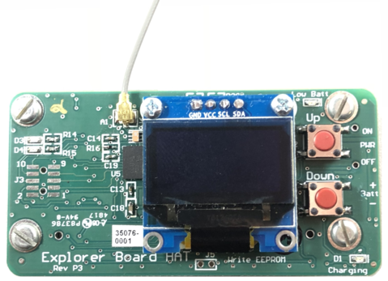

# Understanding your OpenAPS rig

## Pi HAT rig

After April 2018, there is a Pi+HAT rig as an option for closing the loop with OpenAPS. The HAT can be ordered from the same place that makes the Explorer Board ([click here](https://enhanced-radio-devices.myshopify.com/products/900mhz-explorer-hat?variant=1950212653065). We call it the "Explorer HAT", to differentiate from the Explorer "Board" that goes with the Edison. 

#### Getting Physical: Build your Pi/HAT rig

If you chose a "Pi Zero WH" (with headers), you will place the HAT on the Pi.

##### Buttons and Menu System

The Explorer Board Pi HAT includes a 128x64 OLED display with two general purpose buttons to navigate an included menu system.

##### Button Navigation

The Pi HAT has two general purpose buttons labeled "Up" and "Down". A single press of the "Up" button will move the menu selection cursor up a single menu item and a single press of the "Down" button will move the menu selection cursor down a single menu item.

A double press of the "Down" button will enter in currently selected menu item as indicated by the ">" next to a menu item.

A double press of the "Up" button will take you back to the previous screen.

##### Menu Items

 
<b>The current tree of available menu items (click to expand):</b>

 

* OpenAPS
  * Status Graph
  * Set Temp Target
    * Cancel temp Target
    * Eating Soon: 60m@80
    * Speaking: 45m@110
    * Walking: 45m@120
    * Running: 60m@140
  * Status Text
  * Enacted Reason
  * Show pump-loop.log
  * Unicorn Logo
* Wifi
  * Current Wifi Network
  * Current Hostname
  * Current IP Address
  * Show network.log
* System
  * Voltage
  * Display Tests
    * Checkerboard 1
    * Checkerboard 2
    * All On
    * Boxes 1
    * Boxes 2
  * lsusb
  * Reboot
  * Cancel Reboot

 

A series of images of the menu items can be [viewed here](https://imgur.com/a/9qLf93B).

#### Charging

The rig can be charged via microUSB.

**Note:** the charging LED on the board is not working currently (unless you remove the Q3 transistor). Currently, it’s basically just a “plugged into the wall” indicator. The only side effect of removing Q3 is on the binary charging signal to the Pi (which doesn’t work anyway, and we’ve not tried to use). The voltage monitoring should work fine either way, but while the rig is charging will report 4.2V (“fully charged”) any time the battery is more than about 50% charged. So to be sure if it’s charged you should unplug the rig.

**2nd Note:** make sure the battery plug is switched to ON while the rig is plugged. Otherwise the battery won't charge.

#### Power

Like an Edison rig, you can use a single cell (1s) lipo battery or similar; or use wall power.

#### LED

The Pi HAT offers 4 LEDs labeled with D1-D4. D1 is the charging LED and works as described above. D2 is the battery low indicator. It turns orange when the LiPo battery voltage goes below 3.6 V or when the rig is plugged and the battery switch is on OFF. D3 and D4 are connected to the CC1110 radio processor and are controlled by the subg_rfspy radio firmware while resetting the radio. That happens repeatedly during wait-for-silence.

#### Multiple Rigs? What if I have an Edison AND a Pi rig?

Just like multiple Edison rigs play well together, an Edison and a Pi rig can also work fine side by side. As always, best practice is to make sure they're in the same feature set - don't have one type of rig using SMB's if the other hardware has an old code version that isn't aware of SMB's. 

## Edison/Explorer Board rig

The Edison/Explorer Board is one of the "rig" types you can use to close the loop with OpenAPS. 

#### Getting Physical: Build your Edison/Explorer Board rig/put the physical pieces together

The Explorer board is where all the communications are housed for the rig, as well as the battery charger.  The Edison is the mini-computer where all the OpenAPS code will be sent and used.  In order for this to work, first you have to screw and connect the Edison and Explorer Board together with the nuts and bolts you order.  

The nuts and bolts are tiny, and the spaces are a little tight.  It really helps to use a set of tweezers and a small Phillips head screwdriver. You will need 2 small gold screws, 2 small nuts, and 2 small silver screws.

It's easiest to start with the Explorer board and put on 2 nuts and gold screws (nuts on the side with most of the wiring) inside the little outline where the Edison will eventually sit.  The gold screws should be placed as shown, with nuts on the backside.  Then, lay the Edison board on top of the gold screws, aligning the screw holes on the Edison board with the gold screw heads (which have screw holes in them).  Use a small Phillips head screwdriver to tighten the silver screws into the gold screws beneath them.  The Edison board should not wobble, and should feel secure when you are done.  Attach your battery into the explorer board plug.  A single red light should appear and stay lit.  During the course of your OpenAPS rig use, it's good practice to periodically check that the nuts and screws stay tightened.  If they come loose, the Edison can wobble off the connection to the Explorer board and you will either get looping failures (if it's loose) or be unable to connect to the Edison (if it comes completely off).

 

#### Charging LiPo Battery

You can use the little white block that comes with an iPhone (or similar charger) and a microB-USB cable.  The same cables you used to setup the rig and connect to the computer will work for charging, too.  Either one of the USB ports on the Explorer board will work for charging.  When charging is active, there is an extra red light on in the corner of the Explorer board.  When charging is complete, that corner red light will turn off.  It may come back on periodically as the battery "tops off".  You won’t do any damage leaving the rig plugged in for longer than the charge takes. 

While the rig is plugged in for charging, the Nightscout battery pill will read approximately 65%.  This is because it is reading the charging voltage rather than the battery voltage.  Once you disconnect from the charger, the Nightscout battery pill will display the LiPo battery's voltage and percent again.

#### What the lights mean and where they are

* The LED between the two ports is the power. If this light is on, your rig is on.
* The LED in the corner is the charging indictator.
* The two next to the microUSBs (one green on the latest boards) are for the cc1110 radio chip. By default they just blink once each when you mmtune or otherwise reset it.

#### Where is the power button?

The little black button on the end of the board near the JST connector is the power button. If you want to reboot your rig, the easiest way is to hold down the tiny power button for 10-15 seconds until the power light turns off.  Wait a couple seconds and then press and hold the power button again until the light turns back on.  Give the loop a couple minutes to get itself going again. Rebooting solves a majority of rig issues. 

#### Where is the radio?

The radio and antenna are down on the end of the Explorer board where you see a little white stick (opposite end of the board from where your battery connects at the JST connector). 

### Cutting the trace to improve radio communication
Some OpenAPS users have found that cutting a portion of the Explorer Board's hidden copper antenna wire (called a trace) will improve radio comms with the pump. Before doing this, remember to disconnect any attached battery or power source. For North American (NA) or Canadian/Australian (CA) pumps (using the 916MHz band), you're looking to cut near the white line that is between the 1 and the 5 in the "915." Consider cutting on the 1-side rather than the exact spot where the white "cut" line is drawn because it is so close to the corner where the rest of the copper wire goes. To make the cut, use a sharp x-acto blade to cut through the copper just beneath the green surface of board. It will take a few swipes and you'll hear a small scraping noise when you get through the wire.  Make sure you've cut all the way through the wire to the green circuit board material on the other side.

Watch this [video](https://www.facebook.com/groups/TheLoopedGroup/permalink/1854229718127019/?hc_location=ufi) for an example.

#### LiPo Battery

LiPo batteries are great for a lot of things, but taking damage is not one of them.  Please treat LiPo batteries with care.  Keep them protected from puncture.  The Explorer board has some “pointy” parts on the underside, so providing some protection from the board’s squish is a good idea.  A small piece of protection (such as a business card or non-conductive thin foam sheet) will help protect the battery from the board above it.  

Since there is some warmth with an OpenAPS rig, it is also not recommended to put a rig unprotected in a pocket close to the body.  The LiPo battery can become warped from the heat or bent from being in the pocket and potentially compromised.  A durable case or waist-belt pouch is a good idea (see [here](http://openaps.readthedocs.io/en/latest/docs/Gear%20Up/edison.html#cases) for both hard and soft case ideas).

The connections between the LiPo battery and its red and black wires are fragile and can break easily.  Consider taping the wires to the battery with electrical tape as described in SparkFun's LiPo battery care [tutorial](https://www.sparkfun.com/tutorials/241).  (See the Reinforcing the Power Cables section.)  This will stabilize the wires and relieve tension on the connections. 

There are several places to get LiPo batteries, with lots of different dimensions and capacities.  A 2000 mAh LiPo will get you about 12-14 hours of use, assuming you have the standard setup (which is what you get following these docs) running. 

#### What happens if you have multiple rigs?

If you have multiple OpenAPS rigs, they’re built to be polite to each other. Even if you had two or more rigs in same room, they won’t trip each other up. They “wait for silence” before issuing any commands to the pump. By having multiple rigs throughout a house, you can move from room-to-room without carrying rigs because the rigs will pass-off comms as you moves in and out of the rig’s range. Stationary rigs will not need LiPo batteries and can be plugged directly into a wall charger from the Explorer board.
