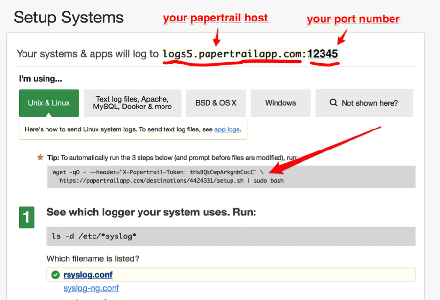
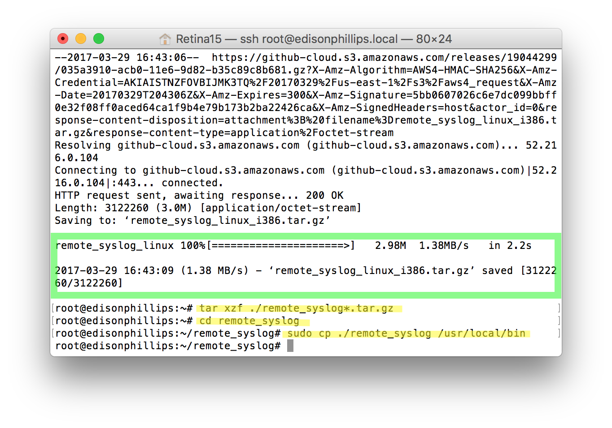
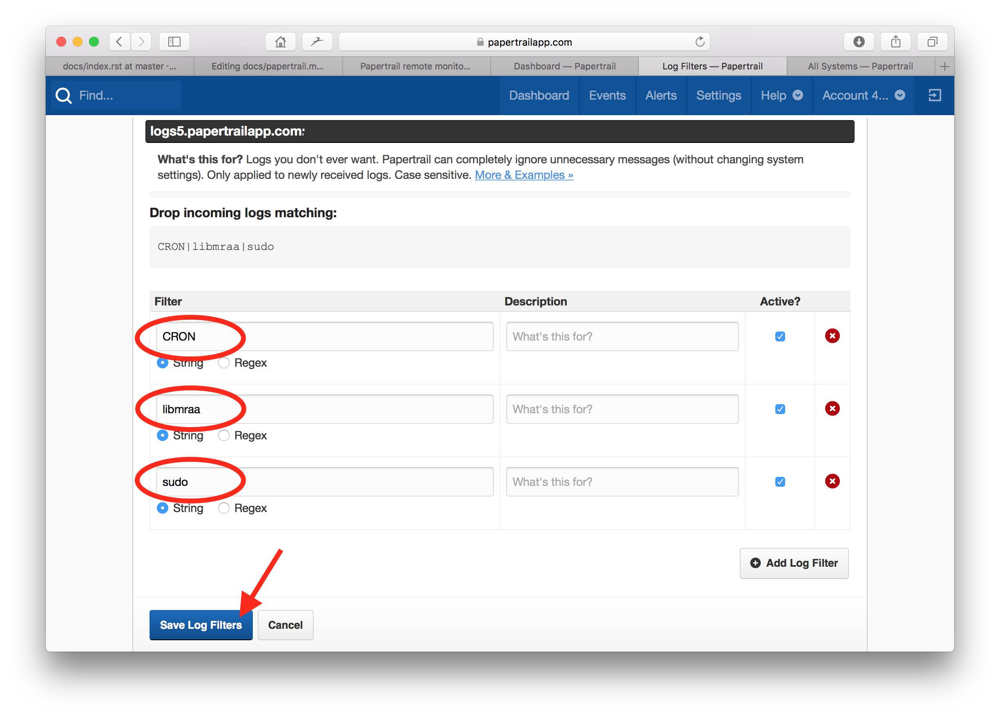
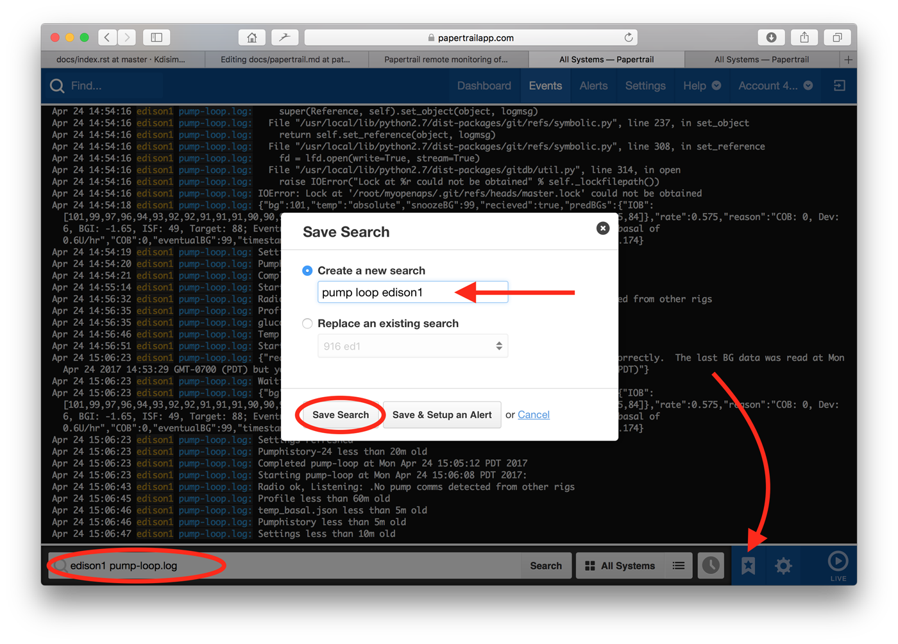

# Understanding all the ways to monitor your rigs

There are two general groups of ways to monitor your rigs:

* Online, meaning it requires the rig to have internet connectivity (via a wifi or hotspot/tethered connection)
* Offline, meaning the rig does not have any internet connectivity

## The main ways of monitoring your rig ONLINE include:

* [Papertrail](http://openaps.readthedocs.io/en/latest/docs/While%20You%20Wait%20For%20Gear/monitoring-OpenAPS.html#papertrail-remote-monitoring-of-openaps-logs-recommended)
* [Accessing via SSH (either using an app on your phone, or your computer)](http://openaps.readthedocs.io/en/latest/docs/While%20You%20Wait%20For%20Gear/monitoring-OpenAPS.html#accessing-your-rig-via-ssh)
* [Nightscout](http://openaps.readthedocs.io/en/latest/docs/While%20You%20Wait%20For%20Gear/nightscout-setup.html)
* Pebble watch (your watchface of choice, such as [Urchin](https://github.com/mddub/urchin-cgm))

********************************

## The main ways of monitoring your rig OFFLINE include:

* [Pancreabble](http://openaps.readthedocs.io/en/latest/docs/While%20You%20Wait%20For%20Gear/monitoring-OpenAPS.html#pancreabble-offline-connection-to-pebble-watch) (offline connection to your Pebble watch)
* For Android users: "[Hot Button](http://openaps.readthedocs.io/en/latest/docs/While%20You%20Wait%20For%20Gear/monitoring-OpenAPS.html#hot-button-for-android-users)"
* For any phone type: [Creating a web page that can be accessed on the phone via the rig's IP address](http://openaps.readthedocs.io/en/latest/docs/While%20You%20Wait%20For%20Gear/monitoring-OpenAPS.html#offline-web-page-from-rig-for-any-phone-user)

********************************

## You'll probably come back to this page later to setup different monitoring options

At this point, if you're not yet set up on OpenAPS, you won't quite be ready to set up all of the below options for accessing your rig - because your rig is not built yet! But, just know that there are different "online" and "offline" ways to **monitor** your rig, so you'll want to think about your preferences for both situations, and know that the instructions on the rest of this page are here when you're more familiar and are ready to set up some or all of them.

********************************

## Accessing your rig via SSH

See below for different ways to access your rig:
* [If your computer and rig are on the same wifi network](http://openaps.readthedocs.io/en/latest/docs/While%20You%20Wait%20For%20Gear/monitoring-OpenAPS.html#if-your-computer-and-rig-are-on-the-same-wifi-network)
* [If your computer and rig are on different wifi networks](http://openaps.readthedocs.io/en/latest/docs/While%20You%20Wait%20For%20Gear/monitoring-OpenAPS.html#if-your-computer-and-rig-are-on-different-wifi-networks)
* [If your iPhone and rig are on the same wifi network](http://openaps.readthedocs.io/en/latest/docs/While%20You%20Wait%20For%20Gear/monitoring-OpenAPS.html#if-your-iphone-and-rig-are-on-the-same-wifi-network)

********************************

### If your computer and rig are on the same wifi network


#### For Mac computers

* Open the Terminal App found in the Utilities folder in Applications.

* Use the command `ssh root@edisonhost.local` (**or whatever you named your edison host**, in the example below, the hostname was edison1).  If this is your first time logging in to the rig on the computer, you may get a message about the authenticity of the host and whether you want to add the key fingerprint to the list of known hosts.  Go ahead and answer yes.  You will be asked for the password for the rig...enter your root password that you setup in Phase 0 (the default was edison).  Realize that keystrokes will not appear as you enter the password.  A successful login will result in a screen similar to below.


* If you get an error about "could not resolve hostname", it is likely that your rig is actually connected to a different wifi network than the computer. Try the screen method (directions below) for connecting to your rig.


* If you get an scary looking error about "WARNING: REMOTE HOST IDENTIFICATION HAS CHANGED!" that is likely because you are attempting to login to a rig that has the same hostname as a previous rig that has been logged into on the computer.  (This is why you want to use unique hostnames if you are going to have multiple rigs.)  You can delete the history of known hosts for the rig by entering the commands `cd .ssh` and then `rm known_hosts`.  This will delete the log of known hosts on your computer.  There's no significant downside to removing the known_host log, except that you will need to answer yes to the key fingerprint additions again for the first time you login to old rigs again.  After you delete the known hosts, you can use the `ssh root@edisonhost.local` command to login, as described above.


#### For Windows computers

* Open PuTTY program

* Click the SSH radio button and then enter the IP address of the rig on the "Host Name" line in PuTTY.  


* If you do not know the IP address of the rig, you can obtain it by first logging on using Serial connection (described below) and using the command `ifconfig`.


* Click the "Open" button in the PuTTY window and, if this is your first time logging into the rig using PuTTY using ssh, you may see a warning regarding the server's host key.  Click yes to add the host key to PuTTY's cache. 


* Login using login name `root` and password is whatever you changed it to during setup in Phase 0.  The default password was edison.  As you type the password, no keystrokes will appear on the screen.  Successful login will leave you at a prompt for the root user.


### If your computer and rig are on different wifi networks


**Access to the rig will need a cable to connect the UART port on the rig with the USB port on the computer.  You will need a cable capable of transmitting data.  If you try all of the steps below and are unsuccessful at connecting, try a new cable.**

#### For Mac computers

* Use the Terminal app on the Mac, or follow [these directions for Windows](http://openaps.readthedocs.io/en/latest/docs/Resources/Edison-Flashing/all-computers-flash.html#if-you-re-using-a-windows-pc-for-console)

* If you're using a Mac, use the command `sudo screen /dev/tty.usbserial-* 115200` to enable “screen” mode.  You will be prompted to enter a password.  Enter your **computer's password** not the rig's password here.


* You may see a blank screen.  Press RETURN to bring up the edison’s login screen.  Login as `root` and use your root password (you should have changed it from the default of `edison` during the setup of the rig - if not, please [go back and do so now](http://openaps.readthedocs.io/en/latest/docs/Resources/Edison-Flashing/all-computers-flash.html#initial-edison-setup).  A successful login will look like below.


* If instead, you see a message at the bottom of the screen that says "Sorry, could not find a PTY." that usually means the system has not cleared a previous screen session.  If you only had the rig connected by one cable in the UART port on rig, you can simply unplug the rig from the computer and move to a new USB port on the computer.  If you don't have any "new" USB ports that were not used by the previous login attempt, then close out terminal app, restart the computer, and try again.  This will clear the error.


* If instead you see a message at the bottom of the screen that says "Cannot exec '/dev/tty.usbserial-*': No such file or directory", double check that you have your rig and computer connected via the rig's UART port.  Using the OTG port will cause this error message.  Or typos in the screen command will have same result.  Double check your spelling, or better yet...use copy and paste whenever possible.


#### For Windows Users

* Navigate to your Control Panel and then to Device Manager.  Click on the Ports to open your USB serial port.  Find the COM port that the rig is connected to.  In the screenshot below, COM7.  Note: different USB ports will have different numbers.  If you regularly plug your rig into the computer and use this connection type, you may need to make sure you update the COM number in the steps below if you are switching between different USB ports.  


* Open PuTTY program.  Click on the Serial radio button, enter the COM number you got from the previous step into the Serial line number and change the speed to 115200.  Click on Open button.


* Enter `root` for the login and the password is whatever you changed it to during setup in Phase 0.  The default password was edison.  As you type the password, no keystrokes will appear on the screen.  Successful login will leave you at a prompt for the root user as shown below.


********************************
### Papertrail remote monitoring of OpenAPS logs (RECOMMENDED) 

If you want to remotely view the rig's logs/loops, you can use Papertrail service.  We HIGHLY recommend setting up this service for at least the first month of your OpenAPS use to help remotely and quickly troubleshoot your rig, if you have problems.  The first month of Papertrail comes with a very generous amount of free data.  If you decide you like the service, you can sign up for monthly plan.  Typically, the monthly cost for using Papertrail with OpenAPS is approximately $5-7 depending on how many rigs you use and how long you'd want to save old data.

#### Get an account at Papertrail

Go to http://papertrailapp.com and setup a new account.  Choose to setup a new system.  Notice the header at the top of the new system setup that says the path and port that your logs will go to.  You’ll need that information later.



#### System logging 

Login to your rig. If you need help with that, please see the [Accessing Your Rig](http://openaps.readthedocs.io/en/latest/docs/WhileYouWaitForGear/monitoring-OpenAPS.html#accessing-your-rig-via-ssh) section of these docs.  Copy and paste the code that is displayed in your new system setup's shaded box, as shown in the red arrowed area in the screen shot above. This will setup papertrail for just your syslogs.  But, we now will need to add more (aggregate) your logs such as pump-loop and ns-loop.

#### Aggregating logs

* Copy and paste each of these four command lines, one at a time.  The screenshot below shows the successful results of each command.  The first command will run for a short time and end with similar information to the green box.  The remaining three commands will not display anything specific as a result of the command.

`wget https://github.com/papertrail/remote_syslog2/releases/download/v0.19/remote_syslog_linux_i386.tar.gz`

`tar xzf ./remote_syslog*.tar.gz`

`cd remote_syslog`

`sudo cp ./remote_syslog /usr/local/bin`



* Create the file that will store all the logs you'd like to aggregate:

`vi /etc/log_files.yml`

* press "i" to enter INSERT mode, and then copy and paste the following (updating your host and port on the lines shown to match what your new system info shows as described above):

```
files:
 -  /var/log/openaps/pump-loop.log
 -  /var/log/openaps/autosens-loop.log
 -  /var/log/openaps/ns-loop.log
 -  /var/log/openaps/network.log
 -  /var/log/openaps/autotune.log
 -  /var/log/openaps/cgm-loop.log
 -  /var/log/openaps/pushover.log
destination:
  host: logs5.papertrailapp.com # NOTE: change this to YOUR papertrail host!
  port: 12345   # NOTE: change to your Papertrail port
  protocol: tls
```
type ESC and ":wq" to save changes and exit.

* Start a new aggregate

`sudo remote_syslog`

Now you should be able to see your new logs in your papertrail, but we need to make it so this runs automatically when the rig is restarted.

#### Install auto restart at reboot

* Create a new file that will restart the papertrail logging at reboot

`vi /etc/systemd/system/remote_syslog.service`

* press "i" to enter INSERT mode, and then copy and paste the following:

```
[Unit]
Description=remote_syslog2
Documentation=https://github.com/papertrail/remote_syslog2
After=network-online.target

[Service]
ExecStartPre=/usr/bin/test -e /etc/log_files.yml
ExecStart=/usr/local/bin/remote_syslog -D
Restart=always
User=root
Group=root

[Install]
WantedBy=multi-user.target
```

type ESC and ":wq" to save changes and exit.

* enable the reboot service by using these two commands, one at a time.

`systemctl enable remote_syslog.service`

`systemctl start remote_syslog.service`

* reboot your rig to test the papertrail

`reboot`

and then go to your papertrailapp website to see the log


#### Optimize Papertrail use

To make the most of your Papertrail logs, setting up some of your account settings and filters will help streamline your troubleshooting

##### Account Filters

Adding filters to your incoming Papertrail logs will help minimize unuseful data (and help keep you below your data caps) and streamline your review of your relevant OpenAPS logs.  You can go to your Papertrail account's `Settings` and then choose the `Log Destinations`. Click on `Log Filters` to go to the screen where you can add specific filters.


Click on the `Add Log Filter` button and add three filters for `CRON`, `libmraa`, and `sudo`.  Save the changes and within 60 seconds, your logs will be filtered.  The CRON, libmraa, and sudo logs usually provide very little help for troubleshooting OpenAPS problems.  You can always undo these filters, if you want to see what those provide in the future.



##### Saved Filters

Unfortunately, Papertrail does not currently have an app for use on mobile devices.  Instead, you will be using an internet browser to view your papertrail.  Setting up saved filters, in advance, can help you sort through your logs more efficiently.  Most OpenAPS troubleshooting will involve either wifi connection issues or pump communications.  Some helpful filters to save to find those issues fastest are:

* `pump-loop.log` to see just your pump loop...similar to using the `l` command when logged into your rig.  

* `network` will show just your oref0-online results and whether/which wifi network your rig is connected to.  If you see results of `192.168.1.XX`, then your rig is likely connected to a wifi network.  If you see results of `172.20.10.XX` then your rig is likely connected to your phone's personal hotspot.  If you see `error, cycling network` results, you should check out troubleshooting steps.

* `pump-loop.log adjust` will show your basal and ISF adjustments being made by autosens, if enabled.

If you are running multiple rigs, you can also setup these filters to include the hostname of a particular rig, if you want to filter just for that rig.  For example, this screenshot below would be setting and saving up a filter for a particular rig with the hostname of `edison1` and only for its pump-loop.log.  



Once you get your desired filters saved, it is an easy process to make them more accessible on your mobile device by using the `add to homescreen` button.  For example, below are the quick links to the saved filters for an OpenAPS user with three rigs...


#### Troubleshooting using Papertrail

Papertrail can be very valuable to quickly troubleshoot a rig, because it is quite easy to see all the loops that log information about your rig's actions.  BUT, the way that the information comes into Papertrail is based on the time the action took place.  So, you'll be seeing information stream by that may or may not help you troubleshoot WHICH area your issues are.

First, let's start with messages that **ARE NOT ERRORS**

* Anything in the first 15 minutes (pretty much) of a new loop setup.  Let the loop run for 15 minutes before you start to investigate the messages.  Many messages resolve themselves during that time, such as `cat: enact/enacted.json: No such file or directory` is because the loop hasn't enacted a temp basal suggestion yet...so the file doesn't exist.

* `Radio ok. Listening: .No pump comms detected from other rigs` This message is NOT an error.  This means your rig is checking to make sure it is not interrupting another rig that may already be talking to your pump.  It's being polite.

* `[system] Failed to activate service 'org.freedesktop.hostname1': timed out` This message is NOT an error. Jubilinux does not use the hostname service...so it does not activate.

* Many messages that say there are failures, are not really failures for your rig.  For example, there are a lot of scary looking messages when your rig is changing networks from wifi to/from BT...an unfiltered papertrail will show every message like this:


But, really, most of those messages are the normal course of the rig telling you what's going on.  Like "Hey, I seem to have disconnected from the wifi...I'm going to look for BT now.  Hold on.  I need to organize myself.  Bringing up my stuff I need to find BT.  Ok, found a BT device.  Well, I can connect to it, but some of the features I don't need...like an audio BT connection."  But, the rig doesn't speak English...it speaks code.  So, if you don't speak code...sometimes a filer for `network` might help you filter for the English bits of info a little better.  Here's what that same period of time looked like with a `network` filter applied.  It's a little more clear that my rig was changing from a BT tether to a wifi connection when you filter the results.


Therefore when you start to troubleshoot, **USE YOUR FILTERS** to narrow down the logs that you are looking at.  Here are some specific errors/issues you may find.

**PUMP TUNING**

Use `pump-loop` search filter to start with.  What messages are you seeing?  Poor pump comms are one of the most frequent causes of loops stopping.  If you see `916, 0, -99` tuning results, then you know that your rig is not getting a usable communication with your pump.  Try moving your pump and rig closer together.  Check if your pump battery is good.  


 
 Ideally you should be seeing pump tuning somewhat like the filter for `mmtune` below shows...this is a kid at school, carrying the rig in a purse/backpack.  Some periods of time she leaves her rig behind (like PE class) and other shorter times where there's poor pump comms.  But, generally speaking seeing mmtune results in the 70s and 80s will sustain good looping.
 


**GIT LOCK**

There are files that get written to in a directory called `/root/myopenaps/.git`  Sometimes a process crashes and causes a file in that directory to get locked and the writing can't continue.  Your loop may fail as a result.  This can be a short term issue, and it could resolve on its own...other times it may require you to delete the file that is causing the problem.  For example, below is a short-term error.  The message says there is a problem in the `/root/myopenaps/.git` and I may need to remove that file to get things going again.  However, you can also see that a few minutes later, the problem resolved on its own.

If you find a .git lock error is causing a long period of time where your loop is failing, you can remove the file, as the error suggests by using `rm -rf /root/myopenaps/.git/filename`  or you can delete the whole `.git` directory (it will get rebuilt by the loop automatically) with `rm -rf /root/myopenaps/.git`


**FLAKEY WIFI**

Having flaky router or wifi issues?  Some routers or ISPs (I still haven't completely determined the cause) will not work nice with the Avahi-daemon.  What the means for you...spotty time staying connected to your wifi.  Does your rig not loop consistently?  Sometimes are you getting kicked out of ssh sessions with your rig?  Look for the message shown in the screenshot below:


Or alternatively, if you see this message when you login to your rig:


The solution to this is to login to your rig and use this command `systemctl disable avahi-daemon` as shown below


AND also make this edit using `vi /etc/default/avahi-daemon`  Change the number on the last line from `1` to `0` so that it reads `AVAHI_DAEMON_DETECT_LOCAL=0` as shown in the screenshot below. (remember `i` to enter INSERT mode for editing, and `esc` and `:wq` to save and exit the editor)


`reboot` your rig after the change to enable the fix.

**subg_rfspy state or version??**

If your loop is failing, lights are staying on, and you see repeated error messages about "Do you have the right subg_rfsby state or version?" as below, then you need to head to [this section of docs](http://openaps.readthedocs.io/en/latest/docs/Resources/troubleshooting.html#could-not-get-subg-rfspy-state-or-version-have-you-got-the-right-port-device-and-radio-type) to fix that issue.  Don't worry, it is a 5 minute fix.  Very straight-forward.


********************************

### Pancreabble - offline connection to Pebble watch


_(TO DO Note - Pancreabble instructions for OpenAPS need to be re-worked to reflect the oref0-setup script way of making it work. Below is notes about Pancreabble setup prior to oref0-setup.sh being in existence.)_

[Pancreabble] is a way to monitor your loop _locally_, by pairing a Pebble smartwatch directly with the Raspberry Pi or Intel Edison.

In other words, whereas the default setup looks like this:

```
Raspberry Pi/Intel Edison -> network -> Nightscout server -> network -> smartphone
                                                                     |
                                                                     -> laptop
                                                                     |
                                                                     -> Pebble watch
```

And by default, your Pebble is paired thus:

```
               smartphone -> Bluetooth -> Pebble watch
```

With Pancreabble, the setup looks like this:

```
Raspberry Pi/Intel Edison -> Bluetooth -> Pebble watch
```

Using a Pebble watch can be especially helpful during the "open loop" phase: you can send the loop's recommendations directly to your wrist, making it easy to evaluate the decisions it would make in different contexts during the day (before/after eating, when active, etc.).

See [Pancreabble] for initial setup instructions.

[Pancreabble]: https://github.com/mddub/pancreabble

Once you've done the first stages above, you'll need to do generate a status file that can be passed over to the Pebble Urchin watch face. Fortunately, the core of this is available in oref0.

Go to `~src/oref0/bin` and look for `peb-urchin-status.sh`. This gives you the basic framework to generate output files that can be used with Pancreabble. To use it, you'll need to install jq using:

`apt-get install jq`

If you get errors, you may need to run `apt-get update` ahead of attempting to install jq.

Once jq is installed, the shell script runs and produces the `urchin-status.json` file which is needed to update the status on the pebble. It can be incorporated into an alias that regularly updates the pebble. You can modify it to produce messages that you want to see there.

When installing the oref0-setup you will need to replace all instances of AA:BB:CC:DD:EE:FF with the Pebble MAC address. This can be found in Settings/System/Information/BT Address.  NOTE: Make sure the MAC address is in ALL CAPS.

Once you've installed, you will need to pair the watch to your Edison.

#### Bluetooth setup for Pancreabble

* Restart the Bluetooth daemon to start up the bluetooth services.  (This is normally done automatically by oref0-online once everything is set up, but we want to do things manually this first time):

`sudo killall bluetoothd`

* Wait a few seconds, and run it again, until you get `bluetoothd: no process found` returned.  Then start it back up again:

`sudo /usr/local/bin/bluetoothd --experimental &`

* Wait at least 10 seconds, and then run:

`sudo hciconfig hci0 name $HOSTNAME`

* If you get a `Can't change local name on hci0: Network is down (100)` error, start over with `killall` and wait longer between steps.

* Now launch the Bluetooth control program: `bluetoothctl`

* And run: `power off`

* then `power on`

* and each of the following:

```
discoverable on

scan on

agent on

default-agent
```

#### On Your Pebble

Settings/BLUETOOTH to make sure Pebble is in pairing mode

from terminal 

`trust AA:BB:CC:DD:EE:FF`
`pair AA:BB:CC:DD:EE:FF`

you might need to do this several times before it pairs

you will see on the edison

`Request confirmation
[agent] Confirm passkey 123456 (yes/no): yes`

* (WARNING: You must type in **yes** not just **y** to pair)

Once paired, type quit to exit.


Currently the `peb-urchin-status.sh` has 1 notification and 3 different options for urchin messages.
in you APS directory there is a file called 'pancreoptions.json' 
```
"urchin_loop_on": true,  <--- to turn on or off urchin watchface update
"urchin_loop_status": false, <--- Gives a message on urchin watchface that it's running
"urchin_iob": true,   <--- Gives a message on urchin watchface of current IOB
"urchin_temp_rate": false, <--- Gives a message on urchin watchface of current temp basal
"notify_temp_basal": false <--- Notification of temp basal when one shows up in enact/suggested.json
```
note only one of the messages for the urchin watchface can be true at once

the `peb-urchin-status.sh` gets called from the crontab and will run automatically.
By default the urchin_loop_on, and urchin_iob is set to true. You must manually change notify_temp_basal to true to start getting temp basal notifications.  you can edit this file using `nano pancreoptions.json` from your APS directory.

********************************

### Hot Button - for Android users

#### Purpose
[Hot Button app](https://play.google.com/store/apps/details?id=crosien.HotButton) can be used to monitor and control OpenAPS using SSH commands. It is especially useful for offline setups. Internet connection is not required, it is enough to have the rig connected to your android smartphone using bluetooth tethering.

#### App Setup 
To setup the button you need to long click. Setup the Server Settings and set them as default. For every other button you can load them.

#### Basic commands
To the Command part of the button setup you can write any command which you would run in the ssh session. For example to show the automatic sensitivity ratio, you can set:
`cat /root/myopenaps/settings/autosens.json`

After button click the command is executed and the results are displayed in the black text area bellow the buttons. 

#### Temporary targets
It is possible to use Hot Button application for setup of temporary targets.  This [script](https://github.com/lukas-ondriga/openaps-share/blob/master/start-temp-target.sh) generates the custom temporary target starting at the time of its execution. You need to edit the path to the openaps folder inside it.

To setup activity mode run:
`./set_temp_target.sh "Activity Mode" 130`

To setup eating soon mode run:
`./set_temp_target.sh "Eating Soon" 80`

The script is currently work in progress. The first parameter is probably not needed, it is there to have the same output as Nightscout produces. It is not possible to set different top and bottom target, but this could be easily added in the future. 
To be able to use the script, the most straigtforward solution is to disable the download of temporary targets from Nightscout. To do that edit your openaps.ini and remove `openaps ns-temptargets` from ns-loop. 

#### SSH Login Speedup
To speed up the command execution you can add to the `/etc/ssh/sshd_config` the following line:
`UseDNS no`

********************************

### Offline web page from rig - for any phone user

**TODO** - implement this as a proper oref0 script that can be installed by oref0-setup

This allows you to extract data from the various files that OpenAPS creates and access the locally from the phone that is connected to the rig, giving a full information set.

A. First, you need to set up the script that will do this for you. An example is shown below:

```
rm ~/myopenaps/enact/index.html
touch ~/myopenaps/enact/index.html

(cat ~/myopenaps/enact/smb-enacted.json | jq -r .timestamp | awk '{print substr($0,12,5)}') >> ~/myopenaps/enact/index.html

(cat ~/myopenaps/enact/smb-enacted.json | jq -r .reason) >> ~/myopenaps/enact/index.html
(echo -n 'TBR: ' && cat ~/myopenaps/enact/smb-enacted.json | jq .rate) >> ~/myopenaps/enact/index.html                                  
(echo -n 'IOB: ' && cat ~/myopenaps/enact/smb-enacted.json | jq .IOB) >> ~/myopenaps/enact/index.html
(echo -n 'Edison Battery: ' && cat ~/myopenaps/monitor/edison-battery.json | jq -r .battery | tr '\n' ' ' && echo '%') >> ~/myopenaps/enact/index.html
(echo -n 'Insulin Remaining: ' && cat ~/myopenaps/monitor/reservoir.json) >> ~/myopenaps/enact/index.html
```
You may need to adjust the values in `'{print substr($0,12,5)}'` - whilst I know these work on the rigs I have set them up on, other's have had better results with `{print substr($0,13,5)}'`

It can be set up where you choose, either in your openaps directory or at root.

B. You will also need to start up the SimpleHTTPserver service that is already installed on jubilinux in the location you will place your file. This is done by adding the following line to your Cron:

```
@reboot cd /root/myopenaps/enact && python -m SimpleHTTPServer 1337
```
The final thing to do is to make sure the script runs regularly to collect the data and publish it. This requires an additional cron line:

```
*/5 * * * * (bash /root/http.sh) 2>&1 | tee -a /var/log/openaps/http.log
```
In this case the script is running from the /root directory and I am publishing to the ~/myopenaps/enact directory.

C. Accessing via your phone

**IPHONE USERS:** To access this from an iphone browser, enter something like the following: http://172.20.10.x:1337/index.html and you should receive an unformatted html page with the data in it. If you want to improve the output for a browser, the script can be modified to generate html tags that will allow formatting and could provide colouring if various predicted numbers were looking too low.

**ANDROID USERS:** On Android, you can download http-widget (https://play.google.com/store/apps/details?id=net.rosoftlab.httpwidget1&hl=en_GB) and add a widget to your home screen that will display this data.

**SAMSUNG GEAR S3 WATCH USERS:** If you use a Samsung Gear S3 watch, you can use the above http-widget with Wearable Widgets (http://wearablewidgets.com) to view what OpenAPS is doing locally, without internet connection.
