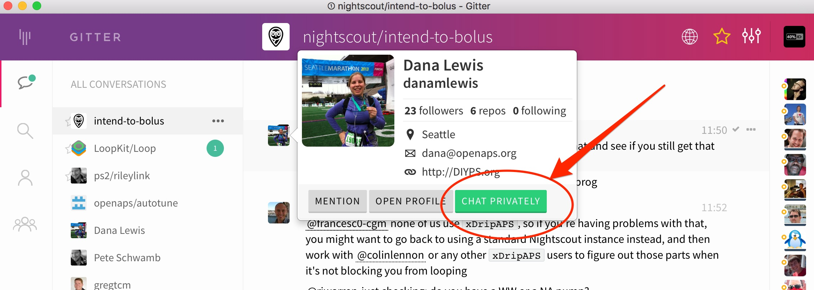
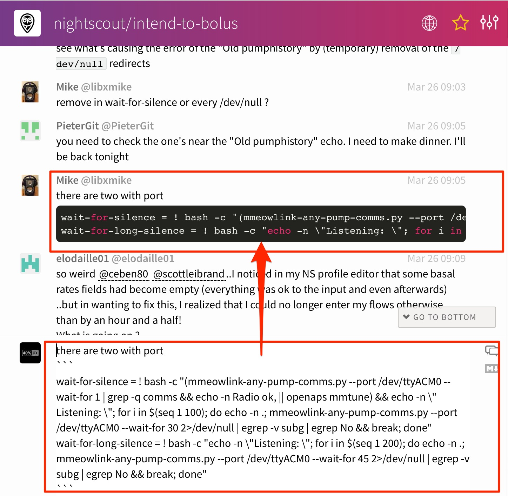
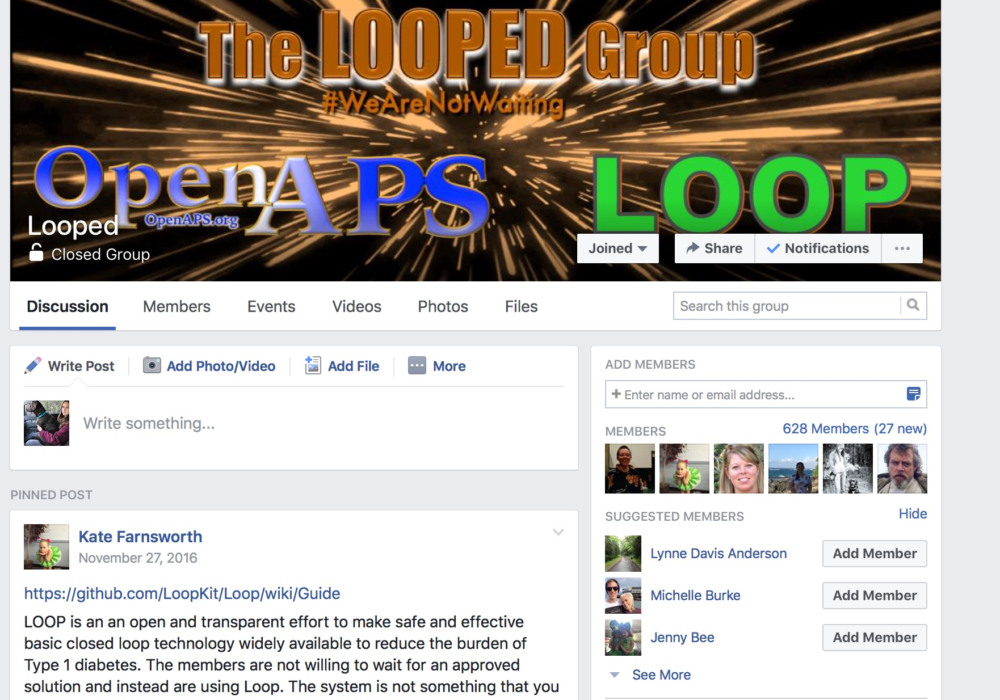

# Where to go for help with your implementation

There are several ways to communicate with other participants and contributors in the #OpenAPS project. See also the [Resources](../Resources/index.rst) section for additional assistance.

**Note:** It's best practice not to share your pump's serial number, so make sure not to include it in pictures or pasted text output when seeking help on pump communication.

**Related**: You may want to read [this blog post for tips on how to best seek help when troubleshooting online](https://diyps.org/2017/03/19/tips-for-troubleshooting-diy-diabetes-devices-openaps-or-otherwise/) - there is a lot of information you can provide proactively when seeking help that will aid in getting your issue resolved more quickly.

### Gitter
[Gitter](https://gitter.im/) is a messaging/chat service similar to IRC. It provides integration with GitHub and several other services. It's the best place to get real-time support with anything related to OpenAPS. (Here's [why we often recommend asking questions on Gitter](https://diyps.org/2016/08/17/why-you-should-post-questions-in-gitter/).)

* The [nightscout/intend-to-bolus]( https://gitter.im/nightscout/intend-to-bolus) channel is where you will find active #OpenAPS discussions ranging from technical issues with openaps tools to control theory to general information. It is a great place to introduce yourself and get some help from those who are a few steps further down the road.
* For Autotune conversations, use the [openaps/autotune channel](https://gitter.im/openaps/autotune)
* For TI stick communication, use the [oskarpearson/mmeowlink channel](https://gitter.im/oskarpearson/mmeowlink)
* For RileyLink conversations, use the [ps2/rileylink channel](https://gitter.im/ps2/rileylink)
* For LoopKit conversations, use the [LoopKit/Loop channel](https://gitter.im/LoopKit/Loop)

Gitter has a search function to find old information, but since it isn't threaded converations, you may need to spend some time reading the posts after the search result to find the ultimate resolution to the question.  So, if you find a particularly useful bit of information that you couldn't find in the docs...please make a PR to the docs so that the information is permanently stored for others to find.

Tag someone! You can tag particular people if you have a question by using the `@` symbol and then typing their username.  This will help notify the person that you are "speaking to them".  You can also private message people by hovering over their profile picture and choosing the "chat privately" button.

************
**A note about posting photos or screenshots in Gitter**

Gitter has a mobile app which works great for posting text, but does not allow for posting images directly.  If you need to post a photo using the mobile app, you'll have to host your photo file somewhere like Dropbox and post the link to the file location.

Using the desktop application, you can simply drag and drop the file into the Gitter chat window.  The file will upload and then display in the chat thread after a short period of time to upload.
*************

Posting copy-paste code from your rig is also another valuable activity for troubleshooting.  To post a single line of information, you can use the single-backtick-quote that is found on the key to the left of the number 1 key on the keyboard.  (hint: it is under the ~ on the same key).  You can also extended-hold the single quote key on your iPhone keypad to bring up the single-backtick-quote that will work in Gitter.  If you start and stop a portion of your text with those single quotes, it will `look like this`.

Posting multiple lines of copy-paste from your rig will also sometimes be needed.  You can do that by:

* start a single line of 3 single quotes (the same one we used in the example above)
* press `control-enter` to get a new line started
* paste the lines of code that you want to post
* press `control-enter` again to get another new line
* enter 3 single quotes to end the section

The copy-pasted lines should have 3 single quotes on the line above and the line below.  The example below shows, on the bottom, how the formatted text yielded the black box of text in Gitter.  Using this format helps troubleshooters read your information easier than unformatted copy and paste.

### Facebook

There is also a [Looped Group](https://www.facebook.com/groups/TheLoopedGroup/?fref=nf) in Facebook that is currently a discussion place for users on both Loop and OpenAPS systems.  You will need to request membership for the group and respond to a message from the group administrators prior to joining.

The Looped Group has grown considerably in the last 6 months and has many users on both systems.  You can search for previous posts on topics that may interest you.  Note:  If you are asking for troubleshooting help, screenshots and additional information about where you are in your problem will help get the best response.

### Google Group - everyone is recommended and welcome to join!
A google group focused on #OpenAPS development work can be found [here](https://groups.google.com/d/forum/openaps-dev). Request access to participate and see some of the archived discussions. If you're new, make sure to introduce yourself!

### Issues on openaps GitHub
For reporting issues on the openaps tools formally, the openaps [issues page](https://github.com/openaps/openaps/issues) on GitHub is the proper forum. Feel free to try and get through the issues by working with others on the Gitter channel first if you think it may be something unrelated to the codebase.

### Other online forums
Those in the #OpenAPS community are frequently found in other forums, such as on Twitter (using [the #OpenAPS hashtag](https://twitter.com/search?f=tweets&vertical=default&q=%23OpenAPS&src=typd), as well as [#WeAreNotWaiting](https://twitter.com/search?f=tweets&vertical=default&q=%23WeAreNotWaiting&src=typd)) and on Facebook in the ["CGM In The Cloud"](https://www.facebook.com/groups/cgminthecloud/) and ["Looped"](https://www.facebook.com/groups/TheLoopedGroup/)group.

There is also a [Slack channel](https://omniapsslack.azurewebsites.net/) to discuss communication around other pumps that are being explored for being used for other DIY closed loops.
