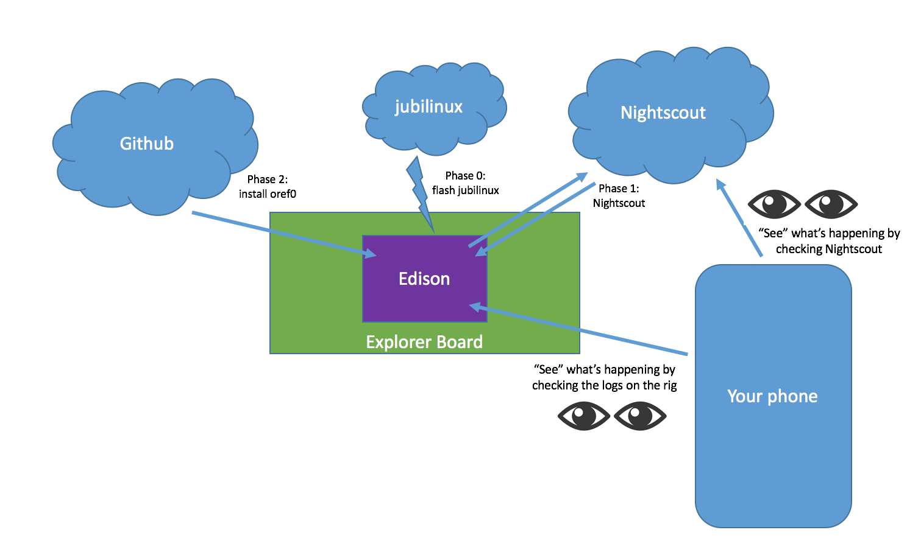

# Understanding this guide and how to build your own OpenAPS implementation

Some conventions used in this guide:

* Wherever you see text that is formatted `like this`, it is a code snippet. You should copy and paste instead of attempting to type this out; this will save you debugging time for finding your typos.
* You will see a <tt>$</tt> at the beginning of many of the lines of code. This
  indicates that it is to be entered and executed at the terminal prompt. Do not type in the dollar sign <tt>$</tt>.
* Wherever there are `<bracketed_components>` in the the code, these are meant for you to insert your own information. Most of the time, it doesn't matter what you choose **as long as you stay consistent throughout this guide**. That means if you choose `myopenaps` as your  `<myopenaps>`, you must use `myopenaps` every time you see `<myopenaps>`. Choose carefully when naming things. Do not include the `< >` brackets in your name.

### Before you get started

Some familiarity with using the terminal will go a long way, but is not required for getting started.  Terminal (or PuTTY) is basically a portal into your rig, allowing us to use our computer's display and keyboard to communicate with the little [Edison or Pi] computer in your rig.  The active terminal line will show your current location, within the computer's file structure, where commands will be executed.  The line will end with a <tt>$</tt> and then have a prompt for you to enter your command.  

There are many commands that are useful, but some of the commands you'll get comfortable with are: 

* `cd` means "change directory" - you can `cd <directorynamewithnobrackets>` to change into a directory; and `cd ..` will take you backward one directory and `cd` will take you back to the root directory. If you try to `cd` into a file, your computer will tell you that's not going to happen.

* `ls` means "list", is also your friend - it will tell you what is inside a directory. If you don't see what you expect, you likely want to `cd ..` to back up a level until you can orient yourself. If you aren't comfortable with what `cd` and `ls` do or how to use them, take a look at some of the Linux Shell / Terminal commands on the [Troubleshooting](../Resources/troubleshooting.md) page and the reference links on the [Technical Resources](../Resources/technical-resources.md) page. 

* `cat` means "concatenation" - it will show you the contents of a file if you `cat <filename>`.  Very useful when trying to see what you have in preferences or other oref0 files.

* `vi` and `nano` are both editing command prefixes.  Using those will bring you into files for the purposes of editing their contents.  It is like `cat` except you will be able to edit.

One other helpful thing to do before starting any software work is to log your terminal session. This will allow you to go back and see what you did at a later date. This will also be immensely helpful if you request help from other OpenAPS contributors as you will be able to provide an entire history of the commands you used. To enable this, just run `script <filename>` at the beginning of your session. It will inform you that `Script started, file is <filename>`. When you are done, simply `exit` and it will announce `Script done, file is <filename>`. At that point, you can review the file as necessary.

### What you won't see in this guide

You won't see a full loop where you can just download the code, press a button, and have a live loop. There are many places where there are examples, and instructions, but you must do the work to understand what you're doing - and why. This is key for helping you understand what you are building and how it will work.

### But wait - I need the "Dummy" version

Well, actually, you don't.  If you can deal with diabetes, this isn't that big a deal.  But it will probably help to have some idea what is going on here.

It may help to think of the OpenAPS setup as a tiny "diabetes brain" which is focused only on figuring out how much basal insulin you should be getting.  It does this by collecting all that background data we usually let our pumps deal with: what is your insulin sensitivity, your target BG, the duration of action for insulin, etc.  Then, it collects more immediate data, such as what is the current IOB, and basal rate, as well as checking out the CGM to see what your BG has been up to recently.  Then, it decides what should be changed (if anything) and tells your pump to go to a new temp basal rate, either higher or lower, depending on all the other factors.

For more details about how OpenAPS works, please [review the OpenAPS Reference Design](https://openaps.org/reference-design/).

### Understanding the basic steps in the Walkthrough

You'll see us refer to `openaps` (no capitalization) from time to time - this is the building block toolkit that allows us to communicate with various diabetes devices, and ultimately construct an OpenAPS implementation. For most users, you won't have to touch the underlying toolkit (but if you need it, you'll find detailed walkthrough instructions and more content related to the [original openaps toolkit pieces here](http://openaps.readthedocs.io/en/latest/docs/openaps-guide/index.html)). 

The high level process for building a system, as outlined in [the rest of the documentation](http://openaps.readthedocs.org/en/latest/):

**Phase 0**: HARDWARE PREPARATION
* Buy your [hardware](http://openaps.readthedocs.io/en/latest/docs/walkthrough/phase-0/hardware/hardware.html).
* Put the pieces together (pop the Edison on an Explorer Board; or plug Carelink/radio stick into Pi, etc.)
* Install necessary software (also called "flashing" jubilinux to [setup the Edison](http://openaps.readthedocs.io/en/latest/docs/walkthrough/phase-0/setup-edison.html) on the Explorer Board rig) and enable wifi. (Pi users will follow [other steps to prepare their Pi](http://openaps.readthedocs.io/en/latest/docs/walkthrough/phase-0/rpi.html)).

**Phase 1**: NIGHTSCOUT 
* Get your Nightscout site installed and ready for OpenAPS, so you can more [easily visualize](http://openaps.readthedocs.io/en/latest/docs/walkthrough/phase-1/index.html) what your closed loop is doing.

**Phase 2**: LOOP INSTALLATION
* [Install oref0](http://openaps.readthedocs.io/en/latest/docs/walkthrough/phase-2/oref0-setup.html#step-0-dependencies) on your rig. This means taking code from Github, and storing it on your rig. 
* Run [oref0-setup.sh](http://openaps.readthedocs.io/en/latest/docs/walkthrough/phase-2/oref0-setup.html#step-2-run-oref0-setup) to create your closed loop, personalize it, and schedule it to automatically run.  This step creates the `<myopenaps>` directory and the loop's scheduler called the `cron`. 

**Phase 3**: LOOP PREFERENCES
* At the end of Phase 2, you'll have a working closed loop that by default is a <b>low-threshold suspension loop</b>.  After you are comfortable with the loop's performance in preventing lows, you can enable it to perform to include help with correcting high blood sugar as well.  For that change, along with many other helpful settings, you'll want to [read this section to understand what it's doing, and how to further personalize your setup](http://openaps.readthedocs.io/en/latest/docs/walkthrough/phase-3/index.html). 

**Phase 4**: ADVANCED FEATURES
* [Tell us you've closed the loop](http://openaps.readthedocs.io/en/latest/docs/walkthrough/phase-4/keeping-up-to-date.html), and enable any [advanced features](http://openaps.readthedocs.io/en/latest/docs/walkthrough/phase-4/advanced-features.html) that you're ready for!

**WARNING:** the links above are quick-links to various sections, but there are other steps you will need to do to not miss anything. We recommend [starting at the top of the docs here](http://openaps.readthedocs.io/en/latest/index.html) and making sure you don't miss any pages of instructions. 

### Understanding how all the pieces fit together

When you get to the end of Phase 2, `ls` in the root directory will show you the following files and directories:
 * `src`:  The first part of Phase 2 creates a directory called `src` (as in "source code") and installs `oref0` there. This means, to find and look at the underylying oref0 code, you must `cd src`, and then `cd oref0` if you want to see those source code files.  They will be a replicate of what is on the openaps/oref0 repository in Github at the time you performed the `git` command.  Updating your rig will perform a fresh `git` of the source code and update oref0 on your rig.
 * `myopenaps`: The second part of Phase 2, running oref0-setup.sh (also called the "setup script", creates the `<myopenaps>` directory. This directory contains your loop's personal information about pump reads, reports, settings, and preferences.  The information such as pump serial number and Nighscout URL reside in this directory as well.  You can see the contents of that directory by `ls <myopenaps>`.  
 * `crontab.txt`: At the end of oref0-setup.sh, you will be asked if you want to enable the "cron" to schedule and automate your closed loop.  If you answer "yes", the script creates a crontab file at the same level as where the `src` and `<myopenaps>` directories are located. Once it's running, it will also create various logs that are stored on the Edison/Pi, so you can see what it has done in the past; what it is doing now; and why it is doing or has done anything. 
 * `kernel.config`: files related to Edison operations.

`ls <myopenaps>` will show the following files and subdirectories contained within the directory:
* autotune
* cgm
* cgm.ini
* detect-sensitivity.ini
* determine-basal.ini
* enact
* get-profile.ini
* iob.ini
* meal.ini
* mmtune_old.json
* monitor
* ns-glucose.ini
* ns.ini
* openaps.ini
* oref0.ini
* oref0-runagain.sh
* pebble.ini
* preferences.json
* pump.ini
* pump-session.json
* raw-cgm
* settings
* tz.ini
* units.ini
* upload
* xdrip.ini

`ls settings` will show the contents of the `settings` subdirectory; the files which collect longer-term loop data.  
* autosens.json
* autotune.json	     
* basal_profile.json   
* bg_targets.json      
* bg_targets_raw.json  
* carb_ratios.json	
* insulin_sensitivities.json      
* insulin_sensitivities_raw.json
* model.json			     
* profile.json		     
* pumphistory-24h.json
* pumphistory-24h-zoned.json
* pumpprofile.json
* settings.json
* temptargets.json

`ls monitor` will show the contents of the `monitor` subdirectory; current data going on right now in your loop.
* battery.json
* carbhistory.json
* clock.json
* clock-zoned.json
* edison-battery.json
* glucose.json
* iob.json
* meal.json
* meal.json.new
* mmtune.json
* pumphistory.json        
* pumphistory-zoned.json
* reservoir.json
* status.json
* temp_basal.json

`ls enact` will show the contents of the `enact` subdirectory; loop's suggested and enacted temp basals and changes.
* enacted.json
* suggested.json
