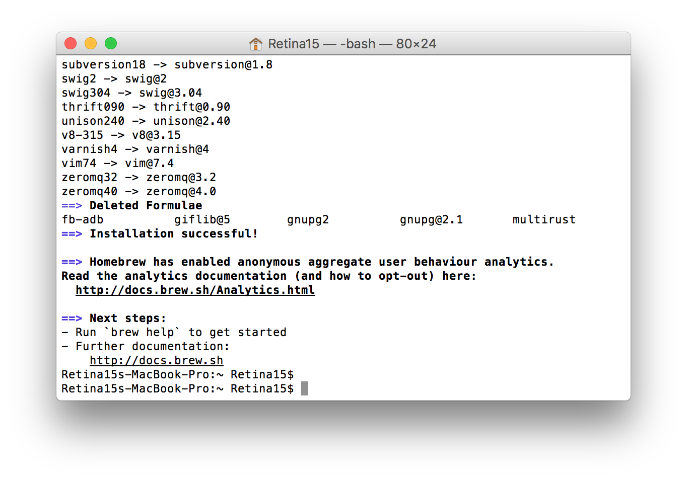
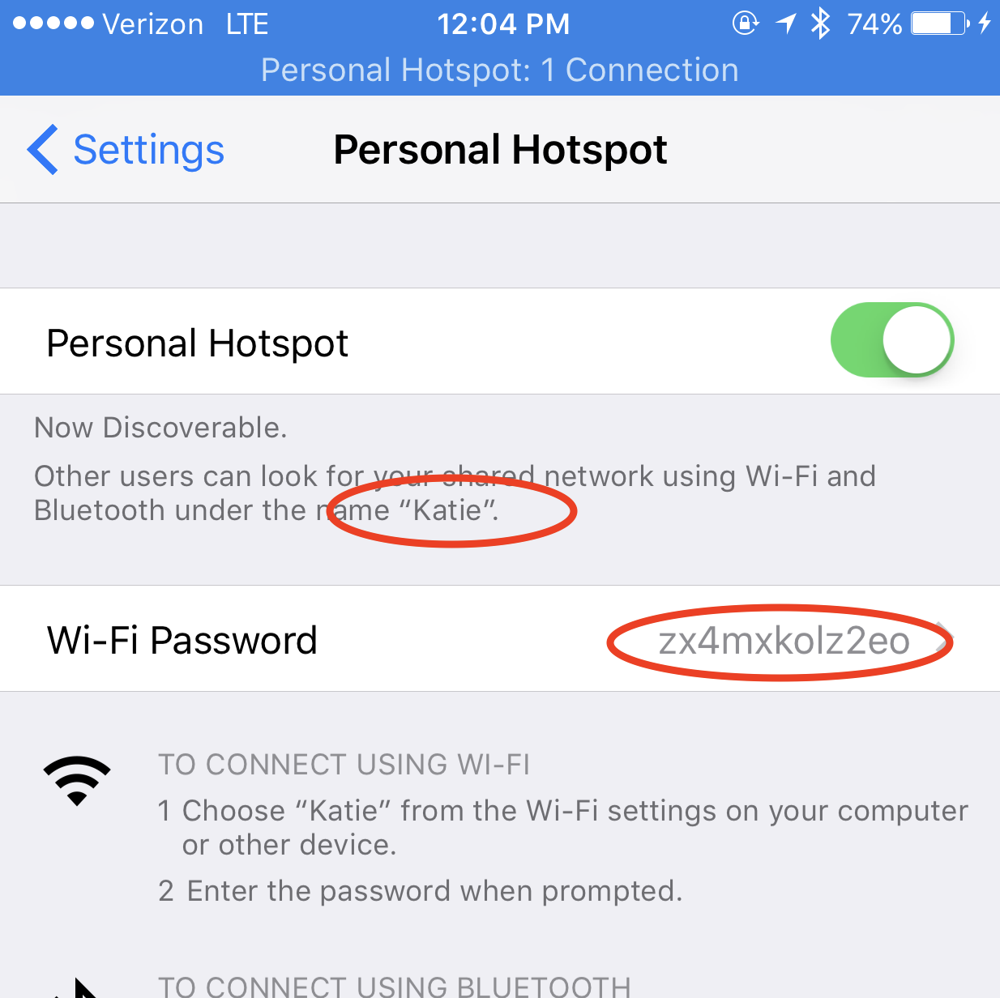
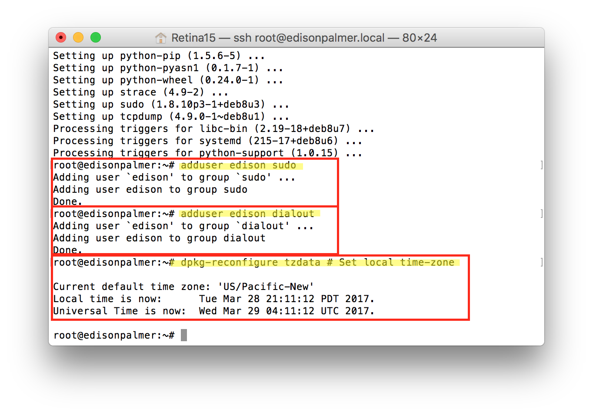

# Setting up Edison/Explorer Board on a Mac - Alpha Instructions

(This is testing a separate workflow for Mac only. Please refer to the main Edison setup guide as well for troubleshooting & full instructions for other computer setup processees.)

## Hardware Assumptions for this page

1.  Using an explorer board and Edison
2.  Using an Apple computer
3.  Using a Loop-compatible Medtronic pump (note - OpenAPS can actually use an additional set of pumps, the x12 series, although it requires one extra step not documented here. See this page in OpenAPS docs for all compatible pumps.)

## High Level Recommended Rig parts list

* Explorer Board
https://enhanced-radio-devices.myshopify.com/products/900mhz-explorer-block-pre-order

* Edison
https://www.sparkfun.com/products/13024

* Nuts and Bolts
https://www.sparkfun.com/products/13187

* Lithium Battery
(Katie recommends using the larger battery for a little longer battery life; but that may be slightly bigger than your Explorer Board.)
https://www.adafruit.com/products/328  (2500mAh battery)
https://www.sparkfun.com/products/8483  (2000mAh battery)

* Cables 
(you may already have workable USB cables; you just need 2 to complete this process.  Doesn’t have to be a certain length either, just giving options if you have a preference for shorter or longer cables.)
https://www.adafruit.com/products/592 (3 ft long cable, USB-microB)
https://www.adafruit.com/products/898 (6 inch long cable, USB-microB)

## Getting Physical: Build your rig/put the physical pieces together

The Explorer board is where all the communications are housed for the rig, as well as the battery charger.  The Edison is the mini-computer where all the OpenAPS code will be sent and used.  In order for this to work, first you have to screw and connect the Edison and Explorer Board together with the nuts and bolts you order.  

The nuts and bolts are tiny, and the spaces are a little tight.  I find it really helps to use a set of tweezers and a small Phillips head screwdriver.

Easiest to start with the explorer board and put on 2 nuts and gold screws (nuts on the side with most of the wiring). Inside the little outline where the Edison will eventually sit.  Gold screws, as shown, with nuts on the backside.   Then lay the Edison board on top, aligning the screw holes.  Use small Phillips head screwdriver to tighten the screws into the gold screws beneath them.  Edison board should not wobble, and should feel secure when you are done.  Attach your battery into the explorer board plug.  A single red light should appear and stay lit.

 

## Software-build your rig

Building the software into your rig is comprised of three steps:

1. preparing the Edison (aka flashing the Edison)
2. installing the “looping” code (aka setup script for oref0)
3. customizing your loop 

### 1. Preparing/flashing the Edison

The Edison comes with an operating system that doesn’t work the best with OpenAPS.  The first step is to replace the operating system with a new one.  This is called “flashing” the Edison.  

Let’s start by downloading the updated operating system (it’s called Jubilinux) to your computer so that we can install it later onto the Edison.  Go to Safari and download jubilinux.zip

Now we move to the Edison.  You’ll see two microB USB ports on your explorer board.  One is labeled OTG (that’s for flashing) and one is labeled UART (that’s for logging into the Edison from a computer).  We will need to use both to flash.  We’re going to plug both of those into our computer’s USB ports using the cables listed in the parts list (Dexcom’s charging cable will work. too). 

 

Once you plug in the cables, you should see your Edison board in your Finder folder as a connected “device”.  If you don’t…try different cables.  If your USB port is bad and not recognizing the device, you may need to reset your SMC first (it’s not hard to do, takes 2 minutes.)

 

The OpenAPS uses Terminal, kind of like Loop uses Xcode.  It’s our interaction with the code that forms the basis of the loop.  You may have never even used the Terminal app.  Go to your Applications folder and find the Terminal App in the Utilities folder.  Double click to open it.


Terminal app is an ugly, plain interface…but it does what we need to do, communicate with the Edison.  Basically, the Edison is a computer that lacks a keyboard and display.  By using a cable connected to the rig, we can login to the Edison and use Terminal as a way of interacting with the Edison. 

When you first launch Terminal, you will probably see something rather plain like below.  The important thing to know is that the Terminal helps show you WHERE you are in your computer or Edison.  So, in the screenshot below, it’s telling me I am in my “iMac4K” user account.  If you are ever a little confused where you are…you can look to the left of the $ prompt and get an idea.


If you’re like me, you don’t “speak linux” (or python or java or…) nor do you really know what linux is.  So, you’ll be comforted to know that most of this setup is cut and paste commands into Terminal.  You won’t need to suddenly learn linux…just will need to follow directions and be willing  learn some basics.

**IMPORTANT NOTE**: STEPS 1-8 will be updated periodically, and also will likely be out of date.  Since this is just a cheat sheet, it may not have all the troubleshooting tips or updated info that the main OpenAPS docs have.  If you get stuck and this guide’s set of instructions do not work at the moment, the place to look is the [OpenAPS Walkthrough Phase 0, Setting up your Intel Edison](http://openaps.readthedocs.io/en/latest/docs/walkthrough/phase-0/setup-edison.html) for the full information on this part of the OpenAPS setup.

The next steps will be done in the Terminal app.  If you see code lines in a grey box, that’s what you want to copy and paste into Terminal, and then press enter.  Don’t try typing it…you’ll likely miss a space or add a typo.  So, let’s start…

#### **1-1. Install homebrew**

`ruby -e "$(curl -fsSL https://raw.githubusercontent.com/Homebrew/install/master/install)"`

You will be prompted to enter “RETURN” to continue and then enter your passcode for the user account (your computer password).  When you type the password, you will not see any letters appear in the Terminal screen..that is normal.  Terminal does not show keystrokes for passwords.


It will take about 1-2 minutes for Homebrew to install.  You’ll see a bunch of commands scrolling by in Terminal window.  Just wait it out until you see the screen showing Installation successful and you’ll be returned to the $ Terminal prompt.



#### **1-2.  Install a bunch of other stuff (dfu-util, coreutils, gnu-getopt)**

`brew install dfu-util coreutils gnu-getopt`


#### **1-3.  Install lsusb (copy and paste one line at a time, pressing enter after each)**

`brew update             && \`

`brew tap jlhonora/lsusb && \`

`brew install lsusb`


#### **1-4.     Start Edison console**

`sudo screen /dev/tty.usbserial-* 115200`

You’ll be asked for your computer password again.  Enter it.  A blank screen will likely come up, then press enter to wake things up to show an Edison login prompt.  Login with username “root” (no quotes) and no password will be needed.  Leave this window alone for a bit as we proceed with next steps.


#### **1-5. Flash the Edison**

* Open a new Terminal Window (leave the existing one from that last screenshot open…we need a second window) by selecting command-N or using menu bar Shell>New Window>New Window with Settings-Basic.  

* In the new window, enter `cd ~/Downloads/jubilinux` This will change your directory. 


* Enter `./flashall.sh`
* You’ll get a prompt that asks you to reboot.  You’re done with this screen for now.  Just leave it alone (**don’t close window**) and go to next step.


#### **1-6.  Return to the other Terminal Window that we left off of in Step 4.  Enter reboot**

#### **1-7.  Now we wait and watch.**  

You may see a message notification that the Edison “Disk Not Ejected Properly”.  Don’t worry...it is rebooting.  You will see some processes going on in the background.  This should take about 10 minutes.  It may appear like nothing is happening for awhile, but wait it out.  If it didn’t take long at all...chances are that the flash didn’t really work.


After flashing is complete, watch the window as you may get asked to type control-D to continue.  If so, go ahead and press (don’t type that out, just press the keys) control-D to keep going.  After several more reboots (don’t panic), you should get a ubilinux login prompt.  Use login root and password edison.


CONGRATULATIONS! You just flashed the edison! Wahoo! Now, let's keep going.

#### **1-8. Wifi for Edison**

Now that you’ve finished flashing, the Edison is going to need a couple things to finish setting it up; Hostname/passwords and Multiple WiFi networks

Hostname and password

* From that same screen we just left off , enter these three commands in succession
`myedisonhostname=<thehostname-you-want`>  <---But replace the <> section with your chosen hostname.  I used “edisonhost” as the name, as shown in screenshot below.
`echo $myedisonhostname > /etc/hostname`
`sed -i"" "s/localhost$/localhost $myedisonhostname/" /etc/hosts`


* To change the password for your Edison to a more secure password than “edison”, enter passwd root

* Follow the commands to reset the password.    Repeat for passwd edison  

* SAVE PASSWORDS somewhere, you’ll want them.


#### **1-9. Multiple wifi networks**

**A-1.** Enter
`vi /etc/network/interfaces`

**A-2.** A screen similar to the one below will appear.  Type “i” to enter INSERT mode for editing on the file.


**A-3.** Make the changes so they match the areas highlighted in yellow, above:
* uncomment (remove the #) from the auto wlan0 line
* add the wpa-conf /etc/wpa_supplicant/wpa_supplicant.conf
* comment out (add #) to the wpa-ssid and wpa-psk lines as shown

**A-4.** Type “:wq” to write (save) and quit that screen.


**B-1.** Enter `vi /etc/wpa_supplicant/wpa_supplicant.conf`


**B-2.** Type “i” to enter INSERT mode for editing on the file.

**B-3.** Add the following for each wifi network you’d like to add.  

```
network={
    ssid="my network"
    psk="my wifi password"
}
```

These are the wifi networks that your rig will be able to use to stay connected to internet. Examples shown in yellow.  One is my home wifi, the other is my iphone’s personal hotspot.



* Note: If you don’t know your personal hotspot’s information, you can find it under your iPhone Settings>Personal Hotspot
* You will definitely want to add it to the list of wifi networks.

**B-4.** Type “:wq” to write (save) and quit that screen when you have finished adding the wifi networks.  You can always come back and add more networks as needed, using the same process.

**C** Run `ifup wlan0` to make sure you can connect to wifi.  A successful connection should look similar (IP address numbers will be different than mine):


#### **1-10. Installing packages, SSH keys, and other settings**

ALRIGHTY...Your Edison is coming along.  Now we are going to logout of the Edison “console” window, reboot, and login using an “ssh” command.

* Type `reboot`
* Wait as many lines of action go by in the Terminal window...eventually you will get to a prompt.  When you get that prompt.  Go ahead and close out the window.  Confirm that you want to “terminate”
* Open a new Terminal window by pressing Command-N
* Login to your Edison by entering `ssh root@edisonhost.local`
* Enter your password that you set earlier


* Enter these three lines, one-at-a-time (the first line will run fast, the second line will take a few minutes to complete, and the third line will take about 1-2 minutes)
`dpkg -P nodejs nodejs-dev`

`apt-get update && apt-get -y dist-upgrade && apt-get -y autoremove`

`apt-get install -y sudo strace tcpdump screen acpid vim python-pip locate`

* Enter these three lines, one-at-a-time (the first two will be fast, the last line will take you to a screen for setting up your timezone.  Screenshots are just for examples...in this case PST

`adduser edison sudo`

`adduser edison dialout`

`dpkg-reconfigure tzdata`    # Set local time-zone



* Enter `vi /etc/logrotate.conf` then press “i” for INSERT mode, and make the following changes:

 * set the log rotation to daily from weekly
 * remove the #  from the “#compress” line

* Press ESC and then type (no quotes) “:wq” to save and quit


### 2. Installing the looping script (openaps-setup.sh)

You'll now want to move on to the [Phase 1 instructions](http://openaps.readthedocs.io/en/latest/docs/walkthrough/phase-1/index.html) if you haven't already set up Nightscout; and if you've already done that, onward to [Phase 2 to install the closed loop](http://openaps.readthedocs.io/en/latest/docs/walkthrough/phase-2/index.html)!

### 3. Personalising your closed loop

See the [phase 3 documentation](http://openaps.readthedocs.io/en/latest/docs/walkthrough/phase-3/index.html) for personalizing your closed loop.
