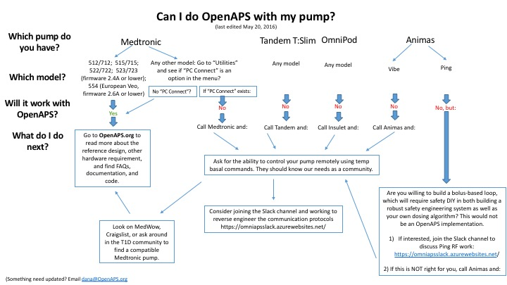

# Hardware overview

This section describes the hardware components required for a 'typical' OpenAPS
implementation. There are numerous variations and substitutions that can be made
but the following items are recommended for getting started. 

_The basic setup requires:_
* a compatible insulin pump
* CGM data
* a small computer
* a radio stick
* battery 

If you come across something that doesn't seem to work, is no longer available, or if you
have a notable alternative, feel free to edit this documentation with your
suggestions.

To start, here is a high-level guide for understanding if your pump is
compatible for OpenAPS. To be compatible, we must be able to send remote temporary basal rate commands to it.

If you're interested in working on communication for another pump (Omnipod,
Animas, etc), [click here](http://bit.ly/1nTtccH) to join the collaboration
group focusing on alternative pump communication.
