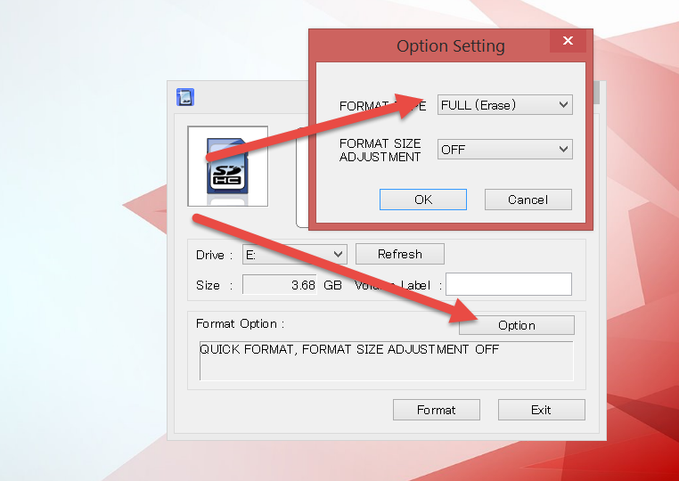

# Setting Up Your Raspberry Pi

**Note 1:** This page talks about setting up the Raspberry Pi with a Carelink USB stick. If you chose the TI stick for your first setup, you'll need to utilize directions in the [mmeowlink wiki](https://github.com/oskarpearson/mmeowlink/wiki) for flashing your TI stick, then return here to continue on with the OpenAPS setup process.

**Note 2:** Setting  up a Raspberry Pi is not specific to OpenAPS. Therefore, it's very easy to Google and find other setup guides and tutorials to help with this process. This is also a good way to get comfortable with using Google if you're unfamiliar with some of the command line tools. Trust us - even if you're an experienced programmer, you'll be doing this throughout the setup process.

In order to use the RPi2 with openaps development tools, the RPi2 must have an operating system installed and be set up in a very specific way. There are two paths to the initial operating system installation and WiFI setup.  Path 1 is recommended for beginners that are very new to using command prompts or "terminal" on the Mac.
Path 2 is considered the most convenient approach for those with more experience with coding and allows the RPi2 to be set up without the use of cables, which is also known as a headless install. Either path will work and the path you choose is a matter of personal preference. Either way, it is recommended that you purchase your RPi2 as a CanaKit, which includes everything you will need for a GUI install.

For the Path 1 GUI install you will need:

* A Raspberry Pi 2 [CanaKit](http://www.amazon.com/CanaKit-Raspberry-Complete-Original-Preloaded/dp/B008XVAVAW/) or similar, which includes several essential accessories in one package
* USB Keyboard
* USB Mouse
* A TV or other screen with HDMI input

For the Path 2 Headless install, you will need:

* Raspberry Pi 2
* 8 GB micro SD Card [and optional adapter so that you can plug in the micro SD Card into your computer]
* Low Profile USB WiFi Adapter
* 2.1 Amp USB Power Supply
* Micro USB cable
* Raspberry Pi 2 CanaKit
* Console cable, Ethernet cable, or Windows/Linux PC that can write ext4 filesystems

## Download and Install Raspbian Jessie

Note: If you ordered the recommended CanaKit, your SD card will already come imaged.  However, if you don't already know whether it's Raspbian 8 Jessie or newer ([see below](#verify-your-raspbian-version)), just treat it as a blank SD card and download and install the latest version of Raspbian (currently version 8.0, codename Jessie).

### Download Raspbian
Raspbian is the recommended operating system for OpenAPS. 

If you don't plan on running a graphical user interface on your Raspberry Pi, you can download the 'lite' version of Raspbian [here](https://downloads.raspberrypi.org/raspbian_lite_latest); the image is much smaller and will download and write to your SD card more quickly. 

If you require a full graphical user interface on your Raspberry Pi, download the latest version of Raspbian [here](http://downloads.raspberrypi.org/raspbian_latest).  

Make sure to extract the disk .img from the ZIP file. If you downloaded the full GUI version above, note that the large size of the Raspbian Jessie image means its .zip file uses a different format internally, and the built-in unzipping tools in some versions of Windows and MacOS cannot handle it. The file can be successfully unzipped with [7-Zip](http://www.7-zip.org/) on Windows and [The Unarchiver](https://itunes.apple.com/us/app/the-unarchiver/id425424353?mt=12) on Mac (both are free).  You can also unzip it from the command line on a Mac, by opening the Terminal application, navigating to the directory where you download the ZIP file, and typing `unzip <filename.zip>`. 

### Write Raspbian to the Micro SD Card

Write the Raspbian .img you extracted from the ZIP file above to the SD card using the [Installing OS Images instructions](https://www.raspberrypi.org/documentation/installation/installing-images/)

If necessary, you can erase (format) your SD card using https://www.sdcard.org/downloads/formatter_4/

#### Detailed Windows Instructions
* First, format your card to take advantage of the full size it offers
	* If you got your through CanaKit, when you put it in your PC it will look like it is 1GB in size despite saying it is 8GB
* Download and install: https://www.sdcard.org/downloads/formatter_4/
* Run SDFormatter
	* Make sure your Micro SD Card is out of your Raspberry PI (shut it down first) and attached to your computer
	* Choose the drive where your card is and hit "Options"
	* Format Type:  Change to Full (Erase)
	* This will erase your old Raspbian OS and make sure you are using the full SD card's available memory
	* 
	* Format the card
* Download Raspbian 8 / Jessie
	* https://www.raspberrypi.org/downloads/raspbian/
	* Extract the IMG file
* Follow the instruction here to write the IMG to your SD card
	* https://www.raspberrypi.org/documentation/installation/installing-images/README.md
* After writing to the SD card, safely remove it from your computer and put it back into your RPi2 and power it up

## Connect and configure WiFi

* Insert the included USB WiFi into the RPi2.
* Next, insert the Micro SD Card into the RPi2.

### Path 1: Keyboard, Mouse, and HDMI monitor/TV

* First, insert your USB keyboard and USB mouse into the RPi2.
* Next, connect your RPi2 to a monitor or T.V. using the included HDMI cable.
* Finally connect your RPi2 using the power adapter.
* You should see the GUI appear on screen.
* Configure WiFi per the instruction pamphlet included with your CanaKit. For those not using the CanaKit, click the computer monitors next to the volume control in the upper-right side and there will be a drop-down menu of available WiFi networks.  You should see your home network.  If you have trouble connecting to the RPi2 via WiFi, check your router settings. The router may need to be switched from WEP to WPA2.
* Once you have installed Raspbian and connected to WiFI, you can disconnect the mouse, keyboard and HDMI cable.

Remember to keep your RPi2 plugged in, just disconnect the peripherals.  Also remember to never disconnect your RPi2 without shutting it down properly using the `sudo shutdown -h now` command.  If you are unable to access the Pi and must power it off without a shutdown, wait until the green light has stopped flashing (indicating the Pi is no longer writing to the SD card).

You can now skip to [Test SSH Access](#test-ssh-access) and SSH into your RPi2.

### Path 2: Console or Ethernet cable

* Get and connect a console cable (use [this guide](https://learn.adafruit.com/downloads/pdf/adafruits-raspberry-pi-lesson-5-using-a-console-cable.pdf)),
* Temporarily connect RPi to a router with an Ethernet cable and SSH in (see below), or
* Connect the RPi directly to your computer with an Ethernet cable (using [this guide](http://www.interlockroc.org/2012/12/06/raspberry-pi-macgyver/)) and SSH in (see below)

#### Configure WiFi Settings

Once you connect to the Pi, you'll want to set up your wifi network(s). It is recommended to add both your home wifi network and your phone's hotspot network if you want to use OpenAPS on the go.

To configure wifi:

Type `sudo bash` and hit enter

Input `wpa_passphrase "<my_SSID_hotspot>" "<my_hotspot_password>" >> /etc/wpa_supplicant/wpa_supplicant.conf` and hit enter (where `<my_SSID_hotspot>` is the name of your phone's hotspot and `<my_hotspot_password>` is the password).

(It should look like: `wpa_passphrase "OpenAPS hotspot" "123loveOpenAPS4ever" >> /etc/wpa_supplicant/wpa_supplicant.conf`)

Input your home wifi next: `wpa_passphrase "<my_SSID_home>" "<my_home_network_password>" >> /etc/wpa_supplicant/wpa_supplicant.conf` (and hit enter)

You will also want to edit `/etc/network/interfaces` to change the following line from `iface wlan0 inet manual` to `iface wlan0 inet dhcp`

To accomplish this input `sudo nano /etc/network/interfaces` and change `manual` to `dhcp` on the line that has `iface wlan0 inet`

If you are not familiar with nano (the text editor) you may want to check out [this tutorial](http://www.howtogeek.com/howto/42980/the-beginners-guide-to-nano-the-linux-command-line-text-editor/)

You can now skip to [Test SSH Access](#test-ssh-access) and SSH into your RPi2.

### Path 3: Headless WiFi configuration (Windows/Linux only)
Keep the SD card in the reader in your computer. In this step, the WiFi interface is going to be configured in Raspbian, so that we can SSH in to the RPi2 and access the device remotely, such as on a computer or a mobile device via an SSH client, via the WiFi connection that we configure. Go to the directory where your SD card is with all of the files for running Raspbian on your RPi2, and open this file in a text editor.

`/path/to/sd/card/etc/wpa_supplicant/wpa_supplicant.conf`

In this file you will list your known WiFi networks so your Pi can connect automatically when roaming (e.g., between your home WiFi and your mobile hotspot).

```
ctrl_interface=DIR=/var/run/wpa_supplicant GROUP=netdev
update_config=1
network={
        ssid="YOURMOBILESSID"
        psk="YOURMOBILEPASS"
}
network={
        ssid="YOURHOMESSID"
        psk="YOURHOMEPASS"
}
```
You can add as many network as you need, the next reboot your system will connect to the first available network listed in your config files. Once the network to which your board is connected becomes unavailable, it start looking for any other known network in the area, and it connects to it if available.

If you want to connect to a router which doesn't broadcast an SSID, add a line with `scan_ssid=1` after the `ssid` and `psk` lines for that network. (More info and examples for the options you can specify for each network are [here](https://www.freebsd.org/cgi/man.cgi?wpa_supplicant.conf%285%29).)

Boot your Pi. (Put the SD card into the RPi2. Plug in the compatible USB WiFi adapter into a RPi2 USB port. Get a micro USB cable and plug the micro USB end into the side of the RPi2 and plug the USB side into the USB power supply.)

If you are unable to access this file on your computer:
* Connect your Pi to your computer with an Ethernet cable and boot your Pi
* Log in using PuTTY. The Host Name is `raspberrypi.local` and the Port is 22.  The login is `pi` and the password is `raspberry`.
* Type `sudo nano /etc/wpa_supplicant/wpa_supplicant.conf` and edit the file as described above.


## Test SSH Access

### Windows

Make sure that the computer is connected to the same WiFi router that the RPi2 is using. Download PuTTY [here](http://www.chiark.greenend.org.uk/~sgtatham/putty/download.html). Hostname is `pi@raspberrypi.local` and default password for the user `pi` is `raspberry`. The port should be set to 22 (by default), and the connection type should be set to SSH. Click `Open` to initiate the SSH session.

### Mac OS X / Linux

Make sure that the computer is connected to the same WiFi router that the RPi2 is using.

Open Terminal and enter this command:

`ssh pi@raspberrypi.local`

Default password for the user `pi` is `raspberry`

### iOS
Make sure that the iOS device is connected to the same WiFi network that the RPi2 is using. Download Serverauditor or Prompt 2 (use this if you have a visual impairment). Hostname is `pi@raspberrypi.local` and the default password for the user `pi` is `raspberry`. The port should be set to 22 (by default), and the connection type should be set to SSH.

You probably also want to make your phone a hotspot and configure the WiFi connection (as above) to use the hotspot.
### Android
Make sure that the Android device is connected to the same WiFi network that the RPi2 is using. Download an SSH client in the Google Play store. Hostname is `pi@raspberrypi.local` and the default password for the user `pi` is `raspberry`. The port should be set to 22 (by default), and the connection type should be set to SSH. You may need to ssh using the ip address instead; the app "Fing - Network Tools" will tell you what the address is if needed.

You probably also want to make your phone a hotspot and configure the WiFi connection (as above) to use the hotspot.

Note: If connecting to the RPi2 fails at this point, the easiest alternative is to temporarily connect RPi to your router with an Ethernet cable and SSH in, making sure both the computer and the RPi2 are connected to the same router.

## Configure the Raspberry Pi

### Verify your Raspbian Version
* In order to do this, you must have done Path 1 or Path 2 above so that you have an environment to interact with
* Go to the shell / Terminal prompt.  If running the GUI, look at the Menu in the upper left and click the icon three to the right of it (looks like a computer)
* Type `lsb_release -a`
* If it says anything about Release 8 / Jessie, you have the correct version and can continue.
* If it says anything else, you need to go back to [Download and Install Raspbian Jessie](#download-and-install-raspbian-jessie)

### Run raspi-config
Run

`sudo raspi-config`

Here you can expand filesystem to maximize memory, change user password and set timezone (in internationalization options). This will take effect on the next reboot, so go ahead and reboot if prompted, or run `sudo reboot` when you're ready.

Confirm that your keyboard settings are correct. Click on Menu (upper left corner of the screen, with raspberry icon). Mouse down to Preferences, and over to Mouse and Keyboard Settings. Click on Mouse and Keyboard Settings, then click on the Keyboard tab. Click on Keyboard Layout and be sure your country and variant are correct. For the US, it should be United States and English (US).


### Note on Time Zone

It is imperative that you set the correct time zone at this step of the configuration process.  OpenAPS will look at the timestamp of your CGM data, and the local time on the pump, when making recommendations for basal changes.  The system also uses local time on the pi; so times and time zone need to match, or you will run into issues later.  If the time zone is incorrect, or you haven’t done this yet, run `sudo dpkg-reconfigure tzdata` from the prompt and choose your local zone. 

### Note on Date and Time in Event of Power Compromise 

To check the time is correct, type `date`. If the date is still not correct, try: 
`sudo /etc/init.d/ntp stop` then `sudo ntpd -q -g` then `sudo /etc/init.d/ntp start` (This may need to be done if the pi unexpectedly lost power)

## Setting up an SSH key for Password-less Login [optional]

You can setup a public/private key identity, and configure your local computer and the Raspberry Pi to automatically use it. This will allow SSH access to the Pi without requiring a password. Some people find this feature very convenient.

### Windows

If you don't already have an SSH key, follow [this guide](https://help.github.com/articles/generating-ssh-keys/) from GitHub to create one.

Create a .ssh directory on the Pi: run `mkdir .ssh`

Log out by typing `exit`

and copy your public SSH key into your RPi2 by entering

`ssh-copy-id pi@raspberrypi.local`

Now you should be able to log in without a password. Try to SSH into the RPi2 again, this time without a password.


### Mac and Linux
In this section some of the commands will be run on your local computer and some will be run on your pi. This will be identified in parenthesis after each command.

If you don't already have an ssh key, then run `ssh-keygen` (on your local computer - keep hitting enter to accept all the defaults).

If you created a new key identity and accepted all of the defaults, then the name of the newly generated identity will be `id_rsa`. However, if you set a custom name for the new identity (e.g. `id_mypi`), then you will need to add it to your local ssh keyring, via `ssh-add ~/.ssh/id_mypi` (on your local computer).

Next create a .ssh directory on the Pi: `ssh pi@raspberrypi.local` (on your local computer), enter the password for the `pi` user on the Pi, and run `mkdir .ssh` (on your pi).

Next, add your new identity to the list of identities for which the Pi's `pi` user grants access via ssh:

`cat ~/.ssh/<id_name>.pub | ssh pi@raspberrypi.local 'cat >> .ssh/authorized_keys'` (on your local computer)

Instead of appending it to the list of authorized keys, you may simply copy your public key to the Pi, **overwriting its existing list of authorized keys**: `scp ~/.ssh/<id_name>.pub pi@raspberrypi.local:~/.ssh/authorized_keys` (on your local computer)

Finally, `ssh pi@raspberrypi.local` (on your local computer) to make sure you can log in without a password.

## Wifi reliability tweaks [optional]

Many people have reported power issues with the 8192cu wireless chip found in many wifi adapters when used with the Raspberry Pi.  As a workaround, we can disable the power management features (which this chip doesn't have anyway) as follows:

`sudo bash -c 'echo "options 8192cu rtw_power_mgnt=0 rtw_enusbss=0" >> /etc/modprobe.d/8192cu.conf'`

## Watchdog [optional]

Now you can consider installing watchdog, which restarts the RPi2 if it becomes unresponsive.

Enable the built-in hardware watchdog chip on the Raspberry Pi:

Install the watchdog package, which controls the conditions under which the hardware watchdog restarts the Pi:

`sudo apt-get install watchdog`

`sudo modprobe bcm2708_wdog` - If this command does not work, it appears to be ok to skip it.

`sudo bash -c 'echo "bcm2708_wdog" >> /etc/modules'`

Next, add watchdog to startup applications:

`sudo update-rc.d watchdog defaults`

Edit the config file by opening up nano text editor

`sudo nano /etc/watchdog.conf`

Uncomment the following: (remove the # from the following lines, scroll down as needed to find them):

```
max-load-1              = 24
watchdog-device         = /dev/watchdog
```

Finally, start watchdog by entering:

`sudo service watchdog start`

## Update the Raspberry Pi [optional]

Update the RPi2.

`sudo apt-get update && sudo apt-get -y upgrade`

The packages will take some time to install.

## Disable HDMI to conserve power [optional]

Via [Raspberry Pi Zero - Conserve power and reduce draw to 80mA](http://www.jeffgeerling.com/blogs/jeff-geerling/raspberry-pi-zero-conserve-energy):

> If you're running a headless Raspberry Pi, there's no need to power the display circuitry, and you can save a little power by running `/usr/bin/tvservice -o` (`-p` to re-enable). 

To disable HDMI on boot, use `sudo nano /etc/rc.local` to edit the rc.local file.  Add `/usr/bin/tvservice -o` to the file and save.

## Configure Bluetooth Low Energy tethering [optional]

The Raspberry Pi can be tethered to a smartphone and share the phone's internet connection. Bluetooth tethering needs to be enabled and configured on the phone device and your carrier/plan must allow tethering. The Raspberry Pi 3 has an inbuilt Bluetooth Low Energy (BLE) chip, while a BLE USB dongle can be used with the other Pi models.

The main advantages of using BLE tethering are that it consumes less power on the phone device than running a portable WiFi hotspot and it allows the Raspberry Pi to use whatever data connection is available on the phone at any given time - e.g. 3G/4G or WiFi. Some have also found that power consumption on the Raspberry Pi is lower when using BLE tethering compared to using a WiFi connection, although this may vary depending on BLE USB dongle, WiFi dongle, etc.

First, we clone a repository which contains scripts which are used later in the setup -

```
cd /home/pi
git clone https://github.com/WayneKeenan/RaspberryPi_BTPAN_AutoConnect.git
```

We then copy the required scripts into a 'bin' directory -
```
mkdir -p /home/pi/bin
cp /home/pi/RaspberryPi_BTPAN_AutoConnect/bt-pan /home/pi/bin
cp /home/pi/RaspberryPi_BTPAN_AutoConnect/check-and-connect-bt-pan.sh /home/pi/bin
```

To configure a connection from the command line -

`sudo bluetoothctl`

Enter the following commands to bring up the adapter and make it discoverable -

```
power on
discoverable on
agent on
default-agent
```

The adapter is now discoverable for three minutes. Search for bluetooth devices on your phone and initiate pairing. The process varies depending on the phone and the dongle in use. The phone may provide a random PIN and bluetoothctl may ask you to confirm it. Enter 'yes'. Then click 'pair' on the phone. Instead, the phone may ask you to enter a PIN. If so, enter '0000' and when bluetoothctl asks for a PIN, enter the same code again. Either way, bluetoothctl should inform you that pairing was successful. It will then ask you to authorize the connection - enter 'yes'.

Execute the paired-devices command to list the paired devices -

```
paired-devices
Device AA:BB:CC:DD:EE:FF Nexus 6P
```

Your paired phone should be listed (in this example, a Google Nexus 6P). Copy the bluetooth address listed for it; we will need to provide this later.

Now trust the mobile device (notice that bluetoothctl features auto-complete, so you can type the first few characters of the device's bluetooth address (which we copied previously) and hit <tab> to complete the address.

NOTE: Whenever you see 'AA:BB:CC:DD:EE:FF' or 'AA_BB_CC_DD_EE_FF' in this guide, replace it with the actual address of your mobile Bluetooth device, in the proper format (colons or underscores).

`trust AA:BB:CC:DD:EE:FF`

Quit bluetoothctl with 'quit'.

Now, we create a service so that a connection is established at startup. Execute the following commands to create a net-bnep-client.service file and open it for editing in Nano -

```
cd /etc/systemd/system
sudo nano net-bnep-client.service
```

In the editor, populate the file with the text below, replacing AA:BB:CC:DD:EE:FF with the address noted earlier -

```
[Unit]
After=bluetooth.service
PartOf=bluetooth.service

[Service]
ExecStart=/home/pi/bin/bt-pan client AA:BB:CC:DD:EE:FF

[Install]
WantedBy=bluetooth.target
```

Save the file, then enable the service -

`sudo systemctl enable net-bnep-client.service`

Open your crontab for editing -

`crontab -e`

...and add an entry to check the connection every minute and reconnect if necessary -

`* * * * * /home/pi/bin/check-and-connect-bt-pan.sh`

Save the file, then restart -

`sudo shutdown -r now`
