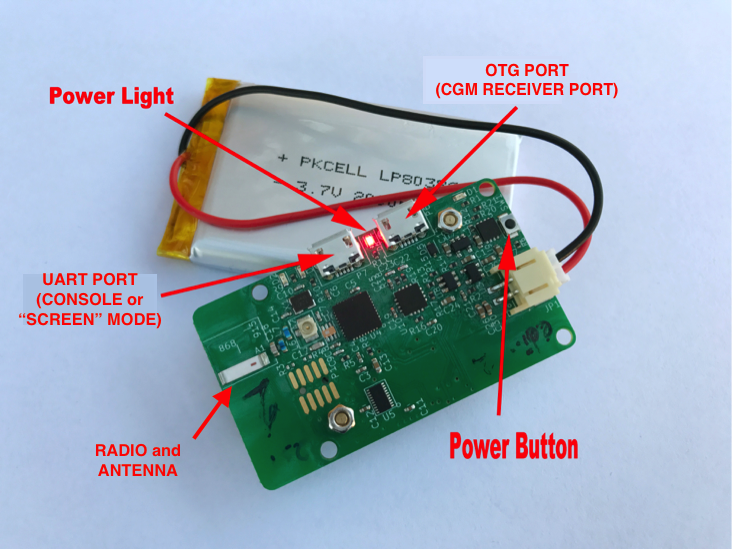

# Understanding your Edison/Explorer Board rig

## Getting Physical: Build your rig/put the physical pieces together

The Explorer board is where all the communications are housed for the rig, as well as the battery charger.  The Edison is the mini-computer where all the OpenAPS code will be sent and used.  In order for this to work, first you have to screw and connect the Edison and Explorer Board together with the nuts and bolts you order.  

The nuts and bolts are tiny, and the spaces are a little tight.  It really helps to use a set of tweezers and a small Phillips head screwdriver.

It's easiest to start with the Explorer board and put on 2 nuts and gold screws (nuts on the side with most of the wiring) inside the little outline where the Edison will eventually sit.  Gold screws should be placed as shown, with nuts on the backside.  Then, lay the Edison board on top, aligning the screw holes.  Use a small Phillips head screwdriver to tighten the screws into the gold screws beneath them.  The Edison board should not wobble, and should feel secure when you are done.  Attach your battery into the explorer board plug.  A single red light should appear and stay lit.  During the course of your OpenAPS rig use, it's good practice to periodically check that the nuts and screws stay tightened.  If they come loose, the Edison can wobble off the connection to the Explorer board and you will either get looping failures (if it's loose) or be unable to connect to the Edison (if it comes completely off).

 

 

### Charging Lipo Battery

You can use the little white block that comes with an iPhone (or similar charger) and a microB-USB cable.  The same cables you used to setup the rig and connect to the computer will work for charging, too.  Either one of the USB ports on the explorer board will work for charging.  When charging is active, there is an extra red light on in the corner of the Explorer board.  When charging is complete, that corner red light will turn off.  It may come back on periodically as the battery "tops off".  You won’t do any damage leaving the rig plugged in for longer than the charge takes. 

While the rig is plugged in for charging, the Nightscout battery pill will read approximately 65%.  This is because it is reading the charging voltage rather than the battery voltage.  Once you disconnect from the charger, the Nightscout battery pill will display the lipo battery's voltage and percent again.

### What the lights mean and where they are

* The LED between the two ports is the power. If this light is on, your rig is on.
* The LED in the corner is the charging indictator.
* The two next to the microUSBs (one green on the latest boards) are for the cc1110 radio chip. By default they just blink once each when you mmtune or otherwise reset it.

### Where is the power button?

The little black button on the end of the board near the JST connector is the power button. If you want to reboot your rig, the easiest way is to hold down the tiny power button for 10-15 seconds until the power light turns off.  Wait a couple seconds and then press the power button again until the light turns back on.  Give the loop a couple minutes to get itself going again…rebooting solves a great majority of any temporary rig issues. 

### Where is the radio?

The radio and antenna are down on the end of the board where you see a little white stick. (Opposite end of the board from where your battery connects at the JST connector). 

### Lipo Battery

Lipo batteries are great for a lot of things…but taking damage is not one of them.  Please treat lipo batteries with care.  Keep them protected from puncture.  The explorer board has some “pointy” parts on the underside, so providing some protection from the board’s squish is a good idea.  A small piece of protection (such as a non-conductive thin foam sheet) will help protect the battery from the board above it.  

Since there is some warmth with an OpenAPS rig, it is also not recommended to put a rig unprotected in a pocket close to the body.  The lipo battery can become warped from the heat and potentially compromised.  A durable plastic case or waist-belt pouch is a good idea (see [here](http://openaps.readthedocs.io/en/latest/docs/walkthrough/phase-0/hardware/edison.html#cases) for case ideas).  There are several places to get lipo batteries, with lots of different dimensions and capacities.  A 2000 mAh lipo will get you about 12-14 hours of use, assuming you have the standard setup script running.  You can customize how often loop tasks run in the cron and potentially get slightly longer use out of each battery charge.

