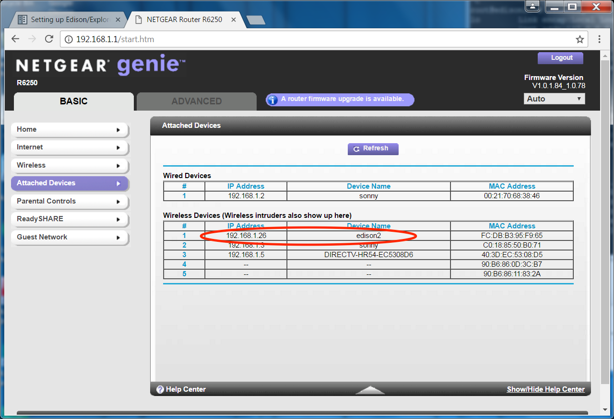

If you want to keep your rig small and portable, using the internet will be important (assuming you are using a Dexcom CGM) to keep BG values flowing to the loop.  Ways your rig can stay online and access the internet are:

* Joining known wifi networks
* BT-tethering to your cell phone's hotspot  
* Wifi-tethering to your cell phone's hotspot
* Wifi-tethering to mifi device

By default, the rig's programming in OpenAPS is to prefer joining known wifi connections over BT-tethered connections.  Basically, the rig will look every minute to see if a wifi connection is available.  If it is, the rig will connect to that.  When a wifi connection is unavailable, the rig will attempt to BT-tether to your phone's hotspot (assuming you have done the work to pair the two devicecs as part of your rig's setup).

Most users prefer a combination of known wifi networks and BT-tethering to maintain internet access for their rig.  This minimizes cell phone data use while at the same time requiring no intentional action on the user's part when they enter/leave their known network areas.  The rig will move seamlessly off/on known networks and BT-tethers without needing help.  Using wifi-tethers requires the user to manually turn the connections on/off when they get into the range of a preferred wifi network to save cell data, therefore those connections aren't preferred.

## Home Wifi

If your home wifi is flaky, your OpenAPS looping will likely be flaky as well.  Speed isn't super important, but reliability of uptime is.  If your router is old and hasn't been updated in awhile, simply updating your router may be a good idea.  Routers are about $100 for a new, well-featured router.  If you get your router as part of a package from your ISP, you can ask if they have any updated equipment to improve your home wifi network's stability.  Many ISPs tend to forget about their customers' old equipment until they start complaining about it.

## Home router

Have you ever accessed your home wifi's router to see the devices connected to it?  How about to make adjustments to your firewall if one is installed?  I highly recommend becoming familiar with logging into your home router...this will let you quickly see (1) if your rig is successfully connected to your home wifi and (2) the MAC address and IP address of your rig. 

*********
**NOTE**  IP addresses are assigned to the rig by the device providing the internet access.  So when the rig is on your home wifi network, the IP address is assigned by your home's router.  When the rig is on your phone's hotspot, the IP address is assigned by your phone.  The private IP addresses for a wifi network will generally be in the format of `192.168.1.XX` or `10.10.1.XX` and the private IP addresses for a phone hotspot will generally be in the format of `172.20.10.XX`  The last two digits will not always be the same every time your rig connects.  Most routers, however, will allow you in the Advanced Settings section to configure your LAN settings to always give your rig the same IP address.  If you find that you cannot access your rig sometimes, it is a good practice to check if maybe the IP address of the rig has changed since the last time you looked and consider setting your router to assign the rig the same IP address each time.
***********

Most home routers can be accessed by going to the URL `http://192.168.1.1` on your computer's browser while it is connected to the home wifi.  Alternatively, check your router for a sticker that includes information about logging into the router (most include a sticker on the bottom of the router).  If there is no sticker, and the URL doesn't work, try googling your router's manufacturer and model number for login information.  Each manufacturer usually has a different combination of default user names and logins, for example:

* NetGear routers have user name as `admin` and password is `password`

* Linksys routers have no user name and password is `admin`

* Asus routers have a default for both user and password of `admin`

By having access to your home router, you can easily see if you rig is listed as a connected device.  You can also bring up the MAC address and IP address of the rig, which may be helpful in other areas of the rig setup that are discussed later.  

 

## School wifi networks

School districts vary widely in their wifi structure and access.  Start talking to your school district's IT department well in advance of looping to discuss options for the rig's access to school wifi.

If you are sending your t1d kid to school with an OpenAPS rig, getting on the school's wifi network will save you cell phone data and phone battery.  Some school districts will need the MAC address of the rig to add it to their "approved" devices list.  Other school districts may provide a special login for the rig.

If the school district refuses to allow the rig access to the school's wifi network, you can use BT tethering to your phone's hotspot to stay online while at school.  The downside is that you will be using your cell data during the school day and it will cause added drain on the phone's battery.  

In some cases, schools have let the phone on the school's wifi but not the rig.  Unfortunately though, this won't help much if your kid uses an iPhone.  IPhones do not allow the rig to be on the phone's hotspot while the phone is also on school's wifi.  So, when the rig connects to the iPhone, the iPhone will disconnect from the school's wifi.  Androids (some of them at least) are able to maintain a wifi connection while the rig is tethered to its hotspot.  

## Mifi device

If the school won't allow rig's wifi access, or you can't get your rig to use your phone's hotspot, you could use a mifi device through your cell provider.  The mifi is a small box (about half the size of a dex receiver usually) that projects a wifi signal using your cellular data plan.  If you use a mifi, the phone could stay connected to the school's wifi and the rig could stay connected to the mifi.

One downside of a mifi box, however, is that since the rig is using a wifi-tethered connection to the mifi box...the rig will stay connected until you turn the mifi box off.  When your kid (and rig) comes back into a known wifi network, your rig will not necessarily automatically move to the known wifi network from the mifi box.  And of course, it's another device to carry.

## Known wifi networks

You will want to prepare ahead of your rig-build by gathering the wifi network names and passwords from areas that you will be at frequently (home, friends' houses, work, etc).  By adding known wifi networks to your your rig's setup, you can save from using your cellular data plan to keep your rig running.  As you are gathering the network names and passwords, remember to pay attention to lower vs upper case letter, hypens, or special characters.  If the names and passwords do not match exactly, the rig will not be able to connect to the network.

## Unknown wifi networks

Unknown wifi networks are pretty frequent during travel.  These can be hit or miss for rig connectivity.  Networks that require you to click on a terms and conditions (like Starbucks) or enter a last name/room number (like many hotels) will not work for the rig.  Sometimes though, you'll get lucky and a hotel will have an open, easy wifi network.  There's a section later about how to add wifi networks while you are traveling.
