# Setting up Edison/Explorer Board on Windows- Alpha Instructions

(This is testing a separate workflow for Windows only. Please refer to the [main Edison setup guide](./setup-edison.md) as well for troubleshooting & full instructions for other computer setup processes.)

### Hardware Assumptions for this page

1.  Using an explorer board and Edison
2.  Using an Windows computer
3.  Using a Loop-compatible Medtronic pump (note - OpenAPS can actually use an additional set of pumps, the x12 series, although it requires [one small extra step](http://openaps.readthedocs.io/en/latest/docs/walkthrough/phase-0/hardware/pump.html#why-do-i-need-a-certain-pump-firmware). See [this page in OpenAPS docs for all compatible pumps](http://openaps.readthedocs.io/en/latest/docs/walkthrough/phase-0/hardware/pump.html#information-about-compatible-insulin-pumps).)

### High Level Recommended Rig parts list

* [**Explorer Board - link**](https://enhanced-radio-devices.myshopify.com/products/900mhz-explorer-block-pre-order)

* [**Edison - link**](https://www.sparkfun.com/products/13024)

* [**Nuts and Bolts - link**](https://www.sparkfun.com/products/13187)

* **At least one Lithium Battery** (The larger battery will have a little longer battery life; but may be slightly bigger.)
 * [**2500mAh battery - link**](https://www.adafruit.com/products/328)
 * [**2000mAh battery - link**](https://www.sparkfun.com/products/8483)

* **Cables**  (you may already have workable USB cables; you just need 2 to complete this process.  Doesn’t have to be a certain length either, just giving options if you have a preference for shorter or longer cables.)
 * [**3 ft long cable, USB-microB - link**](https://www.adafruit.com/products/592)
 * [**6 inch long cable, USB-microB - link**](https://www.adafruit.com/products/898)

### Getting Physical: Build your rig/put the physical pieces together

The Explorer board is where all the communications are housed for the rig, as well as the battery charger.  The Edison is the mini-computer where all the OpenAPS code will be sent and used.  In order for this to work, first you have to screw and connect the Edison and Explorer Board together with the nuts and bolts you order.  

The nuts and bolts are tiny, and the spaces are a little tight.  I find it really helps to use a set of tweezers and a small Phillips head screwdriver.

It's easiest to start with the Explorer board and put on 2 nuts and gold screws (nuts on the side with most of the wiring) inside the little outline where the Edison will eventually sit.  Gold screws should be placed as shown, with nuts on the backside.  Then, lay the Edison board on top, aligning the screw holes.  Use a small Phillips head screwdriver to tighten the screws into the gold screws beneath them.  The Edison board should not wobble, and should feel secure when you are done.  Attach your battery into the explorer board plug.  A single red light should appear and stay lit.  During the course of your OpenAPS rig use, it's good practice to periodically check that the nuts and screws stay tightened.  If they come loose, the Edison can wobble off the connection to the Explorer board and you will either get looping failures (if it's loose) or be unable to connect to the Edison (if it comes completely off).

 

## Preparing/flashing the Edison

The Edison comes with an operating system, called Yocto, that doesn’t work easily with OpenAPS.  The first step is to replace the operating system with a new one.  This is called “flashing” the Edison.  Both your Windows computer and the Edison board will need some work.

### **1-1 Prepare Windows Computer**

- Install the [Intel Edison drivers for Windows]( https://software.intel.com/en-us/iot/hardware/edison/downloads). Select the "Windows standalone driver" download. After it is done downloading, click on the downloaded file and it will execute installation.

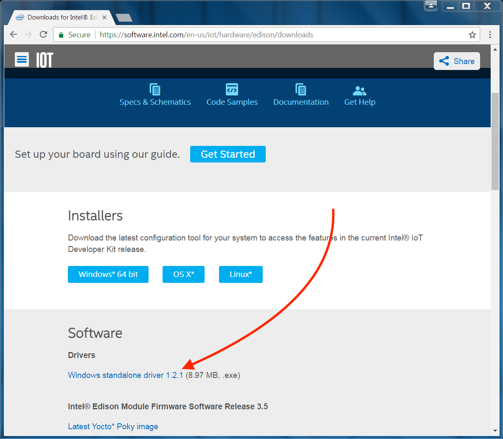

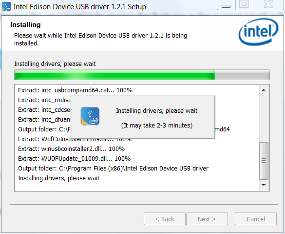


- Install [PuTTY]( http://www.chiark.greenend.org.uk/~sgtatham/putty/download.html). PuTTY is the program you will normally use to login to your rig in the future from the computer.  Creating a desktop shortcut for it is a good idea, since you will likely use it often.  Download the installation file that matches your PC's architecture (32-bit or 64-bit).  If you are unsure, you can check your computer's build and memory in the Control Panel.  Example shown is for a 64-bit computer.  If unsure, installing the 32-bit version won't harm anything...it just might be a little slower to use PuTTY.

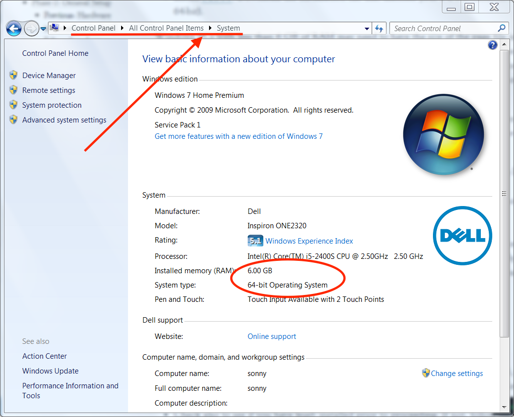

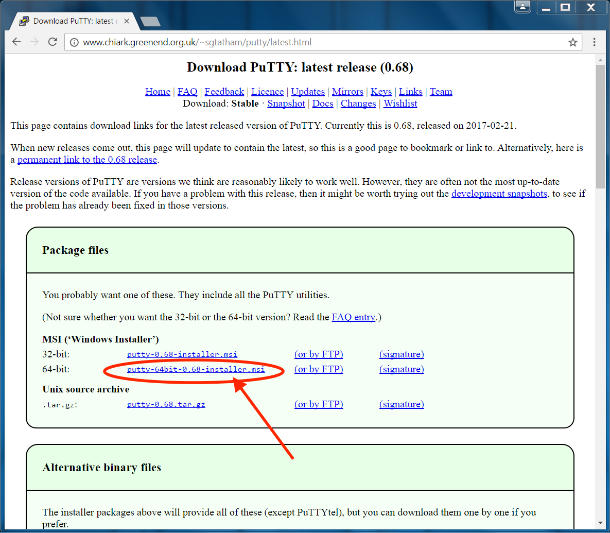

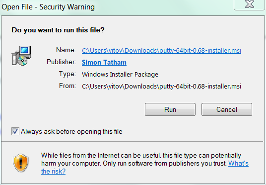

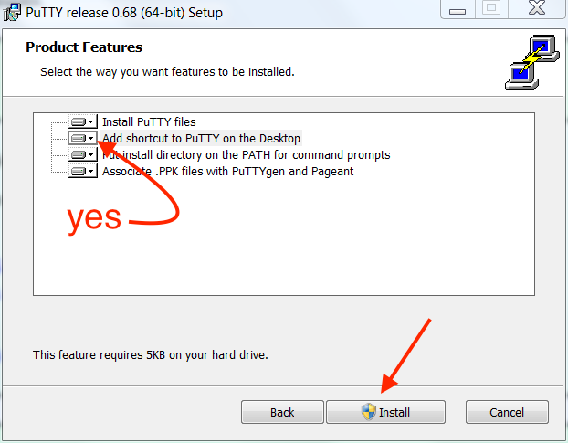

****************************
<b>Side Note regarding computers with less than 6 GB RAM</b>
Windows PCs with less than 6 GB of RAM  may need to have the size of the page file increased to flash the Edison. You can check your RAM as shown in the Control Panel picture above.  If less than 6 GB is showing, then close all unnecessary programs and attempt to flash the device. If the flash operation fails follow these steps to ensure enough swap space is allocated when the computer boots, then restart and try again. Only do this if flashing the device doesn't work without changing these settings.

*Important: Write down the settings in the Virtual Memory window before you make any changes to your system. When you finish the flash process you must return these settings to their original values or Windows may become unstable.*

 - Go to the Control Panel, click All Control Panel Items, then click System. At top left click the Remote Settings link.
 - Select the Advanced tab in the System Properties window, then under Performance click Settings.
 - On the Advanced tab click the Change... button to change the page size.
 - In the Virtual Memory window uncheck "Automatically manage paging file size for all drives," click "Custom size," and set the initial size to at least 4096 MB. If you have already attempted this process at least once continue to increase this number by 1024 MB. Set the maximum size to 2048 MB higher than the initial size you used.
 - Click the Set button, then click OK until all windows are closed.
 - Reboot and attempt the flash proccess.
******************************

- Download [WinZip](http://download.winzip.com/gl/nkln/winzip21_downwz.exe) or similar program to allow you to unzip/uncompress the files we are going to download in the next steps.  WinZip offers a free "evaluation version", or you can buy it for approximately $30.  Install WinZip by double-clicking on the downloaded file. 

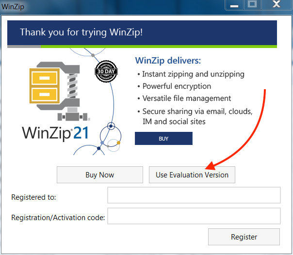

- Download [Jubilinux](http://www.robinkirkman.com/jubilinux/jubilinux.zip)  Jubiliniux will download in a zipped format to your Downloads folder.  Locate the folder in your Downloads and double-click the `jubilinux.zip` folder.  When you double-click (assuming you are using WinZip or similar), you will choose the location to save the unzipped folder to.  Saving it to your root user directory is a good idea...but where ever you put it, remember so we can find it later.

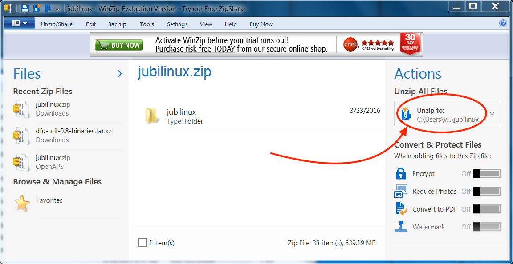

Your root directory is the set of folder that exist under your User name in Windows.  In this screenshot, the user's name is `vitov` and the unzipped jubilinux folder has been saved in the root directory of user vitov.

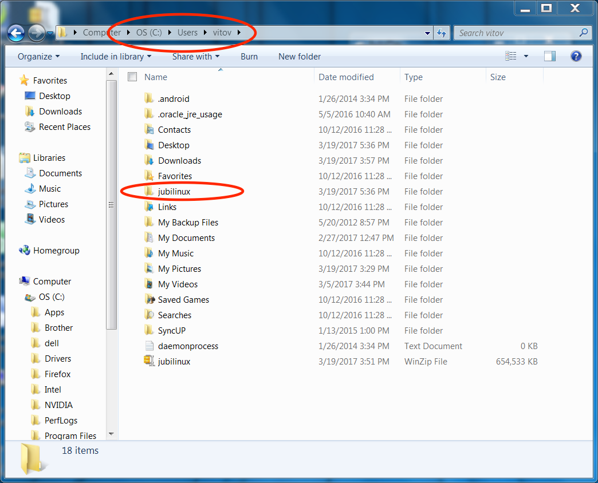

- Download [DFU-Util](https://cdn.sparkfun.com/assets/learn_tutorials/3/3/4/dfu-util-0.8-binaries.tar.xz).  This download is also in a compressed format.  In this download, we are actually only interested in two files `libusb-1.0.dll` and `dfu-util.exe`.  We are going to unzip the whole folder using WinZip again (double-clicking on the `dfu-util-0.8-binaries.tar.xz` in Downloads folder).  We again will save it to any place you'd like, just remember where so we can find it later.


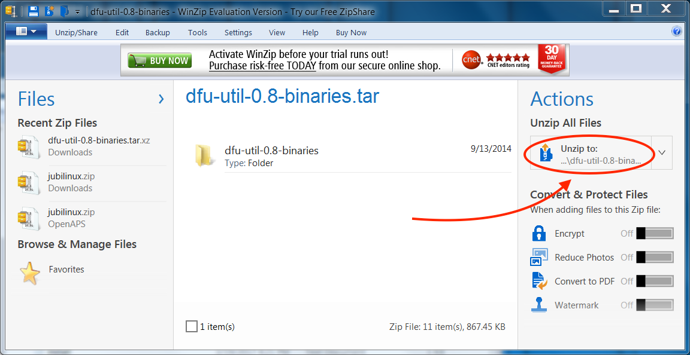

Once you unzip the folder, go to the unzipped folder and look inside.  You will find a folder called `win32-mingw32`.  You want inside that folder.

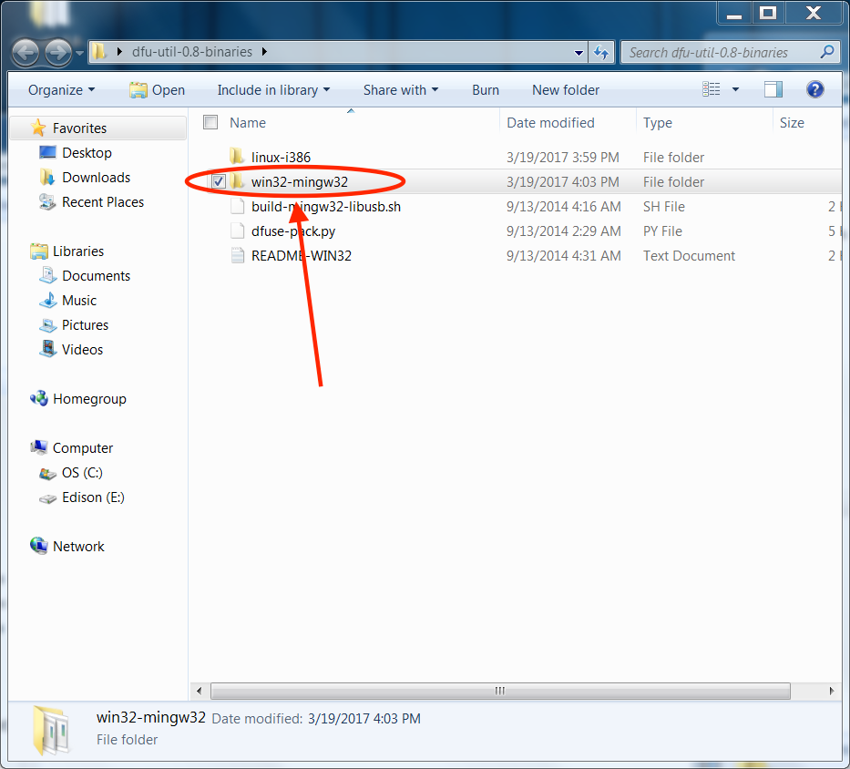

Inside that folder, click on the two files `libusb-1.0.dll` and `dfu-util.exe` and choose to "move" those folders to the jubilinux folder that you unzipped earlier.


When you sucessfully move those two folders into the jubilinux folder, you should see files/folders inside the jubilinux folder like so:

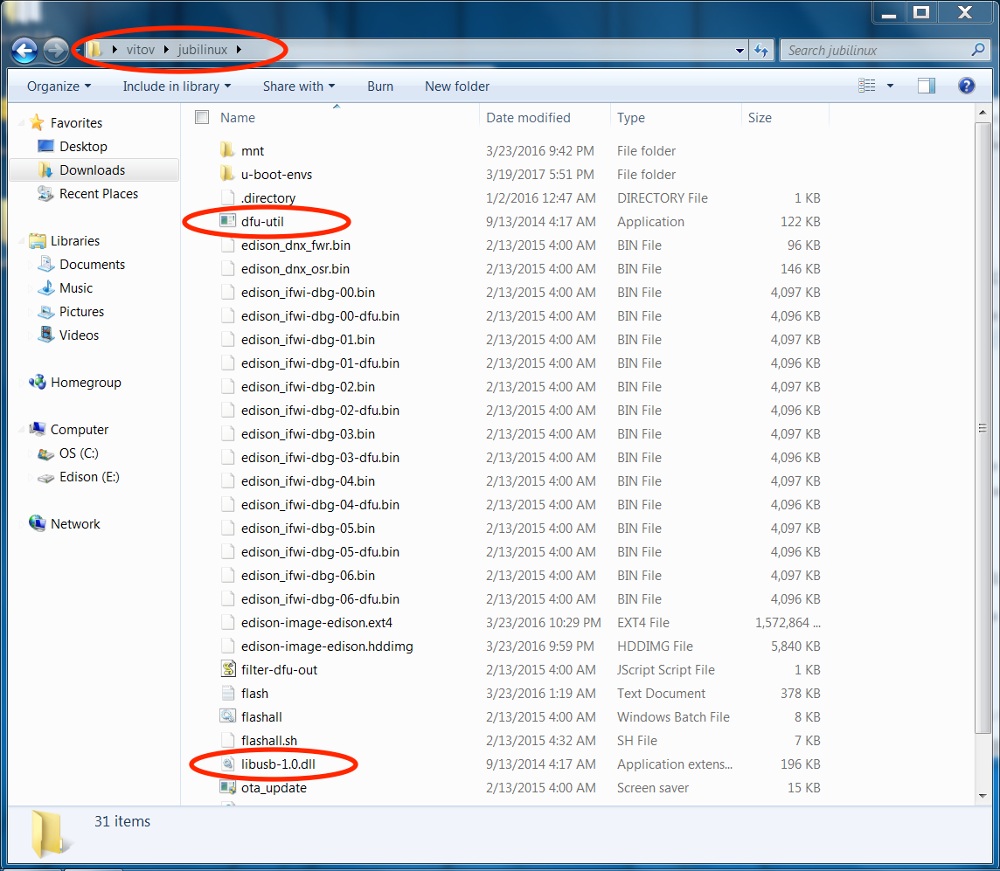

### **1-2  Prepare Edison**
Now we move to the Edison.  You’ll see two microB USB ports on your explorer board.  One is labeled OTG (that’s for flashing) and one is labeled UART (that’s for logging into the Edison from a computer).  We will need to use both to flash.  We’re going to plug both of those into our computer’s USB ports using the cables listed in the parts list (Dexcom’s charging cable will work too). 

 

Once you plug in the cables, you should see your Edison board pop-up as a connected “device”.  If you don’t…try different cables. 

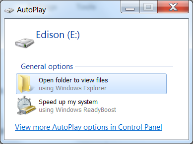

 - Go to Control Panel\All Control Panel Items\Device Manager\Ports\ and look for USB Serial Port COMXX. If you have multiple and unsure of which is the port you need: Make note of existing ports. Unplug the cable from the Explorer board. Notice which port disappears. this is the port you are looking for.  If only one shows up, that is your Edison's port.
 
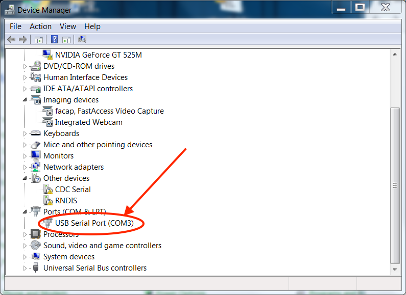
 
  - Open PuTTY, change from SSH to Serial. It normally defaults to COM1 and speed of 9600. Change the COM number to the number you found when you plugged into the Explorer board. Change the speed (baud rate) to 115200. 
  - Once you've made those changes, Click on OPEN at the bottom of your Putty configuration window.
  
  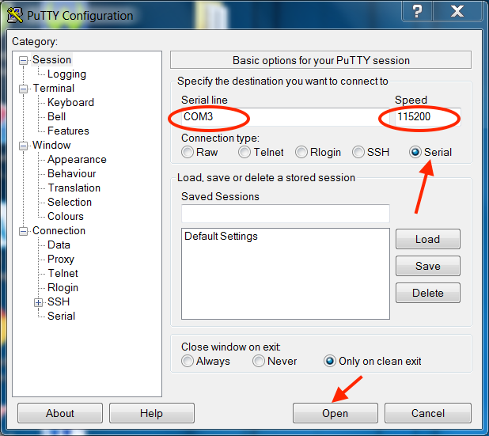

 - Once the screen comes up, press enter a few times to wake things up. This will give you a "console" window of what is happening on your Edison. Move that window over to the right side of your screen without resizing it, if you can.  (We are going to open another window later on the left side.)
- Now you will see a login prompt for the edison on the console screen. Login using the username "root" (all lowercase) and no password. This will have us ready to enter the commands coming up in the next steps later.
  
- Now we are going to open a second window...a "flash" window...using a different program than PuTTY.  Go to your Windows Start menu and search for a program called Command Prompt.  Open Command Prompt and you should be given at a prompt for your User Root directory.  Assuming you saved your jubilinux folder to your user root directory (as described above), enter `cd jubilinux` in the prompt and press return.  If you saved it somewhere else, you will need to navigate to that location.  Move that flash window to the left side of the screen.

Your screens should look like this:

  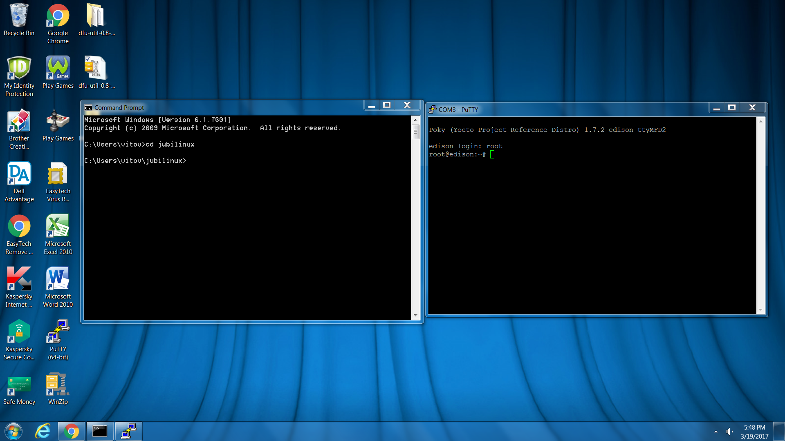
  
### **1-3 Flash the Edison**

* In your flash window on the right (command prompt window), enter `flashall.bat`

* You’ll get a prompt that asks you to "plug and reboot" the Edison board.  You’re done with this screen for now.  Just leave it alone (**don’t close window**) and go to next step.

  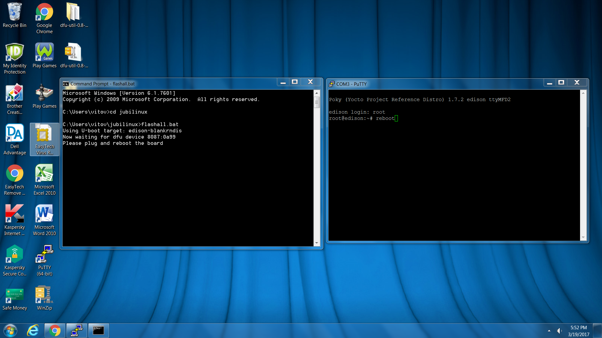

* Return to the screen on the right (the PuTTY window) and enter `reboot` 

You will see many, many messages go by on the screens (mostly on the right-side screen).  Keep your eyes peeled though because there is a required step by you coming up.  At some point, you will see a little pause in the cursor at the bottom of the right-side screen.  And there will be a message that says "type Control D to continue".  Type Control-D to continue.  

  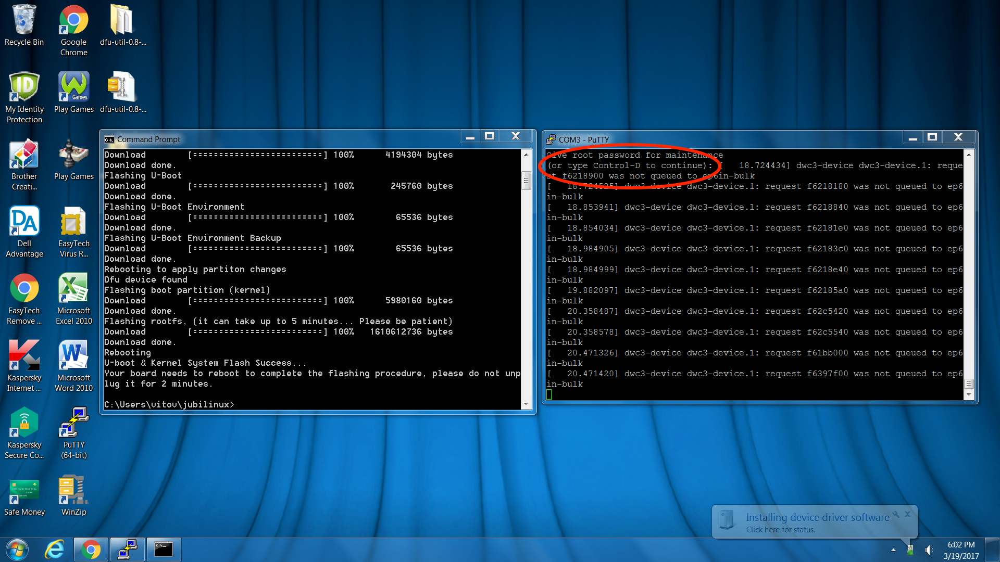

After you press Control-D, the flashing will continue

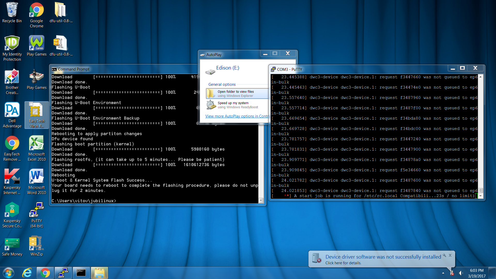

After several reboots (don’t panic), you should get a ubilinux login prompt (If you see Yocto instead of ubliniux, then you need to go back to Step 1-2 and start the flash process over again).  Use login `root` and password `edison`.


CONGRATULATIONS! You just flashed the edison! Wahoo! Now, let's keep going.

### **1-4 Hostname for Edison**

Now that you’ve finished flashing, the Edison is going to need a couple things to finish setting it up; Hostname/passwords and Multiple WiFi networks

Hostname and password

* From that same screen we just left off , enter these three commands in succession
`myedisonhostname=<thehostname-you-want>`  <---But replace the <> section with your chosen hostname.  
Then run the next two lines, one at a time, without modification.
```
echo $myedisonhostname > /etc/hostname
sed -i"" "s/localhost$/localhost $myedisonhostname/" /etc/hosts
```

*****************************
**IMPORTANT**

* To change the password for your Edison to a more secure password than “edison”, enter `passwd root`

* Follow the commands to reset the password.    Repeat for `passwd edison`

* SAVE PASSWORDS somewhere, you’ll want them.
*****************************


### **1.5  Set up Wifi**

Enter `vi /etc/network/interfaces`

Type “i” to enter INSERT mode for editing on the file.

**HELPFUL TIP**:  If you are new to insert mode, realize that it inserts characters at the highlighted cursor (it does not overwrite the character showing beneath the cursor).  And, the default is that the cursor will be at the top left of the screen to start, so you will need to use the arrow keys to move the cursor to the area where you want to start typing.  If you freak out that you’ve made a change that you don’t want to commit...you can simply press the ESC key and then type (no quotes) “:q!” to quit without saving any of your typing/changes.

* Uncomment 'auto wlan0' (remove the `#` at the beginning of the line)
* Edit the next two lines to read:
```
auto wlan0
iface wlan0 inet dhcp
    wpa-conf /etc/wpa_supplicant/wpa_supplicant.conf
```
Comment out or delete the wpa-ssid and wpa-psk lines.

After editing, your file should look like:

```
# interfaces(5) file used by ifup(8) and ifdown(8)
auto lo
iface lo inet loopback

auto usb0
iface usb0 inet static
    address 192.168.2.15
    netmask 255.255.255.0

auto wlan0
iface wlan0 inet dhcp
    wpa-conf /etc/wpa_supplicant/wpa_supplicant.conf
```

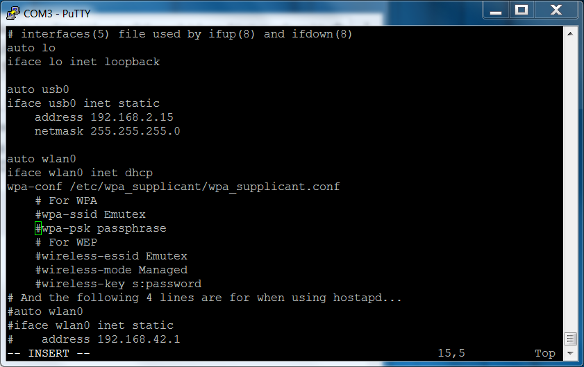

Press Esc and then type ':wq' and press Enter to write the file and quit

`vi /etc/wpa_supplicant/wpa_supplicant.conf`

Type 'i' to get into INSERT mode and add the following to the end, once for each network you want to add.  Be sure to include the quotes around the network name and password.

```
network={
    ssid="my network"
    psk="my wifi password"
}
```

If you want to add open networks to your list, then add:

```
network={
        key_mgmt=NONE
        priority=-999
}
```

If you have a hidden wifi network add the line `scan_ssid=1`.

Press Esc and then type ':wq' and press Enter to write the file and quit.

### **1.6  Test internet connection**

`reboot` to apply the wifi changes and (hopefully) get online

After rebooting, log back in and type `iwgetid -r` to make sure you successfully connected to wifi.

Run `ifconfig wlan0` to determine the IP address of the wireless interface, in case you need it to SSH below. Alternatively, if you know how to login to your router, you can also see the edison's IP address there.

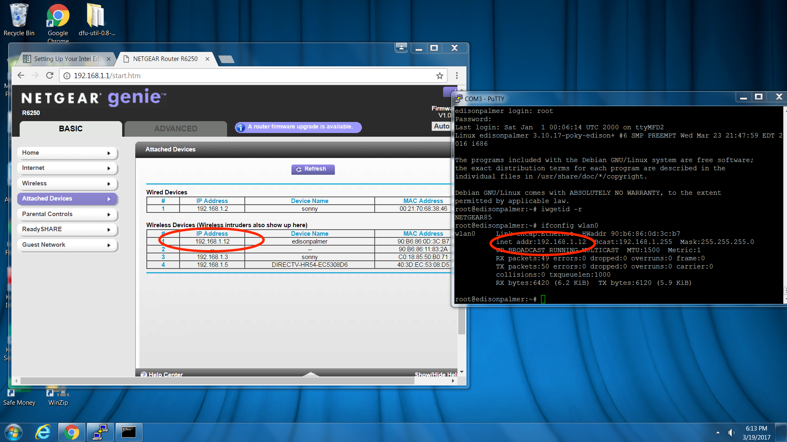

Leave the serial window open in case you can't get in via SSH and need to fix your wifi config.
 
If you need more details on setting up wpa_supplicant.conf, see one of these guides:

* [http://weworkweplay.com/play/automatically-connect-a-raspberry-pi-to-a-wifi-network/](http://weworkweplay.com/play/automatically-connect-a-raspberry-pi-to-a-wifi-network/)
* [http://www.geeked.info/raspberry-pi-add-multiple-wifi-access-points/](http://www.geeked.info/raspberry-pi-add-multiple-wifi-access-points/)
* [http://raspberrypi.stackexchange.com/questions/11631/how-to-setup-multiple-wifi-networks](http://raspberrypi.stackexchange.com/questions/11631/how-to-setup-multiple-wifi-networks)
* [http://www.cs.upc.edu/lclsi/Manuales/wireless/files/wpa_supplicant.conf](http://www.cs.upc.edu/lclsi/Manuales/wireless/files/wpa_supplicant.conf)


### **1.7 Install packages, ssh keys, and other settings**

From a new terminal or PuTTY window, `ssh myedisonhostname.local`. If you can't connect via `youredisonhostname.local` (for example, on a Windows PC without iTunes), you can instead connect directly to the IP address you found with `ifconfig` above.

Log in as root (with the password you just set above), and run (first line will be quick, second and third lines will take awhile):

```
dpkg -P nodejs nodejs-dev
apt-get update && apt-get -y dist-upgrade && apt-get -y autoremove
apt-get install -y sudo strace tcpdump screen acpid vim python-pip locate
```

And then run the next lines (first two will be quick, the last one will take you into a timezone selection menu)

```
adduser edison sudo
adduser edison dialout
dpkg-reconfigure tzdata
```

`vi /etc/logrotate.conf` and change the log rotation to `daily` from `weekly` and enable log compression by removing the hash on the #compress line, to reduce the probability of running out of disk space.

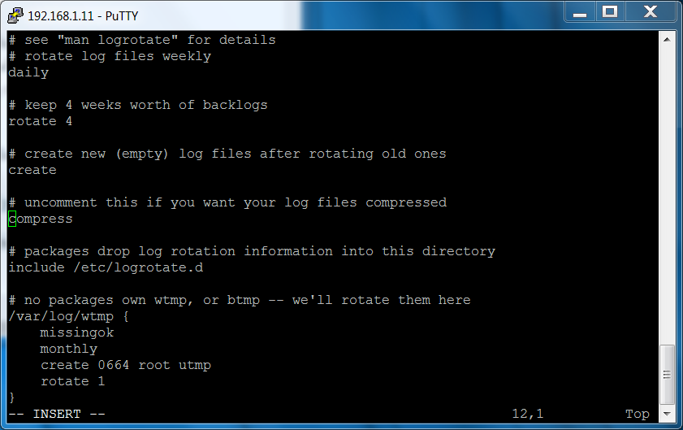

You have now installed the operating system and wifi networks on your Edison! You can now proceed to the next steps in Phases 1-4.

