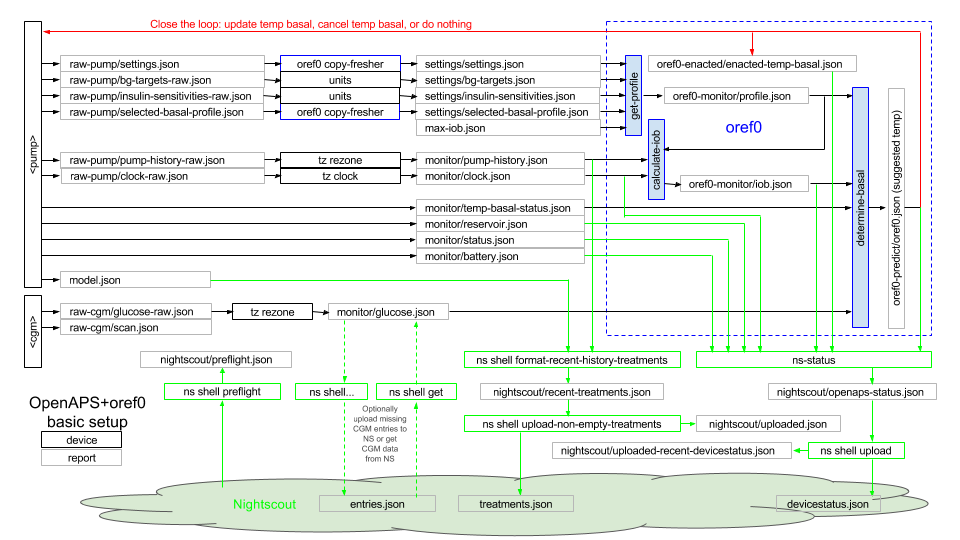

# Phase 1: Logging, Cleaning, and Analyzing Your Data

Phase 1 focuses on accessing, logging, cleaning up, and analyzing data from the pump and CGM. Data fidelity is extremely important, especially when dosing is being considered. Take the time to review what the openaps tools are outputting and carefully compare the logs against your own CareLink and CGM reports.

By the end of this phase, you should also have Nightscout set up; have alerts configured to know whether your system is looping or not; and be analyzing your existing pump or CGM data.

As you go through the walkthrough, you may refer to the diagram below as a reference. The diagram shows a basic system setup using openaps tools and an open reference implementation of the OpenAPS design referred to as oref0. The openaps devices, the required openaps reports, and the basic system dependences are shown, together with ways the system can be integrated with Nightscout for visualization. In Phase 1, you will setup pump and CGM devices and use them to collect pump and CGM data, respectively, as openaps reports. In Phases 2 and 3, you will setup oref0 devices, reports and aliases for an open-loop system. Closing the loop is addressed in Phases 4 and 5, while Phase 6 introduces some more advanced system features. 

Although the report names shown in the diagram below are not mandatory, they correspond to the report names generated by various openaps templates, which are intended to make the setup process easier. Therefore, you may find it convenient to simply follow these report names, especially if you are setting up your system for the first time. As this document is work in progress, naming inconsistencies may still be present. If you identify an opportunity to rectify an inconsistency or to improve the clarity of the document in other ways, please suggest a correction via a pull request (PR).  

