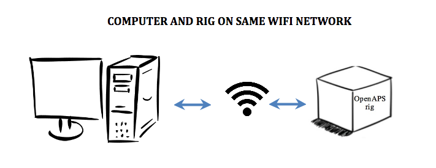
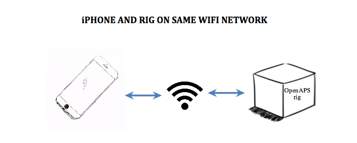
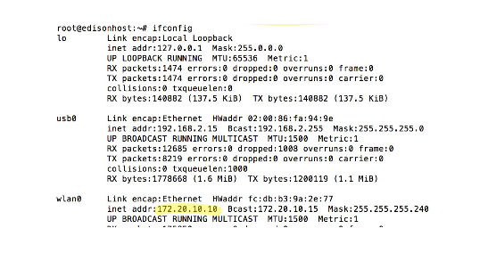

# How to access your OpenAPS rig 

You will need to access your OpenAPS rig’s software when you want to:

* Update your loop software (oref0 update, especially when new features are available)
* Change your preferences.json (update max-iob, turn on/off advances features)
* Change your pump (update pump serial number for different pump)
* Change your Nightscout URL that you use
* Add/change known wifi networks and network passwords
* Run reports or check logs

Since the rig is basically a computer without a screen or keyboard, there are various options to get you access you’ll need.  The option available will depend mostly on the wifi network your gear is connected to.

## If your computer and rig are on the same wifi network



* Access to the rig will be using the Terminal App on the Mac, or PuTTY for Windows

* Use the command ssh root@edisonhost.local (**or whatever you named your edison host**), or enter the equivalent settings into PuTTY.

* If you get an error about the host not being found, it is likely that your rig is actually connected to a different wifi network than the computer.  Try the console method below.


## If your computer and rig are on different wifi networks


* Access to the rig will need a cable to connect the UART port on the rig with the USB port on the computer.

* Use the Terminal app on the Mac, or follow [these directions for Windows](../phase-0/setup-edison.md#if-youre-using-a-windows-pc-for-console)

* If you're using a Mac, use the command `sudo screen /dev/tty.usbserial-* 115200` to enable “console” or “screen” mode

* Press RETURN to bring up the edison’s login screen

* Login as “root” with your root password (you should have changed it during the setup of the rig - if not, please [go back and do so now](../phase-0/setup-edison.md#initial-edison-setup))

## If your iPhone and rig are on the same wifi network



One of the most convenient ways to do quick edits on your rig’s settings may be by using an app on your iPhone.  You will need to make sure your rig and your iPhone are sharing the same network (e.g., home wifi, mifi, or personal hotspot) and here are the instructions.  Each connection point will need it’s own “host” setup in the app.

* Download “Terminus SSH Shell/Console/Terminal” from iPhone app store
* Set up a new “host” in the app with the following information
```
Alias:     enter a name that will remind you what network this connection is using (such as home wifi, mom’s iphone hotspot, or mifi device since each connection will have a unique IP address)
Username:     root
Hostname:     enter the IP address of the rig
Password:     enter your root password 
```
* Clicking on the “host” in the app will launch an ssh connection with the rig and you can use the iPhone to access the rig’s software.  They must be on the same network as the “host” connection specifies though, or else the connection will fail.

### How to determine the IP address of your rig?

Private IP addresses are assigned for devices and are unique to the connection.  So, your rig’s IP address when using your iPhone’s hotspot will be different than your rig’s IP address when using your home wifi.  So, you’ll need to find the IP address for the particular connection you are using.

* If rig and iPhone connected to a mifi device, the mifi device may list connected devices and IP addresses.  Look for your edison rig on there.

* If iPhone and rig are connected via the iPhone’s personal hotspot, you can download an app such as iNet to scan the network for devices and find your edison rig.  The IP address will be listed with the scan information.

* If the rig is accessible by computer (by either method listed above, ssh or console) and the iPhone and rig are on same network as each other, you have a couple options.  You can login on Terminal app and use `ifconfig` to read the wlan0 inet address



OR login to your router to see the list of connected devices and find your edison rig.  Google your router’s brand name and “router login” (e.g., Netgear router login) to find out how to access your router’s administrative area.
